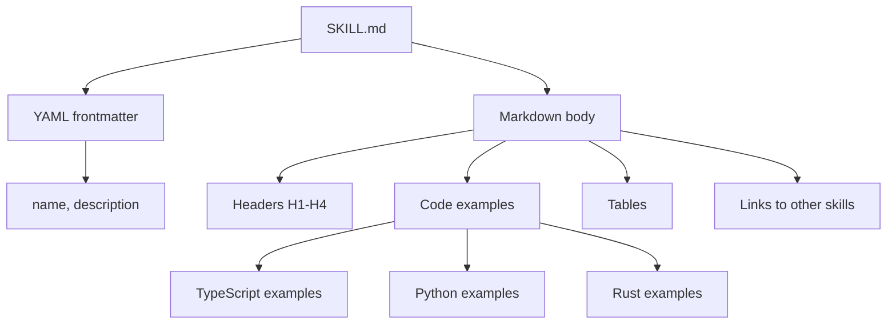
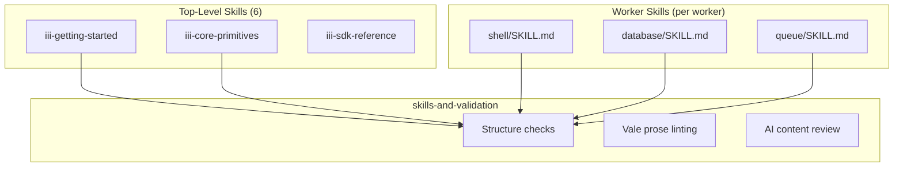

# Skill Format — SKILL.md Structure and Validation

**Every skill follows the SKILL.md format validated by the skills-and-validation system.**

## SKILL.md Structure



### Frontmatter

```yaml
---
name: iii-core-primitives
description: >-
  Use when registering iii functions, binding triggers, selecting sync/void/enqueue invocation...
---
```

| Field | Required | Purpose |
|-------|----------|---------|
| `name` | Yes | Unique identifier, kebab-case |
| `description` | Yes | When the agent should load this skill |

### Body Conventions

| Element | Purpose |
|---------|---------|
| Code blocks with language tag | Executable examples |
| Tables | Quick reference |
| Links | Cross-skill references |
| `::` in function IDs | iii naming convention |
| Leading slashes in HTTP paths | Route convention |

## Skill Naming

| Skill | Convention |
|-------|-----------|
| `iii-getting-started` | `iii-` prefix + descriptive name |
| `iii-core-primitives` | Core concepts have `iii-` prefix |
| `iii-sdk-reference` | Reference docs follow same pattern |

## Worker-Backed Skills

Worker-backed capability skills stay with the worker documentation, not in the top-level skills catalog:

```
workers/
├── shell/
│   └── docs/
│       └── SKILL.md     ← shell-specific skill
├── database/
│   └── docs/
│       └── SKILL.md     ← database-specific skill
```

## Worker-Backed Skills Integration



**Aha:** This prevents duplication — the shell worker's SKILL.md lives with its documentation and is validated by the same skills-and-validation system.

## What's Next

- [03 — Skill Validation](03-skill-validation.md) — Three-layer validation
- [01 — Skill Catalog](01-skill-catalog.md) — Return to catalog
- [00 — Overview](00-overview.md) — Return to overview
