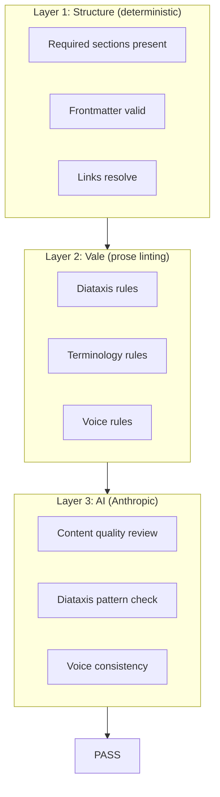
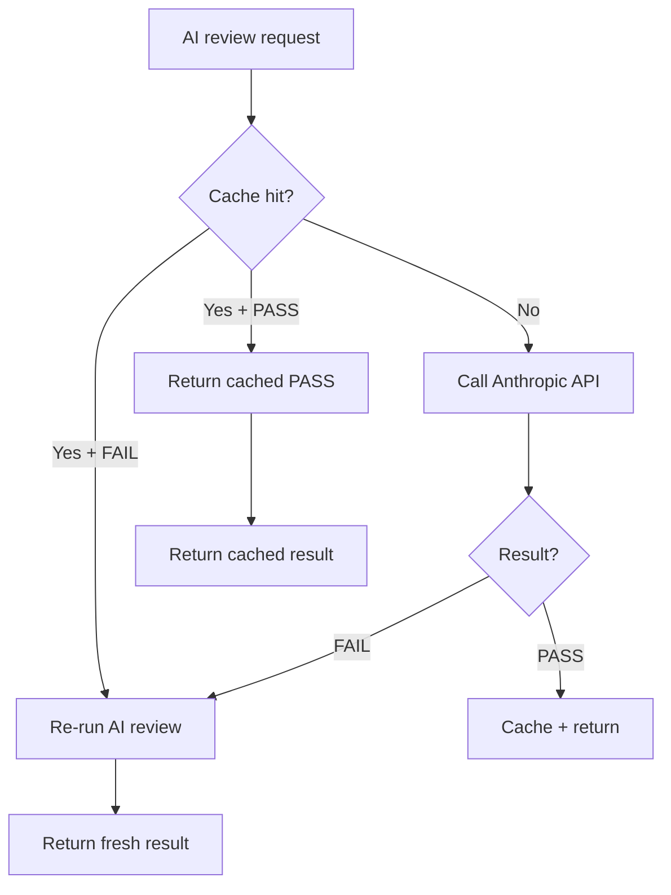

# Skill Validation — Three-Layer Quality Checks

**Every skill is validated by the skills-and-validation system through three layers: structure, prose linting, and AI content review.**

## Validation Pipeline

## Layer 1: Structure Checks

| Check | What it validates |
|-------|------------------|
| Required sections | `#` heading present, non-empty body |
| Frontmatter | `name:` and `description:` fields present and valid |
| Links | Internal links reference valid skills |

## Layer 2: Vale Prose Linting

Rules from the skills-and-validation `content/styles/` directory:

| Style | Rules | Purpose |
|-------|-------|---------|
| Diataxis | 12 rules | Correct doc type (how-to, reference, tutorial) |
| Terminology | 10 rules | Consistent terminology |

### Key Terminology Rules

| Rule | Enforces | Rejects |
|------|----------|---------|
| `SlopMarketing` | Technical terms | "revolutionary", "cutting-edge" |
| `SlopMagic` | Concrete descriptions | "magic", "seamlessly" |
| `BackendSoftware` | "backend" | "back-end" |
| `ForbiddenTerms` | Approved terms | Banned terminology |

## Layer 3: AI Content Review

Uses Anthropic's Claude to review:
- Content quality and completeness
- Diataxis pattern compliance
- Voice consistency with other skills
- Technical accuracy

## AI Pass Caching

Source: `skills-and-validation/crates/iii-skill-core/src/ai_cache.rs`

**Aha:** The same skills-and-validation system that validates worker documentation also validates skills — ensuring consistency across all iii documentation.

## Validation Configuration

Source: `skills-and-validation/content/skills/iii-skill-authoring/`

The skill authoring guide provides:
- Quickstart for new skill creation
- Document structure guidelines
- Template for new skills
- Voice and tone guidelines
- LLM-only and human-only block usage
- Validation checklist

## What's Next

- [00 — Overview](00-overview.md) — Return to overview
- [01 — Skill Catalog](01-skill-catalog.md) — Return to catalog
- [02 — Skill Format](02-skill-format.md) — Return to format
