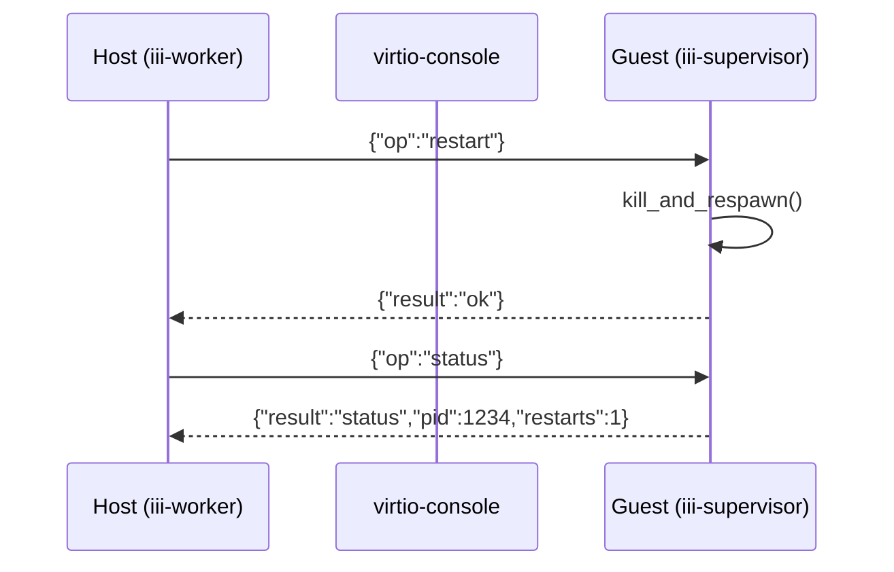

# iii-supervisor — In-VM Process Supervisor

**iii-supervisor is a library for managing the lifecycle of the user worker subprocess inside a microVM, with host-driven restart via a virtio-console control channel.**

## What It Does

```mermaid
flowchart TB
    subgraph Host["Host (iii-worker)"]
        H1["supervisor_ctl"]
        H2["Source watcher"]
    end

    subgraph Guest["Guest VM (iii-init)"]
        S1["supervisor::serve"]
        S2["child::State"]
        S3["Worker process"]
    end

    H2 -->|file changes| H1
    H1 -->|{"op":"restart"}| S1
    S1 -->|kill_and_respawn| S2
    S2 -->|SIGTERM → poll → SIGKILL| S3
    S3 -->|new process| S3
    S1 -->|{"result":"ok"}| H1
```

**Aha:** The standalone `iii-supervisor` binary was absorbed into iii-init. The Cargo.toml explicitly says "No [[bin]] target: the standalone iii-supervisor binary was absorbed into iii-init." This removes one binary from the rootfs and one cross-compile target.

## Crate Structure

```
iii-supervisor/
├── Cargo.toml
├── src/
│   ├── lib.rs              # Library facade (17 lines)
│   ├── protocol.rs         # Control-channel wire protocol (176 lines)
│   ├── child.rs            # Child process lifecycle (704 lines)
│   ├── control.rs          # Control-channel loop (292 lines)
│   └── shell_protocol.rs   # Shell protocol re-export (12 lines)
└── tests/
```

## Dependencies

| Dependency | Purpose |
|------------|---------|
| `iii-shell-proto` | Shell protocol message types |
| `nix = "0.30"` | Signal sending, process management |
| `serde/serde_json` | JSON serialization for control channel |
| `thiserror = "2"` | Error types |
| `tracing = "0.1"` | Structured logging |
| `anyhow = "1"` | Error handling |

## Key Constants

| Constant | Value | Purpose |
|----------|-------|---------|
| `CONTROL_PORT_NAME` | `"iii.control"` | Virtio-console port name |
| `SHUTDOWN_GRACE` | 500ms | Grace period between SIGTERM and SIGKILL |
| `SHUTDOWN_POLL_INTERVAL` | 10ms | Poll interval for child exit detection |
| `RESPAWN_RETRY_DELAY` | 50ms | Delay between spawn retry attempts |

## Request/Response Flow



## What's Next

- [01 — Protocol](01-protocol.md) — Control-channel wire protocol
- [02 — Child Lifecycle](02-child-lifecycle.md) — Spawn, kill, respawn, process groups
- [03 — Control Channel](03-control-channel.md) — The serve loop and request dispatch
