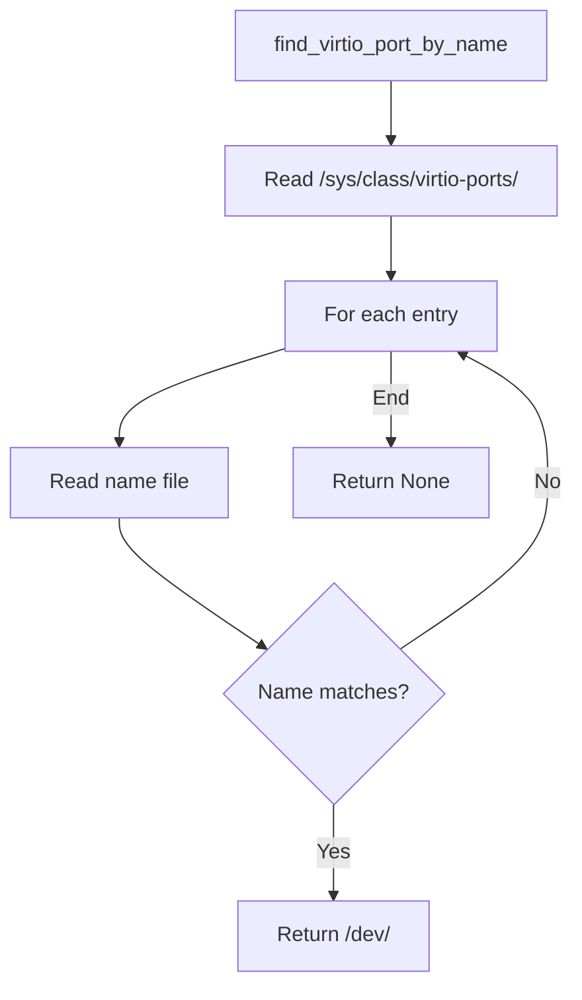

# Protocol — Control-Channel Wire Protocol

**The control channel uses one JSON object per line, newline-terminated, over a virtio-console port.**

## Wire Format

Source: `protocol.rs:7-82`

```
Host → Guest (Request):
{"op":"restart"}\n
{"op":"shutdown"}\n
{"op":"ping"}\n
{"op":"status"}\n

Guest → Host (Response):
{"result":"alive","pid":1234}\n
{"result":"status","pid":1234,"restarts":7}\n
{"result":"ok"}\n
{"result":"error","message":"child spawn failed"}\n
```

**Aha:** Line-delimited JSON keeps partial reads survivable and makes the channel trivially debuggable with `echo`/`cat` from a shell inside the VM.

## Request Enum

Source: `protocol.rs:22-35`

```rust
#[derive(Debug, Clone, Serialize, Deserialize, PartialEq, Eq)]
#[serde(tag = "op", rename_all = "snake_case")]
pub enum Request {
    Restart,   // Kill current child, respawn with same run_cmd
    Shutdown,  // Kill child and exit supervisor → VM poweroff
    Ping,      // Liveness probe
    Status,    // Return child status without disturbing it
}
```

## Response Enum

Source: `protocol.rs:38-58`

```rust
#[derive(Debug, Serialize, Deserialize, PartialEq, Eq)]
#[serde(tag = "result", rename_all = "snake_case")]
pub enum Response {
    Ok,                    // Command applied successfully
    Alive { pid: u32 },    // Ping reply (0 if no child)
    Status { pid: Option<u32>, restarts: u32 },
    Error { message: String },
}
```

## Encoding/Decoding

| Function | Purpose |
|----------|---------|
| `encode_request` | Serialize Request to JSON line |
| `encode_response` | Serialize Response to JSON line |
| `decode_request` | Parse JSON line → Request (whitespace-tolerant) |
| `decode_response` | Parse JSON line → Response |

```mermaid
flowchart LR
    A[Request struct] --> B[serde_json::to_string]
    B --> C[{"op":"restart"}\n]
    C --> D[serde_json::from_str]
    D --> E[Request struct]
```

### Whitespace Tolerance

Source: `protocol.rs:75-82`

```rust
pub fn decode_request(line: &str) -> Result<Request, serde_json::Error> {
    serde_json::from_str(line.trim())
}
```

The decoder tolerates trailing whitespace and CRLF, making it robust against DOS-authored payloads.

## Control Port Discovery

Source: `control.rs:21-48`

The guest discovers the virtio-console port by walking `/sys/class/virtio-ports/*/name`:



**Aha:** Hardcoding `/dev/vport0p1` breaks when libkrun wires the implicit console first. The sysfs name is stable by construction since we pick it on the host.

## What's Next

- [02 — Child Lifecycle](02-child-lifecycle.md) — Spawn, kill, respawn, process groups
- [03 — Control Channel](03-control-channel.md) — The serve loop
- [00 — Overview](00-overview.md) — Return to overview
