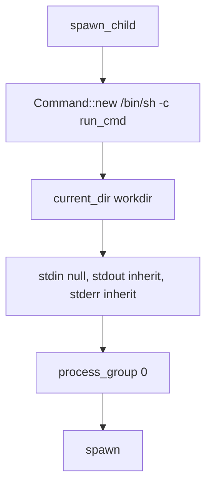
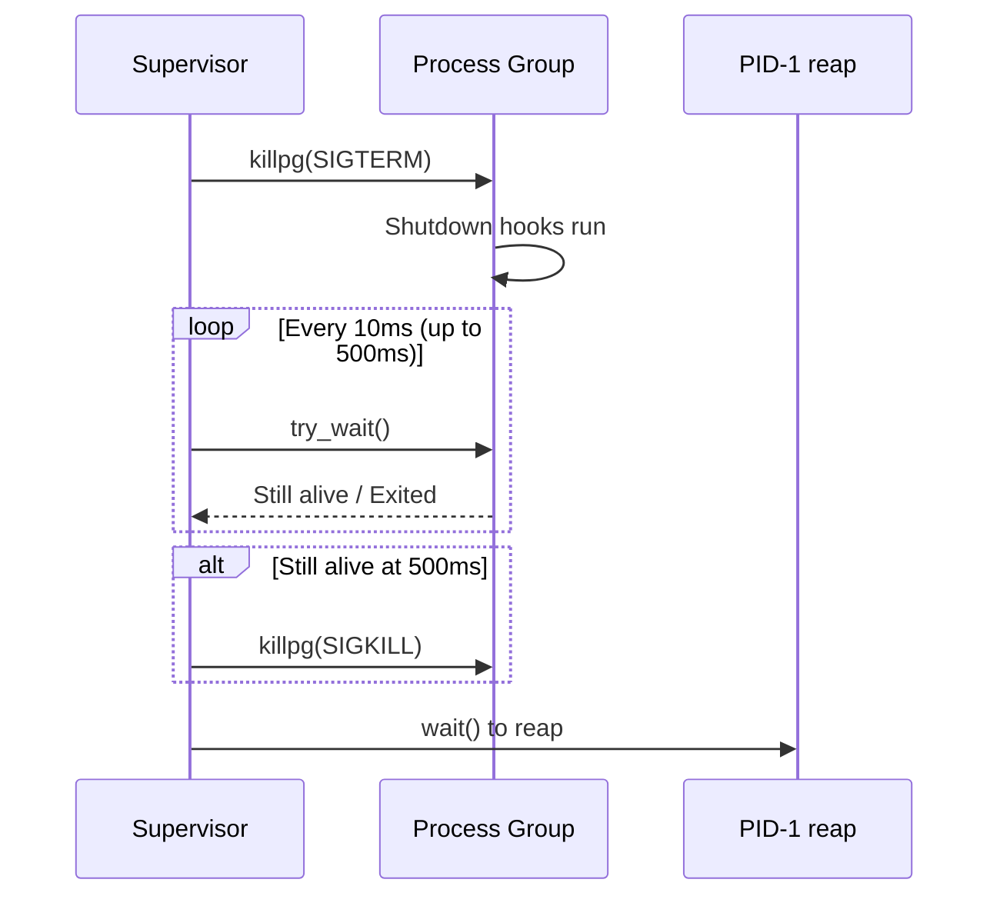

# Child Lifecycle — Spawn, Kill, Respawn, Process Groups

**iii-supervisor manages the user worker subprocess through spawn, kill, and respawn cycles with process-group isolation.**

## State Model

Source: `child.rs:67-90`

```rust
pub struct Config {
    pub run_cmd: String,    // Shell command via /bin/sh -c
    pub workdir: String,    // /workspace for local-path workers
}

struct Inner {
    child: Option<Child>,
    restarts: u32,
}

pub struct State {
    config: Config,
    inner: Arc<Mutex<Inner>>,
}
```

## Spawn

Source: `child.rs:262-300`



**Aha:** `process_group(0)` puts each worker in its own process group. This is critical: when cycling a worker, `killpg` kills the entire subtree — npm, its forked dev script shell, tsx, node, esbuild — all in one shot. Without this, descendants get orphaned to PID 1 and keep running alongside the new worker, producing duplicate engine registrations.

## Graceful Termination

Source: `child.rs:302-364`

```
SIGTERM → poll 500ms (10ms intervals) → SIGKILL → reap
```

| Phase | Duration | Purpose |
|-------|----------|---------|
| SIGTERM | Immediate | Give shutdown hooks a chance |
| Poll loop | Up to 500ms | Check for exit every 10ms |
| SIGKILL | After 500ms | Safety net for SIGTERM ignorers |
| Reap | Immediate | Clean up zombie |

### Why 500ms?

Source: `child.rs:37-51`

- Workers with SIGTERM handlers (Node, Python/uvicorn, Go) clean up in 10-100ms
- Workers without handlers get default SIGTERM (immediate termination)
- Workers that ignore SIGTERM get SIGKILL at 500ms



## Stale PID Detection

Source: `child.rs:230-255`

**Aha:** If the PID-1 `waitpid(-1)` loop reaps the child before `State::pid()` is queried, `try_wait()` returns `Err(ECHILD)`. Returning `child.id()` in this case would report a stale pid that the kernel may have recycled into an unrelated process. The code treats ECHILD as "handle is stale" and returns None.

## Spawn Retry

Source: `child.rs:191-210`

On transient spawn failures (EAGAIN under fork storms, ENOMEM under memory pressure), one retry is attempted after 50ms. Persistent failures still propagate.

## What's Next

- [03 — Control Channel](03-control-channel.md) — The serve loop and request dispatch
- [01 — Protocol](01-protocol.md) — Return to protocol
- [00 — Overview](00-overview.md) — Return to overview
