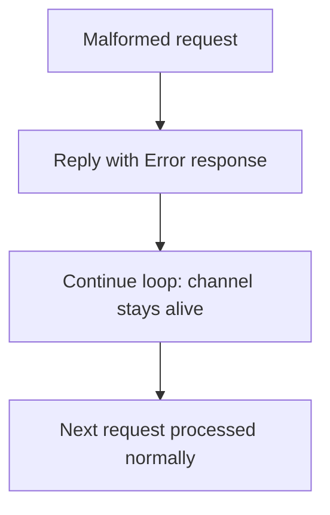

# Control Channel — Serve Loop and Request Dispatch

**The control channel reads newline-delimited JSON requests from a byte stream, dispatches them to the child state, and writes responses back.**

## Serve Loop

Source: `control.rs:87-175`

```mermaid
flowchart TD
    A[serve loop] --> B[read_line (max 4096 bytes)]
    B --> C{n == 0?}
    C -->|EOF| D[Break: host closed channel]
    C -->|Full line| E{<= MAX_LINE?}
    E -->|No| F[Reply Error, break]
    E -->|Yes| G[decode_request]
    G --> H{Valid?}
    H -->|No| I[Reply Error, continue]
    H -->|Yes| J[dispatch state]
    J --> K[encode_response, write]
    K --> L{should_exit?}
    L -->|Yes| M[Break: Shutdown]
    L -->|No| B
```

**Aha:** The 4 KiB line-length cap prevents a misbehaving writer from OOMing the supervisor by streaming bytes without a newline. The `Take<&mut R>` pattern caps a single `read_line` call without consuming the reader.

## Dispatch

Source: `control.rs:52-85`

| Request | Action | Response | should_exit |
|---------|--------|----------|-------------|
| Ping | Check `state.pid()` | `Alive { pid }` | false |
| Status | Check `state.pid()`, `state.restarts()` | `Status { pid, restarts }` | false |
| Restart | `state.kill_and_respawn()` | `Ok` or `Error` | false |
| Shutdown | `state.kill_for_shutdown()` | `Ok` | true |

## Malformed Request Handling

Source: `control.rs:165-172`



**Aha:** The 4 KiB line-length cap prevents a misbehaving writer from OOMing the supervisor by streaming bytes without a newline. The `Take<&mut R>` pattern caps a single `read_line` call without consuming the reader.

## on_dispatch Hook

## What's Next

- [04 — Shell Protocol](04-shell-protocol.md) — Shell protocol re-export
- [05 — Cross-Cutting](05-cross-cutting.md) — Testing, lock recovery
- [00 — Overview](00-overview.md) — Return to overview
