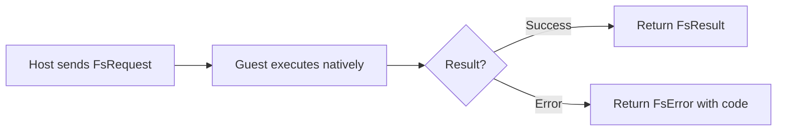
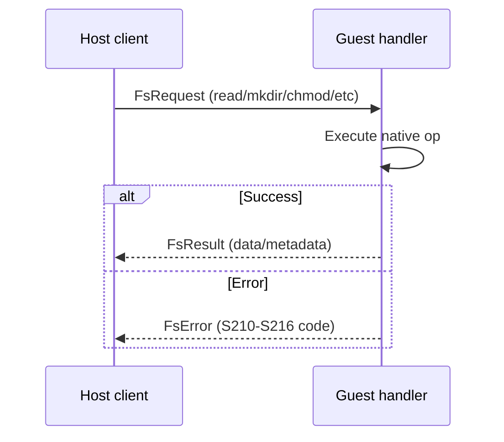

# Shell Protocol — Re-export from iii-shell-proto

**iii-supervisor re-exports the shell protocol types from iii-shell-proto for the in-VM exec channel.**

## What It Is

Source: `shell_protocol.rs` (12 lines)

```rust
pub use iii_shell_proto::*;
```

The shell protocol defines message types and frame codecs for the `iii worker exec` virtio-console channel. It's consumed by both:

| Consumer | Role |
|----------|------|
| iii-init (guest) | Dispatches shell commands inside the VM |
| iii-worker (host) | Sends exec commands to the VM |

## Shell Messages

The protocol defines frame types for:

| Frame | Purpose |
|-------|---------|
| `WriteStart` | Begin a streaming write session |
| `FsChunk` | Stream data chunk |
| `FsEnd` | End of streaming session |
| `FsError` | Error response |
| `FsRequest` | Filesystem operation request |
| `FsResponse` | Filesystem operation response |

## Flag Constants

| Flag | Value | Purpose |
|------|-------|---------|
| `FLAG_TERMINAL` | Set on session spawn | Indicates TTY mode (pseudo-terminal allocated) |

**Aha:** The shell protocol is shared between host and guest — iii-init uses it inside the VM for native filesystem operations, while iii-worker uses it on the host side to send exec commands. One protocol, two ends.

## Frame Types Diagram



## Session Lifecycle



**Aha:** The shell protocol is shared between host and guest — iii-init uses it inside the VM for native filesystem operations, while iii-worker uses it on the host side to send exec commands. One protocol, two ends.

- [05 — Cross-Cutting](05-cross-cutting.md) — Testing, mutex recovery
- [01 — Protocol](01-protocol.md) — Return to control-channel protocol
- [00 — Overview](00-overview.md) — Return to overview
