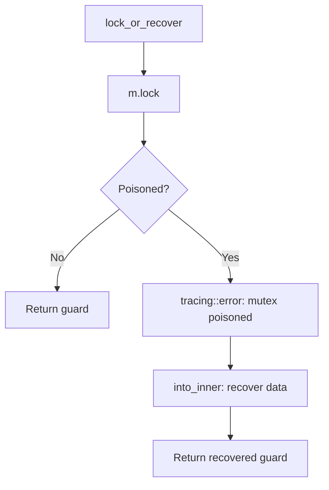
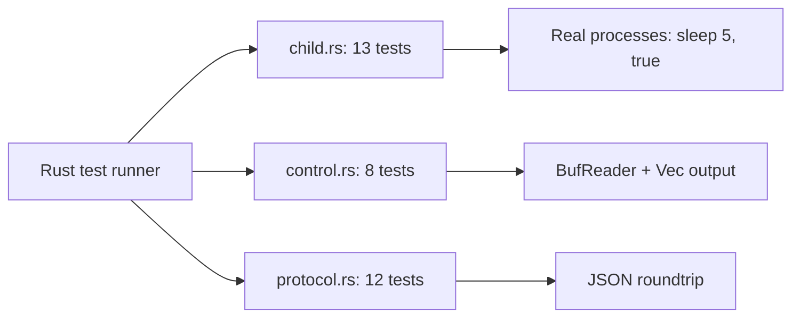

# Cross-Cutting — Testing, Mutex Recovery

**This document covers testing strategy and the mutex poison recovery pattern.**

## Mutex Poison Recovery

Source: `child.rs:17-35`

**Aha:** `Mutex::lock()` returns `Err` when a previous holder panicked. Using `.expect()` would turn that into a fresh panic, which on PID-1 terminates the VM. Instead, `lock_or_recover` recovers the inner data — at worst we observe partially-updated state for one RPC, which the host either retries or escalates to a full VM restart.

## Testing Strategy

Source: `child.rs:366-704` (24 tests in child.rs alone)

| Test Category | Tests | Purpose |
|---------------|-------|---------|
| Spawn lifecycle | 5 | spawn_initial, kill_and_respawn, kill_for_shutdown |
| PID detection | 3 | Live pid, exited pid, reaped-out-of-band pid |
| Graceful shutdown | 3 | SIGTERM respected, SIGKILL escalation, process group kill |
| Retry | 2 | spawn_with_one_retry happy path and persistent failure |
| Idempotency | 1 | kill_and_respawn on dead child |
| Clone sharing | 1 | State handle is clonable |
| Process group | 1 | Grandchildren killed via killpg |

### Key Regression Tests

| Test | Bug It Guards |
|------|--------------|
| `kill_and_respawn_kills_grandchildren_via_process_group` | "Reload leaves two worker trees coexisting" — pre-fix, `kill(pid)` only killed the direct sh child, npm+tsx+node grandchildren orphaned to PID 1 |
| `pid_clears_handle_when_child_reaped_out_of_band` | Stale-dead-pid bug — PID-1 waitpid(-1) reaps child before State::pid() queried, try_wait returns ECHILD |
| `spawn_with_one_retry_retries_exactly_once_on_persistent_failure` | Prevents infinite retry loops or zero-retry regressions |

## Test Environment

Source: `Cargo.toml` — `dev-dependencies`

| Dependency | Purpose |
|------------|---------|
| `tempfile = "3"` | Temp directories for test rootfs |

## What's Next

- [00 — Overview](00-overview.md) — Return to overview
- [01 — Protocol](01-protocol.md) — Return to protocol
- [02 — Child Lifecycle](02-child-lifecycle.md) — Return to child lifecycle
