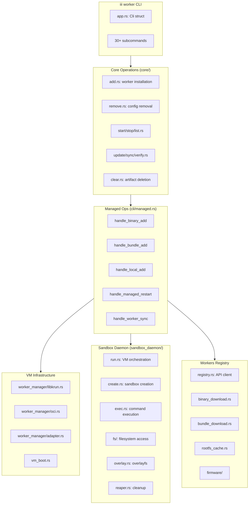
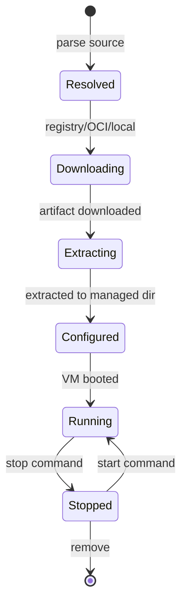

# iii-worker — Managed Worker Runtime

**iii-worker is the managed runtime that handles the full lifecycle of sandboxed workers in krun VMs.** It downloads workers from the registry or OCI images, configures them, boots isolated VMs, and provides CLI commands for the entire lifecycle.

## What It Does

| Command | Purpose |
|---------|---------|
| `iii worker add <name>` | Download, extract, configure, and boot a worker |
| `iii worker remove <name>` | Remove from config.yaml, engine tears down sandbox |
| `iii worker start <name>` | Start a stopped worker container |
| `iii worker stop <name>` | Stop a running worker (graceful shutdown) |
| `iii worker restart <name>` | Stop then start |
| `iii worker list` | Show all workers with status and PID |
| `iii worker status <name>` | Detailed status with live watch |
| `iii worker logs <name>` | Follow worker logs |
| `iii worker exec <name> -- cmd` | Execute command inside sandbox |
| `iii worker sync` | Re-resolve locked workers, update iii.lock |
| `iii worker update <name>` | Update worker versions |
| `iii worker verify` | Verify worker integrity |
| `iii worker clear <name>` | Delete downloaded artifacts |
| `iii worker reinstall <name>` | Re-download (add --force) |
| `iii worker init` | Scaffold a new worker project |
| `iii worker sandbox` | Ad-hoc sandbox VM commands |
| `iii worker watch-source` | Local dev: watch + restart |

**Aha:** iii-worker is a **managed** runtime, not just a process launcher. It handles version pinning (iii.lock), config file management, VM lifecycle, sandbox isolation, firmware downloads, and registry resolution — all with a strict stdout/stderr contract for scriptability.

## Architecture at a Glance



## Crate Structure

```
iii-worker/
├── Cargo.toml              # Package manifest: 55+ deps
├── build.rs                # No-op build script
├── src/
│   ├── main.rs             # CLI entry point (556 lines)
│   ├── lib.rs              # Library facade (26 lines)
│   ├── cli/                # CLI commands and handlers (32,383 LOC)
│   │   ├── app.rs          # Cli struct, Commands enum, arg definitions
│   │   ├── managed.rs      # Managed ops (6,469 lines)
│   │   ├── binary_download.rs  # Binary worker download
│   │   ├── bundle_download.rs  # Bundle worker download
│   │   ├── config_file.rs  # config.yaml management (1,744 lines)
│   │   ├── lockfile.rs     # iii.lock management (1,119 lines)
│   │   ├── registry.rs     # Registry API client (918 lines)
│   │   ├── rootfs_cache.rs # Rootfs caching
│   │   ├── rootfs.rs       # Rootfs management
│   │   ├── vm_boot.rs      # VM boot entry (1,199 lines)
│   │   ├── lifecycle.rs    # Container spec building
│   │   ├── local_worker.rs # Local path workers (1,482 lines)
│   │   ├── worker_manager/ # VM management
│   │   │   ├── mod.rs
│   │   │   ├── libkrun.rs  # libkrun VM adapter (999 lines)
│   │   │   ├── oci.rs      # OCI image adapter (1,490 lines)
│   │   │   ├── adapter.rs
│   │   │   ├── platform.rs
│   │   │   └── state.rs
│   │   ├── worker_manager_daemon.rs
│   │   ├── worker_trigger.rs   # Worker trigger registration
│   │   ├── worker_manifest_deps.rs
│   │   ├── firmware/       # Firmware management
│   │   │   ├── mod.rs
│   │   │   ├── constants.rs
│   │   │   ├── download.rs
│   │   │   ├── libkrunfw_bytes.rs
│   │   │   ├── resolve.rs
│   │   │   └── symlinks.rs
│   │   ├── sandbox.rs      # Sandbox CLI commands (749 lines)
│   │   ├── sandbox_daemon.rs
│   │   ├── shell_client.rs # Shell client (968 lines)
│   │   ├── shell_relay.rs  # Shell relay (1,380 lines)
│   │   ├── source_watcher.rs # File watcher (1,274 lines)
│   │   ├── status.rs       # Worker status (1,697 lines)
│   │   ├── host_shim.rs    # Host operations (994 lines)
│   │   ├── init.rs         # Worker init (557 lines)
│   │   ├── spinner.rs      # Progress spinner
│   │   ├── stderr_sink.rs  # Stderr output
│   │   ├── supervisor_ctl.rs # Supervisor control
│   │   ├── sync.rs         # Worker sync
│   │   ├── pidfile.rs      # PID file management
│   │   ├── oci_ref.rs      # OCI reference parsing
│   │   ├── download.rs     # Generic download (682 lines)
│   │   ├── builtin_defaults.rs # Builtin worker defaults
│   │   └── test_support.rs # Test utilities
│   ├── core/               # Pure async ops (2,440 LOC)
│   │   ├── mod.rs          # Module exports
│   │   ├── add.rs          # Worker installation
│   │   ├── remove.rs       # Worker removal
│   │   ├── update.rs       # Version updates
│   │   ├── start.rs        # Worker start
│   │   ├── stop.rs         # Worker stop
│   │   ├── list.rs         # Worker listing
│   │   ├── clear.rs        # Artifact clearing
│   │   ├── types.rs        # Core types
│   │   ├── events.rs       # Event sinks
│   │   ├── error.rs        # Error types
│   │   ├── host.rs         # Host shim trait
│   │   └── project.rs      # Project context
│   └── sandbox_daemon/     # VM sandbox daemon (7,595 LOC)
│       ├── mod.rs
│       ├── run.rs          # Main daemon loop
│       ├── create.rs       # Sandbox creation
│       ├── exec.rs         # Command execution
│       ├── fs/             # Filesystem operations
│       ├── skills/         # Skills integration
│       ├── overlay.rs      # Overlay filesystem
│       ├── reaper.rs       # Sandbox reaper
│       ├── registry.rs     # Sandbox registry
│       ├── catalog.rs      # Sandbox catalog
│       ├── config.rs       # Sandbox config
│       ├── adapters.rs     # Sandbox adapters (745 lines)
│       ├── errors.rs       # Error types (684 lines)
│       ├── events.rs       # Event types
│       ├── auto_install.rs # Auto-install
│       ├── stop.rs         # Stop handling
│       ├── list.rs         # List handling
│       └── iii.worker.yaml # Worker manifest
└── tests/                  # 34 test files
```

## Dependencies

| Dependency | Purpose |
|------------|---------|
| `msb_krun = "0.1.9"` | krun VM runtime with net/blk features |
| `iii-filesystem` | VFS for worker VMs |
| `iii-network` | Network stack for VMs |
| `iii-sdk` | iii SDK for trigger registration |
| `iii-supervisor` | Process supervisor |
| `oci-client = "0.16"` | OCI image pulling |
| `oci-spec = "0.9"` | OCI spec parsing |
| `tokio` | Async runtime |
| `clap = "4"` | CLI argument parsing |
| `cliclack = "0.3"` | Interactive prompts |
| `reqwest = "0.12"` | HTTP client for registry |
| `serde/serde_json/serde_yaml` | Serialization |
| `notify = "8.2"` | File watching |
| `indicatif = "0.17"` | Progress bars |
| `tar/flate2` | Archive extraction |
| `nix = "0.30"` | Unix syscalls |

## Worker Lifecycle



## What's Next

- [01 — Architecture](01-architecture.md) — Full dependency graph, layer diagram, component relationships
- [02 — CLI Surface](02-cli-surface.md) — All commands, arguments, and the stdout/stderr contract
- [03 — Worker Types](03-worker-types.md) — Registry, OCI, and local workers
