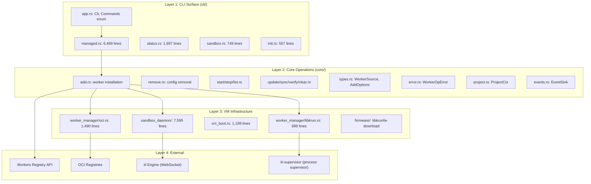
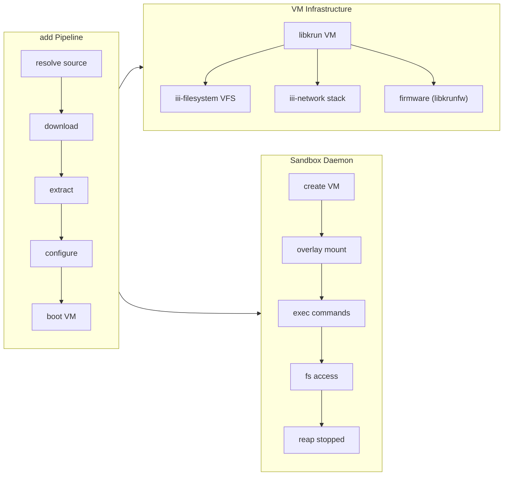

# Architecture — Dependency Graph, Layers, Component Relationships

**iii-worker is organized as three logical layers: CLI surface, core operations, and VM infrastructure.** This document covers the full dependency graph and component relationships.

## Layer Diagram



## Component Relationships



## CLI → Core → Infrastructure Mapping

| CLI Command | Core Module | Infrastructure |
|-------------|------------|----------------|
| `iii worker add` | `core::add::run` | registry + worker_manager + sandbox_daemon |
| `iii worker remove` | `core::remove::run` | config_file + engine |
| `iii worker start` | `core::start::run` | worker_manager + sandbox_daemon |
| `iii worker stop` | `core::stop::run` | sandbox_daemon |
| `iii worker list` | `core::list::run` | config_file + sandbox_daemon |
| `iii worker exec` | — | shell_client + shell_relay |
| `iii worker status` | — | sandbox_daemon |
| `iii worker sync` | — | lockfile + registry |
| `iii worker update` | `core::update::run` | lockfile + registry |
| `iii worker clear` | `core::clear::run` | filesystem |
| `iii worker reinstall` | `core::add::run` (--force) | registry + worker_manager |
| `iii worker verify` | — | lockfile + filesystem |

## Stdout/Stderr Contract

Source: `cli/managed.rs:9-24`

**Aha:** Every managed command follows a strict contract: stdout contains ONLY machine-readable output (the worker name on success), and stderr contains ALL human-facing output (progress, status, errors). This means scripts can pipe `iii worker start foo` and get just the worker name, while users see rich progress on stderr.

```
stdout: worker_name\n
stderr: • downloading pdfkit
stderr:   ✓ resolved to binary v1.2.3
stderr:   ✓ ready in 3.2s
```

## What's Next

- [02 — CLI Surface](02-cli-surface.md) — All commands, arguments, and the stdout/stderr contract
- [03 — Worker Types](03-worker-types.md) — Registry, OCI, and local workers
- [04 — Add Pipeline](04-add-pipeline.md) — The add flow: resolve → download → extract → configure → boot
