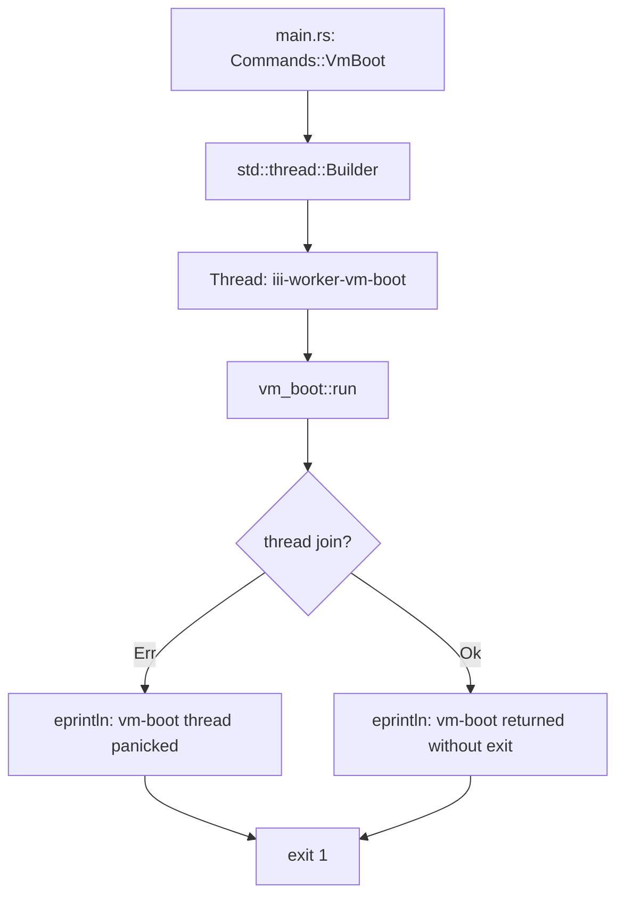

# CLI Surface — All Commands, Arguments, and the stdout/stderr Contract

**iii-worker exposes 17 subcommands through a clap CLI with a strict stdout/stderr contract for scriptability.** This document covers every command, its arguments, and the output contract.

## The Cli Struct

Source: `cli/app.rs:25-35`

```rust
#[derive(Parser, Debug)]
#[command(name = "iii worker", bin_name = "iii worker", version, about = "iii managed worker runtime")]
pub struct Cli {
    #[command(subcommand)]
    pub command: Commands,
}
```

## All Commands

### add

```
iii worker add <WORKER[@VERSION]...> [-f] [--no-wait] [--reset-config]
```

Install workers from the registry, OCI images, or local paths.

| Argument | Type | Purpose |
|----------|------|---------|
| `WORKER[@VERSION]` | positional, 1.. | Worker name(s) — `pdfkit`, `pdfkit@1.0.0`, `ghcr.io/org/worker:tag` |
| `-f, --force` | flag | Re-download: delete existing artifacts before adding |
| `--no-wait` | flag | Don't block waiting for engine to finish booting |
| `--reset-config` | flag | Also remove config.yaml entry before re-adding |

**Aha:** Multiple workers can be added at once. The CLI iterates and shows progress: `[1/3] Adding pdfkit...` etc.

### remove

```
iii worker remove <WORKER...> [-y]
```

Remove workers from config.yaml. The engine's file watcher tears down running sandboxes.

| Argument | Type | Purpose |
|----------|------|---------|
| `WORKER` | positional, 1.. | Worker name(s) to remove |
| `-y, --yes` | flag | Skip confirmation prompt |

**Aha:** `remove` is destructive — it requires confirmation unless `-y` is passed. In non-interactive mode (stderr not a tty), it refuses without `-y` to prevent scripts from silently removing workers.

### reinstall

```
iii worker reinstall <WORKER[@VERSION]...> [--reset-config]
```

Re-download workers (equivalent to `add --force`).

### update

```
iii worker update [WORKER]
```

Re-resolve locked workers and update iii.lock. If no worker name is given, updates all locked workers.

### clear

```
iii worker clear [WORKER] [-y]
```

Clear downloaded worker artifacts from ~/.iii/. No engine connection needed.

### start

```
iii worker start <WORKER> [--no-wait] [--port PORT] [--config FILE]
```

Start a stopped managed worker container. Waits up to 120s for ready by default.

### stop

```
iii worker stop <WORKER>
```

Stop a running worker (graceful shutdown). No confirmation prompt — stop is routine and reversible.

### restart

```
iii worker restart <WORKER> [--no-wait] [--port PORT] [--config FILE]
```

Stop then start a worker.

### list

```
iii worker list
```

Show all workers with name, version, PID, and status.

### status

```
iii worker status <WORKER> [--no-watch]
```

Detailed worker status with optional live watch.

### logs

```
iii worker logs <WORKER> [--follow] [--address ADDR] [--port PORT]
```

Follow worker logs.

### exec

```
iii worker exec <WORKER> -- <CMD>... [--timeout DURATION] [--env KEY=VAL...]
```

Execute a command inside a sandbox.

### sync

```
iii worker sync [--frozen]
```

Re-resolve locked workers and update iii.lock. `--frozen` mode fails if any resolution would change the lock.

### verify

```
iii worker verify [--strict]
```

Verify worker integrity against the lock file.

### init

```
iii worker init
```

Scaffold a new worker project from scratch.

### sandbox

Ad-hoc sandbox VM commands: `run`, `create`, `exec`, `list`, `stop`, `upload`, `download`.

### watch-source

```
iii worker watch-source <WORKER> --project <PATH>
```

Local development: watch source files and restart the worker on change.

## Source Resolution Heuristic

Source: `main.rs:539-555`

When adding a worker, the CLI determines the source type:

```mermaid
flowchart TD
    A[User input: pdfkit] --> B{is_local_path?}
    B -->|Yes| C[WorkerSource::Local]
    B -->|No| D{contains / or :?}
    D -->|Yes| E[WorkerSource::Oci]
    D -->|No| F[WorkerSource::Registry]
    F --> G{name@version?}
    G -->|Yes| H[name=pdfkit, version=X]
    G -->|No| I[name=pdfkit, version=None]
```

**Aha:** When adding a worker, the CLI determines the source type:

```rust
fn parse_source_for_cli(input: &str) -> WorkerSource {
    // 1. Local path: starts with ./ or ../ or / or contains .
    if is_local_path(input) {
        return WorkerSource::Local { path: input.into() };
    }
    // 2. OCI ref: contains '/' OR contains ':' but not '@'
    if input.contains('/') || (input.contains(':') && !input.contains('@')) {
        return WorkerSource::Oci { reference: input.into() };
    }
    // 3. Registry: name@version or just name
    let (name, version) = match input.split_once('@') {
        Some((n, v)) => (n.to_string(), Some(v.to_string())),
        None => (input.to_string(), None),
    };
    WorkerSource::Registry { name, version }
}
```

## VM Boot Thread

Source: `main.rs:495-522`

The `vm_boot` command runs on a dedicated OS thread:



**Aha:** This is necessary because `msb_krun`'s virtio-blk Drop impls call `tokio::Runtime::block_on` for async shutdown, which panics inside the `#[tokio::main]` runtime. The std thread gives those drops a runtime-free context.

## What's Next

- [03 — Worker Types](03-worker-types.md) — Registry, OCI, and local workers
- [04 — Add Pipeline](04-add-pipeline.md) — The add flow: resolve → download → extract → configure → boot
- [05 — Managed Ops](05-managed-ops.md) — Binary add, bundle add, local add
