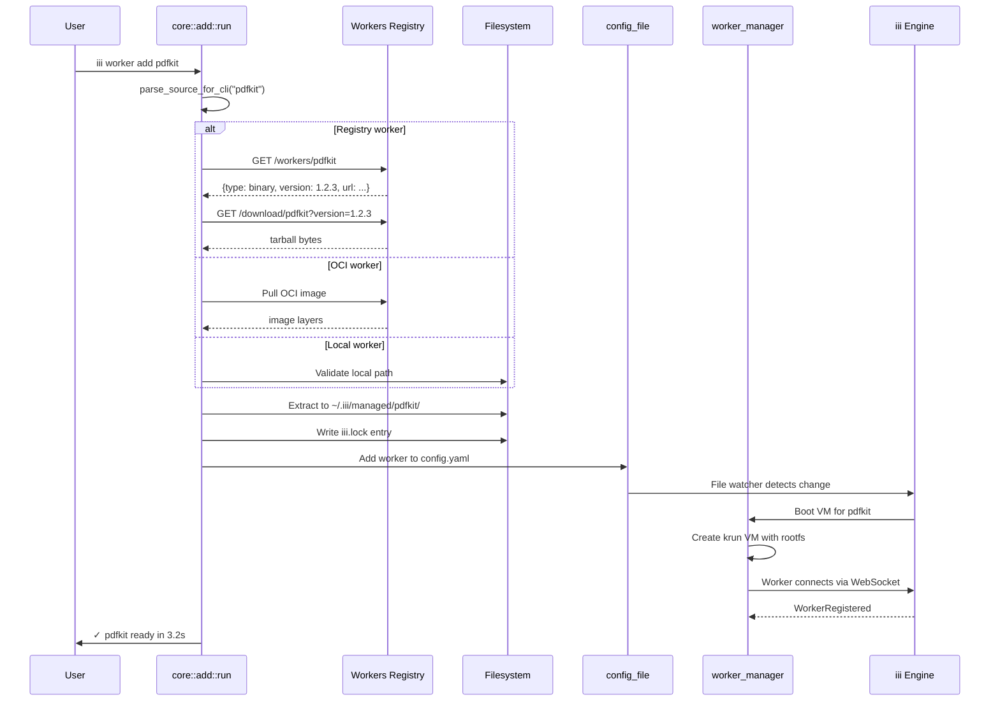
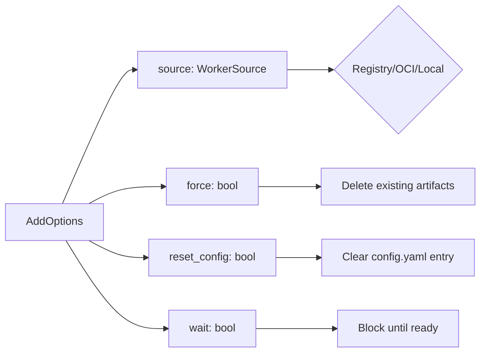

# Add Pipeline — Resolve, Download, Extract, Configure, Boot

**The `iii worker add` command is the core workflow — it resolves a worker source, downloads it, extracts to the managed directory, configures config.yaml, and boots the VM.** This document traces the full pipeline.

## Add Flow



## AddOptions

Source: `core/types.rs`

```rust
pub struct AddOptions {
    pub source: WorkerSource,
    pub force: bool,
    pub reset_config: bool,
    pub wait: bool,
}
```



## Add Pipeline Steps

1. **Resolve** — Determine worker type from source (registry/OCI/local)
2. **Download** — Fetch binary/bundle from registry or pull OCI image
3. **Extract** — Unpack to `~/.iii/managed/{name}/`
4. **Configure** — Write config.yaml entry with worker definition
5. **Lock** — Update iii.lock with resolved version
6. **Boot** — Start the worker VM (if `wait: true`)

## Force Re-add

With `--force`, the pipeline deletes existing artifacts before re-downloading:

```rust
if force {
    // Delete existing managed directory
    std::fs::remove_dir_all(managed_dir)?;
}
```

**Aha:** At startup, iii-worker sweeps orphaned staging directories left from interrupted installs (SIGKILL, power cut, OOM). The RAII `StagingGuard` pattern normally cleans up automatically, but SIGKILL bypasses Drop. The sweep prevents accumulation of partial downloads.

## Orphan Staging Sweep

Source: `main.rs:19-26`

At startup, iii-worker sweeps orphaned staging directories:

```rust
// If a previous `iii worker add <bundle>` was killed mid-install
// (SIGKILL / power cut / OOM), the RAII StagingGuard could not run
// and left a directory behind under ~/.iii/workers-bundle/.staging/.
let _ = iii_worker::cli::bundle_download::sweep_orphans();
```

This prevents accumulation of partial downloads from interrupted installs.

## What's Next

- [05 — Managed Ops](05-managed-ops.md) — Binary add, bundle add, local add in detail
- [06 — Sandbox Daemon](06-sandbox-daemon.md) — VM management, overlay filesystems, exec
- [07 — VM Lifecycle](07-vm-lifecycle.md) — libkrun VM management
