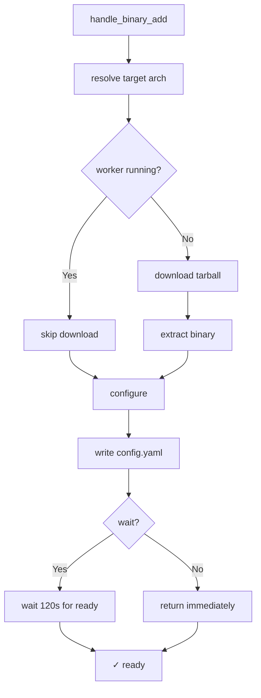
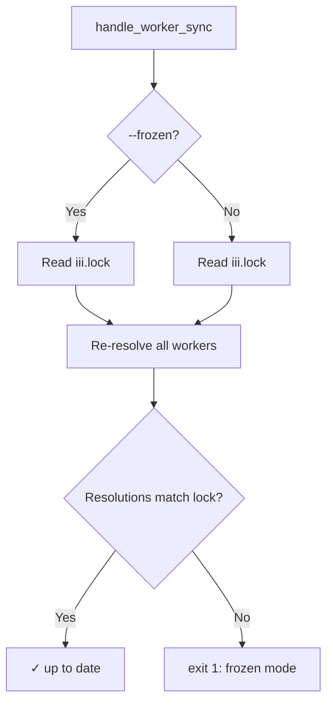

# Managed Operations — Binary Add, Bundle Add, Local Add

**The managed.rs module (6,469 lines) contains all CLI handlers for managing workers.** This document covers the three main add paths and the restart/sync/verify operations.

## Binary Add

Source: `cli/managed.rs` — `handle_binary_add`

For pre-compiled binary workers:

1. **Resolve target** — Determine architecture (e.g., `x86_64-unknown-linux-musl`)
2. **Check running** — Skip download if worker is already running
3. **Download** — Fetch tarball from registry
4. **Extract** — Binary to managed directory
5. **Configure** — Write config.yaml entry
6. **Wait** — Block until worker reports ready (default 120s)



**Aha:** If the worker is already running, the download is skipped entirely — no point downloading a new binary for a running VM. The new binary takes effect on the next restart.

## Bundle Add

Source: `cli/managed.rs` — `handle_bundle_add`

For source bundles that need building:

1. **Resolve** — Fetch bundle metadata from registry
2. **Download** — Fetch bundle archive
3. **Extract** — Source + build scripts to managed directory
4. **Build** — Compile if needed (uses RAII StagingGuard)
5. **Configure** — Write config.yaml entry
6. **Boot** — Start VM

### StagingGuard

The bundle download uses an RAII guard pattern:

```rust
// If the process is killed mid-install, StagingGuard's Drop
// cleans up the partial staging directory automatically.
let guard = StagingGuard::new(staging_dir)?;
// ... extract and build ...
guard.commit()?; // Moves to final location
```

## Local Add

Source: `cli/local_worker.rs` — `handle_local_add`

For workers running from local source:

1. **Validate** — Check for `iii.worker.yaml` or known entry points
2. **Configure** — Write config.yaml entry
3. **Start** — Launch via iii-exec or dedicated process

## Restart

Source: `cli/managed.rs` — `handle_managed_restart`

Restart is stop + start with the same config:

```rust
pub async fn handle_managed_restart(
    worker_name: &Option<String>,
    wait: bool,
    port: Option<u16>,
    config: Option<&PathBuf>,
) -> i32 {
    // Stop the worker
    handle_managed_stop(worker_name).await;
    // Start with same config
    handle_managed_start(worker_name, wait, port, config).await;
}
```

## Sync

Source: `cli/managed.rs` — `handle_worker_sync`

Re-resolves all locked workers and updates iii.lock. In `--frozen` mode, fails if any resolution would change the lock (useful for CI).



## Verify

Source: `cli/managed.rs` — `handle_worker_verify`

Verifies worker integrity: checks that downloaded artifacts match the lock file, that binaries are present, that config.yaml entries are consistent.

## What's Next

- [06 — Sandbox Daemon](06-sandbox-daemon.md) — VM management, overlay filesystems, exec
- [07 — VM Lifecycle](07-vm-lifecycle.md) — libkrun VM management
- [09 — Lockfile](09-lockfile.md) — Version pinning and drift detection
