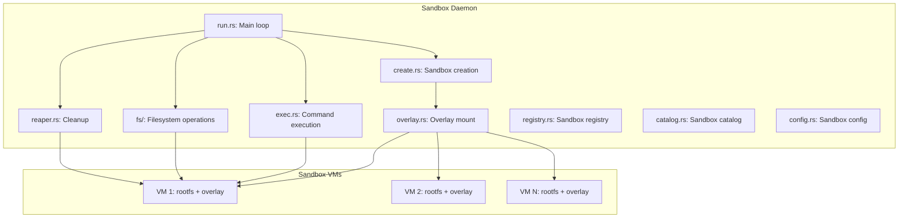
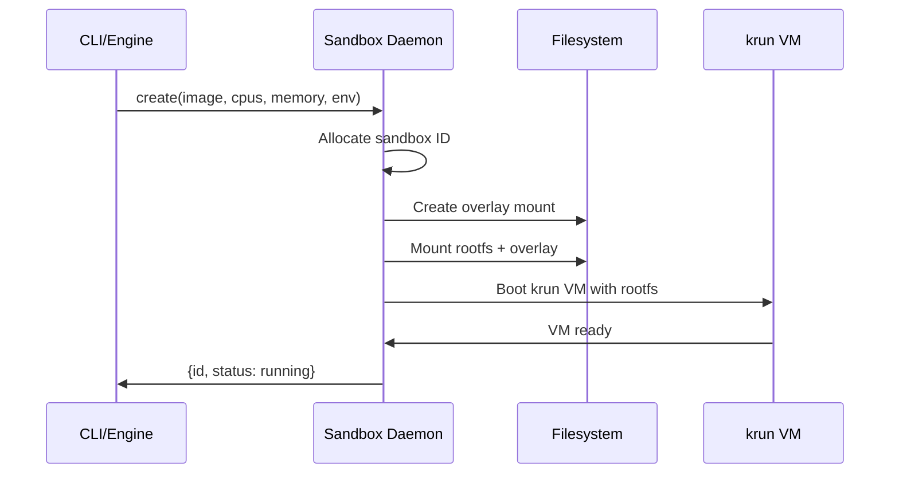

# Sandbox Daemon — VM Management, Overlay Filesystems, Exec

**The sandbox daemon manages sandboxed VMs with overlay filesystems, command execution, and file access.** This document covers the sandbox architecture.

## Sandbox Daemon Architecture

Source: `sandbox_daemon/` (7,595 LOC)



## Sandbox Creation Flow



## Overlay Filesystems

Source: `sandbox_daemon/overlay.rs`

Sandboxes use overlay mounts to isolate changes:

| Layer | Purpose |
|-------|---------|
| Lower (rootfs) | Base image, read-only |
| Upper (overlay) | Write layer, sandbox-specific |
| Work | Overlayfs work directory |

This allows multiple sandboxes to share the same base image while keeping changes isolated.

## Command Execution

Source: `sandbox_daemon/exec.rs`

The exec command runs commands inside a sandbox:

```
iii worker exec <name> -- <cmd>... [--timeout 30s] [--env KEY=VAL]
```

```mermaid
sequenceDiagram
    participant CLI as iii worker exec
    participant Relay as shell_relay
    participant Socket as Unix socket
    participant VM as Sandbox VM

    CLI->>Relay: Connect to sandbox
    Relay->>Socket: Connect via Unix socket
    CLI->>Relay: Send command
    Relay->>Socket: Forward command
    Socket->>VM: Execute in VM
    VM->>Socket: Stream stdout/stderr
    Socket->>Relay: Forward output
    Relay->>CLI: Display to user
    VM->>Socket: Return exit code
    Socket->>Relay->>CLI: Exit code
```

**Aha:** The shell relay uses base64 encoding for binary payloads inside JSON frames, and the peer UID check via `SO_PEERCRED`/`getpeereid` verifies client identity on the Unix socket — preventing unauthorized access to sandboxes.

Execution flow:
1. Connect to sandbox via Unix socket
2. Send command via shell protocol
3. Stream stdout/stderr back to client
4. Return exit code

## Filesystem Access

Source: `sandbox_daemon/fs/`

The sandbox provides file access operations:

| Operation | Purpose |
|-----------|---------|
| Read | Read file from sandbox |
| Write | Write file to sandbox |
| List | List directory contents |
| Create | Create files/directories |
| Delete | Remove files/directories |

### Write Buffer Boundary

Source: `tests/sandbox_fs_read_buffer_boundary.rs`

Tests verify that the read buffer boundary is handled correctly — no data is lost or corrupted at buffer edges.

## Sandbox Reaper

Source: `sandbox_daemon/reaper.rs`

Automatically cleans up stopped sandboxes:

1. Detect stopped VMs
2. Unmount overlay filesystems
3. Delete sandbox directory
4. Update registry

## Sandbox Catalog

Source: `sandbox_daemon/catalog.rs`

Tracks available sandbox images and their metadata for quick lookup during creation.

## What's Next

- [07 — VM Lifecycle](07-vm-lifecycle.md) — libkrun VM management
- [04 — Add Pipeline](04-add-pipeline.md) — Return to add pipeline
- [10 — Cross-Cutting](10-cross-cutting.md) — Testing, CI/CD, configuration
