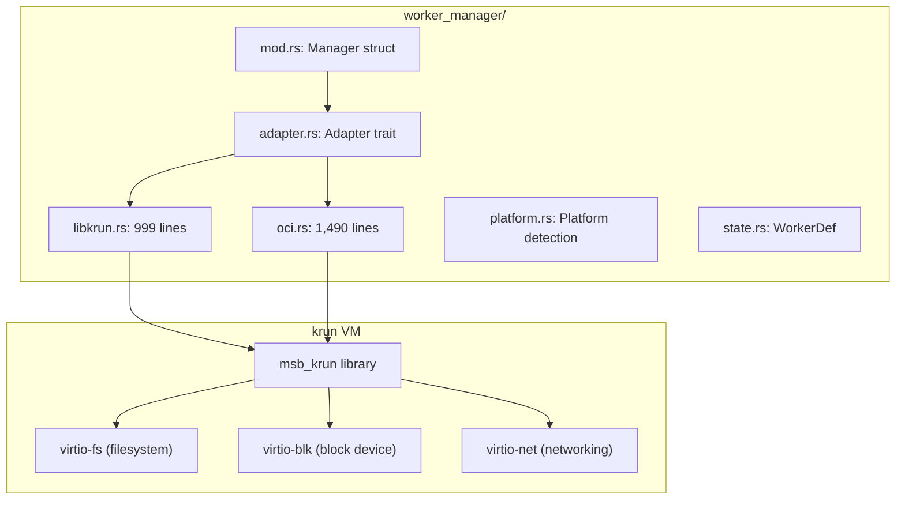
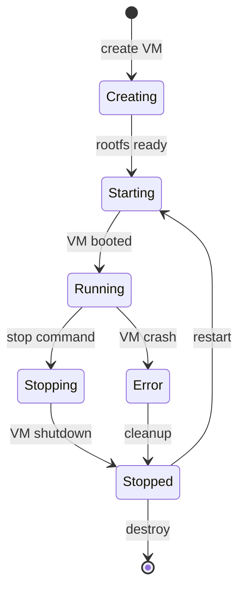

# VM Lifecycle — libkrun VM Management

**iii-worker manages krun VMs through the worker_manager module, handling VM creation, startup, shutdown, and OCI image pulling.** This document covers the VM lifecycle.

## Worker Manager Architecture

Source: `cli/worker_manager/`



## libkrun Adapter

Source: `cli/worker_manager/libkrun.rs` (999 lines)

The libkrun adapter handles VM lifecycle:

1. **Create** — Build VM configuration with rootfs, CPU, memory
2. **Start** — Launch VM via msb_krun
3. **Monitor** — Track VM state (running/stopped)
4. **Stop** — Graceful shutdown with async cleanup
5. **Exec** — Run commands inside running VM

### VM Configuration

```rust
pub struct WorkerDef {
    pub name: String,
    pub image: String,
    pub cpus: u32,
    pub memory: u64,
    pub rootfs: PathBuf,
    // ...
}
```

## OCI Adapter

Source: `cli/worker_manager/oci.rs` (1,490 lines)

The OCI adapter handles container images:

1. **Pull** — Download image layers from OCI registry
2. **Extract** — Unpack layers to rootfs directory
3. **Configure** — Build OCI runtime spec
4. **Run** — Launch via libkrun with OCI config

### OCI Image Pulling

Source: `cli/worker_manager/oci.rs`

```rust
// Uses oci_client = "0.16" for pulling images
let client = oci_client::Client::new(oci_client::client::Protocol::Https);
let image = client.pull(...).await?;
```

## VM Boot

Source: `cli/vm_boot.rs` (1,199 lines)

The vm_boot command runs on a dedicated OS thread (see [02 — CLI Surface](02-cli-surface.md) for why). It:

1. **Parse args** — Image, CPU, memory, port
2. **Create rootfs** — From OCI image or local path
3. **Configure VM** — Set CPU, memory, network
4. **Boot** — Launch via msb_krun
5. **Wait** — Block until VM reports ready

## VM Lifecycle States



**Aha:** The `vm_boot` command runs on a dedicated OS thread because `msb_krun`'s virtio-blk Drop impls call `tokio::Runtime::block_on` for async shutdown, which panics inside the `#[tokio::main]` runtime. The std thread gives those drops a runtime-free context.

## What's Next

- [08 — Firmware](08-firmware.md) — libkrunfw download and caching
- [09 — Lockfile](09-lockfile.md) — Version pinning and drift detection
- [03 — Worker Types](03-worker-types.md) — Return to worker types
