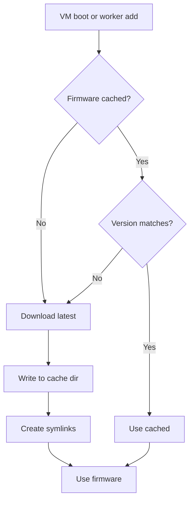
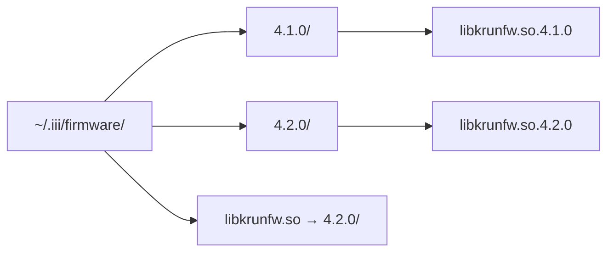

# Firmware — libkrunfw Download and Caching

**iii-worker manages the krun firmware (libkrunfw) download, caching, and version resolution.** This document covers the firmware system.

## Firmware Module

Source: `cli/firmware/`

```
firmware/
├── mod.rs          # Module exports
├── constants.rs    # Firmware URLs, versions
├── download.rs     # Download logic
├── libkrunfw_bytes.rs # Embedded firmware bytes
├── resolve.rs      # Version resolution
└── symlinks.rs     # Symlink management
```

## Firmware Flow



**Aha:** Firmware is cached with versioned directories and symlinks, allowing multiple VMs to share the same firmware while keeping versions isolated. The symlink approach means VMs don't need to know the exact version path.

## Version Resolution

Source: `cli/firmware/resolve.rs`

1. Check if cached firmware matches required version
2. If not, download from firmware URL
3. Create symlinks for the new version
4. Clean up old versions

## Caching Strategy

Firmware is cached in `~/.iii/firmware/` with:

| Component | Purpose |
|-----------|---------|
| Version directory | `~/.iii/firmware/{version}/` |
| Symlinks | `libkrunfw.so` → versioned file |
| Metadata | Download timestamp, checksum |



## Embedded Firmware

Source: `cli/firmware/libkrunfw_bytes.rs`

With the `embed-libkrunfw` feature, firmware bytes are embedded at compile time:

```rust
#[cfg(has_libkrunfw)]
pub const LIBKRUNFW_BYTES: &[u8] = include_bytes!(...);
```

## What's Next

- [09 — Lockfile](09-lockfile.md) — Version pinning and drift detection
- [07 — VM Lifecycle](07-vm-lifecycle.md) — Return to VM lifecycle
- [10 — Cross-Cutting](10-cross-cutting.md) — Testing, CI/CD, configuration
