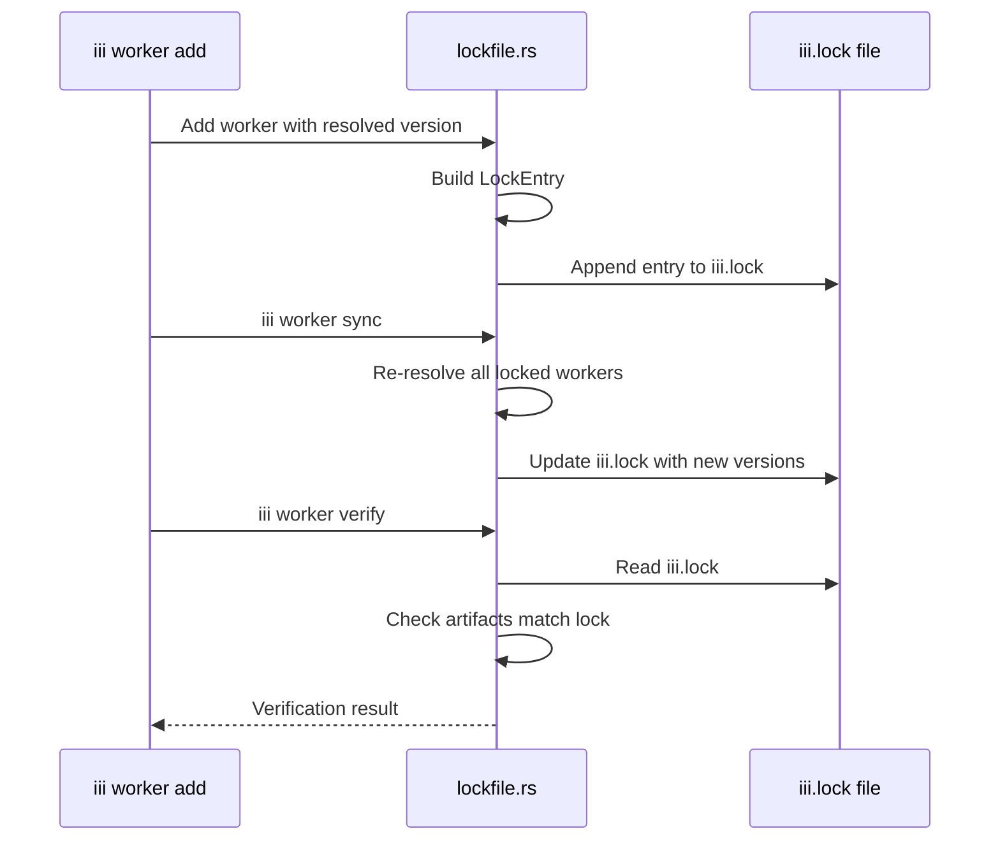
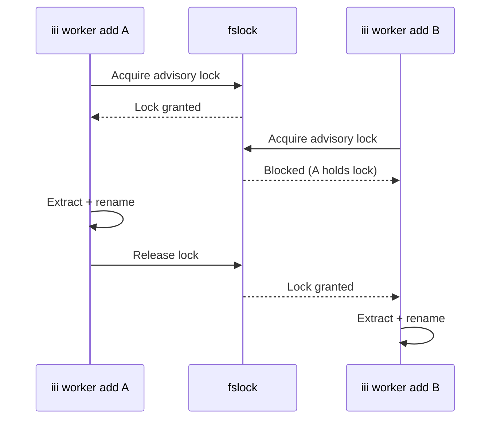

# Lockfile — Version Pinning, iii.lock, and Drift Detection

**iii-worker uses a lockfile system (iii.lock) for version pinning and drift detection.** This document covers the lockfile module.

## Lockfile Module

Source: `cli/lockfile.rs` (1,119 lines)

The lockfile tracks:

| Field | Purpose |
|-------|---------|
| `worker_name` | Worker identifier |
| `version` | Resolved version |
| `source` | WorkerSource (registry/OCI/local) |
| `checksum` | Artifact checksum for integrity |
| `resolved_at` | When the version was resolved |

## Lockfile Flow



**Aha:** The lockfile uses cross-process advisory file locks (`fslock = "0.2"`) to serialize concurrent `iii worker add` calls during the extract+rename step, preventing race conditions between parallel installs.

## Sync Operation

Source: `cli/managed.rs` — `handle_worker_sync`

Re-resolves all locked workers and updates iii.lock. In `--frozen` mode:

```rust
if frozen {
    // Fail if any resolution would change the lock
    // Useful for CI reproducibility
}
```

## Drift Detection

Source: `tests/sync_drift_adversarial.rs`

Tests verify that drift detection works correctly — if the lock file says version X but the artifact is version Y, the system detects and reports the mismatch.

## Cross-Process Advisory Lock

Source: `Cargo.toml` — `fslock = "0.2"`

The lockfile uses cross-process advisory file locks to serialize concurrent `iii worker add` calls during the extract+rename step, preventing race conditions.



## What's Next

- [10 — Cross-Cutting](10-cross-cutting.md) — Testing, CI/CD, configuration
- [04 — Add Pipeline](04-add-pipeline.md) — Return to add pipeline
- [01 — Architecture](01-architecture.md) — Return to architecture
