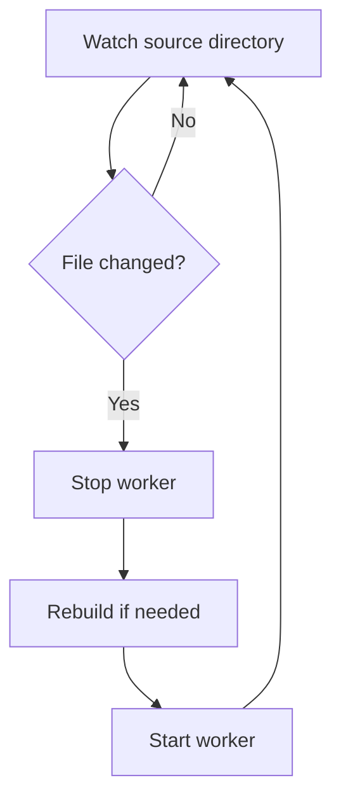
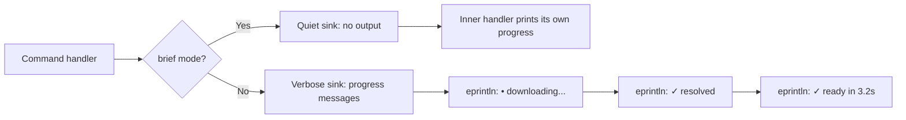

# Cross-Cutting — Testing, Configuration, Source Watching

**This document covers cross-cutting concerns: testing strategy, configuration system, and source watching for local development.**

## Testing Strategy

Source: `tests/` (39 test files)

Tests are organized by type:

| Category | Files | Purpose |
|----------|-------|---------|
| Integration | 25+ | Full worker lifecycle tests |
| Unit | Embedded | Module-level tests |
| Adversarial | 1 | Sync drift detection |
| Smoke | 2 | OCI gate, VM gate |

### Integration Test Features

| Feature | Test File | What It Tests |
|---------|-----------|---------------|
| Binary workers | `binary_worker_integration.rs` | Binary download, extract, boot |
| Bundle workers | `bundle_worker_integration.rs` | Bundle download, build, boot |
| Local workers | `local_worker_integration.rs` | Local path validation, start |
| OCI workers | `oci_worker_integration.rs` | OCI pull, extract, boot |
| Config management | `config_*.rs` | CRUD, cross-platform, path types |
| Sandbox | `sandbox_*.rs` | Lifecycle, FS, workflow, error codes |
| VM | `vm_*.rs` | Boot, lifecycle, args |
| Worker manager | `worker_manager_integration.rs` | Manager lifecycle |
| Worker trigger | `worker_trigger_integration.rs` | Trigger registration |

### Test Features

Source: `Cargo.toml` — features

```toml
[features]
default = []
integration-vm = []    # Gate heavy VM tests
integration-oci = []   # Gate OCI integration tests
```

Integration tests are gated behind features to avoid slow CI for every PR.

### Home Mutex for Tests

Source: `lib.rs:21-25`

```rust
#[cfg(test)]
pub(crate) use crate::cli::test_support::TEST_HOME_LOCK as TEST_ENV_LOCK;
```

**Aha:** Tests that mutate HOME env var serialize against the same mutex that HOME-reading tests use. Two separate mutexes caused intermittent pidfile-path mismatches.

## Configuration System

Source: `cli/config_file.rs` (1,744 lines)

The config file (`config.yaml`) manages:

| Setting | Purpose |
|---------|---------|
| `workers` | List of managed workers |
| Worker definitions | Name, source, version, config |
| Engine connection | WebSocket URL, port |

### Config File Types

| Type | Purpose |
|------|---------|
| `ResolvedWorkerType::Binary` | Pre-compiled binary worker |
| `ResolvedWorkerType::Bundle` | Source bundle worker |
| `ResolvedWorkerType::Local` | Local path worker |

## Source Watching

Source: `cli/source_watcher.rs` (1,274 lines)

For local development, `iii worker watch-source` watches source files and restarts the worker on change:



**Aha:** Tests that mutate HOME env var serialize against the same mutex that HOME-reading tests use. Two separate mutexes caused intermittent pidfile-path mismatches — a subtle race that only appeared in parallel test runs.

Uses `notify = "8.2"` for file watching.

## Shell Client/Relay

Source: `cli/shell_client.rs` (968 lines) + `cli/shell_relay.rs` (1,380 lines)

The shell system enables command execution inside sandboxes:

| Component | Purpose |
|-----------|---------|
| `shell_client` | Connect to sandbox, send commands |
| `shell_relay` | Relay stdout/stderr between client and sandbox |
| Unix socket | Communication channel |
| Peer UID check | Security: verify client identity via `SO_PEERCRED`/`getpeereid` |

### Base64 Encoding

Source: `Cargo.toml` — `base64 = "0.22"`

The shell relay encodes binary payloads as base64 strings inside JSON frames. Version `0.22` matches the engine's version.

### Humantime

Source: `Cargo.toml` — `humantime = "2"`

The `iii worker exec --timeout 30s` command uses humantime for duration parsing: `30s`, `5m`, `1h`, `500ms`.

## Spinner and Progress

Source: `cli/spinner.rs`

Uses `indicatif = "0.17"` for progress bars during download and extraction.

## Stderr Sink

Source: `cli/stderr_sink.rs`

The `StderrSink` provides a unified interface for outputting progress messages to stderr, with brief mode for scripting.



## Supervisor Control

Source: `cli/supervisor_ctl.rs`

Interfaces with `iii-supervisor` for process supervision of worker VMs.

## PID File Management

Source: `cli/pidfile.rs`

Prevents multiple instances of the same worker from running simultaneously.

## OCI Reference Parsing

Source: `cli/oci_ref.rs`

Parses OCI image references (`ghcr.io/org/worker:tag`) into structured components.

## What's Next

- [00 — Overview](00-overview.md) — Return to overview
- [01 — Architecture](01-architecture.md) — Return to architecture
- [02 — CLI Surface](02-cli-surface.md) — Return to CLI
