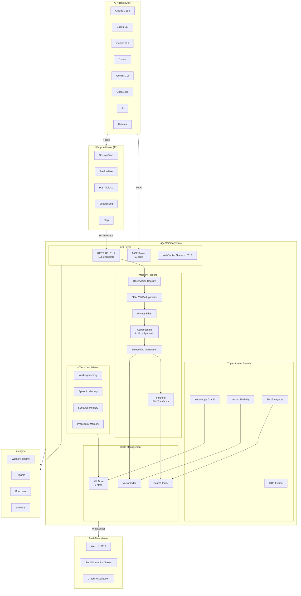
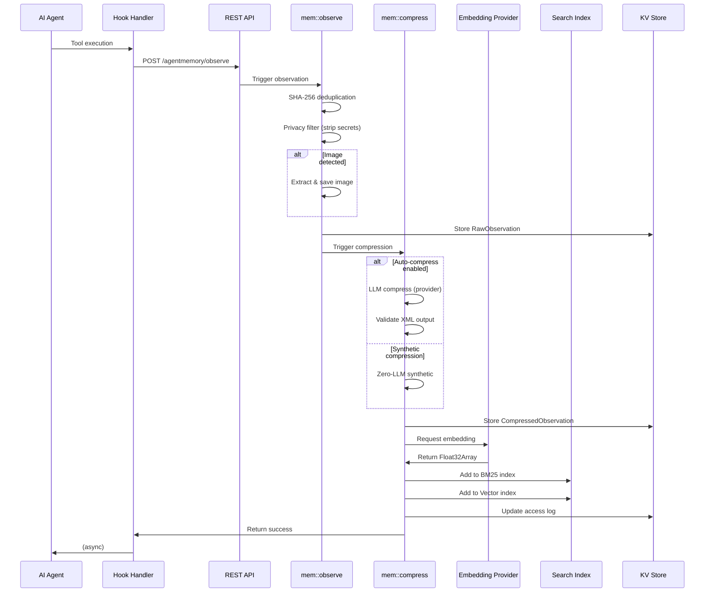
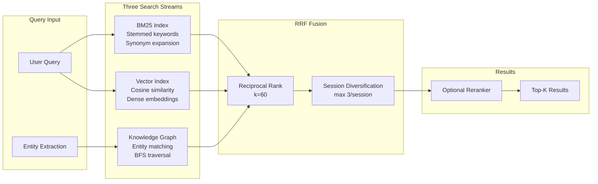
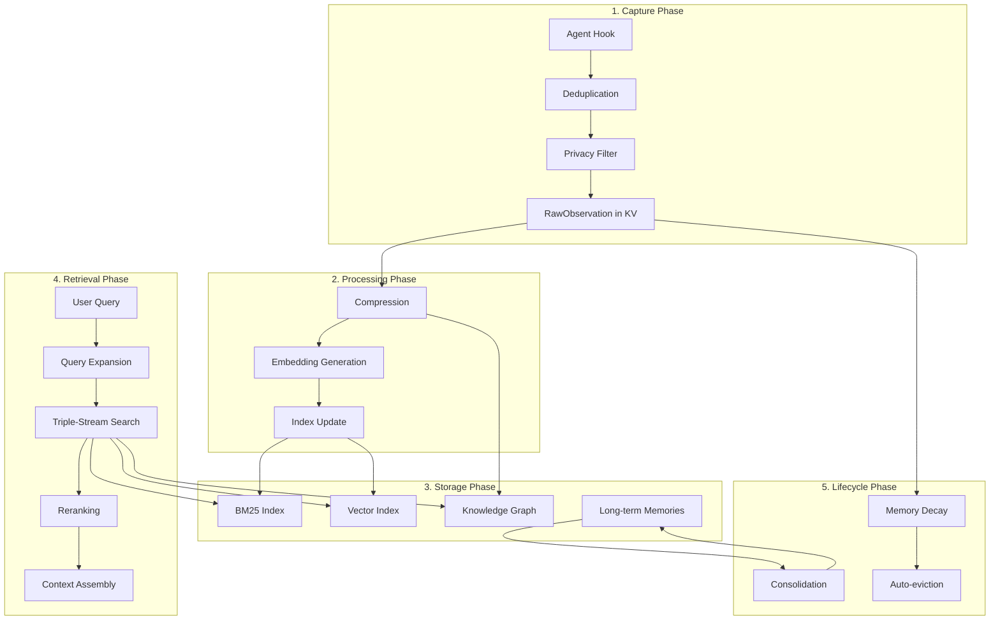

# Project Exploration: agentmemory

## Overview

**agentmemory** is a persistent memory system for AI coding agents, built on the iii-engine's three primitives (worker, function, trigger). It eliminates the need to re-explain project context to coding agents like Claude Code, GitHub Copilot CLI, Cursor, Gemini CLI, Codex CLI, and others by capturing observations from agent interactions, compressing them into searchable memories, and injecting relevant context into new sessions.

The system operates as a background service that silently records tool usage, file access patterns, and conversations, then applies a 4-tier memory consolidation model inspired by human cognitive processes. With 95.2% retrieval accuracy (R@5) on the LongMemEval-S benchmark and 92% fewer tokens than full-context approaches, agentmemory provides a production-grade memory layer that works across 20+ AI agents through MCP (Model Context Protocol) and REST APIs.

**Key insight:** Unlike built-in agent memory (CLAUDE.md, .cursorrules) that caps at 200 lines and goes stale, agentmemory functions as a searchable database behind the sticky notes—using BM25 + vector + knowledge graph search with RRF fusion to deliver only the most relevant context within token budgets.

## Repository

- **Location:** `/home/darkvoid/Boxxed/@formulas/src.rust/src.llamacpp/src.iii/agentmemory/`
- **Remote:** `git@github.com:rohitg00/agentmemory`
- **Primary Language:** TypeScript (29,914 LOC in `src/`)
- **License:** Apache-2.0
- **Version:** 0.9.24
- **Node.js Requirement:** >= 20.0.0
- **Default Ports:** 3111 (REST API), 3112 (Streams), 3113 (Viewer)

## Directory Structure

```
agentmemory/
├── src/                          # Core source code (29,914 LOC)
│   ├── index.ts                  # Main entry point - worker registration
│   ├── cli.ts                    # CLI entry point - commands & lifecycle
│   ├── config.ts                 # Configuration loading & provider detection
│   ├── types.ts                  # TypeScript type definitions (899 lines)
│   ├── version.ts                # Version constant
│   ├── logger.ts                 # Logging utilities
│   ├── auth.ts                   # Authentication & timing-safe compare
│   ├── cli/                      # CLI command implementations
│   │   ├── connect/              # Agent connection adapters (20+ agents)
│   │   ├── doctor-diagnostics.ts # Diagnostic checks & fixes
│   │   ├── onboarding.ts         # First-run setup
│   │   ├── preferences.ts        # User preferences storage
│   │   ├── remove-plan.ts        # Uninstall logic
│   │   └── splash.ts             # ASCII splash screen
│   ├── functions/                # Core memory functions (80+ modules)
│   │   ├── observe.ts            # Observation capture from hooks
│   │   ├── compress.ts           # LLM-powered compression
│   │   ├── compress-synthetic.ts # Zero-LLM synthetic compression
│   │   ├── search.ts             # BM25 search index
│   │   ├── smart-search.ts       # Hybrid search orchestration
│   │   ├── remember.ts           # Long-term memory storage
│   │   ├── recall.ts             # Memory retrieval
│   │   ├── context.ts            # Context injection for sessions
│   │   ├── graph.ts              # Knowledge graph extraction
│   │   ├── graph-retrieval.ts    # Graph traversal search
│   │   ├── consolidate.ts        # Memory consolidation pipeline
│   │   ├── auto-forget.ts        # TTL & decay management
│   │   ├── team.ts               # Multi-agent memory sharing
│   │   ├── actions.ts            # Action/workflow management
│   │   ├── frontier.ts           # Priority action queue
│   │   ├── leases.ts             # Distributed action locking
│   │   ├── signals.ts            # Inter-agent messaging
│   │   ├── slots.ts              # Pinned memory slots
│   │   └── ... (60+ more)
│   ├── state/                    # State management layer
│   │   ├── kv.ts                 # KV store wrapper (iii-sdk)
│   │   ├── schema.ts             # KV scope definitions & ID generation
│   │   ├── search-index.ts       # BM25 implementation
│   │   ├── vector-index.ts       # Vector embedding index
│   │   ├── hybrid-search.ts      # Triple-stream search fusion
│   │   ├── index-persistence.ts  # Disk persistence
│   │   ├── reranker.ts           # Result reranking
│   │   ├── stemmer.ts            # Multi-language stemming
│   │   └── ...
│   ├── providers/                # LLM provider integrations
│   │   ├── index.ts              # Provider factory
│   │   ├── anthropic.ts          # Anthropic API
│   │   ├── openai.ts             # OpenAI API
│   │   ├── gemini.ts             # Google Gemini
│   │   ├── openrouter.ts         # OpenRouter proxy
│   │   ├── minimax.ts            # MiniMax API
│   │   ├── embedding/            # Embedding providers (8 modules)
│   │   ├── fallback-chain.ts     # Provider failover
│   │   └── resilient.ts          # Circuit breaker pattern
│   ├── triggers/                 # Event triggers
│   │   ├── api.ts                # 125 REST endpoints
│   │   └── events.ts             # Lifecycle event handlers
│   ├── mcp/                      # Model Context Protocol
│   │   ├── server.ts             # MCP endpoint registration
│   │   ├── tools-registry.ts     # 53 MCP tools
│   │   ├── transport.ts          # MCP transport layer
│   │   └── standalone.ts         # Standalone MCP shim
│   ├── hooks/                    # Agent hook handlers
│   │   ├── session-start.ts      # Session initialization
│   │   ├── session-end.ts        # Session cleanup & summarization
│   │   ├── post-tool-use.ts      # Tool use observation
│   │   ├── pre-tool-use.ts       # Pre-tool context enrichment
│   │   ├── stop.ts               # Stop hook consolidation
│   │   └── ... (12 total)
│   ├── prompts/                  # LLM prompt templates
│   │   ├── compression.ts      # Observation compression
│   │   ├── graph-extraction.ts   # Knowledge graph prompts
│   │   ├── summary.ts            # Session summary
│   │   └── ...
│   ├── viewer/                   # Real-time web viewer
│   │   ├── server.ts             # HTTP server (port 3113)
│   │   ├── document.ts           # HTML document generation
│   │   └── index.html            # Static HTML template
│   ├── eval/                     # Evaluation & quality
│   │   ├── quality.ts            # Compression quality scoring
│   │   ├── validator.ts          # Output validation
│   │   ├── self-correct.ts       # Retry with self-correction
│   │   └── metrics-store.ts      # Function metrics tracking
│   ├── health/                   # Health monitoring
│   │   ├── monitor.ts            # Health checks
│   │   └── thresholds.ts         # Threshold configuration
│   ├── telemetry/                # OpenTelemetry setup
│   │   └── setup.ts              # OTEL configuration
│   └── utils/                    # Utilities
│       └── image-store.ts        # Image persistence
├── plugin/                       # Agent plugins
│   ├── hooks/                    # Hook configuration files
│   ├── skills/                   # 8 native skills (SKILL.md format)
│   ├── opencode/                 # OpenCode integration
│   └── scripts/                  # Hook script implementations
├── packages/
│   └── mcp/                      # Published @agentmemory/mcp package
├── integrations/                 # Third-party integrations
│   ├── hermes/                   # Hermes agent plugin
│   ├── openclaw/                 # OpenClaw plugin
│   ├── pi/                       # pi agent integration
│   └── filesystem-watcher/       # FS watcher utility
├── eval/                         # Evaluation harness
│   ├── runner/                   # Benchmark runners
│   └── data/                     # Test datasets
├── benchmark/                    # Benchmark results & configs
├── examples/
│   └── python/                   # Python SDK examples
├── test/                         # Test suite (950+ tests)
├── website/                      # Next.js marketing site
├── docs/                         # Documentation
│   ├── benchmarks/               # Benchmark reports
│   └── recipes/                  # Integration recipes
├── deploy/                       # Deployment configs
│   ├── fly/                      # Fly.io template
│   ├── railway/                  # Railway template
│   ├── render/                   # Render blueprint
│   └── coolify/                  # Coolify self-hosted
├── iii-config.yaml               # iii-engine configuration
├── iii-config.docker.yaml        # Docker iii configuration
├── package.json                  # NPM manifest
├── tsconfig.json                 # TypeScript configuration
└── docker-compose.yml            # Docker Compose stack
```

## Architecture

### High-Level Component Diagram



### Memory Pipeline Sequence Diagram



### Triple-Stream Search Architecture



## Component Breakdown

### Entry Point (src/index.ts:1-597)

The main entry point registers the agentmemory worker with iii-engine and bootstraps all subsystems.

**Key initialization flow:**
1. Load configuration from `~/.agentmemory/.env` (lines 160-173)
2. Create LLM provider with fallback chain (lines 164-167)
3. Create embedding provider (lines 169-170)
4. Register worker with iii-sdk (lines 194-214)
5. Initialize state KV (line 218)
6. Register 80+ functions (lines 234-334)
7. Restore persisted indices (lines 383-444)
8. Start background timers (auto-forget, consolidation, decay)
9. Start viewer server on port 3113 (lines 525-531)

**Key insight:** The worker writes its PID to `~/.agentmemory/worker.pid` (lines 111-127) to enable proper cleanup when `agentmemory stop` is called, preventing orphaned worker processes that reconnect to new engine instances.

### Configuration System (src/config.ts:1-429)

Configuration is layered from multiple sources:
1. `~/.agentmemory/.env` file (parsed at lines 24-46)
2. Process environment variables
3. Runtime overrides

**Provider detection priority** (lines 52-157):
1. OpenAI (if `OPENAI_API_KEY` set and not scoped to embeddings only)
2. MiniMax (if `MINIMAX_API_KEY` set)
3. Anthropic (if `ANTHROPIC_API_KEY` set)
4. Gemini (if `GEMINI_API_KEY` or `GOOGLE_API_KEY` set)
5. OpenRouter (if `OPENROUTER_API_KEY` set)
6. Agent SDK (opt-in only with `AGENTMEMORY_ALLOW_AGENT_SDK=true`)
7. No-op provider (default - no LLM calls)

**Aha:** The no-op provider is the intentional default. This prevents accidental token spend and the Stop-hook recursion bug (#149) where agent-sdk child sessions inherit parent hooks.

### Observation Pipeline (src/functions/observe.ts:1-200+)

Captures raw observations from agent hooks and processes them through the pipeline.

**Key types captured** (lines 14-44 in types.ts):
- `file_read`, `file_write`, `file_edit` - File operations
- `command_run` - Shell commands
- `search`, `web_fetch` - Research actions
- `conversation` - User/agent dialogue
- `error`, `decision`, `discovery` - Outcome events
- `subagent`, `notification`, `task` - Lifecycle events
- `image` - Visual content

**Deduplication** (lines 63-78 in observe.ts):
- Uses SHA-256 hash of sessionId + toolName + toolInput
- 5-minute window prevents duplicate captures
- Soft-fails silently for duplicate detections

**Privacy filtering** (src/functions/privacy.ts):
- Strips API keys, tokens, secrets via regex patterns
- Removes content marked with `<private>` tags
- Applied before any storage or LLM processing

### Compression System (src/functions/compress.ts:1-150+)

Transforms raw observations into structured compressed form.

**LLM compression** (when `AGENTMEMORY_AUTO_COMPRESS=true`):
- System prompt: `COMPRESSION_SYSTEM` from prompts/compression.ts
- XML output format with typed schema validation
- Self-correction retry loop for validation failures
- Image description via vision models for mixed-modality observations

**Synthetic compression** (default, zero-LLM):
- Extracts type from hookType/toolName
- Builds title from tool name + file/command
- Derives facts from structured tool output
- No API calls, immediate local processing

**Output schema** (lines 44-65 in compress.ts):
```xml
<observation>
  <type>file_read|file_write|...</type>
  <title>Human-readable title</title>
  <subtitle>Optional context</subtitle>
  <facts><fact>...</fact></facts>
  <narrative>Summary paragraph</narrative>
  <concepts><concept>...</concept></concepts>
  <files><file>...</file></files>
  <importance>1-10</importance>
</observation>
```

### Search Index (src/state/search-index.ts)

BM25 implementation with multi-language support.

**Features:**
- Stemming for English, Greek, Cyrillic, Hebrew, Arabic
- CJK segmentation via optional `@node-rs/jieba` or `tiny-segmenter`
- Synonym expansion via WordNet-style lookup
- Document frequency tracking for IDF calculation
- In-memory with periodic disk persistence

### Vector Index (src/state/vector-index.ts)

Dense vector similarity search using cosine distance.

**Key properties:**
- Supports any embedding dimension (384 for local, 768/1536/3072 for APIs)
- Dimension mismatch protection (rejects cross-dimension comparisons)
- Batch embedding for bulk operations
- Normalized cosine similarity (0-1 range)

### Hybrid Search (src/state/hybrid-search.ts:1-150+)

Combines three retrieval signals with Reciprocal Rank Fusion.

**RRF formula** (line 20):
```
score = 1 / (k + rank)
where k = 60 (constant)
```

**Weighting** (lines 31-33):
- BM25: 0.4 (default)
- Vector: 0.6 (default)
- Graph: 0.3 (default)

**Session diversification** (implemented in search):
- Maximum 3 results per session
- Prevents single session from dominating results
- Ensures cross-session context variety

### Knowledge Graph (src/functions/graph.ts:1-150+)

Entity and relationship extraction from observations.

**Entity types** (lines 366-379 in types.ts):
- `file`, `function`, `concept`, `error`, `decision`
- `pattern`, `library`, `person`, `project`, `preference`
- `location`, `organization`, `event`

**Relationship types** (lines 393-409 in types.ts):
- `uses`, `imports`, `modifies`, `causes`, `fixes`
- `depends_on`, `related_to`, `works_at`, `prefers`
- `blocked_by`, `caused_by`, `optimizes_for`, `rejected`, `avoids`

**Graph query** supports BFS traversal from entity matches with configurable depth.

### Memory Consolidation (src/functions/consolidation-pipeline.ts)

4-tier memory model inspired by human cognitive architecture:

1. **Working Memory** - Raw observations (ephemeral, high volume)
2. **Episodic Memory** - Session summaries ("what happened")
3. **Semantic Memory** - Extracted facts ("what I know")
4. **Procedural Memory** - Workflow patterns ("how to do it")

**Consolidation triggers:**
- Stop hook: Session summary generation
- Scheduled: Periodic batch consolidation (default 2 hours)
- Manual: `mem::consolidate` function invocation

### MCP Server (src/mcp/server.ts:1-200+)

Exposes 53 tools via Model Context Protocol.

**Core tools** (always available):
- `memory_recall` - Search past observations
- `memory_save` - Save insight/decision
- `memory_smart_search` - Hybrid semantic search
- `memory_sessions` - List recent sessions
- `memory_profile` - Project intelligence profile
- `memory_export` - Export all data

**Extended tools** (53 total with `AGENTMEMORY_TOOLS=all`):
- Team memory: `memory_team_share`, `memory_team_feed`
- Actions: `memory_action_create`, `memory_frontier`, `memory_next`
- Orchestration: `memory_lease`, `memory_routine_run`, `memory_signal_send`
- Knowledge graph: `memory_graph_query`
- Governance: `memory_audit`, `memory_governance_delete`

### Multi-Agent Support

**AGENT_ID / AGENTMEMORY_AGENT_SCOPE** (src/config.ts:279-302):

| Mode | Tag Writes | Filter Recall | Use Case |
|------|------------|---------------|----------|
| `shared` (default) | Yes | No | Cross-agent context with audit trail |
| `isolated` | Yes | Yes | Strict role separation |

When `AGENT_ID` is set, all writes include agentId field. In isolated mode, recall endpoints filter to only matching agentId.

## Data Flow



## External Dependencies

| Dependency | Version | Purpose |
|------------|---------|---------|
| `iii-sdk` | 0.11.2 | Core engine integration (pinned) |
| `@anthropic-ai/sdk` | ^0.100.1 | Anthropic API client |
| `@anthropic-ai/claude-agent-sdk` | ^0.3.142 | Agent SDK fallback |
| `@clack/prompts` | ^1.2.0 | CLI interactive prompts |
| `zod` | ^4.0.0 | Schema validation |
| `dotenv` | ^17.4.2 | Environment loading |

**Optional Dependencies:**
| Package | Purpose |
|---------|---------|
| `@xenova/transformers` | Local embeddings (all-MiniLM-L6-v2) |
| `@node-rs/jieba` | Chinese tokenization |
| `tiny-segmenter` | Japanese tokenization |
| `onnxruntime-node` | ONNX inference backend |

## Configuration

### Environment Variables

**LLM Provider** (pick one):
- `ANTHROPIC_API_KEY` - Anthropic Claude
- `OPENAI_API_KEY` - OpenAI GPT
- `GEMINI_API_KEY` - Google Gemini
- `OPENROUTER_API_KEY` - Multi-model proxy
- `MINIMAX_API_KEY` - MiniMax API

**Embedding Provider**:
- `EMBEDDING_PROVIDER=local` - Local transformers (default)
- `OPENAI_API_KEY` - OpenAI embeddings
- `VOYAGE_API_KEY` - Voyage AI
- `COHERE_API_KEY` - Cohere embeddings

**Feature Flags**:
- `GRAPH_EXTRACTION_ENABLED=true` - Enable knowledge graph
- `CONSOLIDATION_ENABLED=true` - Enable auto-consolidation
- `AGENTMEMORY_AUTO_COMPRESS=true` - LLM-powered compression (costly)
- `AGENTMEMORY_INJECT_CONTEXT=true` - Hook context injection
- `AGENTMEMORY_SLOTS=true` - Pinned memory slots
- `SNAPSHOT_ENABLED=true` - Git-versioned snapshots

**Multi-Agent**:
- `AGENT_ID=<role>` - Role identifier
- `AGENTMEMORY_AGENT_SCOPE=isolated` - Enable isolation
- `TEAM_ID=<team>` + `USER_ID=<user>` - Team mode

## Testing

**Test suite** (950+ tests):
```bash
npm test              # Unit tests (excludes integration)
npm run test:all      # All tests including integration
npm run test:watch    # Watch mode
```

**Benchmarks**:
```bash
npm run bench:load           # 100K observation load test
npm run eval:longmemeval     # LongMemEval-S (500 questions)
npm run eval:coding-life     # Coding agent life corpus
```

**Key test categories:**
- Unit tests for individual functions
- Integration tests requiring running iii-engine
- API contract tests for REST endpoints
- MCP tool invocation tests
- Compression quality evaluation
- Search accuracy benchmarks

## Key Insights

1. **Zero-LLM by default:** The system works without any LLM provider using synthetic compression. This is intentional—users must opt into token spend explicitly.

2. **Triple-stream search beats single-stream:** BM25 + Vector + Graph with RRF fusion achieves 95.2% R@5 vs 86.2% for BM25-only, despite each stream having different failure modes.

3. **Privacy-first design:** All PII stripping happens before storage and LLM processing. The regex patterns are applied to the raw JSON before any downstream processing.

4. **iii-engine dependency:** agentmemory is essentially a specialized iii worker. It doesn't use Express, SQLite, Redis, or pm2—iii provides HTTP triggers, KV state, streams, and process supervision.

5. **Dimension mismatch protection:** Cross-dimension vectors silently corrupt cosine similarity (returns 0). The system validates dimensions at write time and refuses to start if persisted vectors have wrong dimensions.

6. **Hook-based capture, not agent modification:** agentmemory captures through agent hooks—not by modifying the agent. This makes it work with any agent supporting MCP or HTTP callbacks.

7. **Session diversification prevents echo chambers:** Without the "max 3 results per session" rule, a single long session could dominate recall results, starving cross-session context.

## Open Questions

1. **iii-engine v0.11.6 migration:** The project is pinned to iii v0.11.2. What changes are needed to migrate to the sandbox-everything-via-`iii worker add` model in v0.11.6+?

2. **Vector dimension migrations:** When changing embedding providers (e.g., local 384-dim to OpenAI 1536-dim), users must either re-embed or set `AGENTMEMORY_DROP_STALE_INDEX=true`. Is there a seamless migration path?

3. **Multi-instance coordination:** The `iii-pubsub` worker is mentioned for multi-instance memory, but documentation is sparse on operational deployment patterns.

4. **Cost at scale:** With `AGENTMEMORY_AUTO_COMPRESS=true`, active sessions generate one LLM call per tool use. What are the cost characteristics at 1000+ sessions/month?

5. **Graph extraction accuracy:** How does the knowledge graph extraction quality compare to dedicated NLP pipelines (spaCy, Stanza) versus the LLM-based approach?

---

*Exploration generated by Exploration Agent following the Documentation Directive. All file paths and line numbers reference the source at commit `de95403`.*
