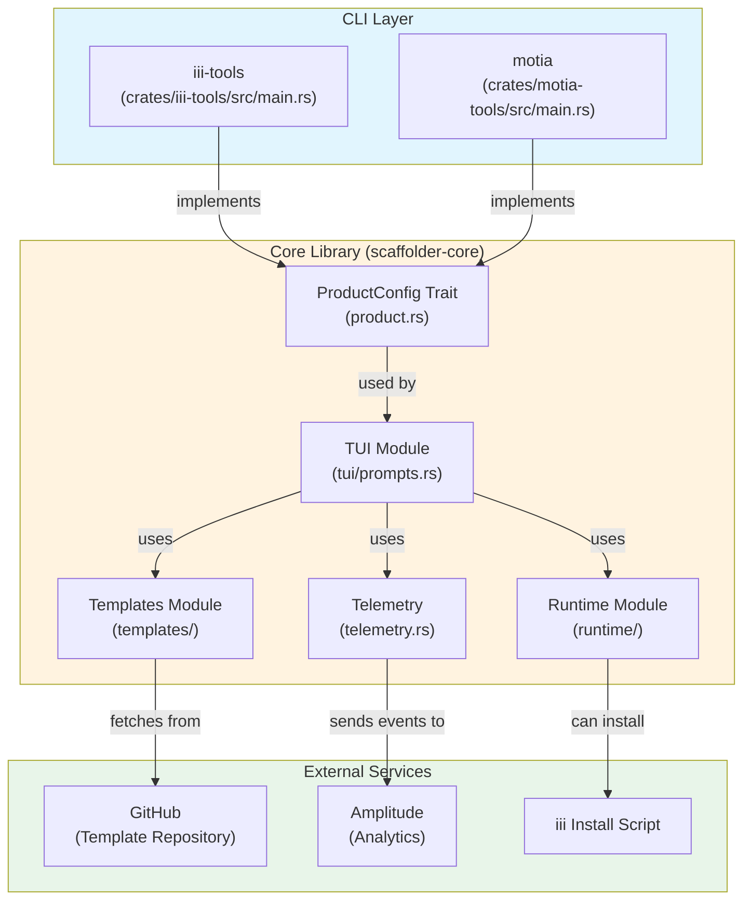
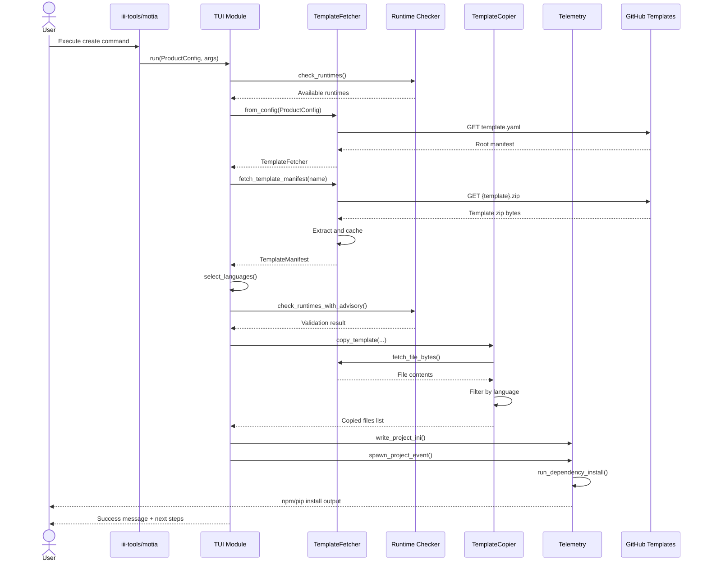

# Project Exploration: iii CLI Tooling

## Overview

The iii CLI Tooling project is a Rust-based workspace that provides command-line interfaces for scaffolding projects built on the iii (Intelligent Infrastructure Interface) platform. It produces two primary binary crates: `iii-tools` for pure iii projects and `motia` for Motia workflow projects. The architecture is designed around a core scaffolder library that handles template fetching, language selection, runtime detection, and project generation, while product-specific CLIs provide branded entry points with their own configurations.

The project serves as the primary onboarding mechanism for developers entering the iii ecosystem. It downloads project templates from remote GitHub URLs (or uses local directories for development), guides users through interactive prompts for language selection and project configuration, validates that required runtimes are installed, and scaffolds complete working projects with dependencies automatically installed. The CLI integrates with the iii engine by reading its telemetry configuration for analytics and can optionally install the iii engine itself if not present.

Key insight: The architecture intentionally separates product branding from core scaffolding logic through the `ProductConfig` trait, enabling multiple CLIs (iii-tools, motia) to share the same underlying implementation while presenting distinct identities to users.

## Repository

- **Location:** `/home/darkvoid/Boxxed/@formulas/src.rust/src.llamacpp/src.iii/cli-tooling/`
- **Remote:** `git@github.com:iii-hq/cli-tooling`
- **Primary Language:** Rust (2021 Edition)
- **Version:** 0.6.3 (workspace)
- **License:** Not specified in source files

## Recent Commits

```
08776d8 chore: rebuild template zips [skip ci]
f64c3a4 fix quickstart version
5423b57 chore: rebuild template zips [skip ci]
ed2eb9f Merge pull request #21 from iii-hq/quickstart-caller-worker-name
646f1e1 feat(iii-quickstart): set caller-worker name in registerWorker options
```

## Directory Structure

```
/home/darkvoid/Boxxed/@formulas/src.rust/src.llamacpp/src.iii/cli-tooling/
├── Cargo.toml                    # Workspace definition with shared dependencies
├── Cargo.lock                    # Dependency lock file
├── config.yaml                   # iii engine configuration (for testing)
├── .gitignore                    # Comprehensive ignore rules for Rust/Node/Python
├── scripts/
│   ├── build-template-zips.sh   # Builds zip archives from template directories
│   └── pre-commit               # Git pre-commit hook
├── .github/
│   └── workflows/               # GitHub Actions for releases and validation
│       ├── build-template-zips.yml
│       ├── create-tag.yml
│       ├── publish-homebrew.yml
│       ├── release.yml          # Multi-platform binary builds
│       ├── rollback.yml
│       └── validate-release.yml
├── crates/                      # Rust workspace crates
│   ├── iii-tools/              # iii CLI binary crate
│   │   ├── Cargo.toml
│   │   └── src/main.rs          # Entry point for `iii-tools` CLI
│   ├── motia-tools/            # Motia CLI binary crate
│   │   ├── Cargo.toml
│   │   └── src/main.rs          # Entry point for `motia` CLI
│   └── scaffolder-core/        # Core library with shared logic
│       ├── Cargo.toml
│       ├── src/
│       │   ├── lib.rs           # Library exports and documentation
│       │   ├── product.rs       # ProductConfig trait definition
│       │   ├── telemetry.rs     # Analytics and project identity
│       │   ├── config/          # Configuration generation
│       │   │   ├── mod.rs
│       │   │   └── generator.rs # JavaScript runtime detection
│       │   ├── runtime/         # Runtime detection and tool management
│       │   │   ├── mod.rs
│       │   │   ├── check.rs     # Node/Bun/Python/Cargo detection
│       │   │   └── tool.rs      # iii tool installation management
│       │   ├── templates/       # Template fetching and copying
│       │   │   ├── mod.rs       # Zip building utility
│       │   │   ├── fetcher.rs   # Remote/local template fetching
│       │   │   ├── manifest.rs  # Template manifest types
│       │   │   ├── copier.rs    # File copying with language filtering
│       │   │   └── version.rs     # CLI/template compatibility
│       │   └── tui/             # Interactive CLI prompts
│       │       ├── mod.rs
│       │       └── prompts.rs   # Charm-style cliclack prompts
│       └── tests/               # E2E and integration tests
│           ├── e2e_quickstart.rs
│           ├── e2e_multi_worker_orchestration.rs
│           ├── template_validation.rs
│           └── e2e_harness/
│               └── mod.rs       # Test infrastructure
└── templates/                   # Project templates
    ├── iii/                    # iii project templates
    │   ├── template.yaml       # Root manifest listing available templates
    │   ├── default-gitignore
    │   ├── default-iii-config.yaml
    │   ├── quickstart/         # Cross-language math example
    │   ├── multi-worker-orchestration/ # 4-worker orchestration demo
    │   ├── quickstart-ai-agents/
    │   └── starter/
    └── motia/                  # Motia workflow templates
        ├── template.yaml
        ├── default-gitignore
        ├── default-motia-iii-config.yaml
        ├── quickstart/
        └── blank/
```

## Architecture

### High-Level Component Diagram



### Data Flow: Project Creation



### Component Breakdown

#### 1. CLI Binaries (iii-tools, motia)

**Location:** `crates/iii-tools/src/main.rs`, `crates/motia-tools/src/main.rs`

Each CLI binary is a thin wrapper that:
1. Implements the `ProductConfig` trait to define product-specific configuration
2. Parses command-line arguments using `clap` derive macros
3. Delegates to `scaffolder_core::run()` for the actual work

Key design: Both binaries share identical code structure, differing only in their `ProductConfig` implementation:

```rust
// From crates/iii-tools/src/main.rs:14-48
#[derive(Clone)]
pub struct IiiConfig;

impl ProductConfig for IiiConfig {
    fn name(&self) -> &'static str { "iii" }
    fn display_name(&self) -> &'static str { "iii" }
    fn default_template_url(&self) -> &'static str { 
        "https://raw.githubusercontent.com/iii-hq/cli-tooling/main/templates/iii" 
    }
    fn template_url_env(&self) -> &'static str { "III_TEMPLATE_URL" }
    fn requires_iii(&self) -> bool { true }
    fn docs_url(&self) -> &'static str { "https://iii.dev/docs" }
    fn cli_description(&self) -> &'static str { "CLI for scaffolding iii projects" }
    fn upgrade_command(&self) -> &'static str { "cargo install iii-tools --force" }
}
```

#### 2. ProductConfig Trait

**Location:** `crates/scaffolder-core/src/product.rs`

The `ProductConfig` trait (lines 13-42) defines the interface that each product must implement. This enables the core library to remain product-agnostic while supporting multiple branded CLIs.

**Key insight:** The trait includes `requires_iii()` which allows products like Motia (which builds on iii) to mandate iii installation, while future products could opt out.

#### 3. Template System

**Location:** `crates/scaffolder-core/src/templates/`

The template system supports fetching from both remote URLs and local directories:

- **Fetcher** (`fetcher.rs`): Handles HTTP requests or local file reads, caches templates in memory
- **Manifest** (`manifest.rs`): Defines `RootManifest` (template listing) and `TemplateManifest` (per-template config)
- **Copier** (`copier.rs`): Copies files with language-based filtering
- **Version** (`version.rs`): CLI/template compatibility checking

**Key file pattern matching** (from `manifest.rs:45-58`):
```rust
fn matches_any(filename: &str, patterns: &[String]) -> bool {
    patterns.iter().any(|pattern| {
        if pattern.starts_with('*') {
            filename.ends_with(&pattern[1..])  // Suffix match: *.ts
        } else if pattern.ends_with('*') {
            filename.starts_with(&pattern[..pattern.len() - 1])  // Prefix match
        } else {
            filename == pattern  // Exact match
        }
    })
}
```

#### 4. TUI Module

**Location:** `crates/scaffolder-core/src/tui/prompts.rs`

The interactive prompt system uses the `cliclack` crate for Charm-style inline prompts. The main flow (lines 47-115):

1. Check tool installation (iii)
2. Setup template fetcher
3. Select template from available options
4. Check version compatibility
5. Select project directory
6. Select languages
7. Check runtimes
8. Create project
9. Install dependencies
10. Show next steps

**Aha moment:** The "treat_required_as_included" flag in template manifests allows required languages to become "included" (advisory-only runtime checks) rather than hard requirements. This supports templates that demonstrate multi-language features without forcing users to have all runtimes installed.

#### 5. Runtime Detection

**Location:** `crates/scaffolder-core/src/runtime/check.rs`

Runtime detection checks for Node.js, Bun, Python 3, and Cargo availability by running `--version` commands:

```rust
// From check.rs:42-61
pub fn check_node() -> RuntimeInfo {
    let output = Command::new("node").arg("--version").output();
    match output {
        Ok(out) if out.status.success() => {
            let version = String::from_utf8_lossy(&out.stdout).trim().to_string();
            RuntimeInfo { name: "Node.js", version: Some(version), available: true }
        }
        _ => RuntimeInfo { name: "Node.js", version: None, available: false }
    }
}
```

The system supports both strict mode (fail on missing runtimes) and advisory mode (warn but continue) through `check_runtimes_with_advisory()`.

#### 6. Telemetry System

**Location:** `crates/scaffolder-core/src/telemetry.rs`

The telemetry system sends events to Amplitude for project creation analytics. Key features:

- Reads device identity from `~/.iii/telemetry.yaml` (managed by iii engine)
- Respects opt-out via `III_TELEMETRY_ENABLED=false` or `III_TELEMETRY_DEV=true`
- Automatically disabled in CI environments (detects 12 common CI env vars)
- Captures: OS, arch, CPU cores, timezone, install method, CLI version

The `run_dependency_install()` function (lines 279-333) automatically installs dependencies after project creation:
- JavaScript/TypeScript: runs `npm install` if package.json exists
- Python: runs `uv sync` or `pip install -r requirements.txt`

## Entry Points

### Binary Entry Points

#### iii-tools
**File:** `crates/iii-tools/src/main.rs:114-159`

```rust
#[tokio::main]
async fn main() -> Result<()> {
    // Setup panic handler to restore cursor
    // Setup Ctrl+C handler
    let args = Args::parse();
    let config = IiiConfig;
    
    match args.command {
        Some(Command::Create(create_args)) => {
            scaffolder_core::run(&config, create_args.into(), CLI_VERSION).await
        }
        Some(Command::BuildZips(build_args)) => {
            scaffolder_core::templates::build_zips(&config, &build_args.template_dir).await
        }
        None => {
            // Default to interactive create
            scaffolder_core::run(&config, CreateArgs::default(), CLI_VERSION).await
        }
    }
}
```

#### motia
**File:** `crates/motia-tools/src/main.rs:114-159`

Identical structure to iii-tools but uses `MotiaConfig` instead of `IiiConfig`.

### Command Structure

Both CLIs support two subcommands:

1. **create** (default): Interactive project scaffolding
   - `--template-dir`: Use local templates instead of remote
   - `--template`: Pre-select template (non-interactive)
   - `--directory`: Pre-select project directory
   - `--languages`: Comma-separated language list
   - `--skip-iii`: Skip iii installation check
   - `--yes`: Auto-confirm all prompts

2. **build-zips**: Development utility for building template archives
   - `--template-dir`: Directory containing templates

## Template System

### Template Manifest Format

**Root Manifest** (`templates/iii/template.yaml`):
```yaml
templates:
  - quickstart
  # - multi-worker-orchestration

shared_files:
  - source: default-gitignore
    dest: .gitignore
  - source: default-iii-config.yaml
    dest: config.yaml

language_files:
  common:
    - '.env.*'
    - 'README.md'
  python:
    - '*.py'
    - 'requirements.txt'
  typescript:
    - '*.ts'
    - 'tsconfig.json'
  node:
    - 'package.json'
    - 'package-lock.json'
```

**Template Manifest** (`templates/iii/quickstart/template.yaml`):
```yaml
name: Quickstart (Cross-Language Math)
description: Call a Python function from a Node worker using iii trigger
version: '0.1.0'
min_iii_version: '0.11.0'

treat_required_as_included: true
requires:
  - python
  - typescript
optional: []

files:
  - README.md
  - workers/math-worker/iii.worker.yaml
  - workers/math-worker/requirements.txt
  - workers/math-worker/math_worker.py
  - workers/caller-worker/package.json
  - workers/caller-worker/tsconfig.json
  - workers/caller-worker/iii.worker.yaml
  - workers/caller-worker/src/worker.ts

next_steps:
  - 'Continue with the quickstart at: https://iii.dev/docs/quickstart'
```

### Language File Filtering

Files are included based on pattern matching against `language_files` configuration:

1. **Common files**: Always included (README, .gitignore, config files)
2. **Language-specific files**: Only included when that language is selected
3. **Node files**: Included when either JavaScript OR TypeScript is selected

The system supports three pattern types (from `manifest.rs:45-58`):
- `*.ts` - suffix matching (files ending in .ts)
- `requirements*` - prefix matching (files starting with requirements)
- `README.md` - exact match

**Key insight:** Files NOT matching any pattern are excluded by default. This prevents accidental inclusion of development artifacts or incomplete files.

## External Dependencies

| Dependency | Version | Purpose |
|------------|---------|---------|
| tokio | 1.x | Async runtime for I/O and process management |
| clap | 4.x | CLI argument parsing with derive macros |
| cliclack | 0.3.x | Interactive TUI prompts (optional, feature-gated) |
| reqwest | 0.13.x | HTTP client for fetching remote templates |
| serde/serde_yaml | 1.x / 0.9.x | Configuration serialization |
| zip | 8.1.x | Template archive creation/extraction |
| semver | 1.x | Version compatibility checking |
| anyhow | 1.x | Error handling and propagation |
| colored | 3.x | Terminal output styling |
| uuid | 1.x | Project ID generation |
| walkdir | 2.x | Directory traversal for zip building |

## Configuration

### Environment Variables

| Variable | Purpose |
|----------|---------|
| `III_TEMPLATE_URL` / `MOTIA_TEMPLATE_URL` | Override default template source URL |
| `III_TELEMETRY_ENABLED` | Set to "false" to disable analytics |
| `III_TELEMETRY_DEV` | Set to "true" to disable analytics in development |
| `III_BIN` | Path to iii binary for E2E tests |
| `III_MONO_ROOT` | Path to iii-mono repository for local SDK testing |

### Build Configuration

Release builds use aggressive size optimization (`Cargo.toml:67-72`):
```toml
[profile.release]
opt-level = "z"     # Optimize for size
lto = true          # Enable Link Time Optimization
codegen-units = 1   # Reduce parallel code generation
strip = true        # Strip symbols from binary
```

## Testing

### Test Structure

1. **Unit Tests**: Embedded in source files (e.g., `version.rs`, `copier.rs`)
2. **Integration Tests** (`tests/template_validation.rs`): Validate templates on disk
3. **E2E Tests**: Full workflow tests requiring iii binary

### E2E Test Harness

**Location:** `crates/scaffolder-core/tests/e2e_harness/mod.rs`

The E2E harness provides:
- `Scenario` struct for test lifecycle management
- Automatic scaffolding into temp directories
- iii engine startup and process management
- Worker discovery from template manifests
- HTTP helpers for endpoint testing
- Graceful shutdown with SIGTERM/SIGKILL

**Key insight:** The E2E tests support local SDK development by patching dependencies to use local paths via `III_MONO_ROOT` environment variable.

### Running Tests

```bash
# Unit tests
cargo test

# Template validation (no external deps)
cargo test --test template_validation

# E2E tests (requires iii binary on PATH)
cargo test --test e2e_quickstart -- --ignored --nocapture
cargo test --test e2e_multi_worker_orchestration -- --ignored --nocapture
```

## CI/CD Pipeline

### Release Workflow (`.github/workflows/release.yml`)

1. **Notify Start**: Slack notification with progress tracker
2. **Detect Pre-release**: Check for alpha/beta/rc in tag
3. **Create Release**: GitHub release with auto-generated notes
4. **Build Binaries**: 7 targets × 2 binaries (motia, iii-tools)
   - macOS: x86_64, aarch64
   - Windows: x86_64, aarch64
   - Linux: x86_64 (gnu, musl), aarch64
5. **Trigger Homebrew**: Dispatches publish-homebrew workflow
6. **Notify Complete**: Slack update with results

### Build Targets

| Target | OS | Notes |
|--------|-----|-------|
| x86_64-apple-darwin | macOS 15 Intel | Native build |
| aarch64-apple-darwin | macOS Latest | Native build |
| x86_64-pc-windows-msvc | Windows Latest | Native build |
| aarch64-pc-windows-msvc | Windows Latest | Cross-compile |
| x86_64-unknown-linux-gnu | Ubuntu Latest | Native build |
| x86_64-unknown-linux-musl | Ubuntu Latest | Static linking |
| aarch64-unknown-linux-gnu | Ubuntu Latest | Cross-compile |

## Key Insights

### 1. Architectural Patterns

**Plugin Architecture via Traits:** The `ProductConfig` trait enables multiple CLI products to share implementation while maintaining distinct identities. This is more flexible than compile-time flags or configuration files.

**Template Inheritance:** The two-level manifest system (root + template) allows shared files and language patterns to be defined once and inherited by all templates, reducing duplication.

**Graceful Degradation:** Runtime checks support both strict (fail on missing) and advisory (warn but continue) modes, supporting diverse user environments.

### 2. Design Decisions

**Why Zip Archives?** Templates are distributed as pre-built zips for consistency between development and production. Local development builds zips on-demand, ensuring identical behavior.

**Why Pattern-Based File Filtering?** Rather than explicit include/exclude lists per template, pattern matching in `language_files` provides a declarative way to handle the combinatorial explosion of file × language combinations.

**Why Read Telemetry from iii Engine?** The CLI reads `~/.iii/telemetry.yaml` rather than maintaining its own identity file. This ties analytics to the engine installation and respects the user's existing telemetry preferences.

### 3. Tradeoffs

**Size vs. Speed:** Release builds optimize for size (`opt-level = "z"`) rather than speed, appropriate for a CLI tool that runs briefly and exits.

**Sync vs. Async:** The CLI uses async Rust throughout, even though many operations are sequential. This future-proofs for potential parallel operations and matches the ecosystem direction.

**External vs. Embedded Templates:** Templates are fetched from GitHub rather than embedded in the binary. This allows template updates without CLI updates, at the cost of requiring network access.

## Open Questions

1. **Multi-worker orchestration template** is commented out in `templates/iii/template.yaml` - is this pending stabilization?
2. **Homebrew publishing** workflow exists but formula location is not in this repository
3. **SDK version consistency tests** suggest multiple SDKs (npm, cargo, pip) - where are these defined?
4. **Rollback workflow** exists but appears unused - is this for manual invocation?

## References

- Source: `crates/scaffolder-core/src/lib.rs` - Library documentation and module structure
- Source: `crates/scaffolder-core/src/product.rs:13-42` - ProductConfig trait definition
- Source: `crates/scaffolder-core/src/tui/prompts.rs:47-115` - Main interactive flow
- Source: `crates/scaffolder-core/src/templates/manifest.rs:45-58` - Pattern matching logic
- Source: `templates/iii/template.yaml` - Root template manifest
- Source: `.github/workflows/release.yml` - CI/CD pipeline definition
