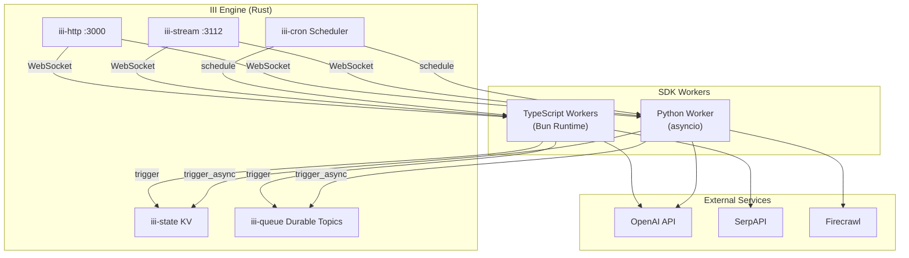
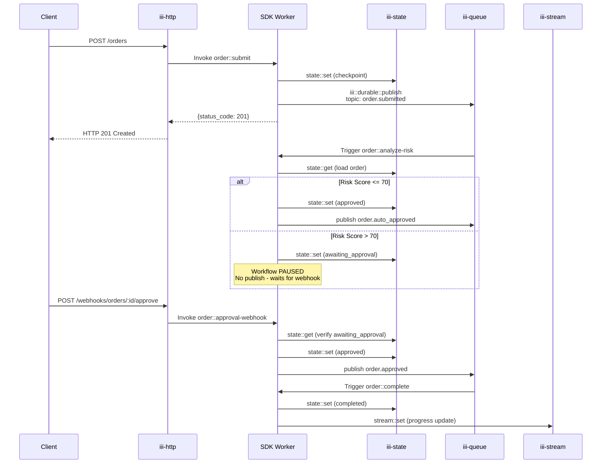

# Project Exploration: iii-hq/examples

## Overview

The iii-hq/examples repository contains four standalone example applications demonstrating the capabilities of the **iii-sdk** (v0.11.0), a workflow engine SDK for building event-driven applications. Each example showcases different architectural patterns: human-in-the-loop workflows with approval gates, AI chat agents with conversation memory, real-time streaming Todo APIs with cron jobs, and multi-agent property search with parallel processing.

**Key Insight:** These examples were all migrated from the Motia framework to iii-sdk, demonstrating iii's explicit registration pattern (`registerFunction` + `registerTrigger`) versus Motia's auto-discovery approach. This architectural shift gives developers explicit control over handler composition and trigger binding.

The repository serves as both documentation and working code, with each example including a complete runnable application, test scripts, and deployment configurations. The examples cover TypeScript (Bun runtime) and Python implementations, showcasing iii-sdk's multi-language support.

## Repository

- **Location:** `/home/darkvoid/Boxxed/@formulas/src.rust/src.llamacpp/src.iii/examples/`
- **Remote:** `git@github.com:iii-hq/examples`
- **Primary Languages:** TypeScript (Bun runtime), Python
- **License:** Apache-2.0

### Recent Commits

```
b19a493 Add todo-app example (REST API + streams + durable topics + cron)
58e0031 Add human-in-the-loop, ai-chat-agent, and property-search-agent examples
```

## Directory Structure

```
/home/darkvoid/Boxxed/@formulas/src.rust/src.llamacpp/src.iii/examples/
├── README.md                    # Root documentation with example overview
├── .gitignore                   # Global git ignore patterns
│
├── ai-chat-agent/               # AI chat with memory and web search (TypeScript/Bun)
│   ├── README.md
│   ├── package.json             # iii-sdk@0.11.0, esbuild, typescript
│   ├── pnpm-lock.yaml
│   ├── tsconfig.json
│   ├── esbuild.config.ts        # Production build config (targets node22, ESM)
│   ├── iii-config.yaml          # iii-exec worker with bun --watch
│   └── src/
│       ├── main.ts              # Entry: imports all handlers
│       ├── lib/
│       │   └── iii.ts           # Worker registration + Logger + types
│       ├── handlers/
│       │   ├── receive-chat-message.ts   # HTTP POST /chat entry
│       │   ├── process-ai-agent.ts       # Durable subscriber: AI processing
│       │   ├── web-search.ts             # Durable subscriber: SerpAPI search
│       │   ├── finalize-response.ts      # Durable subscriber: Stream updates
│       │   └── conversation-api.ts     # HTTP GET/DELETE /chat/:sessionId
│       └── services/
│           ├── openai.service.ts         # GPT-4o-mini integration
│           └── serpapi.service.ts        # Google search via SerpAPI
│
├── human-in-the-loop/           # Order approval workflow (TypeScript/Bun)
│   ├── README.md
│   ├── package.json             # iii-sdk@0.11.0
│   ├── pnpm-lock.yaml
│   ├── tsconfig.json
│   ├── esbuild.config.ts
│   ├── iii-config.yaml          # Full worker stack: http, state, queue, cron, exec
│   ├── test-htl-flow.sh         # End-to-end bash test script
│   └── src/
│       ├── main.ts              # Entry: imports 5 handlers
│       ├── lib/
│       │   └── iii.ts           # Order types + worker setup
│       └── handlers/
│           ├── submit-order.ts           # HTTP POST /orders
│           ├── analyze-risk.ts         # Durable: risk scoring, approval logic
│           ├── approval-webhook.ts     # HTTP POST /webhooks/orders/:id/approve
│           ├── complete-order.ts       # Durable: fulfillment (multi-trigger)
│           └── detect-timeouts.ts      # Cron: every 5 min timeout detection
│
├── property-search-agent/       # Real estate AI agent (Python)
│   ├── README.md
│   ├── pyproject.toml           # iii-sdk==0.11.0, agno, openai, firecrawl-py
│   ├── iii-config.yaml          # iii-exec with python -m src.main
│   └── src/
│       ├── main.py              # Entry: imports handlers, signal handling
│       ├── __init__.py
│       ├── lib/
│       │   ├── __init__.py
│       │   └── iii_client.py    # Python worker registration
│       ├── handlers/
│       │   ├── __init__.py
│       │   ├── start_property_search.py   # HTTP POST /api/property-search
│       │   ├── scrape_properties.py       # Durable: Firecrawl scraping
│       │   ├── market_analysis.py         # Durable: Agno AI market analysis
│       │   ├── property_enrichment.py     # Durable: conditional enrichment
│       │   └── neighborhood_analysis.py   # Durable: neighborhood scoring
│       └── services/
│           ├── __init__.py
│           ├── agents/
│           │   ├── __init__.py
│           │   └── property_agents.py     # Agno agent definitions
│           ├── firecrawl/
│           │   ├── __init__.py
│           │   └── firecrawl_service.py   # Firecrawl API wrapper
│           └── property_scraper/
│               ├── __init__.py
│               └── scrape.py              # Parallel URL scraping
│
└── todo-app/                    # Full-featured Todo API (TypeScript/Bun)
    ├── README.md
    ├── package.json             # iii-sdk@0.11.0
    ├── pnpm-lock.yaml
    ├── tsconfig.json
    ├── esbuild.config.ts
    ├── iii-config.yaml          # Full stack: stream, http, state, queue, cron, exec
    ├── test-todo-flow.sh        # CRUD + events smoke test
    └── src/
        ├── main.ts              # Entry: imports 15 handlers
        ├── lib/
        │   └── iii.ts           # Todo types + query helper
        ├── services/
        │   └── todo.service.ts  # State operations + validation
        └── handlers/
            ├── create-todo.ts           # HTTP POST /todos
            ├── list-todos.ts            # HTTP GET /todos
            ├── get-todo.ts              # HTTP GET /todos/:id
            ├── update-todo.ts           # HTTP PATCH /todos/:id
            ├── delete-todo.ts           # HTTP DELETE /todos/:id
            ├── get-stats.ts             # HTTP GET /todo-stats
            ├── daily-stats-cron.ts      # Cron: hourly stats snapshot
            ├── cleanup-cron.ts          # Cron: daily archive >7 days
            ├── todo-created-notification.ts   # Durable: notification handler
            ├── todo-updated-handler.ts          # Durable: update events
            ├── todo-completed-workflow.ts       # Durable: streak + achievements
            ├── todo-deleted-handler.ts          # Durable: delete events
            ├── analytics-tracker.ts             # Durable: analytics events
            ├── cleanup-completed-handler.ts     # Durable: cleanup events
            └── notification-sent-logger.ts      # Durable: log notifications
```

## Architecture

### High-Level Component Diagram



**Key Insight:** The iii engine provides language-agnostic infrastructure (HTTP, state, queues, streams, cron) via WebSocket connections. Workers register functions and triggers at runtime, then receive events through the persistent connection. This architecture decouples the execution runtime (Bun, Python) from the durable infrastructure.

### Data Flow Pattern



## Example Deep Dives

### 1. Human-in-the-Loop Workflow

**Location:** `/home/darkvoid/Boxxed/@formulas/src.rust/src.llamacpp/src.iii/examples/human-in-the-loop/`

This example demonstrates a durable workflow pattern where execution pauses for human input and resumes via webhook. The core pattern involves saving state checkpoints after each step, then conditionally publishing events based on business logic.

#### The Pause Pattern (Line 47-48: `analyze-risk.ts`)

```typescript
// Source: human-in-the-loop/src/handlers/analyze-risk.ts:35-48
if (riskScore > 70) {
  order.status = 'awaiting_approval'
  order.currentStep = 'awaiting_approval'
  order.requiresApproval = true
  order.approvalReason = `High risk score: ${riskScore}`

  await iii.trigger({
    function_id: 'state::set',
    payload: { scope: 'orders', key: orderId, value: order },
  })

  logger.warn('Order requires approval - workflow paused', { orderId, riskScore })
  // Workflow STOPS here. No publish — the approval webhook will resume it.
}
```

**Aha Moment:** The workflow pause is achieved simply by NOT publishing an event. The durable subscriber pattern means the workflow only continues when explicitly triggered. This is elegant state machine behavior without explicit state machine frameworks—just conditional event emission.

#### Multi-Trigger Registration (Line 53-63: `complete-order.ts`)

```typescript
// Source: human-in-the-loop/src/handlers/complete-order.ts:53-63
iii.registerTrigger({
  type: 'durable:subscriber',
  function_id: ref.id,
  config: { topic: 'order.approved' },
})

iii.registerTrigger({
  type: 'durable:subscriber',
  function_id: ref.id,
  config: { topic: 'order.auto_approved' },
})
```

The same function (`order::complete`) subscribes to multiple topics, enabling both auto-approved and human-approved orders to converge on the same fulfillment handler.

#### Cron-Based Timeout Detection (Line 52-56: `detect-timeouts.ts`)

```typescript
// Source: human-in-the-loop/src/handlers/detect-timeouts.ts:52-56
iii.registerTrigger({
  type: 'cron',
  function_id: ref.id,
  config: { expression: '0 */5 * * * * *' },  // Every 5 minutes
})
```

Uses 7-field cron expression (seconds included) to scan for stuck orders every 5 minutes.

### 2. AI Chat Agent

**Location:** `/home/darkvoid/Boxxed/@formulas/src.rust/src.llamacpp/src.iii/examples/ai-chat-agent/`

A conversational AI agent with sliding-window memory (20 messages) and conditional web search capability. The architecture separates concerns into discrete handlers connected via durable topics.

#### Conversation Memory with Sliding Window (Line 21-26: `receive-chat-message.ts`)

```typescript
// Source: ai-chat-agent/src/handlers/receive-chat-message.ts:15-26
const history =
  ((await iii.trigger({
    function_id: 'state::get',
    payload: { scope: `conversation:${sessionId}`, key: 'history' },
  })) as ConversationMessage[] | null) || []

history.push({ role: 'user', content: message, timestamp })
const windowedHistory = history.slice(-20)  // Keep last 20 messages
```

**Aha Moment:** The sliding window is applied BEFORE saving to state, not during retrieval. This means older messages are permanently dropped from the conversation scope, keeping storage bounded.

#### Intent-Based Routing (Line 41-76: `process-ai-agent.ts`)

```typescript
// Source: ai-chat-agent/src/handlers/process-ai-agent.ts:41-76
let searchAction: { action: string; query: string } | null = null
try {
  const parsed = JSON.parse(initialResponse)
  if (parsed.action === 'search' && parsed.query) searchAction = parsed
} catch {
  // Not JSON — direct answer
}

if (searchAction) {
  // Publish to web-search-required topic
  await iii.trigger({
    function_id: 'iii::durable::publish',
    payload: { topic: 'web-search-required', data: { ... } }
  })
} else {
  // Direct answer ready
  await iii.trigger({
    function_id: 'iii::durable::publish',
    payload: { topic: 'agent-response-ready', data: { ... } }
  })
}
```

The AI's response is parsed as JSON to detect search intent. If the AI returns `{"action": "search", "query": "..."}`, the workflow branches to web search; otherwise it proceeds directly to response finalization.

### 3. Todo App

**Location:** `/home/darkvoid/Boxxed/@formulas/src.rust/src.llamacpp/src.iii/examples/todo-app/`

The most comprehensive example, demonstrating REST API patterns, real-time streams, durable topics for event-driven workflows, and cron scheduling.

#### Service Layer Pattern (Line 38-52: `todo.service.ts`)

```typescript
// Source: todo-app/src/services/todo.service.ts:38-52
export const todoService = {
  async create(input: CreateTodoInput): Promise<Todo> {
    const now = new Date().toISOString()
    const todo: Todo = {
      id: generateId(),
      title: input.title,
      description: input.description,
      status: 'pending',
      priority: input.priority ?? 'medium',
      dueDate: input.dueDate,
      createdAt: now,
      updatedAt: now,
    }
    await putOne(todo)
    return todo
  },
  // ... additional methods
}
```

The service layer abstracts state operations, providing a clean API for handlers while encapsulating the `iii.trigger({ function_id: 'state::...' })` calls.

#### Multi-Event Publishing on Updates (Line 39-62: `update-todo.ts`)

```typescript
// Source: todo-app/src/handlers/update-todo.ts:39-62
if (parsed.status === 'completed' && existing.status !== 'completed') {
  logger.info('Todo completed, triggering completion workflow', { todoId: id })
  await iii.trigger({
    function_id: 'iii::durable::publish',
    payload: {
      topic: 'todo-completed',
      data: { todoId: todo.id, title: todo.title, completedAt: todo.completedAt! },
    },
  })
}

await iii.trigger({
  function_id: 'iii::durable::publish',
  payload: {
    topic: 'track-analytics',
    data: {
      event: parsed.status === 'completed' ? 'todo_completed' : 'todo_updated',
      // ...
    },
  },
})
```

A single HTTP request triggers multiple downstream events: stream updates, durable topic publications for analytics, completion workflows, and notifications.

#### Achievement System with Streak Tracking (Line 15-77: `todo-completed-workflow.ts`)

```typescript
// Source: todo-app/src/handlers/todo-completed-workflow.ts:33-49
let streakDays = existing?.streakDays ?? 0
if (existing?.lastCompletionDate) {
  const yesterday = new Date(now)
  yesterday.setDate(yesterday.getDate() - 1)
  const yesterdayStr = yesterday.toISOString().split('T')[0]
  const lastStr = new Date(existing.lastCompletionDate).toISOString().split('T')[0]

  if (lastStr === yesterdayStr) {
    streakDays++
    logger.info('Streak continued', { streakDays })
  } else if (lastStr !== todayStr) {
    streakDays = 1
    logger.info('Streak reset', { streakDays })
  }
}
```

**Aha Moment:** Streak calculation compares date strings (YYYY-MM-DD) rather than timestamps, properly handling midnight boundaries. Yesterday is computed by manipulating the Date object before converting to ISO string.

### 4. Property Search Agent

**Location:** `/home/darkvoid/Boxxed/@formulas/src.rust/src.llamacpp/src.iii/examples/property-search-agent/`

A Python-based multi-agent system using Agno framework for AI analysis, Firecrawl for web scraping, and parallel event processing.

#### Parallel Event Orchestration (Line 59-105: `start_property_search.py`)

```python
# Source: property-search-agent/src/handlers/start_property_search.py:59-105
events_triggered = []
search_payload = {**body, "searchId": search_id, "searchUrls": search_urls}

# Always trigger scraping
await iii.trigger_async({
    "function_id": "iii::durable::publish",
    "payload": {"topic": "property.scrape", "data": search_payload},
})
events_triggered.append("property.scrape")

# Conditional enrichment for high budgets
if budget_range.get("max", 0) > 500_000:
    await iii.trigger_async({
        "function_id": "iii::durable::publish",
        "payload": {"topic": "property.enrich", "data": {...}},
    })
    events_triggered.append("property.enrich")

# Always trigger market analysis
await iii.trigger_async({
    "function_id": "iii::durable::publish",
    "payload": {"topic": "market.analyze", "data": {...}},
})
```

The handler triggers multiple durable topics in parallel based on request criteria. Unlike sequential workflows, these handlers execute concurrently and aggregate results via the state system.

#### Result Aggregation Pattern (Line 78-122: `scrape_properties.py`)

```python
# Source: property-search-agent/src/handlers/scrape_properties.py:78-122
async def _aggregate_results(search_id: str):
    results = await iii.trigger_async({
        "function_id": "stream::get",
        "payload": {"stream_name": "propertyResults", "group_id": "searches", "item_id": search_id},
    })
    
    # Merge data from parallel processors
    market_data = await iii.trigger_async({
        "function_id": "state::get",
        "payload": {"scope": "market_analysis", "key": search_id},
    })
    if market_data:
        results["marketAnalysis"] = {"fullAnalysis": market_data.get("analysis", "")}
    
    # Similar merges for enrichment_data, neighborhood_data...
    
    results["status"] = "completed"
    await iii.trigger_async({
        "function_id": "stream::set",
        "payload": {"stream_name": "propertyResults", "group_id": "searches", "item_id": search_id, "data": results},
    })
```

**Aha Moment:** The scraper acts as an aggregator, pulling results from parallel processors via state::get calls and merging them into a unified stream update. This fan-out/fan-in pattern is coordinated through durable state, not in-memory queues.

#### Firecrawl Schema-Based Extraction (Line 9-34: `firecrawl_service.py`)

```python
# Source: property-search-agent/src/services/firecrawl/firecrawl_service.py:9-34
PROPERTY_SCHEMA = {
    "type": "object",
    "properties": {
        "properties": {
            "type": "array",
            "items": {
                "type": "object",
                "properties": {
                    "address": {"type": "string"},
                    "price": {"type": "string"},
                    # ... more fields
                },
                "required": ["address", "price"],
            },
        },
        "total_count": {"type": "integer"},
        "source_website": {"type": "string"},
    },
    "required": ["properties", "total_count", "source_website"],
}
```

Uses Firecrawl's LLM-powered extraction with a JSON schema to guarantee structured output from unstructured real estate listings.

## Entry Points

### TypeScript Examples (ai-chat-agent, human-in-the-loop, todo-app)

**Entry File:** `src/main.ts`

Each TypeScript example follows the same pattern:

```typescript
// Source: todo-app/src/main.ts:1-22
import './lib/iii'           // Initialize worker connection

import './handlers/create-todo'
import './handlers/list-todos'
// ... additional handler imports

console.log('todo-app worker registered')
```

**Key Point:** Handlers are imported for side effects. Each handler file registers its functions and triggers during module load.

**Execution Flow:**
1. `iii-config.yaml` configures `iii-exec` worker to run `bun run src/main.ts`
2. `lib/iii.ts` creates WebSocket connection to iii engine
3. Handler files call `iii.registerFunction()` and `iii.registerTrigger()`
4. Worker waits for events from engine

### Python Example (property-search-agent)

**Entry File:** `src/main.py`

```python
# Source: property-search-agent/src/main.py:1-24
import signal
import time
from src.lib.iii_client import iii
from src.handlers import start_property_search  # side-effect imports
# ... more imports

print("property-search-agent worker registered")

def _shutdown(*_args) -> None:
    iii.shutdown()
    raise SystemExit(0)

if __name__ == "__main__":
    signal.signal(signal.SIGINT, _shutdown)
    signal.signal(signal.SIGTERM, _shutdown)
    while True:
        time.sleep(1)  # Keep process alive
```

**Key Difference:** Python requires an explicit keep-alive loop with signal handling for graceful shutdown.

## Data Flow: iii-sdk Primitives

### State Operations

All examples use the same state primitive pattern:

```typescript
// Get
const value = await iii.trigger({
  function_id: 'state::get',
  payload: { scope: 'todos', key: id }
})

// Set
await iii.trigger({
  function_id: 'state::set',
  payload: { scope: 'todos', key: id, value: todo }
})

// List
const all = await iii.trigger({
  function_id: 'state::list',
  payload: { scope: 'todos' }
})

// Delete
await iii.trigger({
  function_id: 'state::delete',
  payload: { scope: 'todos', key: id }
})
```

### Stream Operations

Real-time updates via WebSocket streams:

```typescript
// Set stream value
await iii.trigger({
  function_id: 'stream::set',
  payload: { 
    stream_name: 'chatResponse', 
    group_id: sessionId, 
    item_id: messageId, 
    data: response 
  }
})
```

### Queue/Durable Topics

Event-driven communication between handlers:

```typescript
// Publish
await iii.trigger({
  function_id: 'iii::durable::publish',
  payload: { topic: 'order.submitted', data: { orderId } }
})

// Subscribe (via trigger registration)
iii.registerTrigger({
  type: 'durable:subscriber',
  function_id: ref.id,
  config: { topic: 'order.submitted' }
})
```

## External Dependencies

| Dependency | Version | Purpose |
|------------|---------|---------|
| iii-sdk | 0.11.0 | Core SDK for worker registration and triggers |
| esbuild | ^0.25.0 | TypeScript bundling for production |
| typescript | ^5.7.3 | Type checking |
| bun | latest | TypeScript runtime ( replaces Node.js ) |
| agno | >=0.1.0 | Python AI agent framework |
| openai | >=1.0.0 | GPT-4o-mini integration |
| firecrawl-py | >=0.1.0 | Web scraping for property data |
| aiohttp | >=3.9.0 | Async HTTP client |

## Configuration

### iii-config.yaml Structure

The iii engine is configured via YAML files that declare which workers to run:

```yaml
# Full stack example (todo-app)
workers:
  - name: iii-stream        # WebSocket stream server
    config:
      port: 3112
      
  - name: iii-http          # HTTP API gateway
    config:
      port: 3000
      cors:
        allowed_origins: ["*"]
        
  - name: iii-state         # Key-value state store
    config:
      adapter: { name: kv }
      
  - name: iii-queue         # Durable topic queue
    config:
      queue_configs:
        default:
          max_retries: 5
          concurrency: 10
          
  - name: iii-cron          # Scheduled execution
    config:
      adapter: { name: kv }
      
  - name: iii-exec          # Process executor
    config:
      watch: [src/**/*.ts]   # Hot reload on change
      exec: [bun run src/main.ts]
```

### Environment Variables

| Variable | Required By | Purpose |
|----------|-------------|---------|
| OPENAI_API_KEY | ai-chat-agent, property-search-agent | GPT-4o-mini API access |
| SERPAPI_KEY | ai-chat-agent | Google search API |
| FIRECRAWL_API_KEY | property-search-agent | Web scraping service |
| III_URL | All examples | WebSocket connection to iii engine (default: ws://localhost:49134) |

## Testing

Each example includes a shell script for end-to-end testing:

### human-in-the-loop/test-htl-flow.sh

Tests the full approval workflow:
1. Submits low-risk order (auto-approved)
2. Submits high-risk order (requires approval)
3. Calls approval webhook to resume workflow
4. Verifies completion

### todo-app/test-todo-flow.sh

Tests CRUD operations and event chains:
1. POST /todos (creates todo, triggers notifications)
2. GET /todos (lists all)
3. PATCH /todos/:id (updates, triggers events)
4. DELETE /todos/:id (cleanup)

## Key Insights

1. **Explicit Registration Pattern:** iii-sdk requires explicit `registerFunction` + `registerTrigger` calls, unlike Motia's auto-discovery. This gives developers full control over composition and enables tree-shaking.

2. **State as Checkpoint:** Durable workflows use state as explicit checkpoints. The human-in-the-loop pattern saves state then simply doesn't publish—no complex state machine framework needed.

3. **Multi-Language Consistency:** TypeScript and Python SDKs expose identical primitives (`state::get`, `iii::durable::publish`, `stream::set`) via the same WebSocket protocol, enabling polyglot worker teams.

4. **Event-Driven Composition:** Handlers are composed via durable topics, not direct function calls. This enables parallel execution, retries, and independent scaling.

5. **7-Field Cron Expressions:** iii uses 7-field cron (including seconds) unlike standard Unix 5-field. Pattern: `second minute hour day month weekday year`.

6. **Sliding Window Memory:** The AI chat example applies the 20-message window BEFORE saving to state, permanently discarding older context to bound storage.

7. **Stream Aggregation:** The property search example demonstrates fan-out/fan-in: parallel processors write to state, aggregator reads and merges, then publishes final stream update.

8. **Hot Reload Development:** iii-exec worker watches source files and restarts automatically, providing fast feedback during development.

## Open Questions

1. **State Scoping Best Practices:** The examples use various scope naming strategies (`conversation:${sessionId}`, `orders`, `todos`). What are the performance implications of scope cardinality?

2. **Error Handling Strategies:** Most examples catch errors and log them, but don't show patterns for dead letter queues or retry backoff strategies beyond the queue's `max_retries`.

3. **Testing Patterns:** While shell scripts provide smoke tests, what are the patterns for unit testing individual handlers without the full iii engine?

4. **Production Deployment:** The examples show dev mode (`bun run --watch`). What are the containerization patterns and horizontal scaling considerations?

5. **State Migration:** If the `Order` or `Todo` type changes, what are the patterns for migrating existing state data?

6. **Stream Retention:** How long are stream values retained, and what are the cleanup patterns for high-frequency streams?
