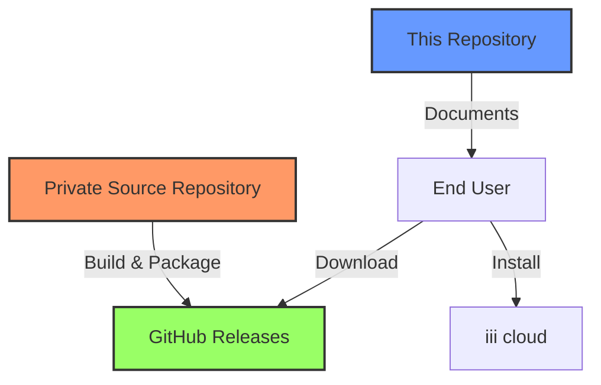
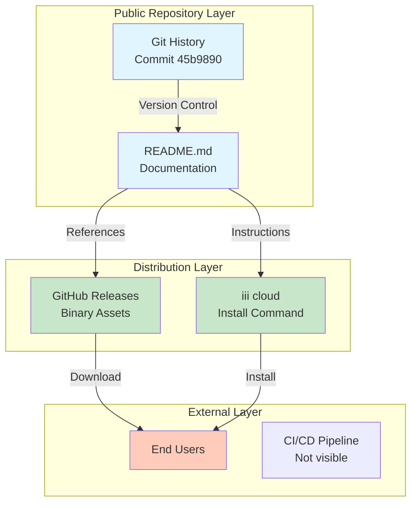
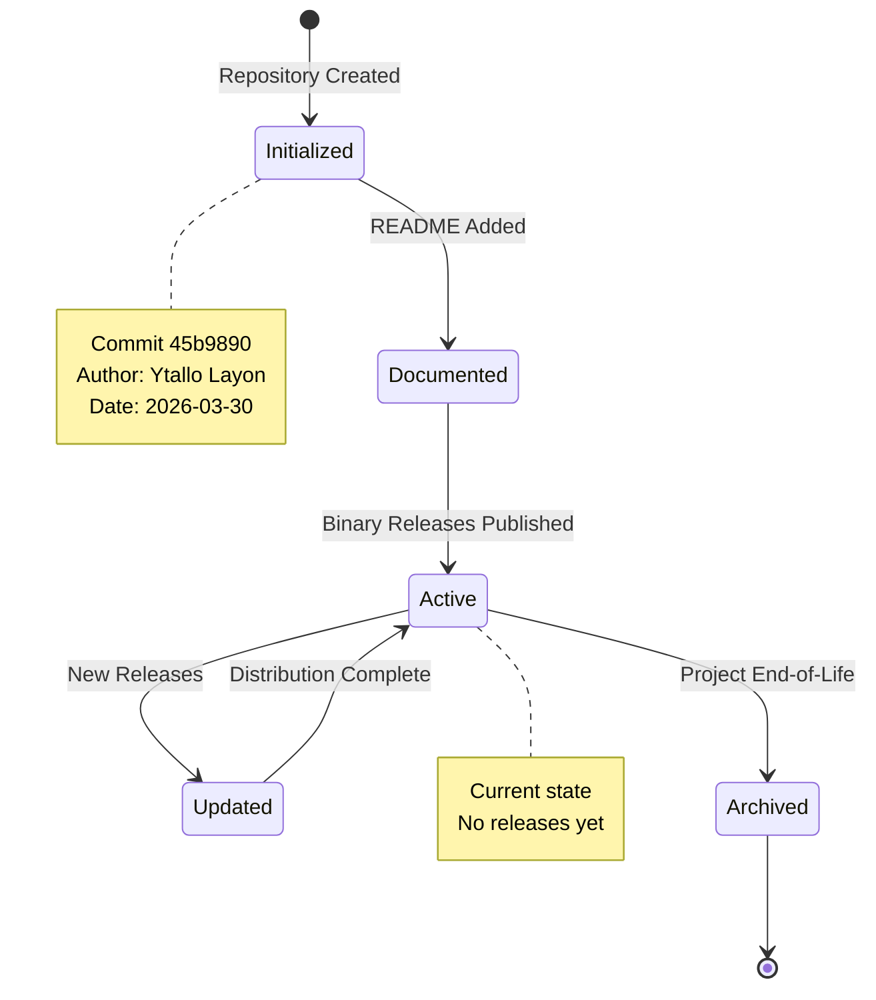
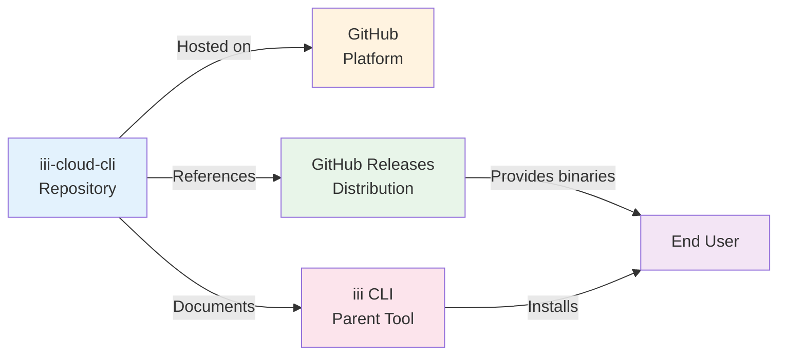

# iii-cloud CLI Repository Exploration

## Executive Summary

The iii-cloud-cli repository is a minimal GitHub repository that serves as a distribution point for binary releases of the iii-cloud CLI tool. The source code itself is private and not included in this repository. This is a common pattern for commercial or proprietary CLI tools where the repository acts as documentation and a release distribution mechanism.

## Repository Metadata

| Property | Value |
|----------|-------|
| **Repository URL** | git@github.com:iii-hq/iii-cloud-cli |
| **Exploration Location** | /home/darkvoid/Boxxed/@formulas/src.rust/src.llamacpp/src.iii/iii-cloud-cli/ |
| **Exploration Date** | 2026-06-02T17:51:27Z |
| **Current Branch** | main |
| **Repository State** | Clean working tree |
| **Total Commits** | 1 |
| **Primary Language** | Markdown (documentation only) |

## Git Information

### Remote Configuration
- **Origin**: git@github.com:iii-hq/iii-cloud-cli
- **Default Branch**: main
- **Branches**: main (local), origin/main (remote)

### Commit History
```
45b9890 chore: initialize repo (Author: Ytallo Layon <ytallo@motia.dev>, Date: Mon Mar 30 16:46:22 2026 -0300)
```

**Commit Details:**
- **Hash**: 45b98902646cd699900de9de9d48f70bf837ccaff7b
- **Author**: Ytallo Layon <ytallo@motia.dev>
- **Date**: Mon Mar 30 16:46:22 2026 -0300
- **Message**: chore: initialize repo
- **Files Changed**: README.md (5 lines added)

## Directory Structure

```
/home/darkvoid/Boxxed/@formulas/src.rust/src.llamacpp/src.iii/iii-cloud-cli/
├── .git/                          # Git repository metadata
│   ├── hooks/                     # Git hooks (sample files)
│   │   ├── applypatch-msg.sample
│   │   ├── commit-msg.sample
│   │   ├── fsmonitor-watchman.sample
│   │   ├── post-update.sample
│   │   ├── pre-applypatch.sample
│   │   ├── pre-commit.sample
│   │   ├── pre-merge-commit.sample
│   │   ├── pre-push.sample
│   │   ├── pre-rebase.sample
│   │   ├── pre-receive.sample
│   │   ├── prepare-commit-msg.sample
│   │   ├── push-to-checkout.sample
│   │   └── sendemail-validate.sample
│   ├── info/
│   │   └── exclude
│   ├── logs/
│   │   └── HEAD
│   │   └── refs/
│   │       └── heads/
│   │           └── main
│   │       └── remotes/
│   │           └── origin/
│   │               └── HEAD
│   ├── objects/
│   │   └── pack/
│   │       └── pack-e575a02205505e612b1dc3a824e4f60cae0bdc0c.pack
│   │       └── pack-e575a02205505e612b1dc3a824e4f60cae0bdc0c.idx
│   │       └── pack-e575a02205505e612b1dc3a824e4f60cae0bdc0c.rev
│   ├── refs/
│   │   ├── heads/
│   │   │   └── main
│   │   └── remotes/
│   │       └── origin/
│   │           └── HEAD
│   ├── config
│   ├── description
│   ├── HEAD
│   ├── index
│   └── packed-refs
└── README.md                      # Repository documentation
```

## File Analysis

### README.md

**Path**: `/home/darkvoid/Boxxed/@formulas/src.rust/src.llamacpp/src.iii/iii-cloud-cli/README.md`

**Content**:
```markdown
# iii-cloud CLI

Binary releases for the iii-cloud CLI. Source is private.

Install via `iii cloud` or download assets from [Releases](https://github.com/iii-hq/iii-cloud-cli/releases).
```

**Analysis**:
- **Purpose**: Brief documentation explaining the repository's role
- **Key Information**:
  - Repository contains only binary releases, not source code
  - Source code is private/proprietary
  - Installation method: via `iii cloud` command or GitHub Releases
  - Releases URL: https://github.com/iii-hq/iii-cloud-cli/releases
- **Line Count**: 5 lines
- **Language**: Markdown

## Architecture Analysis

### Repository Pattern

This repository follows the **Binary Distribution Pattern**, a common architectural approach for proprietary CLI tools:

```
┌─────────────────────────────────────────────────────────────┐
│                     iii-cloud-cli Repository               │
├─────────────────────────────────────────────────────────────┤
│  ┌─────────────┐    ┌─────────────┐    ┌─────────────────┐ │
│  │  README.md  │    │  Releases   │    │  GitHub Actions │ │
│  │ (Docs Only) │    │  (Binaries) │    │  (CI/CD - not   │ │
│  │             │    │             │    │   present yet)   │ │
│  └─────────────┘    └─────────────┘    └─────────────────┘ │
└─────────────────────────────────────────────────────────────┘
                              │
                              ▼
┌─────────────────────────────────────────────────────────────┐
│                   Private Source Repository                 │
│              (Not accessible in this repository)            │
└─────────────────────────────────────────────────────────────┘
```

### Distribution Flow



## Component Diagram



## State Diagram: Repository Lifecycle



## Entry Points and Data Flows

### Entry Point Analysis

Since this is a documentation-only repository with private source code, there are no traditional code entry points. Instead, the entry points are:

1. **Documentation Entry Point**
   - **File**: `/home/darkvoid/Boxxed/@formulas/src.rust/src.llamacpp/src.iii/iii-cloud-cli/README.md`
   - **Purpose**: Primary documentation and installation instructions
   - **Line**: Line 1 - Title declaration

2. **Distribution Entry Point**
   - **URL**: https://github.com/iii-hq/iii-cloud-cli/releases
   - **Purpose**: Binary release distribution
   - **Referenced in**: README.md Line 5

3. **Installation Entry Point**
   - **Command**: `iii cloud`
   - **Purpose**: CLI installation method
   - **Referenced in**: README.md Line 5

### Data Flow Analysis

```
┌──────────────────────────────────────────────────────────────────────────┐
│                          Information Architecture                        │
├──────────────────────────────────────────────────────────────────────────┤
│                                                                          │
│   User Query ──┬──> README.md ──┬──> Installation Method               │
│                │                  │                                      │
│                │                  ├──> `iii cloud` (Preferred)            │
│                │                  │                                      │
│                │                  └──> GitHub Releases (Alternative)    │
│                │                                                         │
│                └──> Git History ──> Commit 45b9890                     │
│                                   Author: Ytallo Layon                   │
│                                   Date: 2026-03-30                     │
│                                                                          │
└──────────────────────────────────────────────────────────────────────────┘
```

## External Dependencies

### Identified Dependencies

| Dependency | Type | Location | Purpose |
|------------|------|----------|---------|
| GitHub | Platform | Remote origin | Repository hosting |
| GitHub Releases | Distribution | External URL | Binary distribution |
| iii cloud CLI | Parent Tool | User system | Installation method |

### Dependency Graph



## Security and Access Control

### Git Configuration

**File**: `/home/darkvoid/Boxxed/@formulas/src.rust/src.llamacpp/src.iii/iii-cloud-cli/.git/config`

```ini
[core]
    repositoryformatversion = 0
    filemode = true
    bare = false
    logallrefupdates = true
[remote "origin"]
    url = git@github.com:iii-hq/iii-cloud-cli
    fetch = +refs/heads/*:refs/remotes/origin/*
[branch "main"]
    remote = origin
    merge = refs/heads/main
```

**Security Notes**:
- Uses SSH protocol for git operations (git@github.com)
- Organization: iii-hq
- Repository name: iii-cloud-cli
- No exposed credentials or tokens

## Conclusions

### Key Findings

1. **Repository Purpose**: This is a binary distribution repository for the iii-cloud CLI tool
2. **Source Code Status**: Source code is private and not included
3. **Development Stage**: Recently initialized (March 30, 2026)
4. **Distribution Method**: Two installation paths - `iii cloud` command and GitHub Releases
5. **Documentation**: Minimal but functional - explains purpose and installation

### Project Maturity Assessment

| Aspect | Status | Notes |
|--------|--------|-------|
| Initialization | Complete | Repository initialized on 2026-03-30 |
| Documentation | Minimal | Only README.md exists |
| Releases | None | No releases have been published yet |
| CI/CD | Not Configured | No workflows or actions present |
| Contributing | Not Possible | Source is private |

### Recommendations for New Engineers

1. **For End Users**: Follow the README.md instructions - use `iii cloud` or download from the releases page
2. **For Contributors**: Contact iii-hq organization directly as source is private
3. **For Documentation**: This repository is a placeholder - actual CLI documentation is likely in the private source or bundled with the binary
4. **For Security**: Verify binary signatures when downloading from releases (if available)

### File Locations Summary

| File | Absolute Path | Lines | Type |
|------|--------------|-------|------|
| README.md | `/home/darkvoid/Boxxed/@formulas/src.rust/src.llamacpp/src.iii/iii-cloud-cli/README.md` | 5 | Documentation |
| Git Config | `/home/darkvoid/Boxxed/@formulas/src.rust/src.llamacpp/src.iii/iii-cloud-cli/.git/config` | 12 | Configuration |

### Line References

| Concept | File | Line | Content |
|---------|------|------|---------|
| Title | README.md | 1 | `# iii-cloud CLI` |
| Description | README.md | 3 | `Binary releases for the iii-cloud CLI. Source is private.` |
| Install Method | README.md | 5 | `Install via \`iii cloud\` or download assets from [Releases](...)` |

---

*This exploration was generated on 2026-06-02T17:51:27Z by the Exploration Agent.*
