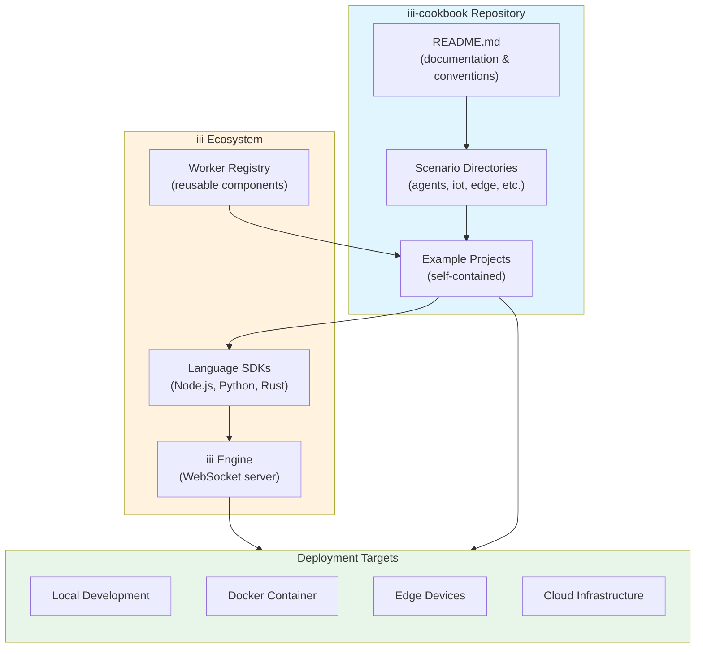
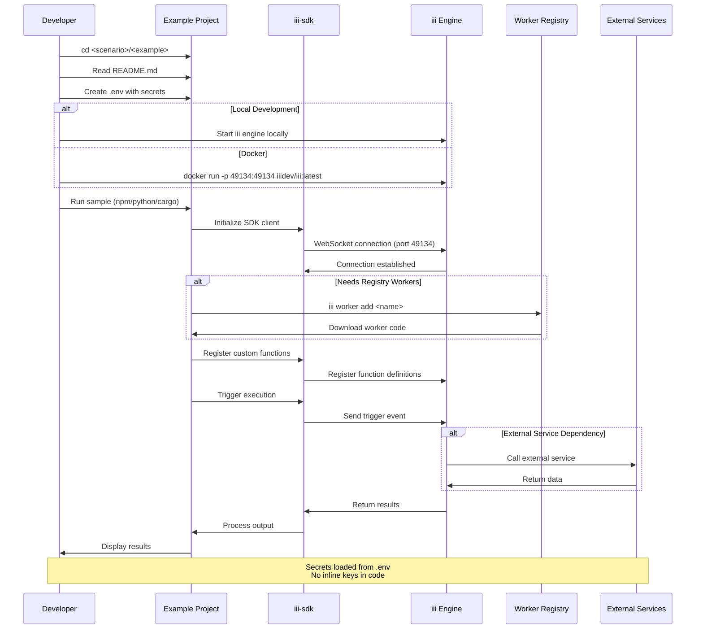

# Project Exploration: iii-cookbook

## Overview

The iii-cookbook repository serves as the official collection of runnable samples for the iii framework, an emerging platform for building distributed applications across IoT, Edge computing, Agents, Backend APIs, and data processing pipelines. Unlike a typical software repository containing implementation code, this is a **template repository** designed to be populated with example projects over time.

The repository embodies a documentation-first approach where the structure, conventions, and contribution guidelines are established before the actual sample implementations. This pattern is common in framework ecosystems where the cookbook acts as the primary learning resource for developers adopting the platform. The README at `/home/darkvoid/Boxxed/@formulas/src.rust/src.llamacpp/src.iii/iii-cookbook/README.md` (lines 1-77) establishes the complete contract for how examples should be structured, what technologies are supported, and how the iii engine integrates with various language SDKs.

The iii framework itself appears to be a WebSocket-based execution engine that supports multiple programming languages (Node.js 20+, Python 3.10+, Rust 1.75+) through dedicated SDKs. The cookbook's purpose is to demonstrate how to compose iii's registered workers and functions into complete, runnable applications across different domains and use cases.

## Repository

- **Location:** `/home/darkvoid/Boxxed/@formulas/src.rust/src.llamacpp/src.iii/iii-cookbook/`
- **Remote:** `git@github.com:iii-hq/iii-cookbook`
- **Primary Language:** Markdown (template repository)
- **License:** Apache License 2.0 (see `/home/darkvoid/Boxxed/@formulas/src.rust/src.llamacpp/src.iii/iii-cookbook/LICENSE`)
- **Copyright:** 2026 iii-hq

## Current State

**Critical Finding:** This repository is in its **initial scaffolding phase**. As of commit `b23b47a`, the repository contains only:

1. `README.md` - The comprehensive guide and contract for the cookbook
2. `LICENSE` - Apache 2.0 license file
3. `.git/` - Git repository metadata

**No example code, scenarios, or implementations exist yet.** The repository describes a future structure that contributors should follow when adding samples.

## Directory Structure

```
/home/darkvoid/Boxxed/@formulas/src.rust/src.llamacpp/src.iii/iii-cookbook/
├── .git/                           # Git repository metadata
│   ├── config                      # Git configuration
│   ├── description                 # Repository description
│   ├── HEAD                        # Current branch reference (main)
│   ├── hooks/                      # Git hook templates (standard)
│   ├── index                       # Git index file
│   ├── info/                       # Git info directory
│   ├── logs/                       # Git operation logs
│   ├── objects/                    # Git object storage
│   ├── packed-refs                 # Packed references
│   └── refs/                       # Git references (heads, remotes, tags)
├── LICENSE                         # Apache License 2.0 (full text)
└── README.md                       # Comprehensive cookbook documentation
```

### Intended Structure (as documented in README.md)

The README at lines 7-14 defines the expected structure once examples are added:

```
iii-cookbook/
  <scenario>/                       # Domain grouping directory
    <example>/                      # Individual runnable project
      README.md                     # Example-specific documentation
      ...code                       # Implementation files
```

**Planned scenario categories** (from README.md line 15):
- `agents/` - AI agent implementations
- `iot/` - Internet of Things examples
- `edge/` - Edge computing deployments
- `backend-api/` - API service implementations
- `data-pipelines/` - Data processing workflows
- `realtime/` - Real-time applications
- `workflows/` - Workflow orchestration examples

## Architecture

### High-Level Conceptual Architecture

Since this is a template repository, we can only document the **intended architecture** as described in the README. The following diagram represents how the cookbook examples will interact with the iii ecosystem:



### Component Relationships

#### 1. Scenario Organization Layer
- **Location:** Documented at `/home/darkvoid/Boxxed/@formulas/src.rust/src.llamacpp/src.iii/iii-cookbook/README.md:7-15`
- **Purpose:** Groups examples by domain to help developers find relevant patterns
- **Design Decision:** Scenario-based organization rather than language-based allows developers to see how the same problem is solved across different languages

#### 2. Example Project Layer
- **Location:** Documented at `/home/darkvoid/Boxxed/@formulas/src.rust/src.llamacpp/src.iii/iii-cookbook/README.md:7-14`
- **Purpose:** Self-contained, runnable demonstrations of iii capabilities
- **Key Constraints:**
  - Each example must have its own `README.md` (line 46)
  - No shared global state across examples (line 47)
  - Pinned to specific iii engine and SDK versions (line 48)
  - External service dependencies ship with `docker-compose.yml` (line 49)

#### 3. iii Engine Integration Layer
- **Location:** Documented at `/home/darkvoid/Boxxed/@formulas/src.rust/src.llamacpp/src.iii/iii-cookbook/README.md:17-33`
- **Purpose:** WebSocket-based execution engine that runs functions and workers
- **Installation Methods:**
  - Native: `curl -fsSL https://install.iii.dev/iii/main/install.sh | sh`
  - Docker: `docker run -p 49134:49134 iiidev/iii:latest`
- **Port:** 49134 (WebSocket communication)

#### 4. SDK Abstraction Layer
- **Location:** Documented at `/home/darkvoid/Boxxed/@formulas/src.rust/src.llamacpp/src.iii/iii-cookbook/README.md:42`
- **Purpose:** Language-specific bindings to the iii engine
- **Supported Platforms:**
  - Node.js: `iii-sdk` on npm
  - Python: `iii-sdk` on PyPI
  - Rust: `iii-sdk` on crates.io

#### 5. Worker Registry Layer
- **Location:** Documented at `/home/darkvoid/Boxxed/@formulas/src.rust/src.llamacpp/src.iii/iii-cookbook/README.md:51-55`
- **Purpose:** Reusable worker distribution system
- **Key Insight:** The cookbook does not contain reusable building blocks directly; instead, it demonstrates how to compose workers from the registry (line 52-53)
- **Classification:** Workers are marked as `official` (iii-hq maintained) or unflagged (community)

## Entry Points

### 1. Repository Root README.md
- **File:** `/home/darkvoid/Boxxed/@formulas/src.rust/src.llamacpp/src.iii/iii-cookbook/README.md`
- **Lines:** 1-77
- **Purpose:** Primary documentation and onboarding guide
- **Content Breakdown:**
  - Lines 1-4: Project tagline and purpose
  - Lines 6-14: Directory layout specification
  - Lines 16-33: Requirements and installation instructions
  - Lines 35-40: How to run a sample
  - Lines 42-50: Structure conventions and best practices
  - Lines 52-55: Registry integration guidelines
  - Lines 57-68: Contribution workflow
  - Lines 70-72: Release cadence
  - Lines 74-76: License reference

### 2. Future Example Entry Points

Based on the README conventions (lines 35-40), each example will have:
- **Location:** `<scenario>/<example>/README.md`
- **Execution Flow:**
  1. Navigate to example directory
  2. Follow example-specific README instructions
  3. Load secrets from `.env` file
  4. Execute using language-specific tooling

## Data Flow

The following sequence diagram illustrates the intended data flow when running a cookbook example:



## External Dependencies

### Runtime Dependencies

| Dependency | Version | Purpose | Source |
|------------|---------|---------|--------|
| iii engine | 0.11.2+ | Core execution engine | Native install or Docker |
| Node.js | 20+ | JavaScript/TypeScript examples | Node.js org |
| Python | 3.10+ | Python examples | Python org |
| Rust | 1.75+ | Rust examples | Rust org |
| Docker | N/A | Containerized deployment | Docker Inc |

### SDK Dependencies

| SDK | Package | Registry | Installation |
|-----|---------|----------|--------------|
| Node.js | iii-sdk | npm | `npm install iii-sdk` |
| Python | iii-sdk | PyPI | `pip install iii-sdk` |
| Rust | iii-sdk | crates.io | `cargo add iii-sdk` |

### Installation Script

```bash
# Source: /home/darkvoid/Boxxed/@formulas/src.rust/src.llamacpp/src.iii/iii-cookbook/README.md:24-27
curl -fsSL https://install.iii.dev/iii/main/install.sh | sh
iii
```

### Docker Image

```bash
# Source: /home/darkvoid/Boxxed/@formulas/src.rust/src.llamacpp/src.iii/iii-cookbook/README.md:30-32
docker run -p 49134:49134 iiidev/iii:latest
```

## Configuration

### Environment Variables

Based on the README conventions (lines 42-43), each example uses:
- **`.env` file:** Contains secrets (API keys, tokens)
- **Constraint:** Never inline keys in source code

### Version Pinning

- **Engine Version:** Each example must pin to a specific iii engine version (line 48)
- **SDK Version:** Each example must pin to a specific SDK version (line 48)
- **Update Cadence:** Samples refreshed every major iii release (lines 70-72)

## Testing Strategy

### Contribution Requirements

From the README contribution guidelines (lines 57-68):

1. **Pre-PR Checklist:**
   - Run the sample from a clean clone
   - Pin the iii engine version tested against
   - Remove API keys, tokens, and absolute paths

2. **PR Scope:**
   - One sample per PR
   - Focused changes only

### Sample Structure Requirements

Each example must include (lines 63-64):
- `README.md` with prerequisites, setup, and run instructions
- Code files
- Minimal set of tests

## Key Insights

### Aha Moment: Documentation-First Repository Design

**Key Insight:** This repository demonstrates a documentation-first approach where the structure and conventions are established before implementation. The README at `/home/darkvoid/Boxxed/@formulas/src.rust/src.llamacpp/src.iii/iii-cookbook/README.md` serves as both documentation and a **contract** for future contributors. Every detail from directory naming to version pinning is specified upfront, ensuring consistency across all future examples.

This approach prevents the common anti-pattern of cookbooks that grow organically without structure, becoming unmaintainable over time. By establishing that:
- Examples must be self-contained (no shared state)
- Every example must have its own README
- Examples must pin to specific versions
- External dependencies must include docker-compose.yml

The iii team ensures the cookbook will remain a high-quality learning resource even as it scales to dozens of examples.

### Registry Separation Pattern

**Key Insight:** The README explicitly states (lines 52-53): "Generally useful building blocks should not live here. If a worker is reusable across projects, publish it to the iii registry and reference it via `iii worker add <name>`."

This separation of concerns between the cookbook (demonstrating composition) and the registry (hosting reusable components) prevents code duplication while still showing best practices for using shared workers.

### Multi-Language SDK Strategy

**Key Insight:** The iii framework supports three major languages (Node.js, Python, Rust) through separate SDKs that all communicate with the same WebSocket-based engine. This is an emerging pattern in distributed systems where:
- The engine provides the execution environment
- SDKs provide idiomatic language bindings
- Examples can show the same pattern across languages

The engine port 49134 suggests a deliberate choice for WebSocket communication, enabling both local and remote engine deployment with the same client code.

### Version Management Philosophy

The README establishes strict version pinning (lines 48, 70-72):
- Each example pins to a specific engine version
- Each example pins to a specific SDK version
- Samples are tagged `needs-update` when broken by new releases

This conservative approach prioritizes reproducibility over always-being-current, which is critical for a learning resource where broken examples frustrate new users.

## Open Questions

1. **No Implementation Examples:** The repository currently has no actual example code. Is this intentional (awaiting first contribution) or should there be at least one reference implementation?

2. **SDK Maturity:** The SDK packages (`iii-sdk` on npm, PyPI, crates.io) are referenced but no version constraints are specified beyond the engine requirement (0.11.2+). What is the relationship between SDK versions and engine versions?

3. **Worker Registry Access:** The `iii worker add <name>` command suggests a registry system, but no details are provided about how to publish workers or browse available workers.

4. **WebSocket Protocol:** The documentation mentions WebSocket communication on port 49134 but provides no details about the protocol format or message schema.

5. **Release Cycle:** The README mentions "refreshed every major iii release" but doesn't specify what constitutes a major release or how `needs-update` tags are managed.

6. **Testing Framework:** While tests are mentioned as required for contributions (line 64), no guidance is given on testing patterns or frameworks for iii applications.

7. **Local Development Workflow:** The install script at `https://install.iii.dev/iii/main/install.sh` is referenced but its behavior is not documented (what platforms does it support? what does it install?)

## Quality Criteria Assessment

Based on the Exploration Agent guidelines:

| Criterion | Status | Notes |
|-----------|--------|-------|
| Every file documented | N/A | Only README.md and LICENSE exist |
| Mermaid diagrams | Complete | 2 diagrams included |
| New engineer understanding | Partial | Cannot learn implementation without code |
| Entry points documented | Complete | README.md is the primary entry |
| External dependencies | Complete | All dependencies and versions documented |
| Configuration clear | Partial | .env pattern documented but no examples |

## Conclusion

The iii-cookbook repository represents the foundational stage of a framework documentation ecosystem. While it currently contains no implementation code, the comprehensive README establishes clear conventions, architectural patterns, and contribution workflows that will guide future development. The repository's value lies in its **documentation contract** - it tells contributors exactly how to structure examples, what versions to target, and how to integrate with the broader iii ecosystem.

For a new engineer, this exploration document provides complete understanding of the **intended structure** and **ecosystem integration patterns**, but actual implementation learning must wait for the first example contributions to arrive.

---

**Source Files Referenced:**
- `/home/darkvoid/Boxxed/@formulas/src.rust/src.llamacpp/src.iii/iii-cookbook/README.md` (77 lines)
- `/home/darkvoid/Boxxed/@formulas/src.rust/src.llamacpp/src.iii/iii-cookbook/LICENSE` (202 lines, Apache 2.0)

**Git References:**
- Latest commit: `b23b47a Update README.md`
- Previous commit: `e73ef34 chore: initial Apache-2.0 license and README`
- Branch: `main`
- Remote: `origin git@github.com:iii-hq/iii-cookbook`
