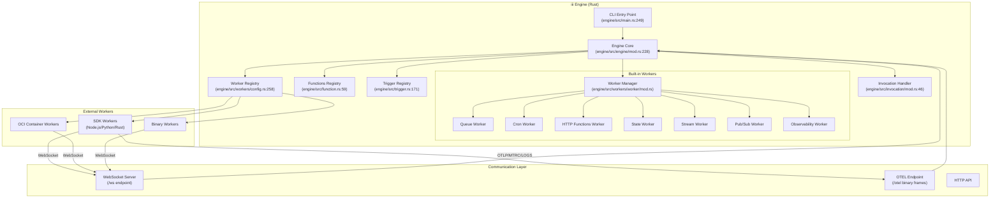
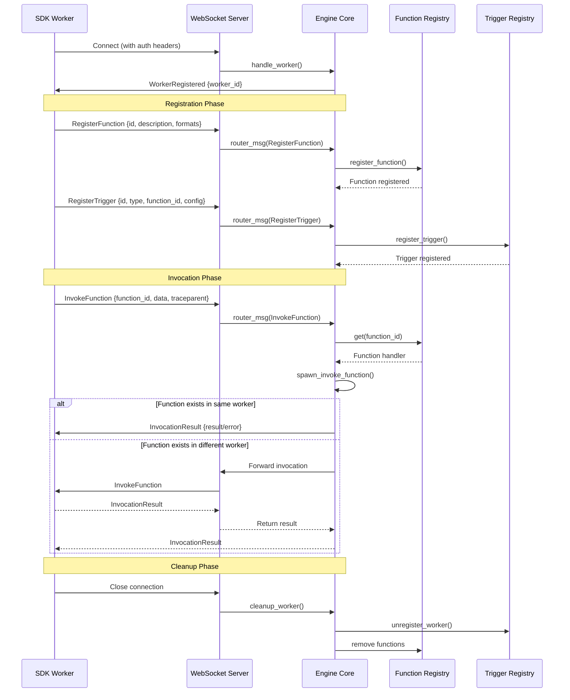
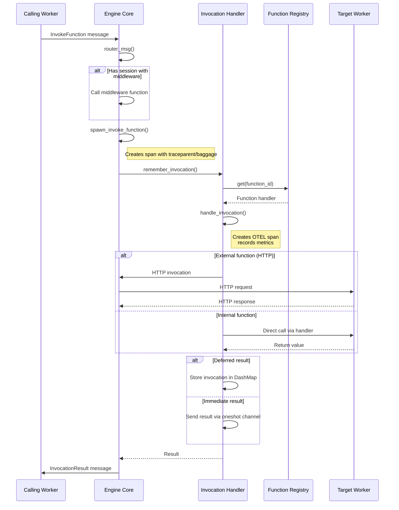
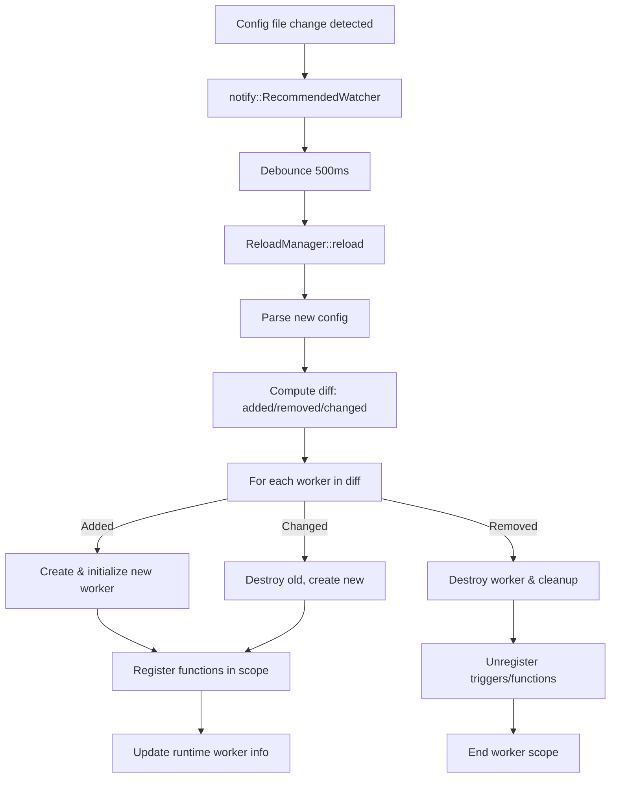

# Project Exploration: iii

## Overview

iii is a **process communication engine** designed to compose, extend, and observe services in real-time. It provides a unified runtime that collapses disparate backend infrastructure — queues, cron, HTTP endpoints, state management, observability, agents, and sandboxes — into a single, live system surface.

The project follows a **Worker _ Function _ Trigger** mental model. Workers are processes that register with the iii engine and declare triggers and functions. A trigger is anything that causes a function to run — HTTP requests, cron schedules, queue messages, state changes, or custom events. Functions are units of work with stable identifiers like `content::classify` or `orders::validate`.

iii is built primarily in **Rust** for the engine runtime, with SDKs provided for **Node.js**, **Python**, and **Rust**. The architecture supports both in-process workers (compiled into the engine) and external workers (spawned as separate processes or VMs).

**Key insight:** iii eliminates the traditional "integration story" where each new service requires weeks of vendor evaluation and procurement. Instead, capabilities are added via `iii worker add <name>` — the worker joins a live catalog, and every other worker is notified and can call it immediately. This same interface is available to agents, which can extend the system at runtime.

## Repository

- **Location:** `/home/darkvoid/Boxxed/@formulas/src.rust/src.llamacpp/src.iii/iii/`
- **Remote:** `git@github.com:iii-hq/iii`
- **Primary Language:** Rust (engine), TypeScript/Python/Rust (SDKs)
- **License:** Elastic License 2.0 (engine), Apache 2.0 (SDKs, CLI, console, docs)

## Directory Structure

```
iii/
├── engine/                    # Core Rust engine (see engine/src/lib.rs:1)
│   ├── src/
│   │   ├── main.rs           # CLI entry point (see engine/src/main.rs:1)
│   │   ├── lib.rs            # Public API exports (see engine/src/lib.rs:1)
│   │   ├── engine/           # Core engine logic (see engine/src/engine/mod.rs:1)
│   │   │   └── mod.rs        # 4,503 lines - main engine implementation
│   │   ├── function.rs       # Function registry and handlers (see engine/src/function.rs:1)
│   │   ├── trigger.rs        # Trigger types and registry (see engine/src/trigger.rs:1)
│   │   ├── protocol.rs       # WebSocket message protocol (see engine/src/protocol.rs:1)
│   │   ├── invocation/       # Function invocation handling
│   │   │   └── mod.rs        # Invocation handler with OTEL tracing (see engine/src/invocation/mod.rs:1)
│   │   ├── workers/          # Worker implementations
│   │   │   ├── config.rs     # Engine configuration and builder (see engine/src/workers/config.rs:1)
│   │   │   ├── traits.rs     # Worker trait definitions (see engine/src/workers/traits.rs:1)
│   │   │   ├── queue/        # Queue worker implementations
│   │   │   ├── cron/         # Cron scheduling worker
│   │   │   ├── http_functions/ # HTTP invocation worker
│   │   │   ├── pubsub/       # Pub/sub messaging
│   │   │   ├── state/        # State management worker
│   │   │   ├── stream/       # Streaming worker
│   │   │   ├── observability/ # Metrics and telemetry
│   │   │   ├── worker/       # Worker manager and RBAC
│   │   │   ├── registry_worker.rs # External worker spawning
│   │   │   ├── reload.rs     # Hot reload support
│   │   │   └── ...
│   │   ├── builtins/         # Built-in engine functions
│   │   ├── cli/              # CLI subcommands
│   │   ├── config/           # Configuration parsing
│   │   ├── services.rs       # Service registry
│   │   └── telemetry.rs      # OpenTelemetry integration
│   ├── function-macros/      # Proc macros for function registration
│   ├── tests/                # E2E and integration tests
│   └── benches/              # Performance benchmarks
├── crates/                    # Additional Rust crates
│   ├── iii-worker/           # Worker CLI and binary (see crates/iii-worker/src/main.rs:1)
│   ├── iii-supervisor/         # Process supervisor
│   ├── iii-init/              # Initialization utilities
│   ├── iii-filesystem/        # Filesystem operations
│   ├── iii-network/           # Network utilities
│   ├── iii-shell-client/      # Shell client
│   ├── iii-shell-proto/       # Shell protocol
│   ├── scaffolder-core/       # Project scaffolding
│   └── motia-tools/           # Development tools
├── sdk/                       # Multi-language SDKs
│   ├── packages/
│   │   ├── node/             # Node.js SDK
│   │   │   ├── iii/          # Core SDK (see sdk/packages/node/iii/src/index.ts:1)
│   │   │   ├── iii-browser/  # Browser SDK
│   │   │   ├── iii-example/  # Example workers
│   │   │   └── observability/ # Observability SDK
│   │   ├── python/           # Python SDK
│   │   │   └── iii/          # Core Python SDK
│   │   └── rust/             # Rust SDK
│   │       ├── iii/          # Core Rust SDK (see sdk/packages/rust/iii/src/lib.rs:1)
│   │       ├── iii-example/  # Rust examples
│   │       └── observability/ # Rust observability SDK
│   ├── fixtures/             # Test fixtures
│   └── test-assets/          # Test resources
├── console/                   # Developer console (React + Rust)
│   └── packages/
│       ├── console-frontend/ # React frontend
│       └── console-rust/     # Rust backend
├── docs/                      # Documentation (Mintlify/MDX)
├── website/                   # iii.dev website
├── skills/                    # Agent-readable reference material
├── scripts/                   # Build and utility scripts
├── blog/                      # Blog site
├── infra/                     # Terraform infrastructure
└── new_skills/               # New skill templates
```

## Architecture

### High-Level Component Diagram



### WebSocket Protocol Flow



## Component Breakdown

### Engine Core (`engine/src/engine/mod.rs:228`)

The `Engine` struct is the heart of iii. It maintains all registries and handles message routing:

```rust
#[derive(Clone)]
pub struct Engine {
    pub worker_registry: Arc<WorkerConnectionRegistry>,
    pub runtime_workers: Arc<DashMap<String, RuntimeWorkerInfo>>,
    pub functions: Arc<FunctionsRegistry>,
    pub trigger_registry: Arc<TriggerRegistry>,
    pub service_registry: Arc<ServicesRegistry>,
    pub invocations: Arc<InvocationHandler>,
    pub channel_manager: Arc<ChannelManager>,
    pub queue_module: Arc<tokio::sync::RwLock<Option<Arc<dyn QueueEnqueuer>>>>,
    pub(crate) function_owners: Arc<DashMap<String, Uuid>>,
    pub(crate) external_function_owners: Arc<DashMap<String, Uuid>>,
    // ...
}
```

**Key insight:** The engine uses `DashMap` for concurrent access to registries without blocking, enabling high-throughput function registration and invocation. Function ownership tracking via `function_owners` prevents race conditions during fast restarts where a new worker might register before the old one cleanup completes.

### Worker Trait (`engine/src/workers/traits.rs:46`)

All workers implement the `Worker` trait:

```rust
#[async_trait::async_trait]
pub trait Worker: Send + Sync {
    fn name(&self) -> &'static str;
    async fn create(engine: Arc<Engine>, config: Option<Value>) -> anyhow::Result<Box<dyn Worker>>;
    async fn initialize(&self) -> anyhow::Result<()>;
    async fn start_background_tasks(&self, shutdown_rx: Receiver<bool>, shutdown_tx: Sender<bool>) -> anyhow::Result<()>;
    async fn destroy(&self) -> anyhow::Result<()>;
    async fn is_alive(&self) -> bool;
    fn is_external_process(&self) -> bool;
    fn register_functions(&self, engine: Arc<Engine>);
}
```

**Key insight:** The trait design supports both in-process workers (built into the engine binary) and external workers (spawned as separate processes). The `ConfigurableWorker` trait extension (`engine/src/workers/traits.rs:109`) adds adapter-based configuration, allowing workers to use pluggable backends (e.g., Redis vs in-memory for queues).

### Function Registry (`engine/src/function.rs:58`)

Functions are stored in a `DashMap` with automatic scope tracking for reload support:

```rust
#[derive(Default)]
pub struct FunctionsRegistry {
    pub functions: Arc<DashMap<String, Function>>,
    pub(crate) active_scope: Arc<std::sync::Mutex<Option<ScopeBuilder>>>,
}
```

Each `Function` contains a handler wrapped in an `Arc`:

```rust
#[derive(Clone)]
pub struct Function {
    pub handler: Arc<HandlerFn>,
    pub _function_id: String,
    pub _description: Option<String>,
    pub request_format: Option<Value>,
    pub response_format: Option<Value>,
    pub metadata: Option<Value>,
}
```

**Key insight:** Function handlers return `FunctionResult<T, E>` with four variants: `Success`, `Failure`, `Deferred`, and `NoResult`. The `Deferred` variant is critical for async patterns where a function returns immediately but completes later (e.g., queue processing).

### Trigger System (`engine/src/trigger.rs:60`)

Triggers connect events to functions. The `TriggerType` defines how triggers of that type behave:

```rust
pub struct TriggerType {
    pub id: String,
    pub _description: String,
    pub trigger_request_format: Option<Value>,
    pub call_request_format: Option<Value>,
    pub registrator: Box<dyn TriggerRegistrator>,
    pub worker_id: Option<Uuid>,
}
```

Built-in trigger types include:
- `http` - HTTP endpoint triggers (requires iii-http worker)
- `cron` - Scheduled execution (requires iii-cron worker)
- `durable:subscriber` - Queue subscription (requires iii-queue worker)
- `subscribe` - Pub/Sub subscription (requires iii-pubsub worker)
- `state` - State change triggers (requires iii-state worker)
- `stream` - Streaming data triggers (requires iii-stream worker)

**Key insight:** Trigger types use JSON Schema for request validation. The schema is generated from Rust types using `schemars` at compile time (`engine/src/trigger.rs:99`), ensuring type safety across the engine-SDK boundary.

### Protocol (`engine/src/protocol.rs:40`)

The WebSocket protocol uses tagged enums for message types:

```rust
#[derive(Debug, Clone, Serialize, Deserialize)]
#[serde(tag = "type", rename_all = "lowercase")]
pub enum Message {
    RegisterTriggerType { id: String, description: String, ... },
    RegisterTrigger { id: String, trigger_type: String, function_id: String, config: Value, ... },
    RegisterFunction { id: String, description: Option<String>, ... },
    InvokeFunction { invocation_id: Option<Uuid>, function_id: String, data: Value, traceparent: Option<String>, baggage: Option<String>, action: Option<TriggerAction> },
    InvocationResult { invocation_id: Uuid, function_id: String, result: Option<Value>, error: Option<ErrorBody>, ... },
    // ...
}
```

**Key insight:** The protocol supports W3C Trace Context (`traceparent`) and W3C Baggage for distributed tracing. Binary frames with prefixes `OTLP`, `MTRC`, and `LOGS` carry OpenTelemetry data on a separate `/otel` WebSocket endpoint to avoid polluting the worker registry with telemetry-only connections.

### Invocation Handler (`engine/src/invocation/mod.rs:46`)

Handles function execution with OpenTelemetry integration:

```rust
pub struct InvocationHandler {
    invocations: Invocations,  // DashMap<Uuid, Invocation>
}

pub struct Invocation {
    pub id: Uuid,
    pub function_id: String,
    pub worker_id: Option<Uuid>,
    pub sender: oneshot::Sender<Result<Option<Value>, ErrorBody>>,
    pub traceparent: Option<String>,
    pub baggage: Option<String>,
}
```

The handler creates spans following OpenTelemetry FAAS semantic conventions:

```rust
let span = tracing::info_span!(
    "call",
    otel.name = %format!("call {}", function_id),
    otel.kind = "server",
    "faas.invoked_name" = %function_id,
    "faas.trigger" = "other",
    "iii.function.kind" = %function_kind,  // "internal" or "user"
);
```

## Entry Points

### Main Engine Binary (`engine/src/main.rs:249`)

```rust
#[tokio::main]
async fn main() -> anyhow::Result<()> {
    // Parse CLI arguments
    let cli_args = Cli::try_parse_from(&argv)?;

    // Send telemetry
    cli::telemetry::send_cli_usage(&cli_usage_command_path(&cli_args)).await;

    match &cli_args.command {
        Some(Commands::Trigger(args)) => cli_trigger::run_trigger(args).await,
        Some(Commands::Console { args }) => cli::handle_dispatch("console", args).await,
        Some(Commands::Cloud { args }) => cli::handle_dispatch("cloud", args).await,
        Some(Commands::Worker { args }) => cli::handle_dispatch("worker", args).await,
        Some(Commands::Project(args)) => cli::project::run(args.clone()).await,
        Some(Commands::Update { target, list_targets }) => { ... }
        None => run_serve(&cli_args).await,  // Default: start the engine
    }
}
```

The `run_serve` function (`engine/src/main.rs:226`) initializes and starts the engine:

```rust
async fn run_serve(cli: &Cli) -> anyhow::Result<()> {
    let config = if cli.use_default_config {
        EngineConfig::default_config()
    } else {
        EngineConfig::config_file(&cli.config)?
    };

    let mut builder = EngineBuilder::new().with_config(config);
    let engine = builder.build().await?;
    engine.serve().await?;
    Ok(())
}
```

### EngineBuilder (`engine/src/workers/config.rs:534`)

The builder pattern constructs the engine with all workers:

```rust
pub struct EngineBuilder {
    config: Option<EngineConfig>,
    config_path: Option<String>,
    engine: Arc<Engine>,
    registry: Arc<WorkerRegistry>,
    running: Vec<RunningWorker>,
}
```

The `build()` method (`engine/src/workers/config.rs:631`):
1. Loads and validates configuration
2. Injects built-in daemons (iii-worker-ops)
3. Assigns instance IDs to workers with duplicate names
4. Resolves the worker manager port
5. Creates and initializes each worker
6. Registers functions from each worker
7. Returns the configured builder

## Data Flow

### Function Invocation Flow



### Hot Reload Flow

The engine supports hot reload of configuration without restarting:



## External Dependencies

| Dependency | Version | Purpose |
|------------|---------|---------|
| tokio | 1.x | Async runtime |
| axum | 0.8.x | HTTP server and WebSocket handling |
| dashmap | 6.x | Concurrent hash maps |
| serde/serde_json | 1.x | Serialization |
| tracing | 0.1.x | Structured logging |
| opentelemetry | 0.31.x | Observability |
| clap | 4.x | CLI argument parsing |
| redis | 1.0.x | Redis adapter for state/queue |
| lapin | 3.x | RabbitMQ adapter (optional) |
| uuid | 1.x | Unique identifiers |
| chrono | 0.4.x | Date/time handling |

## Configuration

The engine is configured via YAML (`config.yaml`):

```yaml
modules:
  - name: iii-observability
  - name: iii-http
  - name: iii-state
    config:
      adapter:
        name: redis
        config:
          url: redis://localhost:6379

workers:
  - name: my-custom-worker
    image: ghcr.io/myorg/worker:1.0
    config:
      port: 8080
```

Environment variable expansion uses `${VAR:default}` syntax (`engine/src/workers/config.rs:47`):

```rust
pub fn expand_env_vars(yaml_content: &str) -> String {
    static RE: LazyLock<Regex> =
        LazyLock::new(|| Regex::new(r"\$\{([^}:]+)(?::([^}]*))?\}").unwrap());
    // Replace ${VAR} or ${VAR:default} with actual values
}
```

## Testing

The project has extensive testing:

- **Unit tests**: Inline in source files using `#[cfg(test)]`
- **Integration tests**: In `engine/tests/` directory (e.g., `http_e2e_*.rs`, `queue_e2e_*.rs`)
- **Benchmarks**: In `engine/benches/` using Criterion

Run tests with:
```bash
cargo test --workspace --all-features
cargo test -p iii --all-features  # Engine tests only
```

## Key Insights

1. **Zero-integration architecture**: iii collapses multiple backend services into a single runtime. Instead of integrating queues, cron, HTTP, state, and observability separately, developers add workers that provide these capabilities through a unified interface.

2. **Worker ownership tracking**: The engine tracks which worker owns each function registration using `DashMap<String, Uuid>` (`function_owners` and `external_function_owners`). This prevents race conditions during fast restarts and enables safe cleanup when workers disconnect.

3. **Separate OTEL WebSocket**: Telemetry data flows through a dedicated `/otel` WebSocket endpoint using binary frames (`OTLP`, `MTRC`, `LOGS` prefixes). This prevents telemetry-only connections from appearing in the worker registry and inflating metrics.

4. **Adapter pattern for workers**: Workers implementing `ConfigurableWorker` can use pluggable adapters. For example, the queue worker can use Redis, RabbitMQ, or in-memory adapters without code changes.

5. **Hot reload without downtime**: The engine watches `config.yaml` for changes and computes diffs to add, remove, or restart only changed workers. This uses scope-based registration tracking to cleanly remove old registrations.

6. **Function registration prefixing**: Workers with RBAC sessions can have a `function_registration_prefix` that automatically prepends to all function IDs they register. This enables multi-tenant scenarios where workers can only invoke functions within their namespace.

7. **Invocation actions**: The `InvokeFunction` message supports `action` field with variants `Enqueue` and `Void`. This allows fire-and-forget patterns and queue-based async processing while maintaining the same function interface.

## Open Questions

1. **Scale limits**: The documentation mentions `DashMap` and in-process storage. How does the engine handle horizontal scaling across multiple nodes?

2. **Persistence guarantees**: How are triggers and function registrations persisted? Can they survive an engine restart?

3. **Security model**: The RBAC session system (`engine/src/workers/worker/rbac_session.rs`) allows function allowlists and forbidden lists. How are secrets managed for external HTTP invocations?

4. **Worker discovery**: The `iii-worker-ops` daemon is auto-injected. How does it discover and download worker binaries from the registry?

5. **Console integration**: The console is a separate React + Rust package. How does it authenticate with the engine and what management operations does it expose?
