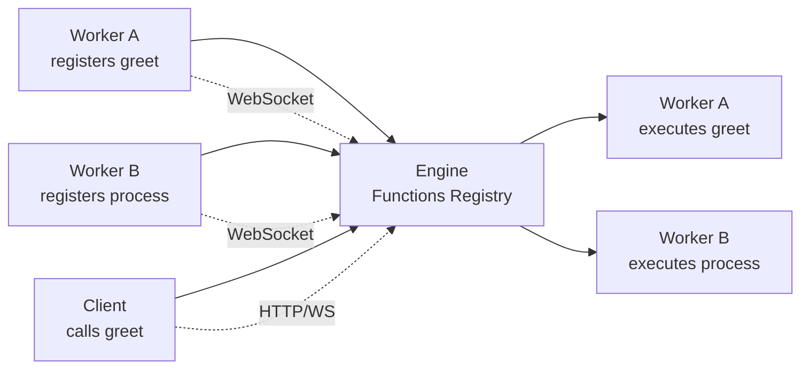
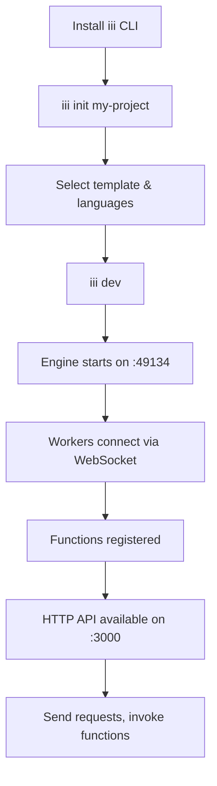

# Overview — What iii Is and Why It Exists

**iii collapses distributed backend infrastructure into a single runtime.** Instead of integrating queues, cron, HTTP endpoints, state management, observability, agents, and sandboxes as separate services, iii provides a unified process communication engine where everything communicates through one protocol: functions and triggers.

## The Mental Model: Worker → Function → Trigger

Everything in iii boils down to three concepts:

- **Worker** — A process (Rust binary, Node.js script, Python script, or OCI container) that connects to the iii engine over WebSocket and registers capabilities.
- **Function** — A named unit of work with a stable identifier like `content::classify` or `orders::validate`. Functions accept a JSON payload and return a result.
- **Trigger** — Anything that causes a function to run. HTTP requests, cron schedules, queue messages, state changes, stream events, or custom events.

**Aha:** The radical simplification is that *every* interaction goes through this triplet. Want an HTTP endpoint? Register a function and attach an `http` trigger. Want a scheduled job? Register a function and attach a `cron` trigger. Want async processing? Publish to a queue topic that triggers a function. There are no special APIs for different infrastructure — just functions and triggers.

## Why iii Exists

Traditional backend development requires integrating multiple services:

```
┌──────────┐  ┌──────┐  ┌──────┐  ┌───────────┐  ┌──────────┐
│  HTTP    │  │ Queue│  │ Cron │  │   State   │  │Telemetry │
│  Server  │  │Worker│  │Daemon│  │   Store   │  │  System  │
└────┬─────┘  └──┬───┘  └──┬───┘  └─────┬─────┘  └────┬─────┘
     │            │         │            │              │
     └────────────┴─────────┴────────────┴──────────────┘
                         Your App (glue code)
```

Each service requires its own SDK, configuration, error handling, and integration code. Adding a new capability means vendor evaluation, procurement, and weeks of integration work.

iii replaces this with a single runtime:

```
┌──────────────────────────────────────────────────────┐
│                    iii Engine                         │
│  ┌──────┐ ┌──────┐ ┌──────┐ ┌─────┐ ┌──────────┐    │
│  │ HTTP │ │Queue │ │ Cron │ │State│ │Observabl.│    │
│  │Worker│ │Worker│ │Worker│ │Worker│ │  Worker  │    │
│  └──────┘ └──────┘ └──────┘ └─────┘ └──────────┘    │
│                                                      │
│  ┌──────────────────────────────────────────────┐   │
│  │          WebSocket Message Bus               │   │
│  └──────────────────────────────────────────────┘   │
└────────────────────────┬─────────────────────────────┘
                         │
              ┌──────────┼──────────┐
              ▼          ▼          ▼
         ┌────────┐ ┌────────┐ ┌────────┐
         │Worker A│ │Worker B│ │Worker C│
         │(Rust)  │ │(Node)  │ │(Python)│
         └────────┘ └────────┘ └────────┘
```

**Key insight:** iii eliminates the "integration story" entirely. Instead of integrating each service separately, you add a worker via `iii worker add <name>`. The worker joins a live catalog, and every other worker can call it immediately — including AI agents at runtime.

## Repository Structure

The iii ecosystem spans 9 subprojects across multiple repositories:

| Subproject | Location | Language | Purpose |
|------------|----------|----------|---------|
| **iii** (engine) | `iii/` | Rust | Core engine, CLI, SDKs, console |
| **workers** | `workers/` | Rust + TS + Python | 17+ capability workers |
| **agentmemory** | `agentmemory/` | TypeScript | AI agent persistent memory |
| **spec-forge** | `spec-forge/` | Rust | UI spec generation from prompts |
| **cli-tooling** | `cli-tooling/` | Rust | Project scaffolding CLI |
| **examples** | `examples/` | TS + Python | Runnable example applications |
| **iii-cloud-cli** | `iii-cloud-cli/` | (private source) | Cloud CLI binary distribution |
| **iii-cookbook** | `iii-cookbook/` | (template) | Example recipe repository |
| **skills-and-validation** | `skills-and-validation/` | Rust | Documentation validation system |

## Engine at a Glance

The engine is a Rust binary (~85,000 lines) built with:

- **tokio** for async runtime
- **axum** for HTTP server and WebSocket handling
- **dashmap** for concurrent hash maps (registries)
- **tracing + opentelemetry** for observability

Source: `engine/src/engine/mod.rs:228-255` — The Engine struct

```rust
#[derive(Clone)]
pub struct Engine {
    pub worker_registry: Arc<WorkerConnectionRegistry>,
    pub runtime_workers: Arc<DashMap<String, RuntimeWorkerInfo>>,
    pub functions: Arc<FunctionsRegistry>,
    pub trigger_registry: Arc<TriggerRegistry>,
    pub service_registry: Arc<ServicesRegistry>,
    pub invocations: Arc<InvocationHandler>,
    pub channel_manager: Arc<ChannelManager>,
    pub queue_module: Arc<tokio::sync::RwLock<Option<Arc<dyn QueueEnqueuer>>>>,
    pub(crate) function_owners: Arc<DashMap<String, Uuid>>,
    pub(crate) external_function_owners: Arc<DashMap<String, Uuid>>,
    // ...
}
```

Every field serves a specific purpose:

| Field | Purpose | Lines |
|-------|---------|-------|
| `worker_registry` | Maps worker UUIDs to WebSocket connections | `worker_connections/mod.rs` |
| `runtime_workers` | Tracks in-process workers by name | `workers/config.rs` |
| `functions` | All registered functions by ID | `function.rs` |
| `trigger_registry` | Trigger instances linking events to functions | `trigger.rs` |
| `service_registry` | Named services workers can look up | `services.rs` |
| `invocations` | Active function invocations with oneshot channels | `invocation/mod.rs` |
| `channel_manager` | WebSocket-based data channels for streaming | `workers/worker/channels.rs` |
| `queue_module` | Pluggable queue backend (in-memory, Redis, RabbitMQ) | `workers/queue/` |
| `function_owners` | Tracks which worker owns each function (fast-restart race protection) | `engine/mod.rs:244` |

## SDKs

iii provides SDKs for three languages, all communicating over the same WebSocket protocol:

| SDK | Package | Location |
|-----|---------|----------|
| Node.js | `iii-sdk` on npm | `sdk/packages/node/iii/` |
| Python | `iii-sdk` on PyPI | `sdk/packages/python/iii/` |
| Rust | `iii-sdk` on crates.io | `sdk/packages/rust/iii/` |

Each SDK abstracts the WebSocket protocol behind a unified API:

```typescript
// Node.js (sdk/packages/node/iii/src/iii.ts)
const iii = await registerWorker({ url: 'ws://localhost:49134' });
iii.registerFunction({ id: 'greet', handler: async (input) => { ... } });
iii.registerTrigger({ type: 'http', function_id: 'greet', config: { path: '/greet' } });
```

```python
# Python (sdk/packages/python/iii/src/iii_client.py)
iii = register_worker(url='ws://localhost:49134')
iii.register_function(id='greet', handler=greet_handler)
iii.register_trigger(type='http', function_id='greet', config={'path': '/greet'})
```

```rust
// Rust (sdk/packages/rust/iii/src/iii.rs)
let iii = register_worker("ws://localhost:49134", InitOptions::default());
iii.register_function(RegisterFunction::new_async("greet", greet_handler));
```

**Aha:** The SDKs are thin wrappers over the WebSocket protocol. They don't implement any business logic — all the intelligence lives in the engine. This means SDK updates are minimal and workers written in different languages behave identically.

## Function Registry Flow



## Quick Start Flow



## What's Next

- [01 — Architecture](01-architecture.md) — Full dependency graph, layer diagrams, and module map
- [02 — Engine Core](02-engine-core.md) — Deep dive into the Engine struct and message routing
- [14 — Data Flow](14-data-flow.md) — End-to-end invocation, durable workflow, and streaming flows
