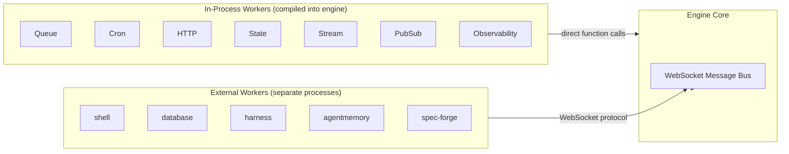
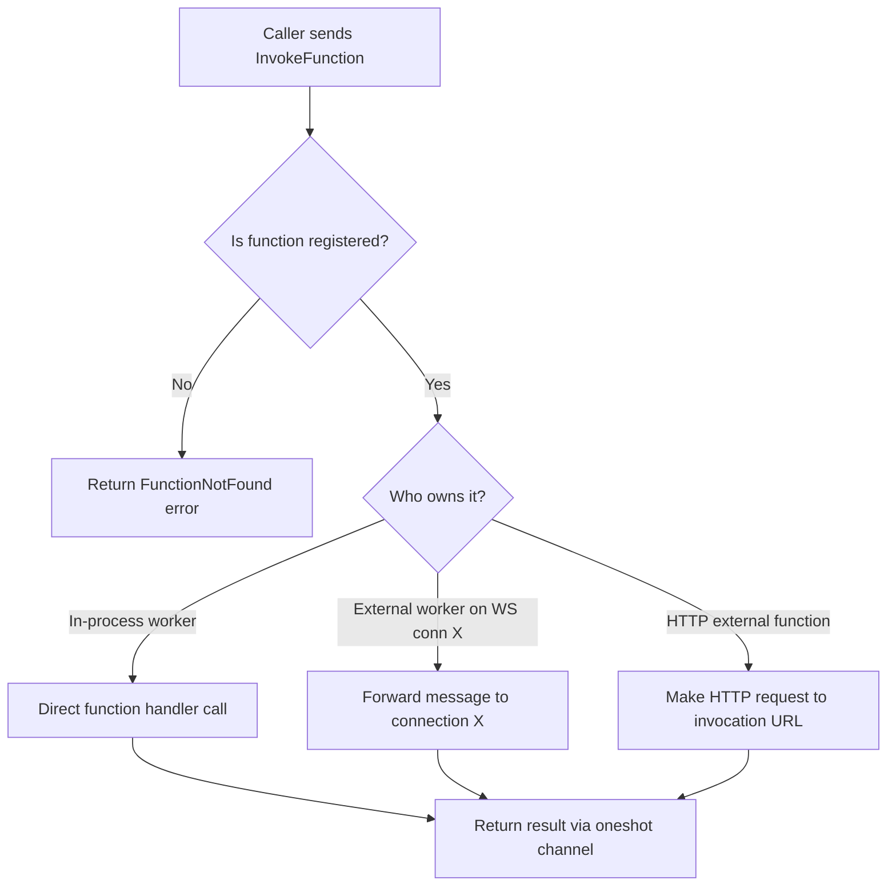

# Architecture — Dependency Graph, Layers, and Module Map

**iii is organized as a layered architecture where each layer communicates through a single message bus.** The engine sits at the center, workers connect as peers, and SDK clients interact through the same WebSocket protocol regardless of language.

## Layer Diagram

```mermaid
graph TB
    subgraph Layer1["Layer 1: Entry Points"]
        CLI["iii CLI<br/>(engine/src/main.rs)"]
        SDK["SDK Workers<br/>(Node/Python/Rust)"]
    end

    subgraph Layer2["Layer 2: Engine Core"]
        Engine["Engine Struct<br/>(engine/mod.rs)"]
        Router["Message Router<br/>(engine/mod.rs:router_msg)"]
        InvHandler["Invocation Handler<br/>(invocation/mod.rs)"]
    end

    subgraph Layer3["Layer 3: Registries"]
        FuncReg["Functions Registry<br/>(function.rs)"]
        TrigReg["Trigger Registry<br/>(trigger.rs)"]
        WorkerReg["Worker Registry<br/>(worker_connections/)"]
        SvcReg["Service Registry<br/>(services.rs)"]
    end

    subgraph Layer4["Layer 4: In-Process Workers"]
        Queue["Queue Worker<br/>(workers/queue/)"]
        Cron["Cron Worker<br/>(workers/cron/)"]
        HTTP["HTTP Functions<br/>(workers/http_functions/)"]
        State["State Worker<br/>(workers/state/)"]
        Stream["Stream Worker<br/>(workers/stream/)"]
        PubSub["Pub/Sub Worker<br/>(workers/pubsub/)"]
        Obs["Observability<br/>(workers/observability/)"]
        WorkerMgr["Worker Manager<br/>(workers/worker/)"]
    end

    subgraph Layer5["Layer 5: External Workers"]
        Shell["shell worker"]
        DB["database worker"]
        Storage["storage worker"]
        MCP["mcp worker"]
        Harness["harness worker<br/>(TS/Node)"]
        AgentMem["agentmemory<br/>(TS/Node)"]
        SpecForge["spec-forge<br/>(Rust)"]
    end

    CLI --> Engine
    SDK -->|WebSocket| Engine
    Engine --> Router
    Router --> FuncReg
    Router --> TrigReg
    Router --> InvHandler
    InvHandler --> FuncReg
    Router --> WorkerReg

    Engine --> Queue
    Engine --> Cron
    Engine --> HTTP
    Engine --> State
    Engine --> Stream
    Engine --> PubSub
    Engine --> Obs
    Engine --> WorkerMgr

    Engine -->|WebSocket| Shell
    Engine -->|WebSocket| DB
    Engine -->|WebSocket| Storage
    Engine -->|WebSocket| MCP
    Engine -->|WebSocket| Harness
    Engine -->|WebSocket| AgentMem
    Engine -->|WebSocket| SpecForge
```



## Module Dependency Graph

The engine source code at `engine/src/lib.rs` exposes the full module structure:

```
iii (engine)
├── builtins/          # Built-in engine functions (kv, queue implementations)
├── condition/         # Conditional trigger logic
├── config/            # Configuration parsing and validation
├── engine/            # Core engine struct and WebSocket handler (mod.rs: 4,502 lines)
├── function/          # Function registry and handler types (function.rs)
├── invocation/        # Function invocation with OTEL tracing
│   ├── mod.rs         # InvocationHandler and Invocation struct
│   ├── http_function/ # HTTP function invocation
│   ├── auth/          # HTTP authentication config
│   └── method/        # HTTP method types
├── logging/           # Structured logging setup (logging.rs: 1,304 lines)
├── protocol/          # WebSocket message protocol (protocol.rs)
├── services/          # Service registry for named lookups
├── telemetry/         # OpenTelemetry ingestion
├── trigger/           # Trigger types, registry, and schema validation
├── trigger_formats/   # Trigger format converters
├── update_ops/        # Self-update operations (update_ops.rs: 1,475 lines)
├── worker_connections/# WebSocket worker connection management
└── workers/           # All in-process workers
    ├── bridge_client/ # Bridge client for external communication
    ├── config/        # EngineBuilder and EngineConfig (config.rs: 2,311 lines)
    ├── configuration/ # Configuration worker
    ├── cron/          # Cron scheduling worker
    ├── engine_fn/     # Engine function registrations
    ├── external/      # External function handling
    ├── http_functions/# HTTP invocation worker
    ├── observability/ # OTEL integration (mod.rs: 5,105 + otel.rs: 6,101 lines)
    ├── pubsub/        # Pub/sub messaging
    ├── queue/         # Queue system with adapters
    │   ├── adapters/  # Built-in, Redis, RabbitMQ adapters
    │   └── queue.rs   # QueueWorker (queue.rs: 2,557 lines)
    ├── redis/         # Redis client utilities
    ├── registry/      # Worker registration helpers
    ├── registry_worker/# External worker spawning
    ├── reload/        # Hot reload manager
    ├── rest_api/      # REST API views and routes
    ├── secure_temp/   # Secure temporary file handling
    ├── shell/         # Shell execution worker
    ├── state/         # KV state worker (state.rs: 1,354 lines)
    ├── stream/        # Streaming worker (stream.rs: 2,076 lines)
    ├── telemetry/     # Telemetry worker (mod.rs: 2,649 lines)
    ├── traits/        # Worker trait definitions
    └── worker/        # Worker manager with RBAC
        ├── rbac_session.rs  # RBAC session management
        └── channels.rs      # Channel manager for streaming
```

## Size by Module

| Module | Lines | Significance |
|--------|-------|-------------|
| `engine/mod.rs` | 4,502 | Core engine: message routing, WebSocket handler |
| `workers/observability/otel.rs` | 6,101 | Full OTEL integration |
| `workers/observability/mod.rs` | 5,105 | Metrics system |
| `workers/config.rs` | 2,311 | EngineBuilder, config parsing, hot reload |
| `workers/queue/queue.rs` | 2,557 | Queue system with retry, DLQ |
| `workers/stream/stream.rs` | 2,076 | WebSocket streaming channels |
| `workers/telemetry/mod.rs` | 2,649 | Telemetry ingestion and metrics |
| `workers/rest_api/views.rs` | 2,644 | REST API endpoint handlers |
| `workers/state/state.rs` | 1,354 | KV state store |
| `logging.rs` | 1,304 | Structured logging |
| `update_ops.rs` | 1,475 | Self-update mechanism |
| `builtins/queue.rs` | 2,823 | Built-in queue implementation |
| `builtins/kv.rs` | 1,360 | Built-in KV store |

## Communication Patterns

### In-Process vs External Workers



**Aha:** In-process workers are compiled into the engine binary and communicate via direct function calls — no serialization overhead. External workers connect over WebSocket and use the same message protocol as SDK clients. This means the engine treats all workers uniformly regardless of deployment model.

### Function Call Routing



## Configuration System

The engine uses a YAML configuration loaded by `EngineBuilder`:

Source: `workers/config.rs:2311` lines

```yaml
# Engine configuration structure
modules:
  - name: iii-observability
  - name: iii-http
  - name: iii-state
    config:
      adapter:
        name: redis
        config:
          url: redis://localhost:6379

workers:
  - name: iii-worker-manager
  - name: shell
    config:
      allowlist: ["git", "cargo", "npm"]
```

Environment variable expansion uses `${VAR:default}` syntax:

Source: `workers/config.rs:47`
```rust
pub fn expand_env_vars(yaml_content: &str) -> String {
    static RE: LazyLock<Regex> =
        LazyLock::new(|| Regex::new(r"\$\{([^}:]+)(?::([^}]*))?\}").unwrap());
    // Replace ${VAR} or ${VAR:default} with actual values
}
```

## What's Next

- [02 — Engine Core](02-engine-core.md) — Deep dive into the Engine struct, message routing, and lifecycle
- [03 — Protocol & WebSocket](03-protocol-websocket.md) — Message types, binary frames, connection lifecycle
- [04 — Workers System](04-workers-system.md) — Worker trait, hot reload, RBAC, adapter pattern
