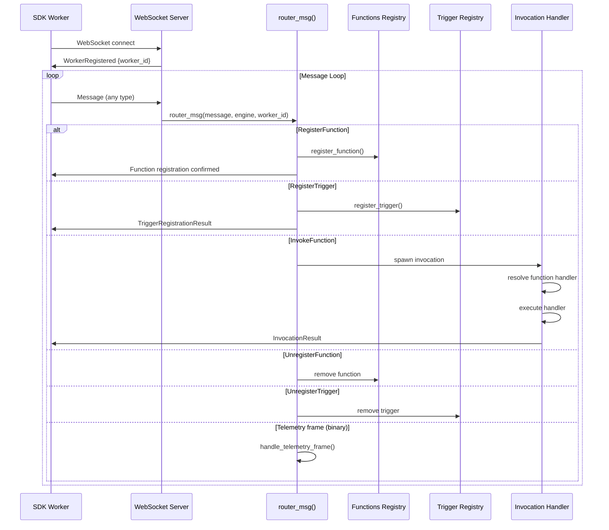
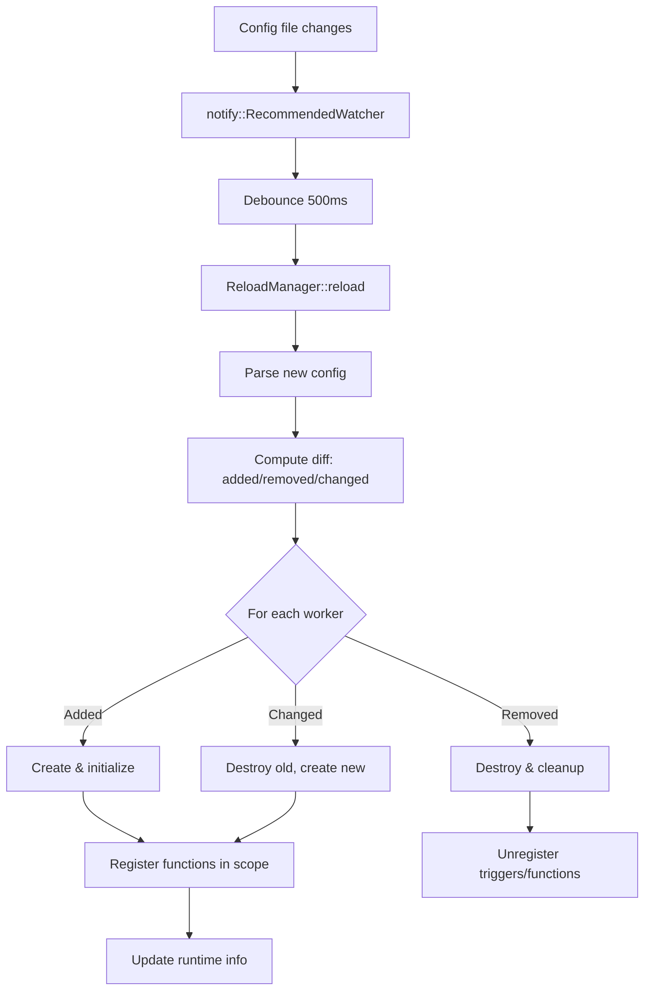

# Engine Core — Struct, Registries, Message Routing, and Lifecycle

**The Engine struct is the central coordinator for all iii activity.** It holds references to every registry, routes WebSocket messages to the correct handler, and manages the lifecycle of both in-process and external workers. This document walks through the Engine struct, its construction via EngineBuilder, message routing logic, and lifecycle management.

## The Engine Struct

Source: `engine/src/engine/mod.rs:228-255`

```rust
#[derive(Clone)]
pub struct Engine {
    pub worker_registry: Arc<WorkerConnectionRegistry>,
    pub runtime_workers: Arc<DashMap<String, RuntimeWorkerInfo>>,
    pub functions: Arc<FunctionsRegistry>,
    pub trigger_registry: Arc<TriggerRegistry>,
    pub service_registry: Arc<ServicesRegistry>,
    pub invocations: Arc<InvocationHandler>,
    pub channel_manager: Arc<ChannelManager>,
    pub queue_module: Arc<tokio::sync::RwLock<Option<Arc<dyn QueueEnqueuer>>>>,
    pub(crate) function_owners: Arc<DashMap<String, Uuid>>,
    pub(crate) external_function_owners: Arc<DashMap<String, Uuid>>,
    pub(crate) active_scope: Arc<std::sync::Mutex<Option<ScopeBuilder>>>,
    worker_manager_port: Arc<std::sync::OnceLock<u16>>,
}
```

Every field has a specific role:

| Field | Type | Purpose |
|-------|------|---------|
| `worker_registry` | `Arc<WorkerConnectionRegistry>` | Maps WebSocket connection IDs to active worker sessions |
| `runtime_workers` | `Arc<DashMap<String, RuntimeWorkerInfo>>` | Tracks in-process workers by name with metadata |
| `functions` | `Arc<FunctionsRegistry>` | All registered functions keyed by function ID |
| `trigger_registry` | `Arc<TriggerRegistry>` | Active trigger instances (event → function bindings) |
| `service_registry` | `Arc<ServicesRegistry>` | Named services that workers can look up at runtime |
| `invocations` | `Arc<InvocationHandler>` | Active function invocations with oneshot response channels |
| `channel_manager` | `Arc<ChannelManager>` | WebSocket data channels for streaming (real-time updates) |
| `queue_module` | `Arc<RwLock<Option<Arc<dyn QueueEnqueuer>>>>` | Pluggable queue backend (in-memory, Redis, RabbitMQ) |
| `function_owners` | `Arc<DashMap<String, Uuid>>` | Maps function ID to owning worker's connection UUID |
| `external_function_owners` | `Arc<DashMap<String, Uuid>>` | Maps HTTP-invocable function ID to owning worker |
| `active_scope` | `Arc<Mutex<Option<ScopeBuilder>>>` | Tracks which functions/triggers belong to which worker (for hot reload) |
| `worker_manager_port` | `Arc<OnceLock<u16>>` | Resolved iii-worker-manager port for external worker spawning |

**Aha:** The `function_owners` map solves a subtle race condition. When a worker restarts quickly, the new worker might register its functions before the old worker's cleanup completes. Without ownership tracking, the cleanup would remove the new worker's registrations. The engine checks `function_owners` during cleanup: if the current owner is a different, still-live worker, the registration is preserved.

## EngineBuilder: Construction Pattern

Source: `workers/config.rs:534-631`

The Engine is built through a builder pattern:

```rust
pub struct EngineBuilder {
    config: Option<EngineConfig>,
    config_path: Option<String>,
    engine: Arc<Engine>,
    registry: Arc<WorkerRegistry>,
    running: Vec<RunningWorker>,
}
```

The `build()` method performs these steps:

1. **Load configuration** — Parse YAML, expand environment variables
2. **Inject built-in daemons** — Auto-inject `iii-worker-ops` daemon
3. **Resolve duplicate names** — Assign instance IDs to workers with duplicate names
4. **Resolve worker manager port** — Set `worker_manager_port` OnceLock
5. **Begin worker scopes** — For each worker, create a `ScopeBuilder`
6. **Create workers** — Call `Worker::create()` for each in-process worker
7. **Initialize workers** — Call `Worker::initialize()` on each
8. **Register functions** — Call `Worker::register_functions()` for each
9. **Start background tasks** — Launch worker background loops
10. **Set queue module** — Wire up the queue adapter

Source: `workers/config.rs:631`
```rust
pub async fn build(mut self) -> anyhow::Result<Self> {
    // 1. Load config
    let config = self.config.take().ok_or_else(|| anyhow!("no config"))?;

    // 2. Inject built-in daemons
    config.inject_builtin_daemons(&mut workers)?;

    // 3-9. Per-worker initialization
    for worker_def in &workers {
        let scope = ScopeBuilder::new(&worker_def.name);
        // ... create, initialize, register, start
    }

    Ok(self)
}
```

## Message Routing: The WebSocket Handler

Source: `engine/src/engine/mod.rs` — `handle_worker_connection` function

When a WebSocket client connects, the engine:

1. **Authenticates** the connection (RBAC session, API key)
2. **Sends WorkerRegistered** with the assigned worker ID
3. **Enters the message loop** — reads messages and dispatches via `router_msg()`



## Telemetry Frame Handling

Source: `engine/src/engine/mod.rs:79-123`

The engine handles binary WebSocket frames prefixed with magic identifiers:

```rust
const OTLP_WS_PREFIX: &[u8] = b"OTLP";
const MTRC_WS_PREFIX: &[u8] = b"MTRC";
const LOGS_WS_PREFIX: &[u8] = b"LOGS";

async fn handle_telemetry_frame(bytes: &[u8], peer: &SocketAddr) -> bool {
    if bytes.starts_with(OTLP_WS_PREFIX) {
        let payload = &bytes[OTLP_WS_PREFIX.len()..];
        ingest_otlp_json(json_str).await
    } else if bytes.starts_with(MTRC_WS_PREFIX) {
        ingest_otlp_metrics(json_str).await
    } else if bytes.starts_with(LOGS_WS_PREFIX) {
        ingest_otlp_logs(json_str).await
    } else {
        return false; // Unknown frame, let message handler process it
    }
}
```

**Aha:** Binary telemetry frames bypass the JSON message parser entirely. This prevents telemetry-only connections from appearing in the worker registry and inflating metrics. A separate `/otel` WebSocket endpoint exists for SDKs that want to send telemetry without registering as workers.

## Function Ownership and Fast-Restart Race

Source: `engine/src/engine/mod.rs:238-247`

When a worker registers a function, the engine records ownership:

```rust
// In the RegisterFunction handler:
self.function_owners.insert(function_id.clone(), worker.id);
self.functions.register_function(function_id, function);
```

When a worker disconnects, the cleanup checks ownership:

```rust
// In cleanup_worker():
for (function_id, owner_id) in self.function_owners.iter() {
    if *owner_id == disconnected_worker_id {
        // Check if another live worker has claimed this function
        if let Some(current_owner) = self.worker_registry.get_owner(function_id) {
            if current_owner != disconnected_worker_id {
                continue; // Skip — a new worker owns this function now
            }
        }
        self.functions.remove(function_id);
    }
}
```

This prevents a race where:
1. Worker A disconnects (cleanup starts)
2. Worker A reconnects and registers functions
3. Worker A's old cleanup removes the new registrations

## Scope-Based Registration Tracking

Source: `engine/src/engine/mod.rs:248` + `workers/reload.rs`

The `active_scope` field enables hot reload by tracking which registrations belong to which worker scope:

```rust
pub(crate) active_scope: Arc<std::sync::Mutex<Option<ScopeBuilder>>>
```

When `EngineBuilder` initializes a worker:

1. Creates a `ScopeBuilder` with the worker's name
2. Sets it as `active_scope`
3. All function/trigger registrations during this period are recorded in the scope
4. Clears `active_scope` when the worker is done

On config reload, the engine compares the new scope with the old scope to compute a diff:



## Engine Trait Abstraction

Source: `engine/src/engine/mod.rs:200-226`

The `EngineTrait` provides an abstraction layer for testing and mocking:

```rust
#[allow(async_fn_in_trait)]
pub trait EngineTrait: Send + Sync {
    async fn call(&self, function_id: &str, input: impl Serialize + Send)
        -> Result<Option<Value>, ErrorBody>;
    async fn register_trigger_type(&self, trigger_type: TriggerType);
    fn register_function(&self, request: RegisterFunctionRequest,
        handler: Box<dyn FunctionHandler + Send + Sync>);
    fn register_function_handler<H, F>(&self, request: RegisterFunctionRequest,
        handler: Handler<H>) where H: HandlerFn<F>;
    fn register_function_handler_with_session<H, F>(&self,
        request: RegisterFunctionRequest, handler: SessionHandler<H>) where H: SessionHandlerFn<F>;
}
```

**Aha:** The trait uses marker traits (`HandlerFn`, `SessionHandlerFn`) to enforce type constraints on handlers. `HandlerFn` requires `Fn(Value) -> Future<Output = HandlerOutput>`, while `SessionHandlerFn` adds an `Option<Arc<Session>>` parameter for RBAC-aware handlers.

## CLI Entry Points

Source: `engine/src/main.rs`

The `iii` binary has multiple subcommands:

| Command | Purpose |
|---------|---------|
| `iii` (no args) | Start the engine (calls `run_serve`) |
| `iii trigger` | Fire a trigger manually |
| `iii console` | Launch the developer console |
| `iii cloud` | Dispatch to cloud CLI |
| `iii worker` | Worker management |
| `iii project` | Project management |
| `iii update` | Self-update the engine |

Source: `engine/src/main.rs:226` — `run_serve`:
```rust
async fn run_serve(cli: &Cli) -> anyhow::Result<()> {
    let config = if cli.use_default_config {
        EngineConfig::default_config()
    } else {
        EngineConfig::config_file(&cli.config)?
    };

    let mut builder = EngineBuilder::new().with_config(config);
    let engine = builder.build().await?;
    engine.serve().await?;
    Ok(())
}
```

## What's Next

- [03 — Protocol & WebSocket](03-protocol-websocket.md) — Message types, binary frames, connection lifecycle
- [04 — Workers System](04-workers-system.md) — Worker trait, hot reload, RBAC, adapter pattern
- [05 — Functions & Triggers](05-functions-triggers.md) — Function registry, trigger types, schema validation
