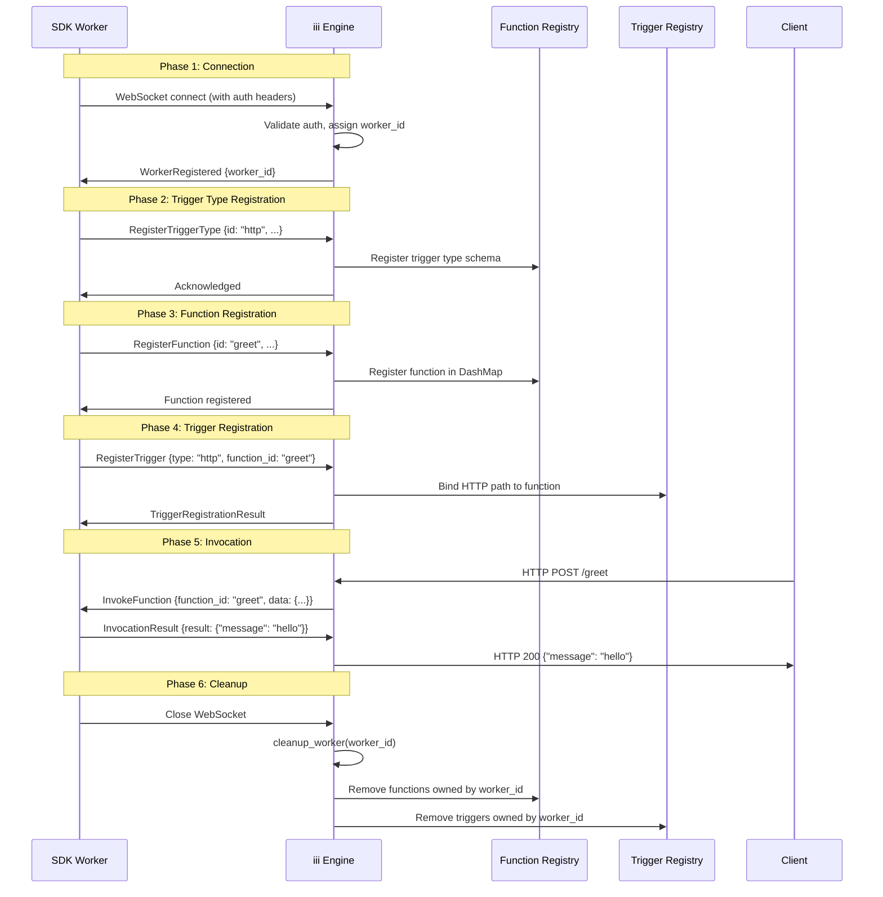
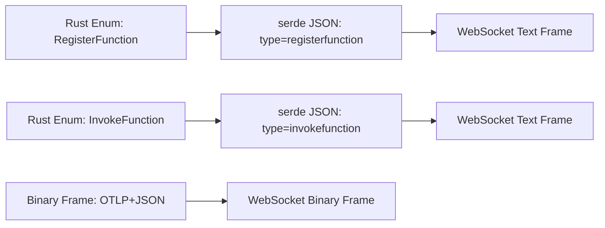

# Protocol & WebSocket — Message Types, Binary Frames, Connection Lifecycle

**iii's entire communication layer uses a single WebSocket protocol with typed JSON messages and binary telemetry frames.** This document covers every message type, the binary frame format, connection lifecycle, and how the engine routes messages.

## Protocol Overview

Source: `engine/src/protocol.rs`

The protocol uses serde's tagged enum serialization. Every message has a `type` field that determines its variant:

```rust
#[derive(Debug, Clone, Serialize, Deserialize)]
#[serde(tag = "type", rename_all = "lowercase")]
pub enum Message {
    RegisterTriggerType { ... },
    RegisterTrigger { ... },
    TriggerRegistrationResult { ... },
    UnregisterTrigger { ... },
    RegisterFunction { ... },
    UnregisterFunction { ... },
    InvokeFunction { ... },
    InvocationResult { ... },
    // ... more variants
}
```

When serialized, a `RegisterFunction` message looks like:
```json
{
  "type": "registerfunction",
  "id": "greet",
  "description": "Greet a user",
  "request_format": {"type": "object", "properties": {"name": {"type": "string"}}},
  "response_format": {"type": "object", "properties": {"message": {"type": "string"}}}
}
```

**Aha:** The `rename_all = "lowercase"` tag means `RegisterTriggerType` serializes to `registtriggertype` — no separators. This is a deliberate choice for compact wire format. The engine's router matches on the deserialized enum variant, not the string tag.

## Complete Message Type Reference

### Registration Messages

| Message Type | Direction | Purpose |
|-------------|-----------|---------|
| `RegisterTriggerType` | Worker → Engine | Register a new trigger type (e.g., "http", "cron") |
| `RegisterTrigger` | Worker → Engine | Bind a trigger instance to a function |
| `TriggerRegistrationResult` | Engine → Worker | Confirm trigger registration success/failure |
| `RegisterFunction` | Worker → Engine | Register a function with optional JSON Schema |
| `UnregisterFunction` | Worker → Engine | Remove a function registration |
| `UnregisterTrigger` | Worker → Engine | Remove a trigger instance |

### Invocation Messages

| Message Type | Direction | Purpose |
|-------------|-----------|---------|
| `InvokeFunction` | Any → Engine | Invoke a function by ID with JSON payload |
| `InvocationResult` | Engine → Caller | Return function result or error |

### Control Messages

| Message Type | Direction | Purpose |
|-------------|-----------|---------|
| `WorkerRegistered` | Engine → Worker | Assign worker ID after connection |
| `ChannelCreated` | Engine → Worker | Confirm data channel creation |
| `ChannelData` | Engine ↔ Worker | Stream data through a channel |
| `ChannelClosed` | Engine → Worker | Signal channel termination |
| `TriggerEvent` | Engine → Worker | Notify worker of trigger event |
| `RegisterTriggerTypeError` | Engine → Worker | Error registering trigger type |

### Invocation Detail

Source: `engine/src/protocol.rs:85-97`

```rust
InvokeFunction {
    invocation_id: Option<Uuid>,
    function_id: String,
    data: Value,
    /// W3C trace-context traceparent header for distributed tracing
    traceparent: Option<String>,
    /// W3C baggage header for cross-cutting context propagation
    baggage: Option<String>,
    action: Option<TriggerAction>,
}
```

The `TriggerAction` field controls invocation behavior:

```rust
#[derive(Debug, Clone, Serialize, Deserialize)]
#[serde(tag = "type", rename_all = "lowercase")]
pub enum TriggerAction {
    Enqueue { queue: String },  // Queue instead of immediate execution
    Void,                        // Fire-and-forget (no result expected)
}
```

### InvocationResult Detail

```rust
InvocationResult {
    invocation_id: Uuid,
    function_id: String,
    result: Option<Value>,
    error: Option<ErrorBody>,
    deferred: bool,
}
```

## Binary Telemetry Frames

Source: `engine/src/engine/mod.rs:72-123`

The engine supports three binary frame types for OpenTelemetry data:

```
┌──────────────────────────────────────────────┐
│ 4-byte prefix │ JSON payload                 │
├──────────────────────────────────────────────┤
│ OTLP          │ OpenTelemetry trace spans     │
│ MTRC          │ OpenTelemetry metrics         │
│ LOGS          │ OpenTelemetry logs            │
└──────────────────────────────────────────────┘
```

Each prefix is followed by a JSON-encoded payload that gets ingested into the engine's telemetry pipeline:

```rust
async fn handle_telemetry_frame(bytes: &[u8], peer: &SocketAddr) -> bool {
    if bytes.starts_with(OTLP_WS_PREFIX) {
        let payload = &bytes[OTLP_WS_PREFIX.len()..];
        match std::str::from_utf8(payload) {
            Ok(json_str) => ingest_otlp_json(json_str).await,
            Err(err) => { /* warn and return */ }
        }
    }
    // ... MTRC, LOGS handling ...
}
```

**Aha:** Binary frames are processed BEFORE the JSON message parser. This means telemetry data never goes through message routing — it's ingested directly. This design prevents telemetry-only connections from polluting the worker registry.

## Connection Lifecycle



## HTTP Invocation via WebSocket

External HTTP functions use the `HttpInvocationRef` type:

Source: `engine/src/protocol.rs:16-27`

```rust
pub struct HttpInvocationRef {
    pub url: String,
    pub method: HttpMethod,
    pub timeout_ms: Option<u64>,
    pub headers: HashMap<String, String>,
    pub auth: Option<HttpAuthConfig>,
}
```

## Message Serialization Format

The protocol uses serde's tagged enum serialization:



When a function is registered with an `invocation` field, the engine routes invocations to the external HTTP endpoint instead of the WebSocket connection:

```json
{
  "type": "registerfunction",
  "id": "external::process",
  "invocation": {
    "url": "http://localhost:8080/process",
    "method": "post",
    "headers": {"X-API-Key": "..."},
    "auth": {"type": "bearer", "token_env": "EXTERNAL_API_KEY"}
  }
}
```

## Distributed Tracing Support

The protocol natively supports W3C Trace Context:

| Field | Format | Purpose |
|-------|--------|---------|
| `traceparent` | `00-traceId-spanId-flags` | W3C Trace Context header |
| `baggage` | `key=value,key=value` | W3C Baggage header |

When an invocation includes `traceparent`, the engine:

1. Parses the trace context
2. Creates a child span in the current trace
3. Propagates the context to the invoked function
4. Records the span in OpenTelemetry

Source: `engine/src/invocation/mod.rs` — span creation
```rust
let span = tracing::info_span!(
    "call",
    otel.name = %format!("call {}", function_id),
    otel.kind = "server",
    "faas.invoked_name" = %function_id,
    "faas.trigger" = "other",
    "iii.function.kind" = %function_kind,
);
```

## RBAC Session Integration

Workers can connect with an RBAC session that controls access:

```rust
// Worker connection includes optional session
struct WorkerConnection {
    pub id: Uuid,
    pub ws_tx: mpsc::Sender<Outbound>,
    pub session: Option<Session>,
    // ...
}
```

The `Session` struct (`workers/worker/rbac_session.rs`) includes:

| Field | Purpose |
|-------|---------|
| `function_registration_prefix` | Auto-prefix all function IDs (e.g., `tenant_a::greet`) |
| `allowed_functions` | Allowlist of functions this worker can invoke |
| `forbidden_functions` | Blocklist of functions this worker cannot invoke |
| `allowed_trigger_types` | Allowed trigger types for registration |

**Aha:** The `function_registration_prefix` enables multi-tenancy without code changes. Worker A registers `greet` but it becomes `tenant_a::greet` in the global registry. Worker B (tenant_b) can only invoke `tenant_b::*` functions.

## What's Next

- [04 — Workers System](04-workers-system.md) — Worker trait, hot reload, RBAC, adapter pattern
- [05 — Functions & Triggers](05-functions-triggers.md) — Function registry, trigger types, schema validation
- [06 — Observability](06-observability.md) — OTEL integration, metrics, traces, logs
