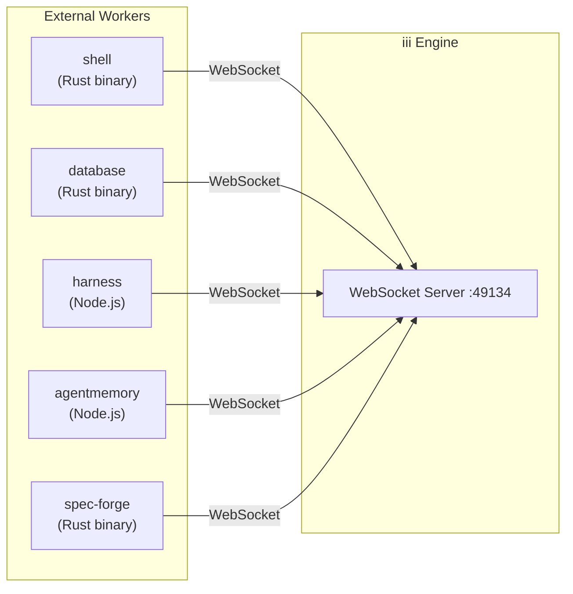
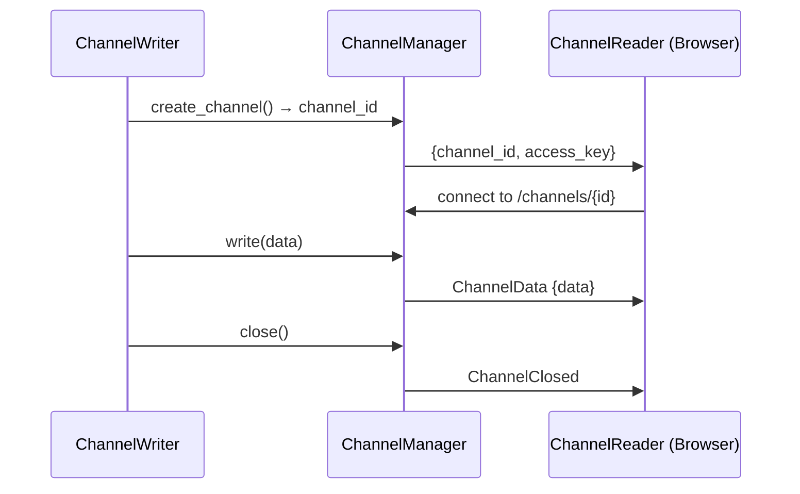

# Workers System — Trait, In-Process vs External, Hot Reload, RBAC, Adapters

**Every capability in iii is a worker.** In-process workers are compiled into the engine binary and communicate via direct function calls. External workers connect over WebSocket and use the same message protocol as SDK clients. This document covers the Worker trait, the hot reload system, RBAC sessions, and the adapter pattern for pluggable backends.

## The Worker Trait

Source: `engine/src/workers/traits.rs:46-90`

All workers implement the `Worker` trait:

```rust
#[async_trait::async_trait]
pub trait Worker: Send + Sync {
    fn name(&self) -> &'static str;

    async fn create(engine: Arc<Engine>, config: Option<Value>)
        -> anyhow::Result<Box<dyn Worker>> where Self: Sized;

    fn make_worker(engine: Arc<Engine>, config: Option<Value>) -> WorkerFuture
        where Self: Sized + 'static { Self::create(engine, config) }

    async fn initialize(&self) -> anyhow::Result<()>;

    async fn start_background_tasks(
        &self,
        _shutdown_rx: tokio::sync::watch::Receiver<bool>,
        _shutdown_tx: tokio::sync::watch::Sender<bool>,
    ) -> anyhow::Result<()> { Ok(()) }

    async fn destroy(&self) -> anyhow::Result<()> { Ok(()) }

    async fn is_alive(&self) -> bool { true }

    fn is_external_process(&self) -> bool { false }

    fn register_functions(&self, engine: Arc<Engine>);
}
```

The lifecycle is:

```mermaid
stateDiagram-v2
    [*] --> Create: Worker::create()
    Create --> Initialize: Worker::initialize()
    Initialize --> RegisterFuncs: register_functions()
    RegisterFuncs --> StartBg: start_background_tasks()
    StartBg --> Running: Worker is active

    Running --> Destroy: Engine shutdown or config reload
    Destroy --> [*]

    Running --> CheckAlive: is_alive()
    CheckAlive --> Running: alive = true
    CheckAlive --> Destroy: alive = false
```

### Method Responsibilities

| Method | When Called | Purpose |
|--------|-------------|---------|
| `create()` | EngineBuilder.build() | Construct the worker with engine reference and config |
| `initialize()` | After create() | Set up internal state, create connection pools, etc. |
| `register_functions()` | After initialize() | Register the worker's functions with the engine |
| `start_background_tasks()` | After register_functions() | Start background loops (cron schedules, queue consumers, etc.) |
| `is_alive()` | Periodically + on reload | Report whether the worker's backing process/state is healthy |
| `destroy()` | Config reload or shutdown | Clean up resources, close connections |

## In-Process vs External Workers

### In-Process Workers

In-process workers are compiled into the engine binary. They communicate via direct function calls with zero serialization overhead:

```rust
// EngineBuilder creates in-process workers directly
let worker = T::make_worker(engine.clone(), config).await?;
worker.initialize().await?;
worker.register_functions(engine.clone());
```

Built-in in-process workers:

| Worker | Source Location | Lines | Purpose |
|--------|----------------|-------|---------|
| `iii-queue` | `workers/queue/` | 2,557 | Durable topic-based queue |
| `iii-cron` | `workers/cron/` | — | Scheduled execution |
| `iii-http` | `workers/http_functions/` | — | HTTP endpoint routing |
| `iii-state` | `workers/state/` | 1,354 | KV state store |
| `iii-stream` | `workers/stream/` | 2,076 | WebSocket streaming channels |
| `iii-pubsub` | `workers/pubsub/` | — | Pub/sub messaging |
| `iii-observability` | `workers/observability/` | 6,101 | OpenTelemetry integration |
| `iii-worker-manager` | `workers/worker/` | — | External worker spawning |

### External Workers

External workers are separate processes that connect over WebSocket. They use the same protocol as SDK clients:



External workers are spawned by the `iii-worker-manager`:

Source: `workers/registry_worker.rs` — `ExternalWorkerProcess::spawn`
```rust
pub struct ExternalWorkerProcess {
    pub name: String,
    pub process: Option<Child>,
    // ...
}
```

The manager:
1. Downloads worker binary from the registry (or uses local path)
2. Spawns the process with `--url ws://localhost:PORT`
3. Waits for WebSocket connection and `WorkerRegistered` response
4. Monitors process health and restarts on failure

## ConfigurableWorker and Adapter Pattern

Source: `engine/src/workers/traits.rs:109`

The `ConfigurableWorker` trait extends `Worker` with adapter-based configuration:

```rust
#[async_trait::async_trait]
pub trait ConfigurableWorker: Worker {
    async fn register_with_adapter(
        &self,
        engine: Arc<Engine>,
        registration: AdapterRegistrationEntry,
    ) -> anyhow::Result<()>;
}
```

This allows workers to use pluggable backends:

```yaml
# Using Redis adapter for state
workers:
  - name: iii-state
    config:
      adapter:
        name: redis
        config:
          url: redis://localhost:6379

# Using in-memory adapter (default)
workers:
  - name: iii-state
    config:
      adapter:
        name: memory
```

The queue worker supports three adapters:

| Adapter | Source | Purpose |
|---------|--------|---------|
| `builtin` | `workers/queue/adapters/builtin/` | In-memory queue (default) |
| `redis` | `workers/queue/adapters/redis/` | Redis-based durable queue |
| `rabbitmq` | `workers/queue/adapters/rabbitmq/` | RabbitMQ integration |

**Aha:** The adapter pattern means the engine's queue API is identical regardless of backend. A worker publishes to a topic without knowing whether it's backed by in-memory storage, Redis, or RabbitMQ. The adapter handles the translation.

## Hot Reload System

Source: `workers/reload.rs`

The engine watches its config file for changes and hot-reloads without downtime:

```rust
pub struct ReloadManager {
    config_path: PathBuf,
    engine: Arc<Engine>,
    watcher: Option<notify::RecommendedWatcher>,
}
```

The reload flow:

1. **Watch** — `notify::RecommendedWatcher` detects config file changes
2. **Debounce** — Wait 500ms to avoid reloading during file writes
3. **Parse** — Load and validate the new configuration
4. **Diff** — Compare new config with current state:
   - `added` — New workers not currently running
   - `removed` — Currently running workers no longer in config
   - `changed` — Workers with modified configuration
5. **Apply** — Execute changes:
   - Added workers: create → initialize → register → start
   - Removed workers: stop background tasks → destroy → cleanup registrations
   - Changed workers: destroy old → create new (atomic swap)

### Scope-Based Registration Tracking

Source: `engine/src/engine/mod.rs:248`

During reload, the engine uses `ScopeBuilder` to track which registrations belong to which worker:

```rust
pub struct ScopeBuilder {
    pub worker_name: String,
    pub function_ids: Vec<String>,
    pub trigger_ids: Vec<String>,
}
```

When a worker registers functions during its scope, the IDs are appended to `function_ids`. On removal, the engine removes exactly those IDs.

## RBAC Session System

Source: `workers/worker/rbac_session.rs`

Workers can connect with an RBAC session that controls access:

```rust
pub struct Session {
    pub function_registration_prefix: Option<String>,
    pub allowed_functions: Option<Vec<String>>,
    pub forbidden_functions: Option<Vec<String>>,
    pub allowed_trigger_types: Option<Vec<String>>,
    // ...
}
```

### Function Registration Prefix

When a session has a `function_registration_prefix`, all function IDs are auto-prefixed:

Source: `engine/src/engine/mod.rs:257-267`
```rust
fn resolve_registration_id(worker: &WorkerConnection, id: &str) -> String {
    if let Some(prefix) = worker
        .session
        .as_ref()
        .and_then(|s| s.function_registration_prefix.as_ref())
    {
        format!("{prefix}::{id}")
    } else {
        id.to_string()
    }
}
```

This enables multi-tenancy: Worker A (prefix `tenant_a`) registers `greet` → it becomes `tenant_a::greet` in the global registry.

### Function Access Control

The session's `allowed_functions` and `forbidden_functions` control which functions a worker can invoke:

```yaml
# RBAC session configuration
session:
  allowed_functions:
    - "state::*"
    - "greet"
  forbidden_functions:
    - "shell::exec"
    - "database::execute"
```

**Aha:** The RBAC system operates at the WebSocket connection level, not the function level. This means a single compromised worker connection cannot access functions outside its session scope, regardless of what it tries to invoke.

## Channel Manager for Streaming

Source: `workers/worker/channels.rs`

The `ChannelManager` handles WebSocket-based data channels for real-time streaming:

```rust
pub struct ChannelManager {
    channels: Arc<DashMap<Uuid, Channel>>,
}
```

Channels are used by:
- **iii-stream** worker for real-time data updates
- **spec-forge** for JSONL patch streaming
- **agentmemory** for live observation streams

A channel flow:



## Worker Manifest (`iii.worker.yaml`)

External workers define their metadata in `iii.worker.yaml`:

```yaml
iii: v1
name: shell
language: rust
deploy: binary
manifest: Cargo.toml
bin: iii-shell
description: "Unix shell execution with filesystem operations"

targets:
  - x86_64-unknown-linux-gnu
  - aarch64-apple-darwin

runtime:
  kind: rust

env:
  III_URL: "ws://localhost:49134"
```

## What's Next

- [05 — Functions & Triggers](05-functions-triggers.md) — Function registry, trigger types, schema validation
- [06 — Observability](06-observability.md) — OTEL integration, metrics, traces, logs
- [08 — Ecosystem Workers](08-ecosystem-workers.md) — 17+ workers deep dive
