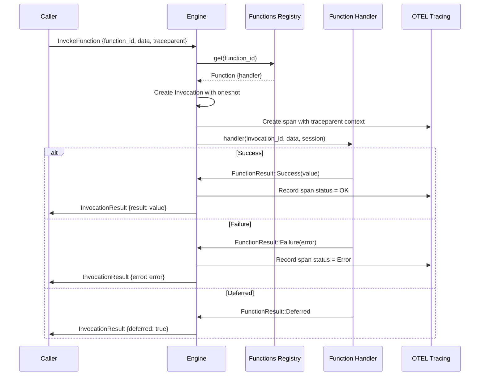

# Functions & Triggers — Registry, Trigger Types, Schema Validation, Invocation Flow

**Functions are the units of work in iii, and triggers are what makes them run.** This document covers the function registry with its handler system, all built-in trigger types with their schemas, the invocation flow with OTEL tracing, and the four `FunctionResult` variants.

## Function Registry

Source: `engine/src/function.rs`

The `FunctionsRegistry` stores functions in a `DashMap` for concurrent access:

```rust
#[derive(Default)]
pub struct FunctionsRegistry {
    pub functions: Arc<DashMap<String, Function>>,
    pub(crate) active_scope: Arc<std::sync::Mutex<Option<ScopeBuilder>>>,
}
```

### The Function Struct

```rust
#[derive(Clone)]
pub struct Function {
    pub handler: Arc<HandlerFn>,
    pub _function_id: String,
    pub _description: Option<String>,
    pub request_format: Option<Value>,
    pub response_format: Option<Value>,
    pub metadata: Option<Value>,
}
```

### Handler Type

```rust
pub type HandlerFn =
    dyn Fn(Option<Uuid>, Value, Option<Arc<Session>>) -> HandlerFuture + Send + Sync;

pub enum FunctionResult<T, E> {
    Success(T),
    Failure(E),
    Deferred,
    NoResult,
}
```

**Aha:** The four `FunctionResult` variants enable different execution patterns:

| Variant | Use Case | Behavior |
|---------|----------|----------|
| `Success(T)` | Synchronous function | Return value immediately |
| `Failure(E)` | Error occurred | Return error to caller |
| `Deferred` | Async/queued processing | Function returns immediately; result comes later via a separate mechanism |
| `NoResult` | Side-effect only | No return value needed (e.g., logging, metrics) |

The `Deferred` variant is critical for the queue system. When a function publishes to a queue, it returns `Deferred` immediately. The actual result is delivered later when the queued invocation completes.

### Registration with Scope Tracking

Source: `engine/src/function.rs:99-118`

```rust
pub fn register_function(&self, function_id: String, function: Function) {
    tracing::info!("[REGISTERED] Function {}", function_id);
    if self.functions.contains_key(&function_id) {
        tracing::warn!("Function {} is already registered. Overwriting.", function_id);
    }
    self.functions.insert(function_id.clone(), function);

    // Track in active scope for hot reload
    if let Ok(mut scope) = self.active_scope.lock()
        && let Some(builder) = scope.as_mut()
    {
        builder.function_ids.push(function_id);
    }
}
```

### Function Removal

```rust
pub fn remove(&self, function_id: &str) {
    self.functions.remove(function_id);
    if let Ok(mut scope) = self.active_scope.lock()
        && let Some(builder) = scope.as_mut()
    {
        builder.function_ids.retain(|id| id != function_id);
    }
}
```

## Trigger System

Source: `engine/src/trigger.rs`

### Built-in Trigger Types

Source: `engine/src/trigger.rs:16-27`

```rust
pub const BUILTIN_TRIGGER_TYPES: &[(&str, &str)] = &[
    ("http", "iii-http"),
    ("cron", "iii-cron"),
    ("durable:subscriber", "iii-queue"),
    ("subscribe", "iii-pubsub"),
    ("state", "iii-state"),
    ("stream", "iii-stream"),
    ("stream:join", "iii-stream"),
    ("stream:leave", "iii-stream"),
    ("log", "iii-observability"),
    ("configuration", "configuration"),
];
```

| Trigger Type | Owning Worker | Purpose |
|-------------|---------------|---------|
| `http` | `iii-http` | HTTP endpoint triggers |
| `cron` | `iii-cron` | Scheduled execution |
| `durable:subscriber` | `iii-queue` | Queue topic subscription |
| `subscribe` | `iii-pubsub` | Pub/sub subscription |
| `state` | `iii-state` | State change triggers |
| `stream` | `iii-stream` | Stream data triggers |
| `stream:join` | `iii-stream` | Peer joins stream |
| `stream:leave` | `iii-stream` | Peer leaves stream |
| `log` | `iii-observability` | Log event triggers |
| `configuration` | `configuration` | Config change triggers |

### The TriggerType Struct

```rust
pub struct TriggerType {
    pub id: String,
    pub _description: String,
    pub trigger_request_format: Option<Value>,
    pub call_request_format: Option<Value>,
    pub registrator: Box<dyn TriggerRegistrator>,
    pub worker_id: Option<Uuid>,
}
```

**Aha:** Trigger types use JSON Schema for request validation. The schema is generated from Rust types using `schemars` at compile time:

```rust
pub fn with_trigger_request_format<T: schemars::JsonSchema>(mut self) -> Self {
    self.trigger_request_format = Self::schema_for::<T>();
    self
}

fn schema_for<T: schemars::JsonSchema>() -> Option<Value> {
    serde_json::to_value(schemars::schema_for!(T)).ok()
}
```

This ensures type safety across the engine-SDK boundary — a worker cannot register an invalid trigger config because the engine validates against the schema.

### Trigger Registry

```rust
pub struct TriggerRegistry {
    pub(crate) trigger_types: DashMap<String, TriggerType>,
    pub(crate) triggers: DashMap<String, Trigger>,
}
```

The `Trigger` struct binds a trigger instance to a function:

```rust
pub struct Trigger {
    pub id: String,
    pub trigger_type: String,
    pub function_id: String,
    pub config: Value,
    pub metadata: Option<Value>,
}
```

### Trigger Registration Error Handling

Source: `engine/src/trigger.rs:43-57`

```rust
pub enum RegisterTriggerError {
    #[error("Trigger type \"{trigger_type}\" not found — worker {worker} is missing. Run: iii worker add {worker}")]
    UnknownBuiltin { trigger_type: String, worker: &'static str },

    #[error("Trigger type \"{trigger_type}\" not found. Search for a worker that provides this trigger type at https://workers.iii.dev/")]
    Unknown { trigger_type: String },

    #[error(transparent)]
    Other(#[from] anyhow::Error),
}
```

**Aha:** The error messages are actionable — they tell the user exactly which worker to install (`iii worker add {worker}`). This is a deliberate UX choice: error messages as documentation.

## Invocation Flow

Source: `engine/src/invocation/mod.rs`

The `InvocationHandler` manages active invocations:

```rust
pub struct InvocationHandler {
    invocations: Invocations,  // DashMap<Uuid, Invocation>
}

pub struct Invocation {
    pub id: Uuid,
    pub function_id: String,
    pub worker_id: Option<Uuid>,
    pub sender: oneshot::Sender<Result<Option<Value>, ErrorBody>>,
    pub traceparent: Option<String>,
    pub baggage: Option<String>,
}
```

### Invocation Steps

1. **Receive InvokeFunction message** — from any source (WebSocket, HTTP, internal)
2. **Resolve function** — Look up in `FunctionsRegistry`
3. **Create invocation** — Generate UUID, create oneshot channel
4. **Create OTEL span** — With traceparent/baggage context
5. **Execute handler** — Call the function handler
6. **Return result** — Send through oneshot channel or forward to external worker



### HTTP Function Invocation

For external HTTP functions, the invocation handler makes an HTTP request:

Source: `engine/src/invocation/http_function/`

```rust
pub struct HttpFunctionConfig {
    pub url: String,
    pub method: HttpMethod,
    pub timeout_ms: Option<u64>,
    pub headers: HashMap<String, String>,
    pub auth: Option<HttpAuthConfig>,
}
```

The handler:
1. Constructs the HTTP request with the function payload
2. Applies authentication (bearer token, basic auth, API key from env)
3. Sends the request with timeout
4. Parses the response and returns as `InvocationResult`

## Function Queues

Functions can be associated with named queues for durable processing:

```rust
// From the QueueEnqueuer trait (engine/mod.rs:47-69)
pub trait QueueEnqueuer: Send + Sync {
    async fn enqueue_to_function_queue(
        &self,
        queue_name: &str,
        function_id: &str,
        data: serde_json::Value,
        message_id: String,
        traceparent: Option<String>,
        baggage: Option<String>,
    ) -> anyhow::Result<()>;
}
```

When an `InvokeFunction` message has `action: TriggerAction::Enqueue { queue }`, the invocation is enqueued instead of executed immediately:

```rust
InvokeFunction {
    function_id: "process::order",
    data: {"order_id": "123"},
    action: Some(TriggerAction::Enqueue { queue: "orders".into() }),
}
```

The queue worker (2,557 lines) handles:
- Topic-based subscriptions (durable:subscriber trigger)
- Retry with exponential backoff
- Dead letter queue (DLQ) for failed messages
- Concurrency control per queue

## Middleware System

Workers with RBAC sessions can register middleware functions that run before other functions:

```rust
fn register_function_handler_with_session<H, F>(
    &self,
    request: RegisterFunctionRequest,
    handler: SessionHandler<H>,
) where
    H: SessionHandlerFn<F>;
```

The `SessionHandler` receives the RBAC session and can:
- Validate the invocation against the session's allowlist
- Apply a function registration prefix
- Enforce forbidden function restrictions

## Function Ownership Flow

```mermaid
flowchart TD
    A[Worker connects] --> B[RegisterFunction msg]
    B --> C[Engine records ownership\nfunction_owners[id] = worker_id]
    C --> D[Function registered]
    
    E[Worker disconnects] --> F[cleanup_worker]
    F --> G{Check function_owners}
    G -->|Same worker| H[Remove function]
    G -->|Different live worker| I[Skip — new owner]
    
    D -.->|invocation| J[Resolve function]
    J --> K{Who owns it?}
    K -->|In-process| L[Direct handler]
    K -->|External WS| M[Forward via WebSocket]
    K -->|HTTP external| N[HTTP request]
```

## What's Next

- [06 — Observability](06-observability.md) — OTEL integration, metrics, traces, logs
- [07 — SDK Packages](07-sdk-packages.md) — Node.js, Python, Rust SDK deep dives
- [14 — Data Flow](14-data-flow.md) — End-to-end invocation, durable workflow, and streaming flows
