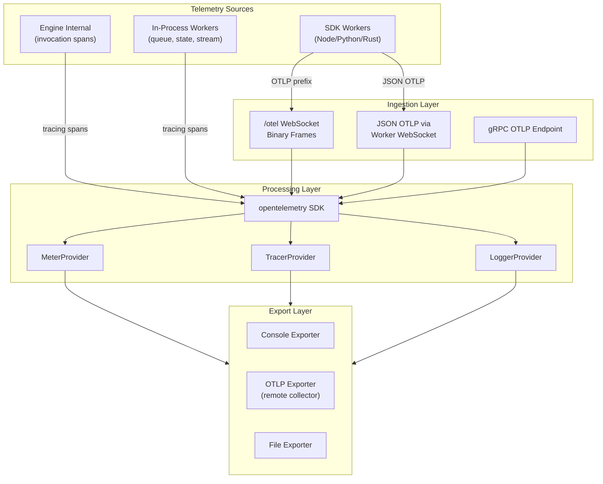
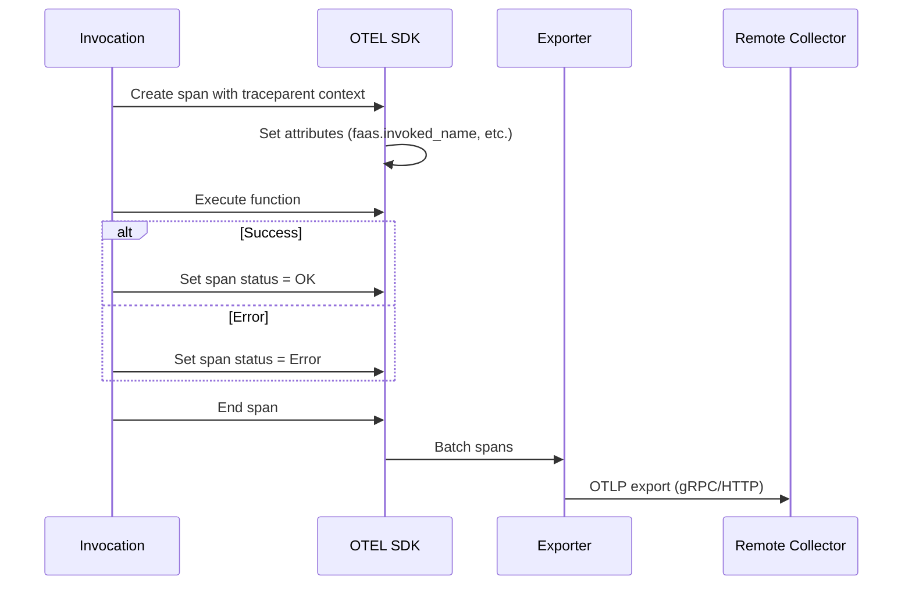

# Observability — OTEL Integration, Metrics, Traces, Logs

**iii's observability system is the largest single module in the engine (~6,101 lines for OTEL alone).** It implements full OpenTelemetry support — traces, metrics, and logs — with a dedicated `/otel` WebSocket endpoint for binary telemetry frames that bypass the worker registry entirely.

## Architecture Overview



## Binary Telemetry Endpoint

Source: `engine/src/engine/mod.rs:72-123`

The `/otel` WebSocket endpoint accepts binary frames with magic prefixes:

```rust
const OTLP_WS_PREFIX: &[u8] = b"OTLP";  // Trace spans
const MTRC_WS_PREFIX: &[u8] = b"MTRC";  // Metrics
const LOGS_WS_PREFIX: &[u8] = b"LOGS";  // Logs
```

Each frame is:
1. Checked for prefix match
2. Payload extracted (4 bytes prefix removed)
3. Parsed as UTF-8 JSON
4. Ingested via the appropriate OTEL handler

```rust
async fn handle_telemetry_frame(bytes: &[u8], peer: &SocketAddr) -> bool {
    if bytes.starts_with(OTLP_WS_PREFIX) {
        let payload = &bytes[OTLP_WS_PREFIX.len()..];
        match std::str::from_utf8(payload) {
            Ok(json_str) => ingest_otlp_json(json_str).await,
            Err(err) => {
                tracing::warn!(peer = %peer, error = ?err,
                    "OTLP payload is not valid UTF-8");
                return true;
            }
        }
    }
    // ... MTRC, LOGS handling ...
}
```

**Aha:** The `/otel` endpoint exists separately from the worker WebSocket endpoint to prevent telemetry-only connections from appearing in the worker registry. Without this separation, every SDK sending metrics would inflate the worker count, trigger worker-connect/disconnect events, and pollute observability data.

## OTEL Integration

Source: `engine/src/workers/observability/otel.rs` (6,101 lines)

The observability worker initializes the full OpenTelemetry SDK:

```rust
pub struct ObservabilityWorker {
    // Meter, Tracer, Logger providers
    // Resource configuration
    // Exporter configuration
}
```

### Trace Spans from Invocations

Every function invocation creates an OTEL span:

Source: `engine/src/invocation/mod.rs`
```rust
let span = tracing::info_span!(
    "call",
    otel.name = %format!("call {}", function_id),
    otel.kind = "server",
    "faas.invoked_name" = %function_id,
    "faas.trigger" = "other",
    "iii.function.kind" = %function_kind,  // "internal" or "user"
);
```

The span follows OpenTelemetry FAAS (Function-as-a-Service) semantic conventions:

| Attribute | Value | Purpose |
|-----------|-------|---------|
| `otel.name` | `call {function_id}` | Span name |
| `otel.kind` | `server` | Server-side span |
| `faas.invoked_name` | `{function_id}` | Invoked function name |
| `faas.trigger` | `other` | Trigger type (http, timer, pubsub, etc.) |
| `iii.function.kind` | `internal` or `user` | Whether the function is engine-internal or user-registered |

### Trace Context Propagation

The protocol natively supports W3C Trace Context:

| Field | Source | Format |
|-------|--------|--------|
| `traceparent` | SDK or HTTP headers | `00-{traceId}-{spanId}-{flags}` |
| `baggage` | SDK or HTTP headers | `key=value,key=value` |

When the engine receives a `traceparent`, it:
1. Parses the trace context
2. Creates a child span in the existing trace
3. Propagates context to the invoked function
4. Records all attributes in the span

### Metrics System

Source: `engine/src/workers/observability/mod.rs` (5,105 lines)

The metrics system tracks:

| Metric | Type | Description |
|--------|------|-------------|
| `iii.worker.count` | Gauge | Number of connected workers |
| `iii.function.invocations` | Counter | Total function invocations |
| `iii.function.errors` | Counter | Total function errors |
| `iii.function.duration` | Histogram | Invocation latency |
| `iii.queue.depth` | Gauge | Messages per queue |
| `iii.queue.retries` | Counter | Queue message retries |
| `iii.queue.dlq_depth` | Gauge | Dead letter queue size |
| `iii.trigger.count` | Counter | Trigger activations |

Metrics are exported via:
- **Console exporter** — Visible in the developer console
- **OTLP exporter** — Sent to remote collectors (Jaeger, Grafana, etc.)
- **File exporter** — Written to disk for offline analysis

### Log Ingestion

Source: `engine/src/logging.rs` (1,304 lines)

The logging system provides structured logging with:

- **Tracing subscriber** — Rust tracing ecosystem integration
- **JSON output** — Machine-parseable log format
- **Log levels** — trace, debug, info, warn, error
- **Field enrichment** — Automatic inclusion of worker_id, function_id, invocation_id

```rust
// logging.rs: Structured logging setup
tracing_subscriber::fmt()
    .with_env_filter(...)
    .with_target(false)
    .with_thread_ids(false)
    .json()  // JSON output for machine parsing
    .init();
```

## Telemetry Worker

Source: `engine/src/workers/telemetry/mod.rs` (2,649 lines)

The telemetry worker manages:

1. **Usage telemetry** — Anonymous usage data sent to Amplitude
2. **Health metrics** — Worker health checks and alive status
3. **Span volume** — Controls span export rate to prevent overload

### Usage Telemetry

Source: `engine/src/cli/telemetry.rs`

The CLI sends anonymous usage events:

```rust
pub async fn send_cli_usage(command_path: &str) {
    // Read device identity from ~/.iii/telemetry.yaml
    // Respect III_TELEMETRY_ENABLED=false
    // Automatically disabled in CI environments
    // Send event to Amplitude
}
```

Telemetry is disabled when:
- `III_TELEMETRY_ENABLED=false`
- `III_TELEMETRY_DEV=true`
- Running in CI (detects 12 common CI env vars)

### Telemetry Volume Control

The `harness telemetry/span-volume reductions` commit (2194ab8) shows active optimization of span export volume. The system uses rate limiting to prevent telemetry from overwhelming the engine during high-throughput scenarios.

## OpenTelemetry Integration Points

| Component | OTEL Integration | Source |
|-----------|-----------------|--------|
| Function invocation | Server spans with FAAS attributes | `invocation/mod.rs` |
| HTTP requests | HTTP client spans | `invocation/http_function/` |
| Queue operations | Producer/consumer spans | `workers/queue/` |
| Cron execution | Timer-triggered spans | `workers/cron/` |
| Stream events | Custom spans | `workers/stream/` |
| State operations | Custom spans | `workers/state/` |
| SDK workers | Client spans via SDK | `sdk/packages/*/iii/` |

## OTEL Span Lifecycle



## What's Next

- [07 — SDK Packages](07-sdk-packages.md) — Node.js, Python, Rust SDK deep dives
- [14 — Data Flow](14-data-flow.md) — End-to-end telemetry pipeline flow
- [15 — Cross-Cutting](15-cross-cutting.md) — Configuration, testing, CI/CD
