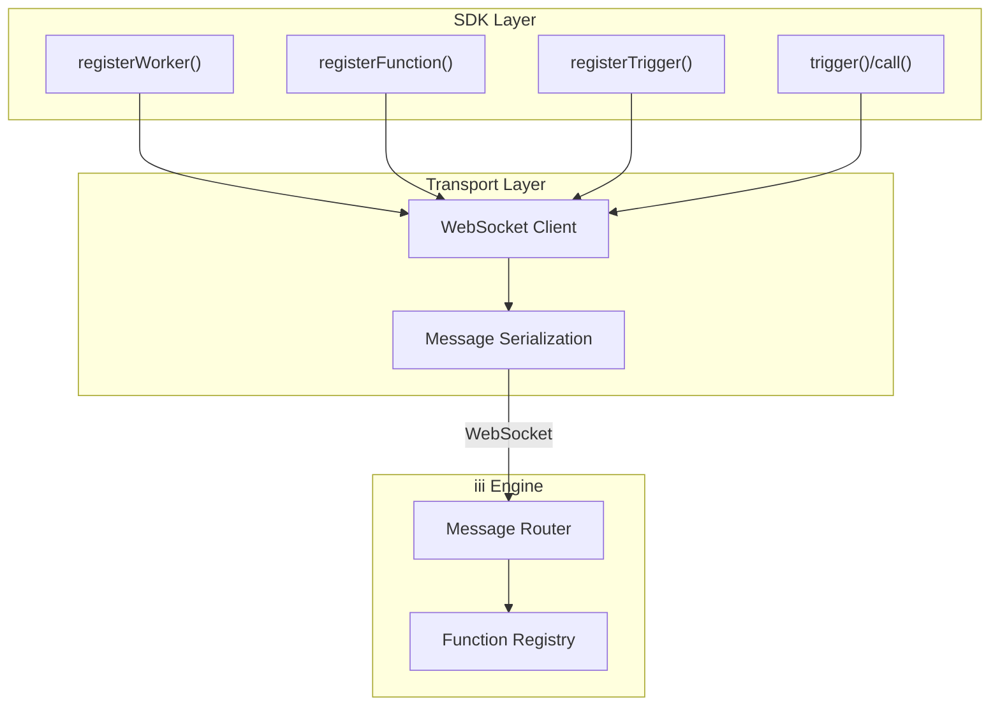
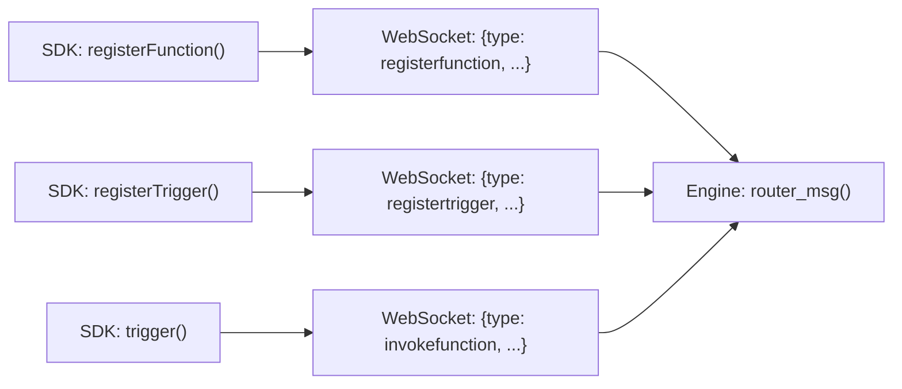

# SDK Packages — Node.js, Python, Rust SDK Deep Dives

**iii provides SDKs for three languages that all abstract the same WebSocket protocol.** This document covers the Node.js, Python, and Rust SDKs — their registration patterns, type systems, and how they map to the engine's message protocol.

## SDK Architecture

All three SDKs follow the same pattern:



**Aha:** The SDKs are thin protocol wrappers. They don't implement any business logic — all intelligence lives in the engine. This means SDK updates are minimal and workers written in different languages behave identically.

## Node.js SDK

Source: `sdk/packages/node/iii/`

### Entry Point

Source: `sdk/packages/node/iii/src/index.ts`

```typescript
export { ChannelReader, ChannelWriter } from './channels'
export { IIIInvocationError } from './errors'
export { registerWorker, TriggerAction } from './iii'
export { EngineFunctions, EngineTriggers } from './iii-constants'
export { Logger } from '@iii-dev/observability'
export type { TriggerConfig, TriggerHandler } from './triggers'
export { http } from './utils'
```

### Worker Registration

Source: `sdk/packages/node/iii/src/iii.ts`

```typescript
export async function registerWorker(options: InitOptions): Promise<III> {
  const ws = new WebSocket(options.url || 'ws://localhost:49134');
  // Handle WorkerRegistered message
  // Return III instance with registerFunction, registerTrigger, trigger
}
```

The `III` instance provides:

```typescript
interface III {
  registerFunction(options: RegisterFunctionInput): FunctionRef;
  registerTrigger(options: RegisterTriggerInput): Trigger;
  trigger(request: TriggerRequest): Promise<any>;
  shutdown(): void;
}
```

### Function Registration

```typescript
iii.registerFunction({
  id: 'greet',
  description: 'Greet a user',
  handler: async (input: any) => {
    return { message: `Hello, ${input.name}!` };
  }
});
```

### Trigger Registration

```typescript
iii.registerTrigger({
  type: 'http',
  function_id: 'greet',
  config: { path: '/greet' }
});
```

### Invocation

```typescript
const result = await iii.trigger({
  function_id: 'greet',
  payload: { name: 'World' }
});
```

### Constants

Source: `sdk/packages/node/iii/src/iii-constants.ts`

```typescript
export enum EngineFunctions {
  STATE_GET = 'state::get',
  STATE_SET = 'state::set',
  STATE_DELETE = 'state::delete',
  STATE_LIST = 'state::list',
  STREAM_SET = 'stream::set',
  STREAM_GET = 'stream::get',
  DURABLE_PUBLISH = 'iii::durable::publish',
  // ... more engine functions
}

export enum EngineTriggers {
  HTTP = 'http',
  CRON = 'cron',
  DURABLE_SUBSCRIBER = 'durable:subscriber',
  SUBSCRIBE = 'subscribe',
  STATE = 'state',
  STREAM = 'stream',
  // ... more trigger types
}
```

## Python SDK

Source: `sdk/packages/python/iii/`

### Worker Registration

```python
from iii import register_worker

iii = register_worker(url='ws://localhost:49134')
```

### Function Registration

```python
@iii.register_function(id='greet')
async def greet(input: dict) -> dict:
    return {"message": f"Hello, {input['name']}!"}
```

### Trigger Registration

```python
iii.register_trigger(
    type='http',
    function_id='greet',
    config={'path': '/greet'}
)
```

### Keep-Alive Loop

Source: `sdk/packages/python/iii/src/iii_client.py`

Unlike Node.js (which runs on the event loop automatically), Python requires an explicit keep-alive loop:

```python
import signal
import time

def _shutdown(*_args):
    iii.shutdown()
    raise SystemExit(0)

signal.signal(signal.SIGINT, _shutdown)
signal.signal(signal.SIGTERM, _shutdown)
while True:
    time.sleep(1)
```

## Rust SDK

Source: `sdk/packages/rust/iii/`

### Crate Structure

| File | Purpose |
|------|---------|
| `lib.rs` | Public exports |
| `iii.rs` | Core SDK: register_worker, III struct |
| `protocol.rs` | Message type definitions |
| `types.rs` | TypeScript-compatible type definitions |
| `structs.rs` | Request/response structs |
| `channels.rs` | Channel reader/writer for streaming |
| `stream.rs` | Stream utilities |
| `stream_provider.rs` | Stream backend provider |
| `triggers.rs` | Trigger registration helpers |
| `builtin_triggers.rs` | Built-in trigger type definitions |
| `helpers.rs` | Utility functions |
| `error.rs` | Error types |

### Worker Registration

Source: `sdk/packages/rust/iii/src/iii.rs`

```rust
pub fn register_worker(url: &str, options: InitOptions) -> III {
    // Connect WebSocket
    // Wait for WorkerRegistered
    // Return III instance
}
```

### Function Registration

```rust
iii.register_function(RegisterFunction::new_async("greet", async |input| {
    let name: String = input["name"].as_str().unwrap().into();
    FunctionResult::Success(json!({"message": format!("Hello, {}!", name)}))
}));
```

### Trigger Registration

```rust
iii.register_trigger(RegisterTriggerInput {
    trigger_type: "http".into(),
    function_id: "greet".into(),
    config: json!({"path": "/greet"}),
});
```

### Tests

Source: `sdk/packages/rust/iii/tests/`

| Test File | Purpose |
|-----------|---------|
| `api_triggers.rs` | HTTP trigger registration and invocation |
| `bridge.rs` | Bridge client communication |
| `data_channels.rs` | Channel streaming tests |
| `healthcheck.rs` | Worker health check |
| `middleware.rs` | Middleware function tests |
| `payload_capture.rs` | Input/output capture |
| `pubsub.rs` | Pub/sub messaging |
| `queue_integration.rs` | Queue system tests |
| `rbac_workers.rs` | RBAC session tests |
| `registration_dedup.rs` | Duplicate registration handling |
| `span_ops_api.rs` | OTEL span operations |

## SDK Comparison

| Feature | Node.js | Python | Rust |
|---------|---------|--------|------|
| Registration | `iii.registerFunction()` | `@iii.register_function()` decorator | `iii.register_function()` |
| Invocation | `iii.trigger()` | `iii.trigger_async()` | `iii.trigger()` |
| Async Model | Promise/async | asyncio | tokio |
| Type System | TypeScript types | Type hints | Rust types |
| WebSocket Lib | `ws` | `websockets` | `tokio-tungstenite` |
| Serialization | `JSON.stringify` | `json.dumps` | `serde_json` |
| Shutdown | `iii.shutdown()` | `iii.shutdown()` | `iii.shutdown_async()` |

## SDK Package Organization

Source: `sdk/packages/`

```
sdk/packages/
├── node/
│   ├── iii/              # Core Node.js SDK
│   ├── iii-browser/       # Browser SDK
│   ├── iii-example/       # Example workers
│   └── observability/     # Observability SDK
├── python/
│   └── iii/              # Core Python SDK
├── rust/
│   ├── iii/              # Core Rust SDK
│   ├── iii-example/       # Rust examples
│   └── observability/     # Rust observability SDK
├── fixtures/              # Test fixtures
└── test-assets/           # Test resources
```

## SDK Message Mapping



## What's Next

- [08 — Ecosystem Workers](08-ecosystem-workers.md) — 17+ workers deep dive
- [14 — Data Flow](14-data-flow.md) — End-to-end invocation and streaming flows
- [15 — Cross-Cutting](15-cross-cutting.md) — Testing strategy, CI/CD
