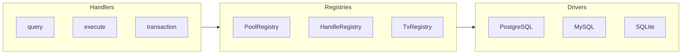
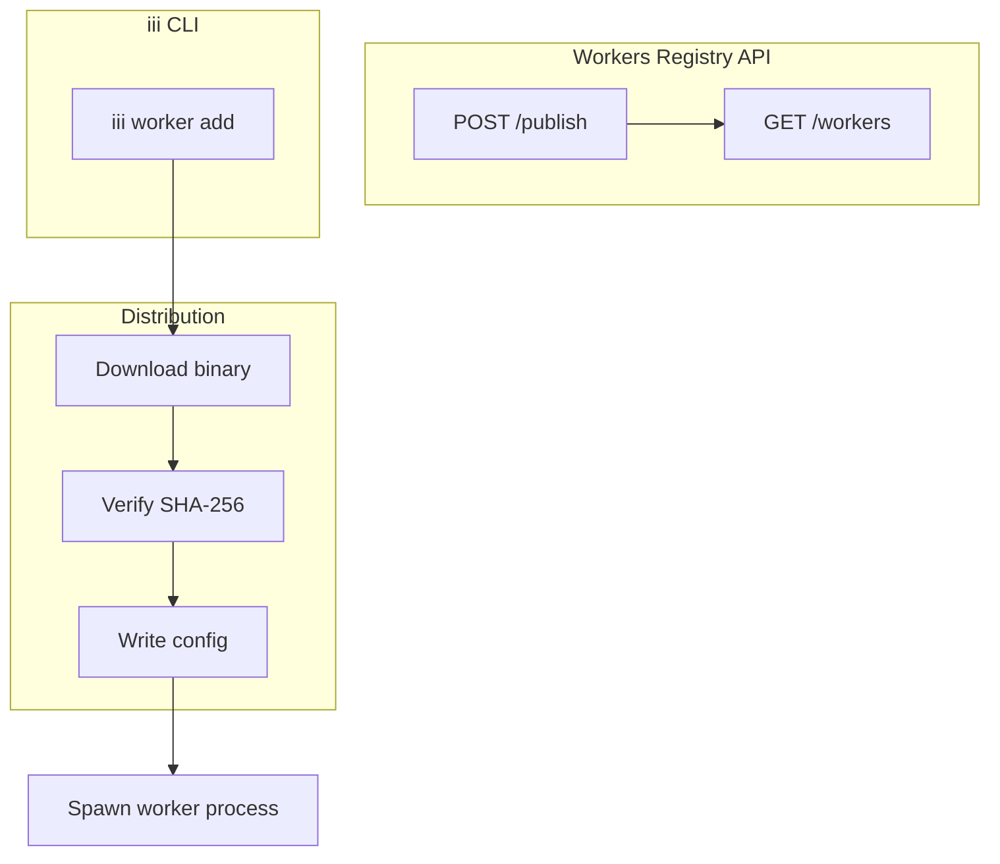

# Ecosystem Workers — 17+ Workers Deep Dive

**The iii ecosystem includes 17+ workers across three languages, each independently deployable and versioned.** This document covers every worker — its purpose, function surface, architecture, and key implementation details.

## Worker Catalog

| # | Worker | Language | Lines | Purpose |
|---|--------|----------|-------|---------|
| 1 | shell | Rust | — | Unix shell execution with filesystem jail |
| 2 | database | Rust | — | PostgreSQL/MySQL/SQLite with connection pooling |
| 3 | storage | Rust | — | S3-compatible object storage (AWS, GCS, R2, local) |
| 4 | coder | Rust | — | Path-jailed code manipulation |
| 5 | console | Rust | — | Web console with embedded React SPA |
| 6 | mcp | Rust | — | MCP 2025-06-18 Streamable HTTP bridge |
| 7 | acp | Rust | — | Agent Client Protocol over stdio JSON-RPC |
| 8 | iii-directory | Rust | — | Engine introspection (functions, triggers, workers) |
| 9 | iii-lsp | Rust | — | Language Server Protocol for iii |
| 10 | image-resize | Rust | — | Image processing |
| 11 | harness | TypeScript | — | Meta-worker: chat, AI providers, turn orchestration |
| 12 | agentmemory | TypeScript | ~30K | AI agent persistent memory system |
| 13 | spec-forge | Rust | ~3K | UI spec generation from natural language |
| 14 | todo-worker | TypeScript | — | Quickstart example |
| 15 | todo-worker-python | Python | — | Quickstart example |

## 1. Shell Worker

Source: `workers/shell/src/main.rs`

**Function surface (15 functions):**

| Function | Purpose |
|----------|---------|
| `shell::exec` | Run command, wait, return output |
| `shell::exec_bg` | Spawn background job, return job_id |
| `shell::kill` | Terminate background job |
| `shell::status` | Poll job status |
| `shell::list` | List all background jobs |
| `shell::fs::ls` | List directory |
| `shell::fs::stat` | File metadata |
| `shell::fs::mkdir` | Create directory |
| `shell::fs::rm` | Remove file/directory |
| `shell::fs::chmod` | Change permissions |
| `shell::fs::mv` | Move/rename |
| `shell::fs::grep` | Recursive regex search |
| `shell::fs::sed` | Find and replace |
| `shell::fs::read` | Read file (stream via channel) |
| `shell::fs::write` | Write file (stream via channel) |

**Security model (defense in depth):**

```yaml
allowlist: ["git", "cargo", "npm", "pnpm"]
denylist_patterns: ["rm\\s+-rf\\s+/"]
fs:
  host_root: "${HOME}/projects"
  max_read_bytes: 10485760
  denylist_paths: ["**/.ssh/**", "**/.aws/**"]
timeout_ms: 30000
max_output_bytes: 1048576
max_concurrent_jobs: 10
```

**Aha:** The shell worker implements five security layers: allowlist (permitted commands), denylist (forbidden regex patterns), filesystem jail (path restriction), resource caps (timeouts, output limits), and size limits (read/write byte caps).

## 2. Database Worker

Source: `workers/database/src/main.rs`

**Function surface (11 functions):**

| Function | Purpose |
|----------|---------|
| `database::query` | Read-only SQL |
| `database::execute` | Write statements |
| `database::prepareStatement` | Create parameterized statement |
| `database::runStatement` | Execute prepared handle |
| `database::transaction` | Atomic multi-statement block |
| `database::beginTransaction` | Start interactive transaction |
| `database::transactionQuery` | Query within transaction |
| `database::transactionExecute` | Execute within transaction |
| `database::commitTransaction` | Commit transaction |
| `database::rollbackTransaction` | Rollback transaction |
| `database::executeBatch` | Batch execution |

**Drivers:**

| Driver | Crate | Connection |
|--------|-------|------------|
| PostgreSQL | `tokio-postgres` | `Pool<PostgresConnectionManager>` |
| MySQL | `mysql_async` | `Pool` |
| SQLite | `rusqlite` | Blocking (thread pool) |

**Architecture:**



**Aha:** The database worker uses a handle registry pattern for prepared statements. Handles are reference-counted and auto-evicted after TTL, allowing long-lived prepared statements without leaking resources.

## 3. Storage Worker

Source: `workers/storage/src/main.rs`

**Function surface:**

| Function | Purpose |
|----------|---------|
| `storage::putObject` | Upload object |
| `storage::getObject` | Download object |
| `storage::deleteObject` | Remove object |
| `storage::listObjects` | List objects in bucket |
| `storage::presignUrl` | Generate presigned URL |
| `storage::headObject` | Get object metadata |

**Backends:**

| Backend | Crate | Purpose |
|---------|-------|---------|
| AWS S3 | `aws-sdk-s3` | Production storage |
| GCS | `gcloud-storage` | Google Cloud Storage |
| R2 | `aws-s3-compatible` | Cloudflare R2 |
| Local | `rustfs` | Development/testing |

**Trigger types:**
- `storage::object-created` — Fires when object is uploaded
- `storage::object-deleted` — Fires when object is removed

## 4. Coder Worker

Source: `workers/coder/src/main.rs`

**Function surface (8 functions):**

| Function | Purpose |
|----------|---------|
| `coder::create_file` | Create new file |
| `coder::read_file` | Read file contents |
| `coder::update_file` | Patch file with operations |
| `coder::delete_file` | Delete file |
| `coder::list_folder` | Paginated directory listing |
| `coder::tree` | Recursive directory tree |
| `coder::search` | Content search |
| `coder::diff` | Generate file diff |

**Path security:**
```yaml
jail_root: "${WORKER_JAIL}"
denylist_patterns: ["*.secret", "**/.git/**"]
max_read_bytes: 1048576
max_write_bytes: 1048576
```

## 5. Console Worker

Source: `workers/console/src/main.rs`

**Architecture:**
- `src/server.rs` — HTTP server with Axum
- `src/proxy.rs` — WebSocket proxy to engine
- `src/assets.rs` — Embedded static assets via `rust-embed`
- `web/` — Vite + React SPA

The console bundles a React UI and proxies the engine WebSocket on a single HTTP port.

## 6. MCP Worker

Source: `workers/mcp/src/main.rs`

**Purpose:** MCP (Model Context Protocol) 2025-06-18 Streamable HTTP bridge. Exposes iii functions tagged with `mcp.expose` as MCP tools.

```yaml
api_path: "/mcp/v1"
listen_addr: "0.0.0.0:3000"  # Optional: dedicated HTTP server
```

**Aha:** The MCP worker acts as a protocol adapter. It translates between iii's function/trigger protocol and the MCP specification, allowing iii workers to serve as MCP servers without code changes.

## 7. ACP Worker

Source: `workers/acp/src/main.rs`

**Purpose:** Exposes iii agents as ACP (Agent Client Protocol) sessions over stdio JSON-RPC.

```rust
#[derive(Parser)]
struct Args {
    #[arg(long, env = "IIIACP_ENGINE_URL", default_value = "ws://localhost:49134")]
    engine_url: String,
    #[arg(long, env = "IIIACP_BRAIN_FN")]
    brain_fn: Option<String>,  // Function ID for turn processing
    #[arg(long, env = "IIIACP_USE_CANONICAL_BRAIN")]
    use_canonical_brain: bool,  // Shortcut for run::start_and_wait
}
```

## 8. Harness (Meta-Worker)

Source: `workers/harness/src/index.ts`

The harness is a composite Node.js worker that bundles 13 sub-workers:

| Worker | Function Prefix | Purpose |
|--------|-----------------|---------|
| harness | `harness::`, `ui::`, `policy::` | Meta-worker, permissions, provider registry |
| turn-orchestrator | `run::`, `turn::` | Agent turn state machine |
| approval-gate | `approval::` | Human-in-the-loop approvals |
| session | `session-tree::`, `session-inbox::` | Session storage |
| llm-budget | `budget::` | Spend tracking and caps |
| hook-fanout | `hook-fanout::` | Pub-sub primitives |
| models-catalog | `models::` | Model capability registry |
| provider-anthropic | `provider::anthropic::` | Anthropic API integration |
| provider-openai | `provider::openai::` | OpenAI API integration |
| provider-kimi | `provider::kimi::` | Kimi (Moonshot) API |
| provider-lmstudio | `provider::lmstudio::` | LM Studio local models |
| provider-llamacpp | `provider::llamacpp::` | llama.cpp server |
| context-compaction | (side-car) | Session history compaction |
| web | `web::` | Outbound HTTP client |

**Entry point:**
```typescript
const WORKERS: readonly WorkerDefinition[] = [
  { name: 'harness', register: (iii, ctx) => registerHarness(iii, ctx) },
  { name: 'turn-orchestrator', register: (iii, ctx) => registerTurnOrchestrator(iii, ctx) },
  // ... 13 workers total
];
```

## 9. iii-directory Worker

Source: `workers/iii-directory/src/main.rs`

**Purpose:** Engine introspection — provides discovery of functions, triggers, and workers.

| Function | Purpose |
|----------|---------|
| `directory::engine::functions::list` | List all registered functions |
| `directory::engine::functions::info` | Get function metadata |
| `directory::engine::triggers::list` | List trigger types |
| `directory::engine::workers::list` | List connected workers |
| `directory::skills::list` | List available skills |
| `directory::prompts::list` | List prompt templates |

## 10. iii-LSP Worker

Source: `workers/iii-lsp/src/main.rs`

**Purpose:** Language Server Protocol for iii. Provides autocompletion and hover information for iii function IDs and trigger configurations.

**Supported languages:** TypeScript, Python, Rust (via tree-sitter parsers)

## 11. Image-Resize Worker

Source: `workers/image-resize/src/main.rs`

**Purpose:** Image processing — resize, crop, format conversion.

## 12. agentmemory

See [09 — AgentMemory](09-agentmemory.md) for the full deep dive.

## 13. spec-forge

See [10 — SpecForge](10-spec-forge.md) for the full deep dive.

## Worker Entry Pattern

All Rust workers follow the same entry pattern:

```rust
#[tokio::main]
async fn main() -> Result<()> {
    // 1. Initialize tracing
    tracing_subscriber::fmt().with_env_filter(...).init();

    // 2. Parse CLI
    let cli = Cli::parse();

    // 3. Handle --manifest (registry publish)
    if cli.manifest {
        let m = manifest::build_manifest();
        println!("{}", serde_json::to_string_pretty(&m)?);
        return Ok(());
    }

    // 4. Load config
    let cfg = config::load_config(&cli.config).unwrap_or_default();

    // 5. Connect to iii engine
    let iii = register_worker(&cli.url, InitOptions::default());

    // 6. Register functions
    functions::register_all(&iii, &cfg);

    // 7. Register triggers (optional)
    iii.register_trigger(RegisterTriggerInput { ... });

    // 8. Wait for shutdown
    tokio::signal::ctrl_c().await?;
    iii.shutdown_async().await;
    Ok(())
}
```

## Worker Distribution Architecture



## What's Next

- [09 — AgentMemory](09-agentmemory.md) — AI agent persistent memory system
- [10 — SpecForge](10-spec-forge.md) — UI spec generation from natural language
- [13 — Examples](13-examples.md) — Example patterns and workflows
