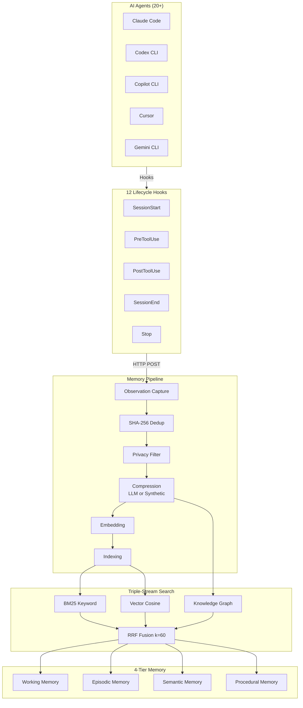

# AgentMemory — AI Agent Persistent Memory System

**agentmemory is a persistent memory system for AI coding agents, built entirely on the iii-engine's three primitives: worker, function, and trigger.** It eliminates the need to re-explain project context to coding agents by capturing observations from agent interactions, compressing them, and injecting relevant context into new sessions.

## System Overview

Source: `agentmemory/src/index.ts` (597 lines)

agentmemory operates as a background service with:

- **36,867 LOC** in `src/`
- **80+ functions** registered with iii
- **53 MCP tools** via Model Context Protocol
- **125 REST endpoints** for programmatic access
- **12 lifecycle hooks** for agent integration
- **Default ports:** 3111 (REST API), 3112 (Streams), 3113 (Viewer)

**Key insight:** Unlike built-in agent memory (CLAUDE.md, .cursorrules) that caps at 200 lines and goes stale, agentmemory functions as a searchable database — using BM25 + vector + knowledge graph search with RRF fusion to deliver only the most relevant context within token budgets.

## Architecture



## Observation Pipeline

Source: `agentmemory/src/functions/observe.ts`

### Observation Types

Source: `agentmemory/src/types.ts:14-44`

| Type | Captured From | Example |
|------|---------------|---------|
| `file_read` | Read tool | Opening a source file |
| `file_write` | Write tool | Creating a new file |
| `file_edit` | Edit tool | Modifying existing code |
| `command_run` | Bash tool | Running tests |
| `search` | Search tool | Grep search |
| `web_fetch` | WebFetch tool | Fetching a URL |
| `conversation` | User messages | User-agent dialogue |
| `error` | Tool failures | Command errors |
| `decision` | Agent actions | Architectural decisions |
| `discovery` | Findings | Bug discoveries |
| `image` | Visual content | Screenshots |

### Deduplication

Source: `agentmemory/src/functions/observe.ts:63-78`

```typescript
// SHA-256 hash of sessionId + toolName + toolInput
const hash = sha256(`${sessionId}:${toolName}:${JSON.stringify(toolInput)}`);
// 5-minute window prevents duplicate captures
if (recentDedup.has(hash) && Date.now() - recentDedup.get(hash) < 300_000) {
  return; // Already captured
}
```

### Privacy Filtering

Source: `agentmemory/src/functions/privacy.ts`

- Strips API keys, tokens, secrets via regex patterns
- Removes content marked with `<private>` tags
- Applied before any storage or LLM processing

## Compression System

Source: `agentmemory/src/functions/compress.ts`

### Two Compression Modes

| Mode | Trigger | Cost | Quality |
|------|---------|------|---------|
| **LLM compression** | `AGENTMEMORY_AUTO_COMPRESS=true` | Token cost | High — uses LLM to extract structured insights |
| **Synthetic compression** | Default (zero-LLM) | Free | Good — extracts facts from structured tool output |

### LLM Compression Output Schema

```xml
<observation>
  <type>file_read|file_write|...</type>
  <title>Human-readable title</title>
  <subtitle>Optional context</subtitle>
  <facts><fact>...</fact></facts>
  <narrative>Summary paragraph</narrative>
  <concepts><concept>...</concept></concepts>
  <files><file>...</file></files>
  <importance>1-10</importance>
</observation>
```

**Aha:** The no-op provider is the intentional default. This prevents accidental token spend and the Stop-hook recursion bug (#149) where agent-sdk child sessions inherit parent hooks. Users must explicitly opt into LLM compression.

## Triple-Stream Search

Source: `agentmemory/src/state/hybrid-search.ts`

### RRF Fusion

```
score = 1 / (k + rank)
where k = 60 (constant)
```

### Stream Weights

| Stream | Weight | Purpose |
|--------|--------|---------|
| BM25 | 0.4 | Keyword matching with stemming |
| Vector | 0.6 | Semantic similarity |
| Graph | 0.3 | Entity and relationship matching |

### Session Diversification

Maximum 3 results per session prevents a single long session from dominating recall results. This ensures cross-session context variety.

**Aha:** Without the "max 3 results per session" rule, a single long session could dominate recall results, starving cross-session context. Session diversification prevents echo chambers.

## Knowledge Graph

Source: `agentmemory/src/functions/graph.ts`

### Entity Types

| Entity | Example |
|--------|---------|
| `file` | `src/auth.ts` |
| `function` | `authenticate()` |
| `concept` | "RBAC" |
| `error` | "TypeError: Cannot read" |
| `decision` | "Use JWT for auth" |
| `pattern` | "Repository pattern" |
| `library` | "axios" |
| `person` | "Alice" |
| `project` | "iii-engine" |
| `preference` | "Prefer async/await" |

### Relationship Types

| Relationship | Example |
|-------------|---------|
| `uses` | `auth.ts uses jwt` |
| `imports` | `app.ts imports auth.ts` |
| `modifies` | `test modifies auth.ts` |
| `causes` | `change causes error` |
| `fixes` | `PR fixes error` |
| `depends_on` | `auth depends on config` |
| `prefers` | `Alice prefers TypeScript` |

## Memory Consolidation

Source: `agentmemory/src/functions/consolidation-pipeline.ts`

### 4-Tier Memory Model

```mermaid
flowchart TD
    A[Raw Observations] -->|Session End| B[Working Memory]
    B -->|LLM Summary| C[Episodic Memory<br/>"what happened"]
    C -->|Fact Extraction| D[Semantic Memory<br/>"what I know"]
    D -->|Pattern Detection| E[Procedural Memory<br/>"how to do it"]
```

| Tier | Content | Lifespan | Example |
|------|---------|----------|---------|
| Working Memory | Raw observations | Session-scoped | "Read auth.ts line 42" |
| Episodic Memory | Session summaries | Weeks | "Session 47: implemented JWT auth" |
| Semantic Memory | Extracted facts | Months | "Project uses JWT for authentication" |
| Procedural Memory | Workflow patterns | Persistent | "How to add a new API endpoint" |

### Consolidation Triggers

| Trigger | Timing | Action |
|---------|--------|--------|
| Stop hook | Session end | Generate session summary |
| Scheduled | Every 2 hours | Batch consolidation |
| Manual | `mem::consolidate` | Force consolidation |

## MCP Server

Source: `agentmemory/src/mcp/server.ts`

### Core Tools (always available)

| Tool | Purpose |
|------|---------|
| `memory_recall` | Search past observations |
| `memory_save` | Save insight/decision |
| `memory_smart_search` | Hybrid semantic search |
| `memory_sessions` | List recent sessions |
| `memory_profile` | Project intelligence profile |
| `memory_export` | Export all data |

### Extended Tools (53 total with `AGENTMEMORY_TOOLS=all`)

| Category | Tools |
|----------|-------|
| Team memory | `memory_team_share`, `memory_team_feed` |
| Actions | `memory_action_create`, `memory_frontier`, `memory_next` |
| Orchestration | `memory_lease`, `memory_routine_run`, `memory_signal_send` |
| Knowledge graph | `memory_graph_query` |
| Governance | `memory_audit`, `memory_governance_delete` |

## Multi-Agent Support

| Mode | Tag Writes | Filter Recall | Use Case |
|------|------------|---------------|----------|
| `shared` (default) | Yes | No | Cross-agent context with audit trail |
| `isolated` | Yes | Yes | Strict role separation |

When `AGENT_ID` is set, all writes include agentId field. In isolated mode, recall endpoints filter to only matching agentId.

## Configuration

| Environment Variable | Purpose |
|---------------------|---------|
| `ANTHROPIC_API_KEY` | Anthropic Claude for compression |
| `OPENAI_API_KEY` | OpenAI for compression/embeddings |
| `EMBEDDING_PROVIDER=local` | Local embeddings (all-MiniLM-L6-v2) |
| `AGENTMEMORY_AUTO_COMPRESS=true` | LLM-powered compression |
| `GRAPH_EXTRACTION_ENABLED=true` | Knowledge graph |
| `AGENT_ID=<role>` | Multi-agent role identifier |
| `AGENTMEMORY_AGENT_SCOPE=isolated` | Strict role separation |

## Key Insights

1. **Zero-LLM by default** — The system works without any LLM provider using synthetic compression. Users must opt into token spend explicitly.
2. **Hook-based capture** — agentmemory captures through agent hooks, not by modifying the agent. This makes it work with any agent supporting MCP or HTTP callbacks.
3. **iii-engine dependency** — agentmemory doesn't use Express, SQLite, Redis, or pm2. iii provides HTTP triggers, KV state, streams, and process supervision.
4. **Dimension mismatch protection** — Cross-dimension vectors silently corrupt cosine similarity. The system validates dimensions at write time.

## What's Next

- [10 — SpecForge](10-spec-forge.md) — UI spec generation from natural language
- [14 — Data Flow](14-data-flow.md) — Memory pipeline end-to-end flow
- [07 — SDK Packages](07-sdk-packages.md) — How agentmemory uses the iii SDK
