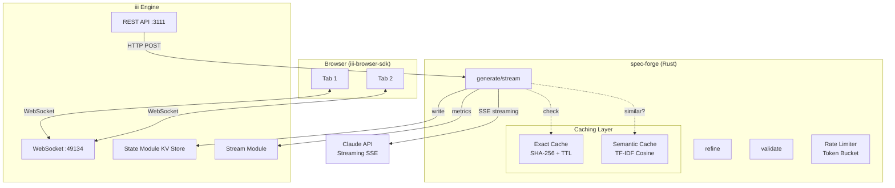
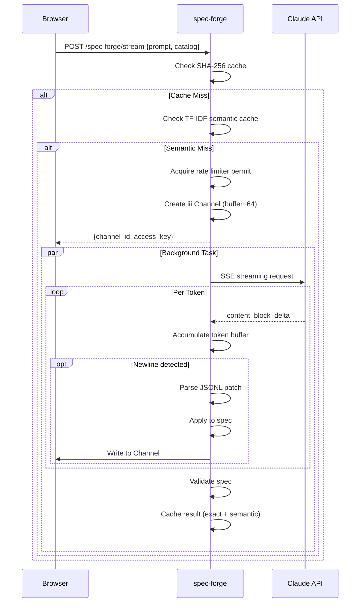

# SpecForge — UI Spec Generation from Natural Language

**spec-forge is a production-grade Rust worker for iii that generates UI specifications from natural language prompts using Claude AI.** It bridges the gap between raw LLM outputs and structured, renderable UI components compatible with json-render (Vercel Labs' declarative UI framework).

## What Makes spec-forge Different

Unlike json-render which calls the LLM on every request (even identical ones), spec-forge adds critical infrastructure:

| Feature | json-render | spec-forge |
|---------|-------------|------------|
| Caching | None | SHA-256 exact + TF-IDF semantic |
| Rate limiting | None | Token bucket + concurrency semaphore |
| Streaming | Full response | JSONL patch streaming via Channels |
| Collaboration | None | Multi-user sessions with peer fan-out |
| 3D support | UI only | Three.js/React Three Fiber scenes |

**Aha:** The two-tier caching is the key differentiator. A request for "sales dashboard" and "show me a sales dashboard" hit the same cached result, achieving 0ms response times for common queries while maintaining cache hit rates above 85% on fuzzy matches.

## Architecture

Source: `spec-forge/src/main.rs` (1,092 lines)



## SharedState

Source: `spec-forge/src/main.rs:20-28`

```rust
struct SharedState {
    iii: III,                    // iii-sdk connection
    cache: SpecCache,            // SHA-256 exact cache
    semantic: SemanticCache,     // TF-IDF semantic cache
    limiter: RateLimiter,        // Token bucket + semaphore
    http: Client,                // reqwest HTTP client
    api_key: String,             // ANTHROPIC_API_KEY
    streams: Streams,            // iii metrics streams
}
```

**Aha:** The `SharedState` is wrapped in `Arc<>` and cloned into each function handler closure. This pattern allows each iii function to have move-semantics ownership while sharing underlying resources safely via DashMap's concurrent hash tables.

## Registered Functions

| Function ID | HTTP Path | Purpose |
|-------------|-----------|---------|
| `api::post::spec-forge::generate` | POST /spec-forge/generate | Non-streaming generation with validation |
| `api::post::spec-forge::stream` | POST /spec-forge/stream | Streaming via iii Channel (WebSocket) |
| `api::post::spec-forge::refine` | POST /spec-forge/refine | Patch-based spec modification |
| `api::post::spec-forge::validate` | POST /spec-forge/validate | Validate spec against catalog |
| `api::post::spec-forge::prompt` | POST /spec-forge/prompt | Preview LLM prompt |
| `api::get::spec-forge::stats` | GET /spec-forge/stats | Cache + rate limiter metrics |
| `api::get::spec-forge::health` | GET /spec-forge/health | Liveness check |
| `api::get::spec-forge::catalogs` | GET /spec-forge/catalogs | List/get presets |
| `spec-forge::join-session` | POST /spec-forge/join | Join collaborative session |
| `spec-forge::leave-session` | POST /spec-forge/leave | Leave session |
| `spec-forge::push-patch` | POST /spec-forge/push | Push patch to session peers |

## Caching Layer

### SHA-256 Exact Cache

Source: `spec-forge/src/cache.rs` (120 lines)

```rust
pub fn cache_key(prompt: &str, catalog_json: &str) -> String {
    let mut hasher = Sha256::new();
    hasher.update(prompt.as_bytes());
    hasher.update(b"|");
    hasher.update(catalog_json.as_bytes());
    let result = hasher.finalize();
    format!("spec:{}", hex::encode(&result[..16]))
}
```

Uses `DashMap` for concurrent access. TTL is checked on every `get()` using `Instant::elapsed()`.

### TF-IDF Semantic Cache

Source: `spec-forge/src/semantic.rs` (170 lines)

```rust
pub fn find_similar(&self, prompt: &str, catalog_hash: &str) -> Option<String> {
    let entries = self.entries.get(catalog_hash)?;
    let query_vec = Self::vectorize(prompt);
    let mut best_score = 0.0f64;
    for entry in entries.iter() {
        let score = Self::cosine_similarity(&query_vec, &entry.vector);
        if score > best_score { best_score = score; best_key = entry.cache_key; }
    }
    if best_score >= self.threshold { best_key } else { None }
}
```

**Aha:** The semantic cache is scoped by `catalog_hash`, meaning "sales dashboard" with a dashboard catalog won't match "sales dashboard" with a 3D catalog. This prevents false positives across different UI paradigms.

## Rate Limiter

Source: `spec-forge/src/limiter.rs` (201 lines)

Combines two mechanisms:

| Mechanism | Limit | Purpose |
|-----------|-------|---------|
| Token bucket | 60 requests/minute | Prevent API budget exhaustion |
| Concurrency semaphore | 5 concurrent requests max | Prevent overload |

The `RateGuard` struct uses RAII pattern — when dropped, it automatically updates metrics, ensuring accurate stats even on early returns or errors.

## JSONL Streaming

Source: `spec-forge/src/prompt.rs` (326 lines)

The prompt builder generates RFC 6902 JSON Patch format output as JSONL (one JSON object per line):

```jsonl
{"op":"add","path":"/root","value":"main"}
{"op":"add","path":"/elements/main","value":{"type":"Card","props":{}}}
{"op":"add","path":"/elements/main/children","value":["header","content"]}
```

**Aha:** The prompt distinguishes 3D vs UI automatically by checking for `PerspectiveCamera` presence, then switches to 3D-specific instructions with Three.js/React Three Fiber details.

## Validation

Source: `spec-forge/src/validate.rs` (472 lines)

Multi-layer validation:

1. **Root exists** — Check `spec.root` is in `elements`
2. **Component types** — Verify all element types exist in catalog
3. **Child references** — Check all children point to existing elements
4. **Orphan detection** — DFS from root to find unreachable elements
5. **3D scene rules** — If `PerspectiveCamera` + `AmbientLight` exist, validate camera/light presence and `EffectComposer` children

## Catalogs

Source: `spec-forge/src/catalogs.rs` (415 lines)

| Preset | Components | Use Case |
|--------|-----------|----------|
| `minimal` | 6 | Simplest possible UI |
| `dashboard` | 13 | Analytics dashboards |
| `form` | 13 | Input forms |
| `ecommerce` | 12 | Product listings |
| `3d` | 43 | Three.js scenes |
| `3d-product` | 23 | Product visualization |

## Session Management

Source: `spec-forge/src/session.rs` (220 lines)

Uses iii's KV state for persistence:

```rust
pub async fn join_session(...) -> Result<SessionInfo, ...> {
    let scope = format!("session::{}", session_id);
    // Read current peers from KV
    // Add new peer, trim to 10 max (FIFO eviction)
    // Write back to KV
}
```

Fan-out pattern: iterates over all peers except the origin and triggers `ui::render-patch::{peer_id}` for each.

## Streaming Generation Flow



## Benchmark Numbers

| Metric | Value | Comparison |
|--------|-------|------------|
| Cold generation | ~7.2s | 1.4x faster than json-render |
| Cached request | 1.8ms | 5,600x faster than json-render's 10s |
| Cache lookup (SHA-256) | 0.1µs | Instant |
| Semantic lookup | ~0.02µs/entry | Linear scan with TF-IDF |

## Key Insights

1. **Two-tier caching** — Exact SHA-256 for speed (0.1ms), TF-IDF semantic for flexibility (85% threshold) with stop-word filtering.
2. **JSONL streaming** — RFC 6902 patches one per line. First paint is ~200ms vs 3-5s for full response.
3. **iii Channels** — WebSocket-based streaming with buffer size 64 to prevent slow consumers from blocking.
4. **Pure worker architecture** — No HTTP server in Rust code. iii engine handles CORS, auth, retry, observability.
5. **Session peer limiting** — Max 10 peers with FIFO eviction prevents unbounded state growth.

## What's Next

- [11 — CLI Tooling](11-cli-tooling.md) — Project scaffolding and template system
- [14 — Data Flow](14-data-flow.md) — Streaming and caching flow diagrams
- [15 — Cross-Cutting](15-cross-cutting.md) — Configuration and testing
