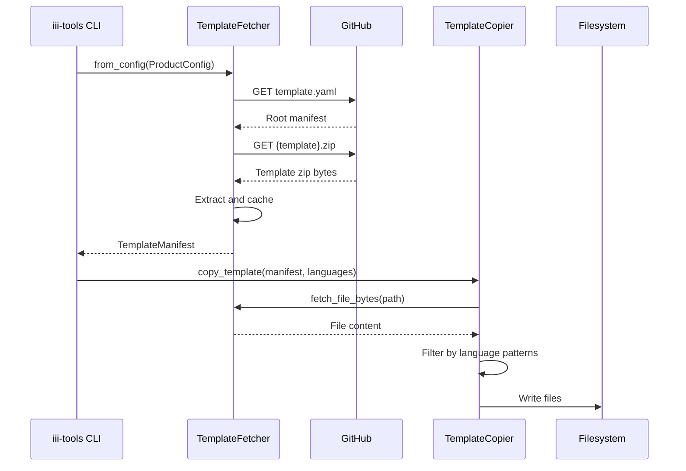

# CLI Tooling — Project Scaffolding, Templates, Runtime Detection, Telemetry

**The iii CLI Tooling project provides the primary onboarding mechanism for developers entering the iii ecosystem.** It's a Rust workspace that produces two branded CLIs (`iii-tools` and `motia`) sharing a core scaffolding library.

## Architecture: Product Config Trait

Source: `cli-tooling/crates/scaffolder-core/src/product.rs`

The architecture separates product branding from core scaffolding logic through the `ProductConfig` trait:

```rust
pub trait ProductConfig {
    fn name(&self) -> &'static str;
    fn display_name(&self) -> &'static str;
    fn default_template_url(&self) -> &'static str;
    fn template_url_env(&self) -> &'static str;
    fn requires_iii(&self) -> bool;
    fn docs_url(&self) -> &'static str;
    fn cli_description(&self) -> &'static str;
    fn upgrade_command(&self) -> &'static str;
}
```

**Aha:** The trait enables multiple CLI products to share implementation while maintaining distinct identities. `iii-tools` and `motia` differ only in their `ProductConfig` implementation — same binary logic, different branding.

### Product Implementations

| Product | Binary | Template URL | Requires iii |
|---------|--------|-------------|-------------|
| iii-tools | `crates/iii-tools/src/main.rs` | `github.com/iii-hq/cli-tooling/.../templates/iii` | Yes |
| motia | `crates/motia-tools/src/main.rs` | `github.com/iii-hq/cli-tooling/.../templates/motia` | Yes |

## Workspace Structure

Source: `cli-tooling/Cargo.toml`

```
cli-tooling/
├── Cargo.toml                    # Workspace with shared dependencies
├── crates/
│   ├── iii-tools/                # iii CLI binary
│   │   └── src/main.rs           # Entry point
│   ├── motia-tools/              # Motia CLI binary
│   │   └── src/main.rs           # Entry point
│   └── scaffolder-core/          # Core scaffolding library
│       └── src/
│           ├── lib.rs            # Library exports
│           ├── product.rs        # ProductConfig trait
│           ├── telemetry.rs      # Analytics
│           ├── config/           # Configuration generation
│           ├── runtime/          # Runtime detection
│           ├── templates/        # Template fetching and copying
│           └── tui/              # Interactive CLI prompts
└── templates/
    ├── iii/                      # iii project templates
    │   ├── template.yaml         # Root manifest
    │   ├── quickstart/           # Cross-language math example
    │   ├── multi-worker-orchestration/
    │   └── starter/
    └── motia/                    # Motia workflow templates
```

## Template System

Source: `cli-tooling/crates/scaffolder-core/src/templates/`

### Two-Level Manifest System

**Root Manifest** (`templates/iii/template.yaml`):
```yaml
templates:
  - quickstart
  - multi-worker-orchestration
shared_files:
  - source: default-gitignore
    dest: .gitignore
language_files:
  common: ['.env.*', 'README.md']
  python: ['*.py', 'requirements.txt']
  typescript: ['*.ts', 'tsconfig.json']
  node: ['package.json', 'package-lock.json']
```

**Template Manifest** (`templates/iii/quickstart/template.yaml`):
```yaml
name: Quickstart (Cross-Language Math)
description: Call a Python function from a Node worker using iii trigger
requires: [python, typescript]
treat_required_as_included: true
files:
  - workers/math-worker/math_worker.py
  - workers/caller-worker/src/worker.ts
  # ...
```

### Pattern Matching

Source: `cli-tooling/crates/scaffolder-core/src/templates/manifest.rs:45-58`

```rust
fn matches_any(filename: &str, patterns: &[String]) -> bool {
    patterns.iter().any(|pattern| {
        if pattern.starts_with('*') {
            filename.ends_with(&pattern[1..])  // *.ts → suffix match
        } else if pattern.ends_with('*') {
            filename.starts_with(&pattern[..pattern.len() - 1])  // prefix match
        } else {
            filename == pattern  // exact match
        }
    })
}
```

**Aha:** Files NOT matching any pattern are excluded by default. This prevents accidental inclusion of development artifacts. The "treat_required_as_included" flag allows templates to demonstrate multi-language features without forcing users to have all runtimes installed.

## Runtime Detection

Source: `cli-tooling/crates/scaffolder-core/src/runtime/check.rs`

Runtime detection checks for availability by running `--version` commands:

```rust
pub fn check_node() -> RuntimeInfo {
    let output = Command::new("node").arg("--version").output();
    match output {
        Ok(out) if out.status.success() => {
            RuntimeInfo { name: "Node.js", version: Some(...), available: true }
        }
        _ => RuntimeInfo { name: "Node.js", version: None, available: false }
    }
}
```

| Runtime | Detection | Advisory Mode |
|---------|-----------|---------------|
| Node.js | `node --version` | Warn but continue |
| Bun | `bun --version` | Warn but continue |
| Python 3 | `python3 --version` | Warn but continue |
| Cargo | `cargo --version` | Warn but continue |

## Interactive Flow (TUI)

Source: `cli-tooling/crates/scaffolder-core/src/tui/prompts.rs`

Uses `cliclack` for Charm-style inline prompts:

1. Check tool installation (iii)
2. Setup template fetcher
3. Select template from available options
4. Check version compatibility
5. Select project directory
6. Select languages
7. Check runtimes (advisory if `treat_required_as_included`)
8. Create project
9. Install dependencies (`npm install`, `uv sync`)
10. Show next steps

## Telemetry System

Source: `cli-tooling/crates/scaffolder-core/src/telemetry.rs`

The telemetry system sends events to Amplitude:

- Reads device identity from `~/.iii/telemetry.yaml` (managed by iii engine)
- Respects opt-out via `III_TELEMETRY_ENABLED=false` or `III_TELEMETRY_DEV=true`
- Automatically disabled in CI environments (detects 12 common CI env vars)
- Captures: OS, arch, CPU cores, timezone, install method, CLI version

The `run_dependency_install()` function auto-installs dependencies:

| Language | Command | Detection |
|----------|---------|-----------|
| JavaScript/TypeScript | `npm install` | `package.json` exists |
| Python | `uv sync` or `pip install -r requirements.txt` | `requirements.txt` exists |

## Build Configuration

Source: `cli-tooling/Cargo.toml:67-72`

```toml
[profile.release]
opt-level = "z"       # Optimize for size
lto = true            # Link Time Optimization
codegen-units = 1     # Single codegen unit
strip = true          # Strip symbols
```

**Aha:** Release builds optimize for size rather than speed, appropriate for a CLI tool that runs briefly and exits. The `opt-level = "z"` is more aggressive than `opt-level = "s"` — it also enables size-reducing optimizations that may slightly impact runtime performance.

## CI/CD Pipeline

### Release Flow

| Step | Action |
|------|--------|
| Detect pre-release | Check for alpha/beta/rc in tag |
| Create release | GitHub release with auto notes |
| Build binaries | 7 targets × 2 binaries = 14 builds |
| Trigger Homebrew | Dispatch publish-homebrew workflow |

### Build Targets

| Target | OS | Notes |
|--------|-----|-------|
| x86_64-apple-darwin | macOS Intel | Native |
| aarch64-apple-darwin | macOS Apple Silicon | Native |
| x86_64-pc-windows-msvc | Windows x64 | Native |
| aarch64-pc-windows-msvc | Windows ARM | Cross-compile |
| x86_64-unknown-linux-gnu | Linux x64 | Native |
| x86_64-unknown-linux-musl | Linux x64 | Static linking |
| aarch64-unknown-linux-gnu | Linux ARM64 | Cross-compile |

## E2E Test Harness

Source: `cli-tooling/crates/scaffolder-core/tests/e2e_harness/mod.rs`

The E2E harness provides:
- `Scenario` struct for test lifecycle management
- Automatic scaffolding into temp directories
- iii engine startup and process management
- Worker discovery from template manifests
- HTTP helpers for endpoint testing
- Graceful shutdown with SIGTERM/SIGKILL

## Key Insights

1. **Plugin architecture via traits** — `ProductConfig` trait enables multiple products with shared implementation.
2. **Template inheritance** — Two-level manifest system allows shared files and patterns across templates.
3. **Graceful degradation** — Runtime checks support strict (fail) and advisory (warn) modes.
4. **Zip distribution** — Templates are distributed as pre-built zips for consistency between dev and production.
5. **External templates** — Templates fetched from GitHub allow updates without CLI updates.

## Template Fetch and Copy Flow



## Runtime Check Flow

```mermaid
flowchart TD
    A[Check runtimes] --> B{Node.js available?}
    B -->|Yes| C[Record version]
    B -->|No| D[Not available]
    C --> E{Bun available?}
    D --> E
    E -->|Yes| F[Record version]
    E -->|No| G[Not available]
    F --> H{Python 3 available?}
    G --> H
    H -->|Yes| I[Record version]
    H -->|No| J[Not available]
    I --> K[Return RuntimeInfo[]]
    J --> K
```

## What's Next

- [12 — Skills & Validation](12-skills-validation.md) — Documentation validation system
- [13 — Examples](13-examples.md) — Example patterns and workflows
- [15 — Cross-Cutting](15-cross-cutting.md) — Testing strategy and CI/CD
