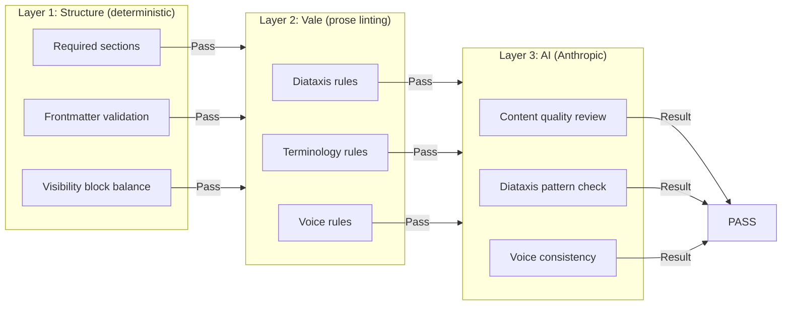
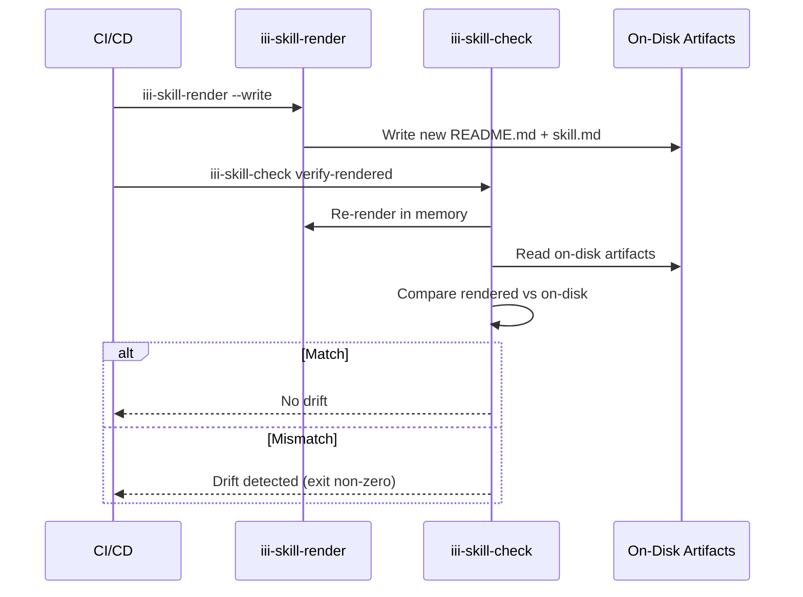

# Skills & Validation — Documentation Validation and Rendering System

**skills-and-validation is a Rust workspace that renders and validates documentation across the iii ecosystem.** It solves the "dual audience" problem by producing both human-facing README.md and agent-facing skill.md from a single source, then validates the output through three layers of checks.

## Two Modes

| Mode | Input | Output | Use Case |
|------|-------|--------|----------|
| **Worker mode** | `iii.worker.yaml` + `docs/*.md` | `README.md` + `skill.md` | Worker documentation |
| **Docs mode** | `.md` / `.mdx` files | `*.skill.md` | Standalone documentation |

## Three-Layer Validation Architecture



### Layer 1: Structure (Fast, Deterministic)

Source: `crates/iii-skill-core/src/structure.rs` (321 lines)

Checks:

| Check | What It Validates |
|-------|-------------------|
| Required sections | `## Install`, `## Quickstart`, `## Configuration` present and ordered |
| Frontmatter | Starts with `---`, contains `name:`, closes with `---` |
| Visibility block balance | Equal number of `llm-only:start` and `llm-only:end` markers |

### Layer 2: Vale (Prose Linting)

Source: `crates/iii-skill-core/src/vale.rs` (81 lines) + `content/styles/`

Vale rules are organized into style directories:

| Style Directory | Rules | Purpose |
|----------------|-------|---------|
| `Diataxis/` | 12 rules | Diataxis pattern enforcement |
| `Terminology/` | 10 rules | Terminology consistency |

Key rules:

| Rule | Pattern | Example |
|------|---------|---------|
| `SlopMarketing` | "revolutionary", "cutting-edge" | Reject marketing language |
| `SlopMagic` | "magic", "seamlessly" | Reject vague descriptors |
| `BackendSoftware` | "backend" vs "back-end" | Enforce terminology |
| `EmDash` | Em-dash usage | Enforce style guide |

### Layer 3: AI Validation

Source: `crates/iii-skill-core/src/ai.rs` (266 lines)

Uses Anthropic's Messages API with prompt caching:

```rust
fn call_anthropic(...) -> anyhow::Result<Result<(), String>> {
    let body = serde_json::json!({
        "model": model,
        "max_tokens": max_tokens,
        "system": [{
            "type": "text",
            "text": system_prompt,
            "cache_control": { "type": "ephemeral" }
        }],
        "messages": [{
            "role": "user",
            "content": [
                { "type": "text", "text": cached_user_prefix,
                  "cache_control": { "type": "ephemeral" } },
                { "type": "text", "text": uncached_user_suffix }
            ]
        }]
    });
}
```

**Aha:** Two cache breakpoints (system prompt + rules prefix) mean the expensive context is shared across all artifacts in a run. After the first API call, subsequent calls hit the cache at ~10% of the cost.

### AI Pass Caching

Source: `crates/iii-skill-core/src/ai_cache.rs` (152 lines)

**Aha:** Only PASS results are cached. FAILs always re-run to prevent flaky model responses from being permanently pinned.

Cache key includes all inputs:
- Artifact text
- Rules text
- System prompt
- Model name
- Doc type

## Dual-Audience Rendering

Source: `crates/iii-skill-core/src/render.rs` (333 lines)

### Visibility Blocks

Both modules support two comment forms:
- HTML: `<!-- llm-only:start --> ... <!-- llm-only:end -->`
- MDX: `{/* llm-only:start */} ... {/* llm-only:end */}`

### The Audience Enum

```rust
enum Audience {
    Readme,  // Human-facing: drop llm-only, reveal human-only
    Skill,   // Agent-facing: reveal llm-only, drop human-only
}
```

### Render Readme Flow

The `render_readme` function assembles sections in strict order:

1. Frontmatter block (YAML with name/description/tags)
2. Generated banner comment
3. H1 title from `iii.worker.yaml`
4. `intro.md` content
5. Install section with `iii worker add {name}`
6. Quickstart section
7. Configuration section (inlined `config.yaml`)
8. Optional migration notes
9. Additional HOWTOs (inlined `leaves/*.md`)

The `demote_headings` function demotes all ATX headings by 2 levels (capped at H6) so leaf content nests correctly under `## Additional HOWTOs`.

### Mixed Comment Forms

**Aha:** Mixed comment forms work across block boundaries — you can open with HTML form and close with MDX form. This supports gradual migration and copy-paste between file types.

```markdown
<!-- llm-only:start -->
This is visible only to LLMs
{/* llm-only:end */}
```

## Source Mapping

Source: `crates/iii-skill-core/src/source_map.rs` (139 lines)

Translates violations from rendered artifacts back to source files:

```rust
pub fn translate(rendered: &Path, rendered_line: usize) -> Option<(PathBuf, usize)> {
    let cands = candidates(rendered);
    // Read the offending line from rendered file
    // Search candidate sources for exact match
    // Return (source_path, source_line)
}
```

For worker mode, candidates are: `docs/intro.md`, `docs/quickstart.md`, `docs/companions.md`, then all `docs/leaves/*.md` sorted alphabetically.

## Configuration

### Version 1 (Worker Mode)

```yaml
version: 1
ai_check:
  provider: anthropic
  model: claude-opus-4-7
  api_key_env_var: ANTHROPIC_API_KEY
  max_tokens: 6000
```

### Version 2 (Explicit Mode Selection)

```yaml
version: 2
mode: docs  # or "worker"
docs:
  include: ["**/*.md", "**/*.mdx"]
  exclude: ["fixtures/**"]
ai_check:
  provider: anthropic
  model: claude-sonnet-4-6
  api_key_env_var: ANTHROPIC_API_KEY
  max_tokens: 6000
```

## Workspace Crates

| Crate | Purpose | Lines |
|-------|---------|-------|
| `iii-skill-core` | Core validation library | 14 modules |
| `iii-skill-render` | Render-only CLI binary | 235 lines |
| `iii-skill-check` | Full validation CLI binary | 1,215 lines |

## CLI Commands

### iii-skill-render

```bash
iii-skill-render <target> --write
```

- Walks up from target to find `.skill-check.yaml`
- Dispatches based on resolved mode (worker/docs)
- Worker mode: renders `README.md` + `skill.md`
- Docs mode: renders `<source>.skill.md` siblings

### iii-skill-check

```bash
iii-skill-check verify <target>
iii-skill-check verify-rendered <target>
iii-skill-check check-file <file> --doc-type <type>
```

| Subcommand | Purpose |
|------------|---------|
| `verify` | Run all configured validation layers |
| `verify-rendered` | Check if rendered artifacts match sources (drift) |
| `check-file` | Validate a single file with explicit doc type |

## Skill Bundles

Source: `content/skills/`

| Bundle | Files | Purpose |
|--------|-------|---------|
| `iii-skill-authoring` | 9 files | Worker documentation guide |
| `iii-doc-authoring` | 9 files | Mintlify/Fumadocs documentation guide |

The doc authoring bundle includes Diataxis guides:

| Guide | Diataxis Type |
|-------|--------------|
| `doc_tutorial.md` | Tutorial (learning-oriented) |
| `doc_howto.md` | How-to (task-oriented) |
| `doc_reference.md` | Reference (information-oriented) |
| `doc_explanation.md` | Explanation (understanding-oriented) |
| `doc_workflow.md` | Workflow (process-oriented) |

## Drift Detection Flow



## Key Insights

1. **Dual-audience rendering** — Single source serves both humans (README) and AI agents (skill.md) via `llm-only`/`human-only` blocks.
2. **Three-layer validation** — Structure (fast/deterministic) → Vale (prose rules) → AI (content quality) provides a progression from cheap to expensive.
3. **Prompt caching strategy** — Two cache breakpoints share expensive context across all artifacts.
4. **Source mapping** — Violations mapped back from rendered artifacts to source partials.
5. **AI pass caching** — Only PASSes cached; FAILs always re-run to prevent pinning flaky responses.

## What's Next

- [13 — Examples](13-examples.md) — Example patterns and workflows
- [15 — Cross-Cutting](15-cross-cutting.md) — Testing strategy and CI/CD
- [00 — Overview](00-overview.md) — Return to overview
