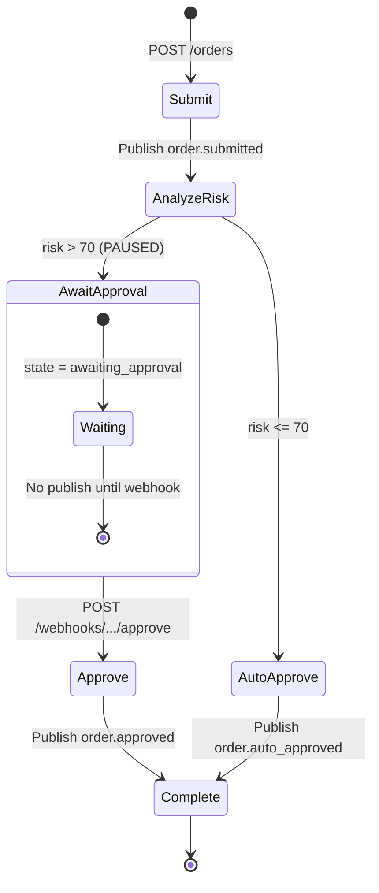
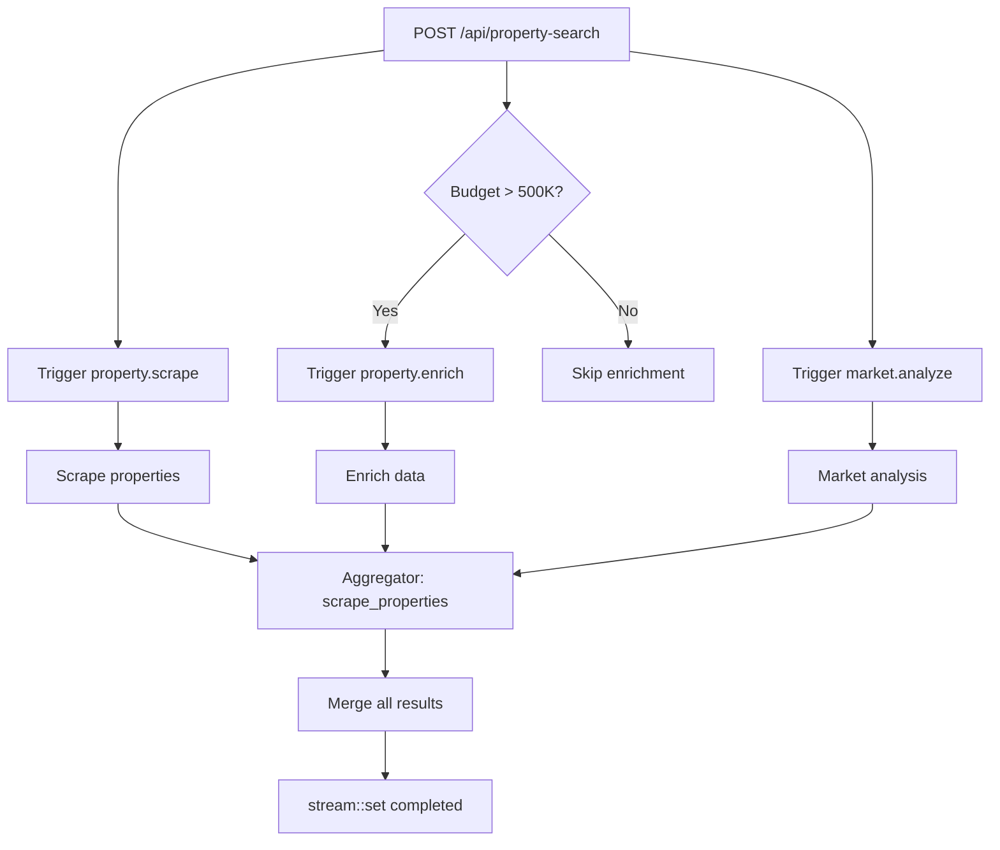

# Examples — Human-in-Loop, Chat Agent, Todo API, Property Search

**The examples repository contains four runnable applications demonstrating iii-sdk patterns.** Each example showcases a different architectural pattern and has been migrated from the Motia framework to iii-sdk, demonstrating iii's explicit registration pattern.

## Repository Structure

```
examples/
├── human-in-the-loop/       # Order approval workflow (TypeScript/Bun)
├── ai-chat-agent/           # AI chat with memory and web search (TypeScript/Bun)
├── todo-app/                # Full-featured Todo API (TypeScript/Bun)
└── property-search-agent/   # Real estate AI agent (Python)
```

## 1. Human-in-the-Loop Workflow

Source: `examples/human-in-the-loop/`

### The Pause Pattern

Source: `human-in-the-loop/src/handlers/analyze-risk.ts:35-48`

```typescript
if (riskScore > 70) {
  order.status = 'awaiting_approval'
  order.currentStep = 'awaiting_approval'
  order.requiresApproval = true

  await iii.trigger({
    function_id: 'state::set',
    payload: { scope: 'orders', key: orderId, value: order },
  })

  // Workflow STOPS here. No publish — the approval webhook will resume it.
}
```

**Aha:** The workflow pause is achieved simply by NOT publishing an event. The durable subscriber pattern means the workflow only continues when explicitly triggered. This is elegant state machine behavior without explicit state machine frameworks.

### Multi-Trigger Registration

Source: `human-in-the-loop/src/handlers/complete-order.ts:53-63`

```typescript
iii.registerTrigger({ type: 'durable:subscriber', function_id: ref.id, config: { topic: 'order.approved' } })
iii.registerTrigger({ type: 'durable:subscriber', function_id: ref.id, config: { topic: 'order.auto_approved' } })
```

The same function subscribes to multiple topics, enabling both auto-approved and human-approved orders to converge on the same fulfillment handler.

### Cron Timeout Detection

Source: `human-in-the-loop/src/handlers/detect-timeouts.ts:52-56`

```typescript
iii.registerTrigger({
  type: 'cron',
  function_id: ref.id,
  config: { expression: '0 */5 * * * * *' },  // Every 5 minutes (7-field cron)
})
```

Uses 7-field cron expression (seconds included) to scan for stuck orders.

## 2. AI Chat Agent

Source: `examples/ai-chat-agent/`

### Sliding Window Memory

Source: `ai-chat-agent/src/handlers/receive-chat-message.ts:15-26`

```typescript
const history = ((await iii.trigger({
  function_id: 'state::get',
  payload: { scope: `conversation:${sessionId}`, key: 'history' },
})) as ConversationMessage[] | null) || []

history.push({ role: 'user', content: message, timestamp })
const windowedHistory = history.slice(-20)  // Keep last 20 messages
```

**Aha:** The sliding window is applied BEFORE saving to state, not during retrieval. Older messages are permanently dropped, keeping storage bounded.

### Intent-Based Routing

Source: `ai-chat-agent/src/handlers/process-ai-agent.ts:41-76`

```typescript
let searchAction = null
try {
  const parsed = JSON.parse(initialResponse)
  if (parsed.action === 'search' && parsed.query) searchAction = parsed
} catch { /* Not JSON — direct answer */ }

if (searchAction) {
  await iii.trigger({ function_id: 'iii::durable::publish', payload: { topic: 'web-search-required', ... } })
} else {
  await iii.trigger({ function_id: 'iii::durable::publish', payload: { topic: 'agent-response-ready', ... } })
}
```

The AI's response is parsed as JSON to detect search intent, routing the workflow accordingly.

## 3. Todo App

Source: `examples/todo-app/`

The most comprehensive example with 15+ handlers:

### Service Layer Pattern

Source: `todo-app/src/services/todo.service.ts`

```typescript
export const todoService = {
  async create(input: CreateTodoInput): Promise<Todo> {
    const todo = { id: generateId(), ...input, status: 'pending', createdAt: now(), updatedAt: now() }
    await putOne(todo)
    return todo
  }
}
```

The service layer abstracts state operations, encapsulating `iii.trigger({ function_id: 'state::...' })` calls.

### Multi-Event Publishing

Source: `todo-app/src/handlers/update-todo.ts:39-62`

A single HTTP request triggers multiple downstream events:
- Stream updates (real-time UI)
- Durable topic for analytics
- Completion workflow (if status changed to completed)
- Notification events

### Achievement System with Streak Tracking

Source: `todo-app/src/handlers/todo-completed-workflow.ts:33-49`

```typescript
let streakDays = existing?.streakDays ?? 0
if (existing?.lastCompletionDate) {
  const yesterday = new Date(now); yesterday.setDate(yesterday.getDate() - 1)
  const yesterdayStr = yesterday.toISOString().split('T')[0]
  const lastStr = new Date(existing.lastCompletionDate).toISOString().split('T')[0]

  if (lastStr === yesterdayStr) { streakDays++ }
  else if (lastStr !== todayStr) { streakDays = 1 }  // Reset
}
```

**Aha:** Streak calculation compares date strings (YYYY-MM-DD) rather than timestamps, properly handling midnight boundaries.

## 4. Property Search Agent

Source: `examples/property-search-agent/`

A Python-based multi-agent system using Agno framework.

### Parallel Event Orchestration

Source: `property-search-agent/src/handlers/start_property_search.py:59-105`

```python
# Always trigger scraping
await iii.trigger_async({
    "function_id": "iii::durable::publish",
    "payload": {"topic": "property.scrape", "data": search_payload},
})

# Conditional enrichment for high budgets
if budget_range.get("max", 0) > 500_000:
    await iii.trigger_async({
        "function_id": "iii::durable::publish",
        "payload": {"topic": "property.enrich", "data": {...}},
    })

# Always trigger market analysis
await iii.trigger_async({
    "function_id": "iii::durable::publish",
    "payload": {"topic": "market.analyze", "data": {...}},
})
```

### Result Aggregation Pattern

Source: `property-search-agent/src/handlers/scrape_properties.py:78-122`

```python
async def _aggregate_results(search_id: str):
    results = await iii.trigger_async({"function_id": "stream::get", ...})
    market_data = await iii.trigger_async({"function_id": "state::get", ...})
    if market_data:
        results["marketAnalysis"] = market_data.get("analysis", "")
    # Similar merges for enrichment_data, neighborhood_data...
    results["status"] = "completed"
    await iii.trigger_async({"function_id": "stream::set", ...})
```

**Aha:** The scraper acts as an aggregator, pulling results from parallel processors via `state::get` calls and merging them into a unified stream update. This fan-out/fan-in pattern is coordinated through durable state, not in-memory queues.

## SDK Primitives Used

All examples use the same state/queue/stream primitives:

### State Operations

```typescript
// Get
const value = await iii.trigger({ function_id: 'state::get', payload: { scope: 'todos', key: id } })
// Set
await iii.trigger({ function_id: 'state::set', payload: { scope: 'todos', key: id, value: todo } })
// List
const all = await iii.trigger({ function_id: 'state::list', payload: { scope: 'todos' } })
// Delete
await iii.trigger({ function_id: 'state::delete', payload: { scope: 'todos', key: id } })
```

### Stream Operations

```typescript
await iii.trigger({
  function_id: 'stream::set',
  payload: { stream_name: 'chatResponse', group_id: sessionId, item_id: messageId, data: response }
})
```

### Queue/Durable Topics

```typescript
// Publish
await iii.trigger({ function_id: 'iii::durable::publish', payload: { topic: 'order.submitted', data: { orderId } } })
// Subscribe (via trigger registration)
iii.registerTrigger({ type: 'durable:subscriber', function_id: ref.id, config: { topic: 'order.submitted' } })
```

## Key Insights

1. **Explicit registration pattern** — iii-sdk requires `registerFunction` + `registerTrigger` calls, giving developers full control.
2. **State as checkpoint** — Durable workflows use state as explicit checkpoints. The pause is just "don't publish."
3. **Multi-language consistency** — TypeScript and Python SDKs expose identical primitives.
4. **Event-driven composition** — Handlers composed via durable topics, not direct calls.
5. **7-field cron** — Includes seconds: `second minute hour day month weekday year`.
6. **Fan-out/fan-in** — Parallel processors write to state, aggregator reads and merges.

## Human-in-the-Loop State Machine



## Property Search Fan-Out/Fan-In



## What's Next

- [14 — Data Flow](14-data-flow.md) — End-to-end flows for all patterns demonstrated here
- [15 — Cross-Cutting](15-cross-cutting.md) — Testing strategy and CI/CD
- [00 — Overview](00-overview.md) — Return to overview
