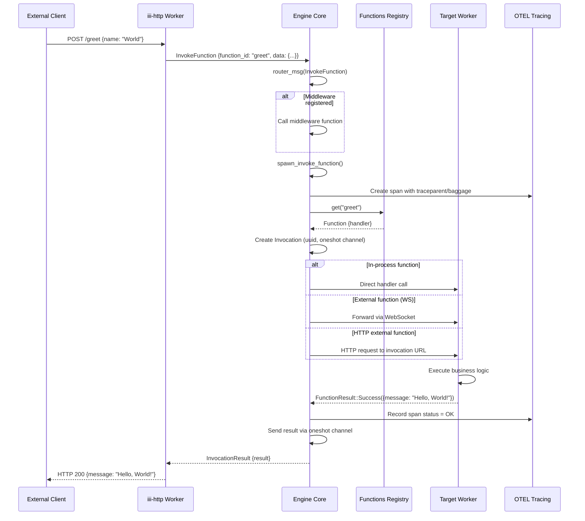
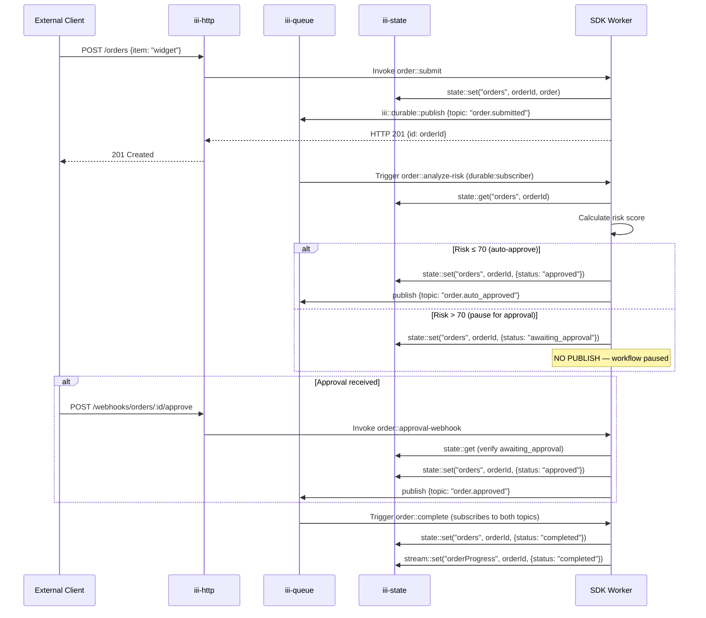
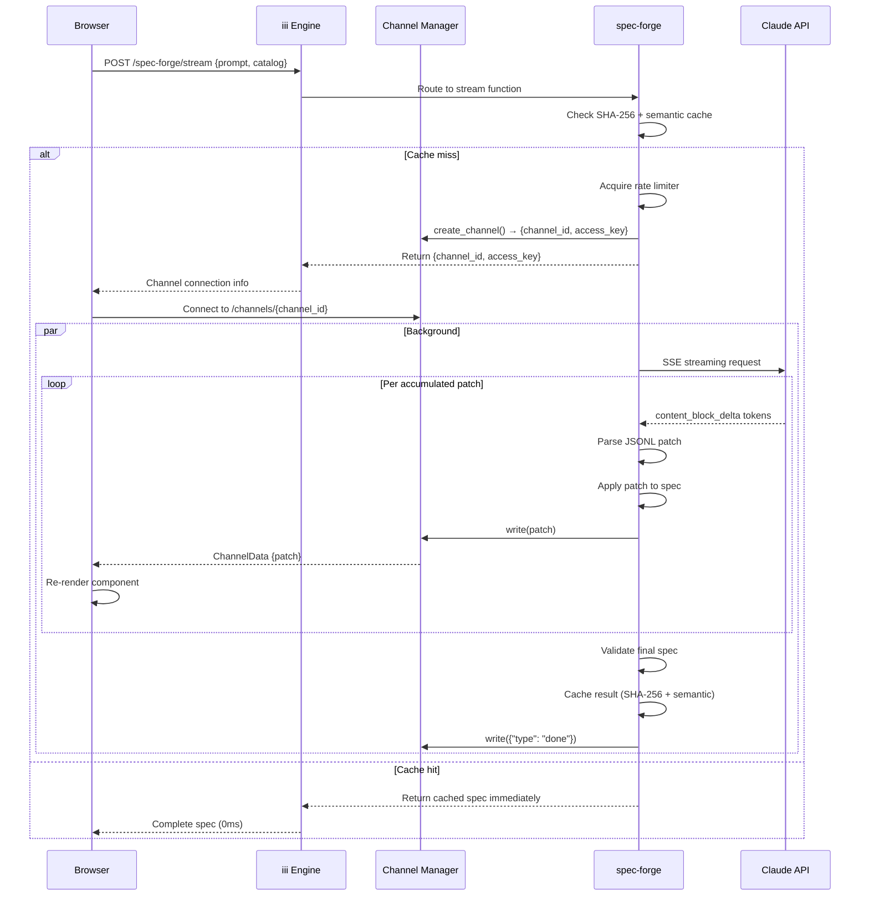
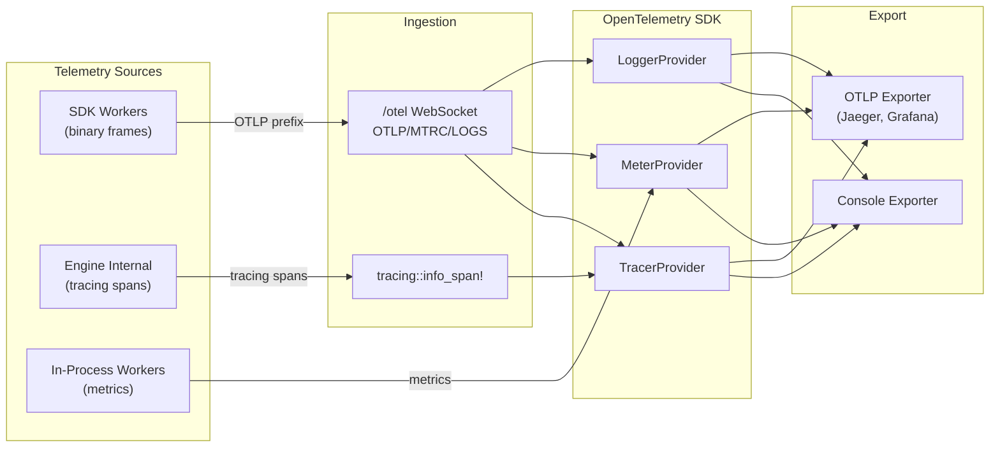
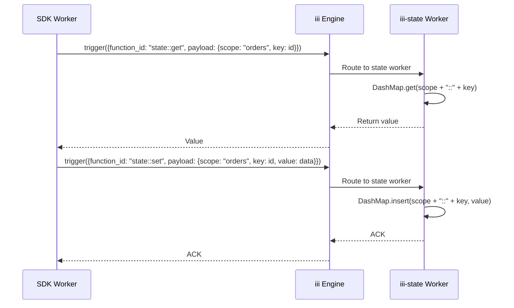
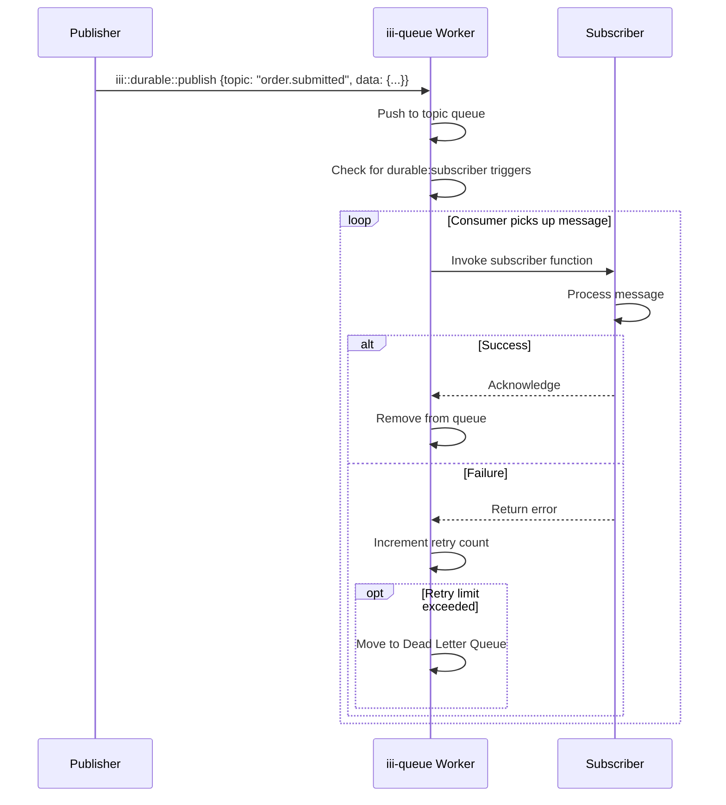

# Data Flow — End-to-End Invocation, Durable Workflows, Streaming, Telemetry

**This document traces data through the iii system end-to-end.** We follow requests from entry point through the engine, to workers, and back — covering function invocation, durable queue workflows, streaming updates, and telemetry pipelines.

## Function Invocation Flow



## Durable Queue Workflow

The human-in-the-loop pattern demonstrates durable workflows:



**Aha:** The workflow pause is achieved by NOT publishing an event. The durable subscriber pattern means the workflow only continues when explicitly triggered. The state is the checkpoint, and the absence of an event is the pause signal.

## Streaming Updates

The spec-forge streaming flow demonstrates iii Channels:



## Telemetry Pipeline



### Binary Frame Processing

```
┌───────────────────────────────────────────┐
│ WebSocket Binary Frame                    │
├─────────────┬─────────────────────────────┤
│ 4-byte prefix │ JSON payload              │
├─────────────┼─────────────────────────────┤
│ OTLP          │ OpenTelemetry trace spans  │
│ MTRC          │ OpenTelemetry metrics      │
│ LOGS          │ OpenTelemetry logs         │
└─────────────┴─────────────────────────────┘
```

Each frame:
1. Checked for prefix match (`bytes.starts_with(OTLP_WS_PREFIX)`)
2. Payload extracted (prefix bytes removed)
3. Parsed as UTF-8 JSON
4. Ingested via appropriate OTEL handler
5. Bypasses message routing entirely

## State Access Pattern

All examples and workers use the same state primitive:



## Queue Message Flow



## What's Next

- [15 — Cross-Cutting](15-cross-cutting.md) — Security, configuration, testing, CI/CD
- [00 — Overview](00-overview.md) — Return to overview
