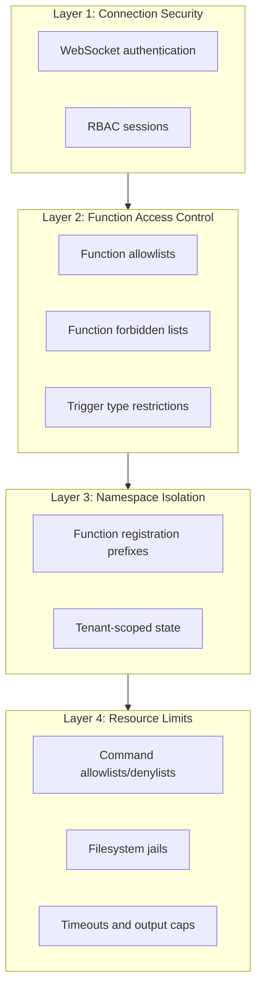
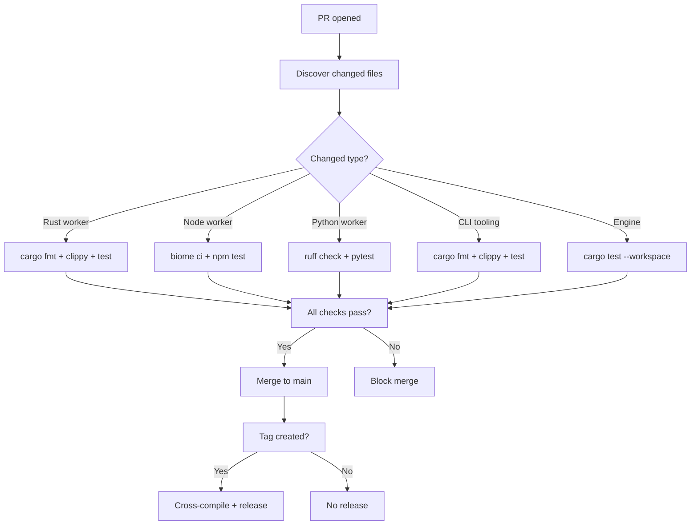
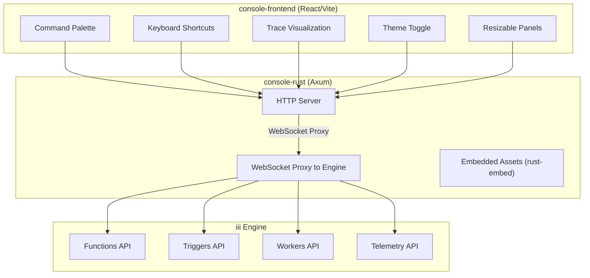

# Cross-Cutting Concerns — Security, Configuration, Testing, CI/CD, Console

**This document covers cross-cutting concerns that span the entire iii ecosystem** — security model, configuration system, testing strategy, CI/CD pipelines, and the console architecture.

## Security Model

### Defense-in-Depth Layers

iii implements security at multiple levels:



### RBAC Sessions

Source: `engine/src/workers/worker/rbac_session.rs`

```rust
pub struct Session {
    pub function_registration_prefix: Option<String>,
    pub allowed_functions: Option<Vec<String>>,
    pub forbidden_functions: Option<Vec<String>>,
    pub allowed_trigger_types: Option<Vec<String>>,
}
```

| Session Field | Purpose | Example |
|--------------|---------|---------|
| `function_registration_prefix` | Auto-prefix all registered functions | `tenant_a::greet` |
| `allowed_functions` | Allowlist of invocable functions | `["state::*", "greet"]` |
| `forbidden_functions` | Blocklist of forbidden functions | `["shell::exec", "database::execute"]` |
| `allowed_trigger_types` | Allowed trigger types for registration | `["http", "cron"]` |

### Shell Worker Security

Source: `workers/shell/src/config.rs`

Five security layers:

| Layer | Mechanism | Example |
|-------|-----------|---------|
| Allowlist | Permitted commands only | `["git", "cargo", "npm"]` |
| Denylist | Forbidden regex patterns | `["rm\\s+-rf\\s+/"]` |
| Filesystem jail | Path restriction | `host_root: "${HOME}/projects"` |
| Resource caps | Timeouts, output limits | `timeout_ms: 30000` |
| Size limits | Read/write byte caps | `max_read_bytes: 10485760` |

### Coder Worker Path Security

Source: `workers/coder/src/config.rs`

```yaml
jail_root: "${WORKER_JAIL}"
denylist_patterns: ["*.secret", "**/.git/**"]
max_read_bytes: 1048576
max_write_bytes: 1048576
```

The path validation normalizes paths and rejects anything that escapes the jail root.

## Configuration System

### Engine Configuration

Source: `engine/src/workers/config.rs` (2,311 lines)

```yaml
modules:
  - name: iii-observability
  - name: iii-http
    config:
      port: 3000
      cors:
        allowed_origins: ["*"]
  - name: iii-state
    config:
      adapter:
        name: redis
        config:
          url: redis://localhost:6379

workers:
  - name: iii-worker-manager
  - name: shell
    config:
      allowlist: ["git", "cargo", "npm"]
```

### Environment Variable Expansion

Source: `engine/src/workers/config.rs:47`

```rust
pub fn expand_env_vars(yaml_content: &str) -> String {
    static RE: LazyLock<Regex> =
        LazyLock::new(|| Regex::new(r"\$\{([^}:]+)(?::([^}]*))?\}").unwrap());
    // ${VAR} → env var value
    // ${VAR:default} → env var value or default
}
```

### Hot Reload

Source: `workers/reload.rs`

The engine watches `config.yaml` for changes:

1. `notify::RecommendedWatcher` detects file changes
2. Debounce 500ms
3. Parse new config
4. Compute diff: added/removed/changed workers
5. Apply changes atomically

## Testing Strategy

### Engine Tests

Source: `engine/tests/`

| Test File | Purpose |
|-----------|---------|
| `http_e2e_*.rs` | HTTP function invocation tests |
| `queue_e2e_*.rs` | Queue system integration tests |
| Various | Unit tests in `#[cfg(test)]` modules |

```bash
cargo test --workspace --all-features
cargo test -p iii --all-features  # Engine tests only
```

### SDK Tests

Source: `sdk/packages/rust/iii/tests/`

| Test File | Purpose |
|-----------|---------|
| `api_triggers.rs` | HTTP trigger registration and invocation |
| `bridge.rs` | Bridge client communication |
| `data_channels.rs` | Channel streaming tests |
| `healthcheck.rs` | Worker health check |
| `middleware.rs` | Middleware function tests |
| `pubsub.rs` | Pub/sub messaging |
| `queue_integration.rs` | Queue system tests |
| `rbac_workers.rs` | RBAC session tests |
| `registration_dedup.rs` | Duplicate registration handling |

### E2E Tests

Source: `cli-tooling/crates/scaffolder-core/tests/`

The E2E harness provides:
- `Scenario` struct for test lifecycle management
- Automatic scaffolding into temp directories
- iii engine startup and process management
- Worker discovery from template manifests
- HTTP helpers for endpoint testing

### Example Test Scripts

Each example includes a shell script for end-to-end testing:

| Example | Test Script | What It Tests |
|---------|-------------|---------------|
| human-in-the-loop | `test-htl-flow.sh` | Full approval workflow |
| todo-app | `test-todo-flow.sh` | CRUD + event chains |

## CI/CD Pipelines

### Engine CI

```bash
# Lint
cargo fmt --check
cargo clippy -- -D warnings

# Test
cargo test --workspace --all-features
```

### Workers CI

Source: `workers/.github/workflows/ci.yml`

Per-worker pipeline:

| Step | Action |
|------|--------|
| Discover | Find changed workers from PR diff |
| Validate | Check `iii.worker.yaml`, README.md, version bump |
| Rust Lint | `cargo fmt`, `cargo clippy`, `cargo test` |
| Node Lint | `biome ci`, `npm test` |
| Python Lint | `ruff check`, `ruff format`, `pytest` |

### Worker Release Flow

Source: `workers/.github/workflows/release.yml`

| Step | Action |
|------|--------|
| Create Tag | `<worker>/v<X.Y.Z>` |
| Cross-compile | 9 targets (Linux, macOS, Windows) |
| Upload | GitHub Release with SHA-256 checksums |
| Publish | `POST /publish` to workers registry API |

### CLI Tooling Release

Source: `cli-tooling/.github/workflows/release.yml`

| Step | Action |
|------|--------|
| Build | 7 targets × 2 binaries = 14 builds |
| Release | GitHub release with auto-generated notes |
| Homebrew | Dispatch publish-homebrew workflow |

## CI/CD Pipeline Flow



## Console Architecture

Source: `iii/console/`

The developer console is a React SPA served by a Rust backend:

**Aha:** The console proxies the engine WebSocket on the same HTTP port as the SPA, avoiding CORS issues entirely. The browser sees one origin for both the UI and the WebSocket connection — no preflight, no cross-origin headers, no proxy configuration needed.



### Frontend Components

Source: `console/packages/console-frontend/src/`

| Component | Purpose |
|-----------|---------|
| `command-palette.tsx` | Quick access to all operations |
| `keyboard-shortcut-overlay.tsx` | Keyboard shortcut reference |
| `useTraceData.ts` | OTEL trace data fetching |
| `useTraceFilters.ts` | Trace filtering and grouping |
| `otel-utils.ts` | OpenTelemetry data transformation |
| `traceGroups.ts` | Trace grouping logic |
| `traceTransform.ts` | Trace data transformation |

### WebSocket Proxy

Source: `console/packages/console-rust/src/proxy.rs`

The console proxies the engine WebSocket on the same HTTP port as the SPA, avoiding CORS issues.

## Key Files Reference

| Concept | File | Significance |
|---------|------|-------------|
| Engine struct | `engine/src/engine/mod.rs:228` | Central coordinator |
| Message protocol | `engine/src/protocol.rs` | All message types |
| Worker trait | `engine/src/workers/traits.rs:46` | Worker interface |
| Function registry | `engine/src/function.rs:58` | Function storage |
| Trigger registry | `engine/src/trigger.rs:60` | Trigger management |
| Invocation handler | `engine/src/invocation/mod.rs` | Function execution |
| RBAC session | `engine/src/workers/worker/rbac_session.rs` | Access control |
| Config builder | `engine/src/workers/config.rs:534` | EngineBuilder |
| Hot reload | `engine/src/workers/reload.rs` | Config watching |
| OTEL integration | `engine/src/workers/observability/otel.rs` | 6,101 lines |
| SDK Node entry | `sdk/packages/node/iii/src/index.ts` | Node SDK exports |
| SDK Rust entry | `sdk/packages/rust/iii/src/lib.rs` | Rust SDK exports |

## What's Next

- [00 — Overview](00-overview.md) — Return to overview
- [01 — Architecture](01-architecture.md) — Full dependency graph
- [14 — Data Flow](14-data-flow.md) — End-to-end flows
