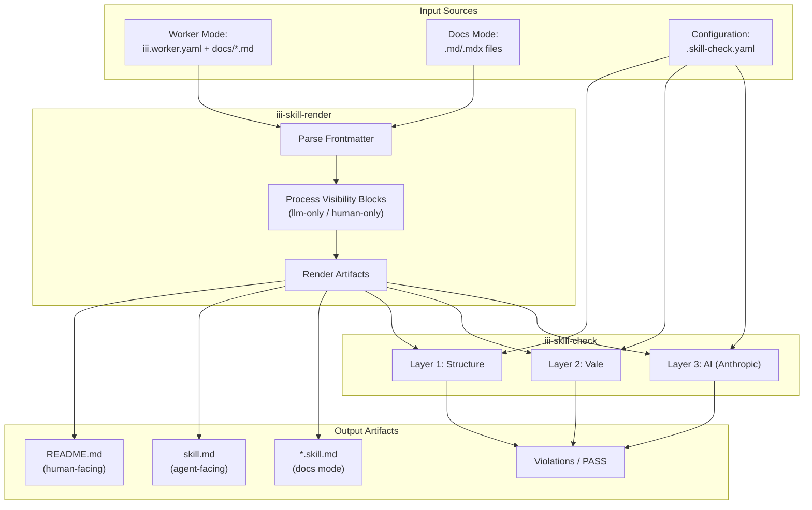
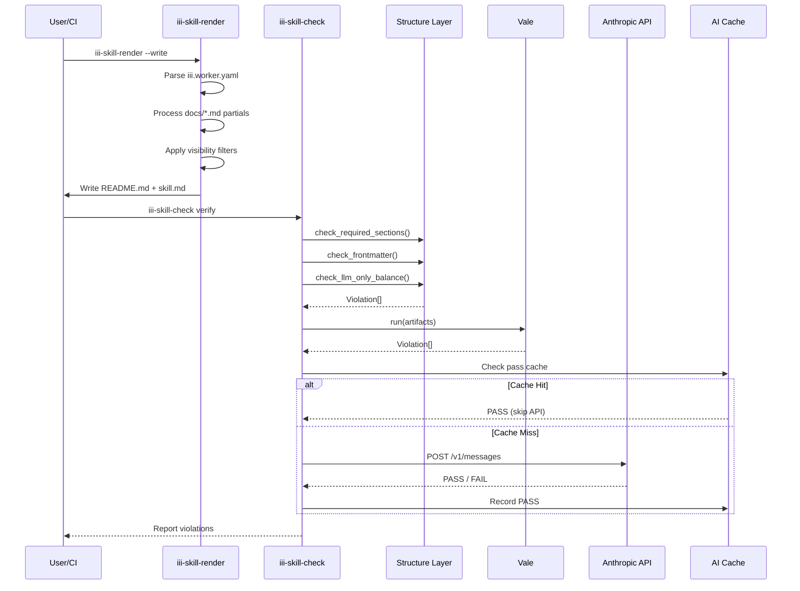
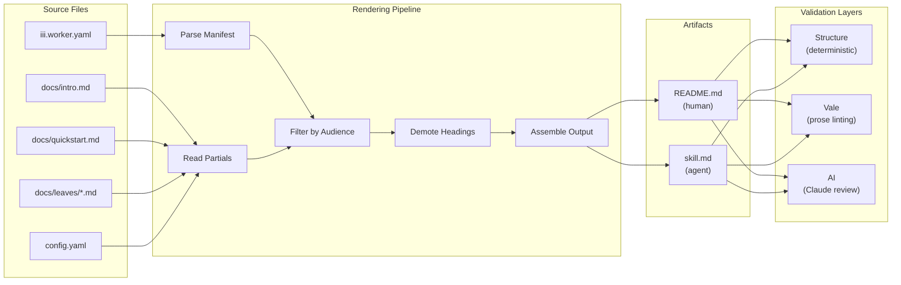

# Project Exploration: skills-and-validation

## Overview

The **skills-and-validation** project is a comprehensive documentation validation and rendering system for the iii (Intelligent Infrastructure Interface) ecosystem. It provides automated tooling to render, validate, and maintain high-quality documentation across iii workers and standalone documentation projects.

The system operates in two primary modes:

1. **Worker Mode**: Renders and validates iii worker documentation, producing both human-facing README.md files and agent-facing skill.md artifacts from markdown partials stored in `docs/` directories.

2. **Docs Mode**: Validates standalone documentation (Mintlify, Fumadocs, etc.) by rendering `.md` and `.mdx` files into skill artifacts with Diataxis-aware validation.

The validation pipeline implements a three-layer architecture: deterministic structure checks, Vale-based prose linting, and AI-powered content review using Anthropic's Claude models. This multi-layer approach catches everything from malformed YAML frontmatter to voice inconsistencies and Diataxis pattern violations.

**Key insight**: The project elegantly solves the "dual audience" problem by supporting `llm-only` and `human-only` visibility blocks, allowing a single source document to serve both human readers (who see the README) and AI agents (who consume the skill.md).

---

## Repository

- **Location:** `/home/darkvoid/Boxxed/@formulas/src.rust/src.llamacpp/src.iii/skills-and-validation/`
- **Remote:** `git@github.com:iii-hq/skills-and-validation`
- **Primary Language:** Rust (40 source files)
- **License:** Not specified in repository

---

## Directory Structure

```
/home/darkvoid/Boxxed/@formulas/src.rust/src.llamacpp/src.iii/skills-and-validation/
├── Cargo.toml                    # Workspace root - defines 3 crate members
├── Cargo.lock                    # Dependency lock file
├── action.yml                    # GitHub Actions composite action definition (641 lines)
├── README.md                     # Project documentation (508 lines)
├── .skill-check.yaml             # Self-validation config (docs mode)
├── .gitignore                    # Git ignore patterns
│
├── crates/                       # Rust workspace crates
│   ├── iii-skill-core/           # Core validation library
│   │   ├── Cargo.toml            # Package manifest
│   │   └── src/                  # Source code
│   │       ├── lib.rs            # Library exports (14 modules)
│   │       ├── config.rs         # .skill-check.yaml parsing (v1/v2 schema)
│   │       ├── render.rs         # Worker rendering engine (333 lines)
│   │       ├── structure.rs      # Layer 1: deterministic checks (321 lines)
│   │       ├── ai.rs             # Layer 3: Anthropic AI validation (266 lines)
│   │       ├── ai_cache.rs       # Persistent AI pass caching (152 lines)
│   │       ├── vale.rs           # Layer 2: Vale prose linting (81 lines)
│   │       ├── bundle.rs         # Content bundle resolution (48 lines)
│   │       ├── introspect.rs     # Worker manifest parsing (54 lines)
│   │       ├── llm_only.rs       # LLM-only block handling (199 lines)
│   │       ├── human_only.rs     # Human-only block handling (229 lines)
│   │       ├── source_map.rs     # Violation source mapping (139 lines)
│   │       ├── update_check.rs   # Binary version checking (259 lines)
│   │       └── docs/             # Docs-mode validation surface
│   │           ├── mod.rs        # Module exports
│   │           ├── frontmatter.rs # YAML frontmatter parsing (182 lines)
│   │           ├── markers.rs    # skill: marker scanning (262 lines)
│   │           ├── render.rs     # Docs rendering pipeline (274 lines)
│   │           ├── enumerate.rs  # Doc discovery via globs (321 lines)
│   │           ├── structure.rs  # Docs structure validation (160 lines)
│   │           ├── check_rendered.rs # Drift detection (234 lines)
│   │           └── vale_config.rs # Runtime Vale config generation (173 lines)
│   │
│   ├── iii-skill-render/         # Render-only CLI binary
│   │   ├── Cargo.toml            # Package manifest
│   │   └── src/main.rs           # Entry point (235 lines)
│   │
│   └── iii-skill-check/          # Full validation CLI binary
│       ├── Cargo.toml            # Package manifest
│       └── src/main.rs           # Entry point (1215 lines)
│
├── content/                      # Bundled validation rules and guides
│   ├── .vale.ini                 # Vale configuration for worker mode
│   ├── github_workflows_example.yml # Example CI workflow
│   ├── project-rules/            # AI validation rules (9 files)
│   │   ├── voice.md              # Voice and tone guidelines
│   │   ├── general.md            # General writing rules
│   │   ├── workers.md            # Worker-specific rules
│   │   ├── sdks.md               # SDK documentation rules
│   │   ├── cli.md                # CLI documentation rules
│   │   ├── config.md             # Configuration documentation rules
│   │   ├── console.md            # Console output rules
│   │   ├── docs.md               # Documentation structure rules
│   │   └── _skill-check-prompt.md # AI system prompt
│   │
│   ├── skills/                   # Skill bundles for skillkit
│   │   ├── iii-skill-authoring/  # Worker authoring guide (9 files)
│   │   │   ├── SKILL.md          # Bundle manifest
│   │   │   ├── quickstart.md     # Getting started guide
│   │   │   ├── structure.md      # Document structure guide
│   │   │   ├── skeleton.md       # Template for new workers
│   │   │   ├── voice.md          # Voice guidelines
│   │   │   ├── leaves.md         # Leaf document authoring
│   │   │   ├── llm-only-blocks.md # LLM-only directive usage
│   │   │   ├── human-only-blocks.md # Human-only directive usage
│   │   │   └── check.md          # Validation guide
│   │   │
│   │   └── iii-doc-authoring/    # Docs authoring guide (9 files)
│   │       ├── SKILL.md
│   │       ├── quickstart.md
│   │       ├── frontmatter.md    # Mintlify frontmatter guide
│   │       ├── types.md          # Diataxis type guide
│   │       ├── markers.md        # skill: marker guide
│   │       ├── llm-only-blocks.md
│   │       ├── human-only-blocks.md
│   │       ├── voice.md
│   │       └── diataxis/         # Diataxis guides (5 files)
│   │           ├── doc_tutorial.md
│   │           ├── doc_howto.md
│   │           ├── doc_reference.md
│   │           ├── doc_explanation.md
│   │           └── doc_workflow.md
│   │
│   └── styles/                   # Vale style rules
│       ├── Diataxis/             # Diataxis pattern rules (12 files)
│       │   ├── HowTo.yml
│       │   ├── HowToBackground.yml
│       │   ├── Tutorial.yml
│       │   ├── TutorialExplanation.yml
│       │   ├── TutorialAbstraction.yml
│       │   ├── TutorialReferenceLists.yml
│       │   ├── Reference.yml
│       │   ├── ReferenceOpinion.yml
│       │   ├── ReferenceTeaching.yml
│       │   ├── Explanation.yml
│       │   ├── ExplanationImperatives.yml
│       │   └── CrossContamination.yml
│       │
│       └── Terminology/          # Terminology rules (10 files)
│           ├── SlopMarketing.yml
│           ├── SlopMagic.yml
│           ├── SlopEase.yml
│           ├── SlopConnection.yml
│           ├── SlopFlow.yml
│           ├── EmDash.yml
│           ├── Hedges.yml
│           ├── ForbiddenTerms.yml
│           ├── BackendSoftware.yml
│           └── NegationContrast.yml
│
├── scripts/                      # Shell scripts for CI and local use
│   ├── install.sh                # Local installation script (114 lines)
│   ├── install-hook.sh           # Pre-commit hook installer
│   ├── pre-commit-hook.sh        # Git pre-commit hook logic
│   ├── ci-install.sh             # CI binary installation
│   ├── verify-workers.sh         # Worker validation orchestration
│   ├── verify-docs.sh            # Docs validation orchestration
│   ├── annotate.sh               # GitHub annotation formatter
│   ├── summary.sh                # PR comment summary generator
│   ├── augment-summary-drift.sh  # Drift reporting
│   ├── pr-comment.sh             # Sticky PR comment manager
│   ├── config-verdict-changed.sh # Config change detection
│   └── test-e2e.sh               # End-to-end test runner
│
├── templates/                    # Template files for consumers
│   └── example-worker/           # Starter worker template
│       ├── iii.worker.yaml       # Worker manifest
│       ├── config.yaml           # Runtime configuration
│       └── docs/                 # Documentation partials
│           ├── intro.md
│           ├── quickstart.md
│           ├── companions.md
│           ├── migration.md
│           └── leaves/           # Per-function how-tos
│               ├── analyze.md
│               ├── diff.md
│               └── summarize.md
│
└── fixtures/                     # Test fixtures
    ├── bad-concept-worker/       # Intentionally broken worker
    ├── bad-sdk-worker/           # SDK-related test case
    ├── broken-worker/            # Structure violation examples
    └── example-docs/             # Docs mode test cases
        ├── how-to/
        ├── reference/
        ├── tutorials/
        └── draft.mdx
```

---

## Architecture

### High-Level Diagram



### Validation Pipeline Sequence



---

## Component Breakdown

### iii-skill-core (Library)

**Location:** `crates/iii-skill-core/src/lib.rs`

The core library exports 14 modules that implement the complete validation pipeline:

```rust
// crates/iii-skill-core/src/lib.rs:1-14
pub mod ai;
pub mod ai_cache;
pub mod bundle;
pub mod config;
pub mod docs;
pub mod human_only;
pub mod introspect;
pub mod llm_only;
pub mod render;
pub mod source_map;
pub mod structure;
pub mod update_check;
pub mod vale;
```

**Key insight**: The module organization follows the three-layer validation architecture, with dedicated modules for visibility block processing (`llm_only`, `human_only`) and source mapping for actionable error reporting.

#### config.rs - Configuration Management

**Location:** `crates/iii-skill-core/src/config.rs:1-89`

Parses `.skill-check.yaml` with support for two schema versions:

**Version 1 (implicit worker mode):**
```yaml
version: 1
ai_check:
  provider: anthropic
  model: claude-opus-4-7
  api_key_env_var: ANTHROPIC_API_KEY
  max_tokens: 6000
```

**Version 2 (explicit mode selection):**
```yaml
version: 2
mode: docs  # or "worker"
docs:
  include: ["**/*.md", "**/*.mdx"]
  exclude: ["fixtures/**"]
ai_check:
  provider: anthropic
  model: claude-sonnet-4-6
  api_key_env_var: ANTHROPIC_API_KEY
  max_tokens: 6000
```

The `Config` struct uses serde for deserialization with custom enums for mode selection:

```rust
// crates/iii-skill-core/src/config.rs:25-30
#[derive(Debug, Deserialize, Clone, Copy, PartialEq, Eq)]
#[serde(rename_all = "snake_case")]
pub enum Mode {
    Worker,
    Docs,
}
```

#### render.rs - Worker Rendering Engine

**Location:** `crates/iii-skill-core/src/render.rs:1-333`

The rendering engine produces two artifacts from worker partials:

1. **README.md** (human-facing): Strips `llm-only` blocks, unwraps `human-only` blocks
2. **skill.md** (agent-facing): Unwraps `llm-only` blocks, strips `human-only` blocks

**Aha moment**: The `Audience` enum at line 17 drives the two-pass filter system:

```rust
// crates/iii-skill-core/src/render.rs:15-21
#[derive(Clone, Copy)]
enum Audience {
    Readme,  // Human-facing: drop llm-only, reveal human-only
    Skill,   // Agent-facing: reveal llm-only, drop human-only
}
```

The `render_readme` function (lines 93-138) assembles sections in strict order:
1. Frontmatter block (YAML with name/description/tags)
2. Generated banner comment
3. H1 title from `iii.worker.yaml`
4. intro.md content
5. Install section with `iii worker add {name}`
6. Quickstart section
7. Configuration section (inlined config.yaml)
8. Optional migration notes
9. Additional HOWTOs (inlined leaves)

The `demote_headings` function (lines 189-213) ensures leaf content nests correctly under `## Additional HOWTOs` by demoting all ATX headings by 2 levels (capped at H6).

#### structure.rs - Deterministic Validation

**Location:** `crates/iii-skill-core/src/structure.rs:1-321`

Layer 1 of the validation pipeline performs fast, deterministic checks:

**Required sections check** (lines 167-195):
```rust
fn check_required_sections(readme: &str) -> Vec<Violation> {
    let required = ["## Install", "## Quickstart", "## Configuration"];
    // Verifies presence and correct ordering
}
```

**Frontmatter validation** (lines 115-142):
- Must start with `---\n`
- Must contain `name:` field
- Must close with `---`

**Visibility block balance** (lines 235-274):
```rust
fn check_llm_only_balance(label: &str, content: &str) -> Vec<Violation> {
    let starts = content.lines().filter(|l| is_llm_only_start(l)).count();
    let ends = content.lines().filter(|l| is_llm_only_end(l)).count();
    if starts == ends { return Vec::new(); }
    vec![Violation::error(label, None, 
        format!("unbalanced llm-only blocks: {starts} start, {ends} end"))]
}
```

#### ai.rs - AI-Powered Validation

**Location:** `crates/iii-skill-core/src/ai.rs:1-266`

Layer 3 uses Anthropic's Messages API with prompt caching for cost efficiency:

**Prompt construction with cache breakpoints** (lines 197-256):
```rust
fn call_anthropic(
    system_prompt: &str,
    cached_user_prefix: &str,      // Rules (cached)
    uncached_user_suffix: &str,    // Per-artifact content
    model: &str,
    api_key_env_var: &str,
    max_tokens: u32,
) -> anyhow::Result<Result<(), String>> {
    let body = serde_json::json!({
        "model": model,
        "max_tokens": max_tokens,
        "system": [{
            "type": "text",
            "text": system_prompt,
            "cache_control": { "type": "ephemeral" }  // Cache breakpoint
        }],
        "messages": [{
            "role": "user",
            "content": [
                {
                    "type": "text",
                    "text": cached_user_prefix,
                    "cache_control": { "type": "ephemeral" }  // Cache breakpoint
                },
                { "type": "text", "text": uncached_user_suffix }
            ]
        }]
    });
    // ...
}
```

**Aha moment**: Two cache breakpoints (system prompt + rules prefix) mean the expensive context is shared across all artifacts in a run. After the first API call, subsequent calls hit the cache at ~10% of the cost.

The AI layer expects exactly "PASS" (whitespace-tolerated) for success; any other content is treated as a violation report.

#### ai_cache.rs - Persistent Pass Caching

**Location:** `crates/iii-skill-core/src/ai_cache.rs:1-152`

**Aha moment**: Only PASS results are cached. FAILs always re-run to prevent flaky model responses from being permanently pinned.

Cache key includes all inputs that could change the verdict:
- Artifact text
- Rules text
- System prompt
- Model name
- Doc type (optional)

```rust
// crates/iii-skill-core/src/ai_cache.rs:41-67
pub fn cache_key(
    artifact_text: &str,
    rules: &str,
    system_prompt: &str,
    model: &str,
    doc_type: Option<crate::docs::frontmatter::DocType>,
) -> String {
    let mut hasher = Sha256::new();
    hasher.update(CACHE_KEY_VERSION.as_bytes());
    hasher.update([0u8]);  // NUL separator prevents boundary ambiguity
    hasher.update(artifact_text.as_bytes());
    hasher.update([0u8]);
    hasher.update(rules.as_bytes());
    // ... more fields
    to_hex(&hasher.finalize())
}
```

#### llm_only.rs and human_only.rs - Visibility Blocks

**Location:** `crates/iii-skill-core/src/llm_only.rs` and `human_only.rs`

These modules implement dual-audience content filtering. Both support two comment forms:
- HTML: `<!-- llm-only:start --> ... <!-- llm-only:end -->`
- MDX: `{/* llm-only:start */} ... {/* llm-only:end */}`

**Key operations:**

`unwrap_llm_only()` - Reveals LLM-only content by stripping markers and expanding inline forms:
```rust
// Input: "Before\n<!-- llm-only:start -->\nSecret\n<!-- llm-only:end -->\nAfter"
// Output: "Before\n\nSecret\n\nAfter"
```

`strip_llm_only()` - Hides LLM-only content (used for human-facing README):
```rust
// Input: "Before\n<!-- llm-only:start -->\nSecret\n<!-- llm-only:end -->\nAfter"
// Output: "Before\n\n\nAfter"
```

**Aha moment**: Mixed comment forms work across block boundaries - you can open with HTML form and close with MDX form. This supports gradual migration and copy-paste between file types.

#### source_map.rs - Violation Source Mapping

**Location:** `crates/iii-skill-core/src/source_map.rs:1-139`

Translates violations from rendered artifacts back to source files users actually edit:

```rust
// crates/iii-skill-core/src/source_map.rs:106-138
pub fn translate(rendered: &Path, rendered_line: usize) -> Option<(PathBuf, usize)> {
    let cands = candidates(rendered);
    // Read the offending line from rendered file
    // Search candidate sources for exact match
    // Return (source_path, source_line)
}
```

For worker mode, candidates are: `docs/intro.md`, `docs/quickstart.md`, `docs/companions.md`, then all `docs/leaves/*.md` files sorted alphabetically.

### iii-skill-render (CLI)

**Location:** `crates/iii-skill-render/src/main.rs:1-235`

The render-only binary walks up from the target to find `.skill-check.yaml`, then dispatches based on resolved mode:

```rust
// crates/iii-skill-render/src/main.rs:42-82
match config.resolved_mode() {
    iii_skill_core::config::Mode::Worker => {
        // Validate target is directory with iii.worker.yaml
        render_worker_dir(&cli.target, cli.write)
    }
    iii_skill_core::config::Mode::Docs => {
        // Support single file or docs root
        if cli.target.is_file() { render_single_doc(...) }
        else { render_docs_root(...) }
    }
}
```

### iii-skill-check (CLI)

**Location:** `crates/iii-skill-check/src/main.rs:1-1215`

The full validation binary implements three subcommands:

1. **`verify`** - Run all configured layers against a target
2. **`verify-rendered`** - Check if rendered artifacts match sources (drift detection)
3. **`check-file`** - Validate a single file with explicit doc type

**Key insight**: The `dispatch_verify` function (lines 127-167) uses the controlling `.skill-check.yaml` to determine mode, ensuring a single source of truth for configuration.

**Staging for Vale** (lines 236-265): Since Vale requires files on disk but the renderer can operate in-memory, the binary stages artifacts in a temp directory while preserving the original paths for violation reporting:

```rust
// crates/iii-skill-check/src/main.rs:248-265
fn rewrite_vale_paths(
    violations: &mut [iii_skill_core::structure::Violation],
    staged: &[StagedArtifact],
) {
    for v in violations.iter_mut() {
        for s in staged {
            if v.file == s.temp.to_string_lossy() {
                v.file = s.canonical.display().to_string();
            }
        }
    }
}
```

---

## Entry Points

### iii-skill-render

**File:** `crates/iii-skill-render/src/main.rs`

**Execution Flow:**
1. Parse CLI arguments (`target`, `--write`, `--allow-old-version`)
2. Run version check gate (can exit if out of date)
3. Walk up from target to find `.skill-check.yaml`
4. Load configuration and resolve mode (worker/docs)
5. **Worker mode:**
   - Validate target is a directory with `iii.worker.yaml`
   - Call `iii_skill_core::render::render_worker(dir)`
   - If `--write`: Write `README.md` and `skill.md`, remove stale `skills/` directory
6. **Docs mode:**
   - If target is a file: Render single doc
   - If target is a directory: Enumerate and render all in-scope docs
   - If `--write`: Write `<source>.skill.md` siblings, clean up orphans

### iii-skill-check

**File:** `crates/iii-skill-check/src/main.rs`

**Execution Flow for `verify`:**
1. Parse CLI arguments (target, `--layers`, `--rules-dir`, `--vale-config`)
2. Walk up from target to find controlling `.skill-check.yaml`
3. Dispatch based on resolved mode:
   - **Worker mode:** `verify_worker()`
     - Run structure layer against source files
     - Render artifacts in-memory
     - Stage for Vale (temp directory)
     - Run Vale layer
     - Run AI layer (with cache check)
     - Report violations with source mapping
   - **Docs mode:** `verify_docs()` or `verify_doc_file()`
     - Enumerate in-scope docs via globs
     - Render each doc in validator mode (llm-only stripped)
     - Stage and validate with Vale (type-aware config)
     - Run AI layer with per-doc type hints

**Execution Flow for `verify-rendered`:**
1. Load controlling config
2. Re-render target(s) in memory
3. Compare against on-disk artifacts
4. Report drift (exit non-zero if out of date)

---

## Data Flow



---

## External Dependencies

### Rust Dependencies (Cargo)

| Dependency | Version | Purpose |
|------------|---------|---------|
| `serde` | 1 | YAML/JSON serialization |
| `serde_yaml` | 0.9 | .skill-check.yaml parsing |
| `serde_json` | 1 | API response parsing |
| `anyhow` | 1 | Error handling |
| `clap` | 4 | CLI argument parsing |
| `walkdir` | 2 | Directory traversal |
| `glob` | 0.3 | Pattern matching |
| `reqwest` | 0.12 | Anthropic API calls |
| `sha2` | 0.10 | AI cache hashing |
| `tempfile` | 3 | Staging directories (dev) |

### External Tools

| Tool | Version | Purpose |
|------|---------|---------|
| `vale` | 3.14.1 | Prose linting against style guides |
| `git` | any | Pre-commit hooks, drift detection |
| `anthropic` | API | AI validation layer |

---

## Configuration

### .skill-check.yaml (v2 - Docs Mode)

**Location:** Repository root (self-validating)

```yaml
version: 2
mode: docs
docs:
  include:
    - "content/skills/**/*.md"
  exclude:
    - "fixtures/**"
    - "templates/**"
    - "target/**"
    - "content/skills/iii-doc-authoring/diataxis/**"
ai_check:
  provider: anthropic
  model: claude-sonnet-4-6
  api_key_env_var: ANTHROPIC_API_KEY
  max_tokens: 6000
```

### .skill-check.yaml (v1 - Worker Mode)

```yaml
version: 1
ai_check:
  provider: anthropic
  model: claude-opus-4-7
  api_key_env_var: ANTHROPIC_API_KEY
  max_tokens: 6000
```

### Vale Configuration

**Location:** `content/.vale.ini`

The Vale config applies Diataxis rules per artifact type:
- Worker README.md: How-to rules (`Diataxis.HowTo = YES`)
- Worker skill.md: How-to rules
- Per-function leaves: How-to rules
- Docs mode: Type-aware rules generated at runtime

---

## Testing

The project uses Cargo's built-in test framework with tests embedded in source files via `#[cfg(test)]` modules.

**Test Coverage Areas:**
- Rendering: `render.rs` (lines 280-332), `docs/render.rs` (207-273)
- Visibility blocks: `llm_only.rs` (114-198), `human_only.rs` (129-228)
- Frontmatter parsing: `docs/frontmatter.rs` (112-181)
- Marker scanning: `docs/markers.rs` (171-261)
- Doc enumeration: `docs/enumerate.rs` (154-320)
- AI cache: `ai_cache.rs` (82-151)
- Update checking: `update_check.rs` (206-258)
- Source mapping: `source_map.rs` (full module)

**Integration Tests:** Located in `crates/iii-skill-core/tests/`

---

## Key Insights

### Design Decisions

1. **Dual-Audience Rendering**: The `llm-only` / `human-only` block system elegantly solves the problem of maintaining documentation for both human readers and AI agents from a single source of truth.

2. **Three-Layer Validation**: Structure (fast/deterministic) → Vale (prose rules) → AI (content quality) provides a progression from cheap catches to expensive validation.

3. **Prompt Caching Strategy**: Two cache breakpoints in the Anthropic API call (system prompt + rules prefix) share expensive context across all artifacts in a run.

4. **Source Mapping**: Violations are mapped back from rendered artifacts to source partials, making errors actionable for users who should never edit generated files.

5. **AI Pass Caching**: Only PASSes are cached; FAILs always re-run to prevent pinning flaky model responses.

### Technical Debt / Edge Cases

1. **Version Parsing**: Only supports X.Y.Z semver; dev builds with `-dev` suffix skip update checks.

2. **Vale Dependency**: Requires external Vale binary installation; not bundled with the Rust binaries.

3. **Cache TTL**: Update check cache is 24 hours; network failures fall back to stale cache.

4. **Platform Support**: Linux (x86_64, aarch64) and macOS (x86_64, aarch64) only; no Windows support.

---

## Open Questions

1. **Model Version Pinning**: The AI layer supports model specification, but there's no validation that the model ID is valid before the API call.

2. **Vale Rule Extensibility**: Custom Vale styles must be bundled; there's no user-provided style path option.

3. **Worker Manifest API**: The `iii.worker.yaml` format only captures narrative fields; API surface (functions, triggers) is auto-generated elsewhere.

4. **Docs Mode Cross-References**: No validation that `iii://` links in docs-mode artifacts resolve correctly.

---

## File Reference Summary

| File | Lines | Purpose |
|------|-------|---------|
| `crates/iii-skill-check/src/main.rs` | 1215 | Main validation CLI |
| `crates/iii-skill-render/src/main.rs` | 235 | Render-only CLI |
| `crates/iii-skill-core/src/render.rs` | 333 | Worker rendering engine |
| `crates/iii-skill-core/src/structure.rs` | 321 | Structure validation |
| `action.yml` | 641 | GitHub Actions definition |
| `README.md` | 508 | Project documentation |
| `content/project-rules/voice.md` | 58+ | Voice guidelines |
