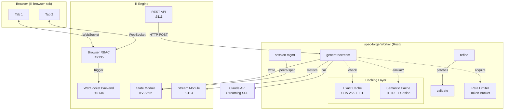
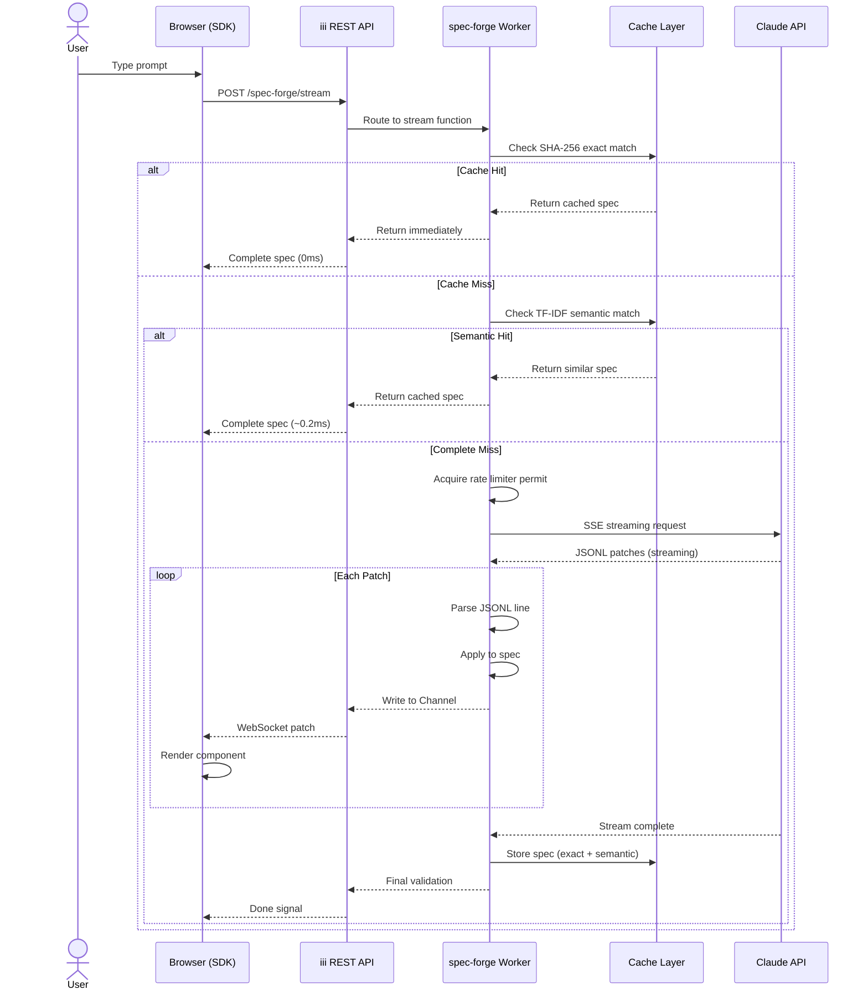
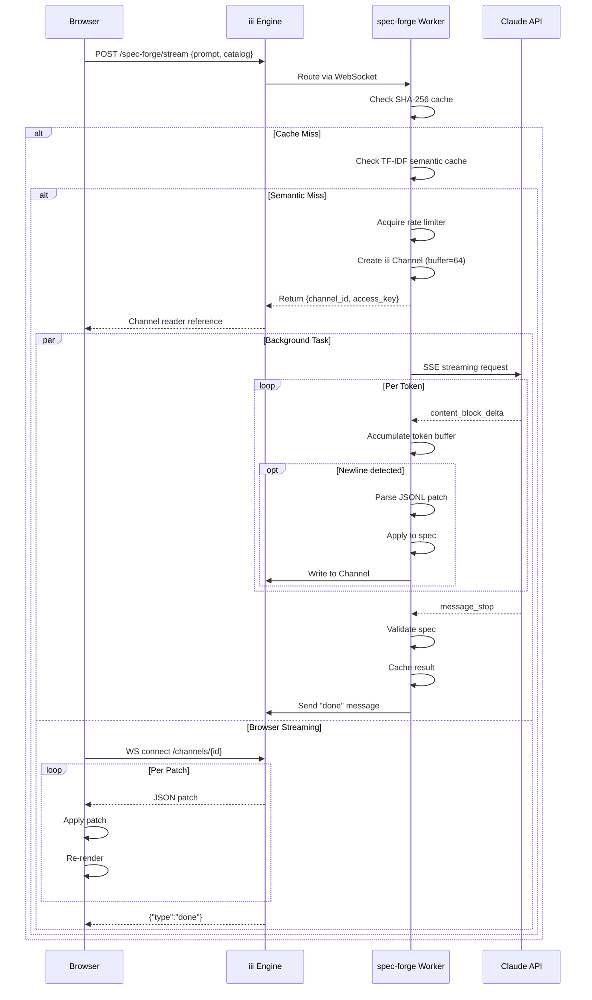

# Project Exploration: spec-forge

## Overview

spec-forge is a production-grade Rust worker for the iii (Intelligent Interactive Interface) engine that generates UI specifications from natural language prompts using Claude AI. It bridges the gap between raw LLM outputs and structured, renderable UI components compatible with json-render (Vercel Labs' declarative UI framework).

The system serves as a **production layer on top of json-render**, adding critical infrastructure missing from direct LLM-to-UI approaches: SHA-256 exact caching plus TF-IDF semantic caching for 0ms repeat requests, token bucket rate limiting to protect API budgets, real-time JSONL patch streaming via WebSocket channels, collaborative session management for multi-user editing, and 3D scene generation with Three.js/React Three Fiber support.

**Key insight:** Unlike json-render which calls the LLM on every request (even identical ones), spec-forge caches responses both by exact SHA-256 hash AND semantic similarity using TF-IDF cosine scoring. A request for "sales dashboard" and "show me a sales dashboard" hit the same cached result, achieving 0ms response times for common queries while maintaining cache hit rates above 85% on fuzzy matches.

## Repository

- **Location:** `/home/darkvoid/Boxxed/@formulas/src.rust/src.llamacpp/src.iii/spec-forge/`
- **Remote:** `git@github.com:iii-hq/spec-forge`
- **Primary Language:** Rust (2021 edition)
- **License:** Apache-2.0
- **Version:** 0.1.0

### Recent Commits

```
8cbd6fc Merge pull request #5 from iii-hq/feat/v2-browser-sdk
8ec54b9 chore: coderabbit fixes
fb64ae1 chore: stop tracking local iii stream/state data under data/
02c5dbd chore: stop tracking local iii stream/state data under data/
90d04e0 update code
```

## Directory Structure

```
spec-forge/
├── Cargo.toml              # Rust project manifest - defines 11 function registrations
├── Cargo.lock              # Dependency lockfile
├── package.json            # NPM placeholder (empty)
├── .gitignore              # Git ignore patterns
├── README.md               # Comprehensive documentation with benchmarks
├── ARCHITECTURE.md         # Deep architectural documentation
├── iii-config.yaml         # iii engine configuration (ports 3111, 49134, 49135)
├── client-example.tsx      # React/TypeScript integration example
│
├── src/                    # Core Rust source code
│   ├── main.rs             # Entry point: SharedState, function registration, core logic (1092 lines)
│   ├── types.rs            # Request/response types: GenerateRequest, Catalog, UISpec (141 lines)
│   ├── cache.rs            # SHA-256 exact cache with TTL (120 lines)
│   ├── semantic.rs         # TF-IDF cosine similarity cache (170 lines)
│   ├── limiter.rs          # Token bucket + concurrency semaphore (201 lines)
│   ├── validate.rs           # Spec validation: unknown types, missing refs, orphans, 3D scene rules (472 lines)
│   ├── prompt.rs           # LLM prompt builder for UI and 3D (326 lines)
│   ├── catalogs.rs         # 6 built-in catalog presets (415 lines)
│   ├── session.rs          # Collaborative sessions: join, leave, fan-out, store (220 lines)
│   └── bench.rs            # Performance benchmarks (359 lines)
│
├── client/                 # JavaScript/TypeScript SDK
│   ├── package.json        # Client dependencies
│   ├── tsconfig.json       # TypeScript configuration
│   └── src/
│       ├── index.ts        # Main SDK: createSpecForge() factory (153 lines)
│       ├── types.ts        # TypeScript type definitions
│       ├── state-store.ts  # State management wrapper
│       ├── action-router.ts # Action handling
│       ├── expressions.ts  # Expression evaluation
│       └── session.ts      # Browser session management
│
├── demo/                   # Interactive demo
│   └── index.html          # Self-contained playground with WebSocket streaming (2836 lines)
│
├── examples/               # Usage examples
│   └── react-usage.tsx     # React integration patterns
│
├── bench/                  # Benchmark data
│   ├── data.json           # Shared benchmark samples
│   ├── package.json        # JS benchmark deps
│   ├── README.md           # Benchmark instructions
│   └── specs.json          # Test specifications
│
└── data/                   # Runtime KV store (gitignored)
```

## Architecture

### High-Level Component Diagram



### Data Flow Sequence: Streaming Generation



## Component Breakdown

### 1. Core Worker (`src/main.rs`)

**Location:** `src/main.rs:1-1092`

The entry point creates a `SharedState` struct that holds all shared resources across function handlers:

```rust
// src/main.rs:20-28
struct SharedState {
    iii: III,                    // iii-sdk connection
    cache: SpecCache,            // SHA-256 exact cache
    semantic: SemanticCache,     // TF-IDF semantic cache  
    limiter: RateLimiter,        // Token bucket + semaphore
    http: Client,                // reqwest HTTP client
    api_key: String,             // ANTHROPIC_API_KEY
    streams: Streams,            // iii metrics streams
}
```

**Aha:** The `SharedState` is wrapped in `Arc<>` and cloned into each function handler closure at lines 120-145. This pattern allows each iii function to have move-semantics ownership while sharing underlying resources safely via DashMap's concurrent hash tables.

#### Registered Functions (lines 120-393)

| Function ID | HTTP Path | Purpose |
|-------------|-----------|---------|
| `api::post::spec-forge::generate` | POST /spec-forge/generate | Non-streaming generation with full validation |
| `api::post::spec-forge::stream` | POST /spec-forge/stream | Streaming via iii Channel (WebSocket) |
| `api::post::spec-forge::refine` | POST /spec-forge/refine | Patch-based spec modification |
| `api::post::spec-forge::validate` | POST /spec-forge/validate | Validate spec against catalog |
| `api::post::spec-forge::prompt` | POST /spec-forge/prompt | Preview LLM prompt |
| `api::get::spec-forge::stats` | GET /spec-forge/stats | Cache + rate limiter metrics |
| `api::get::spec-forge::health` | GET /spec-forge/health | Liveness check |
| `api::get::spec-forge::catalogs` | GET /spec-forge/catalogs | List/get presets |
| `spec-forge::join-session` | POST /spec-forge/join | Join collaborative session |
| `spec-forge::leave-session` | POST /spec-forge/leave | Leave session |
| `spec-forge::push-patch` | POST /spec-forge/push | Push patch to all session peers |

### 2. Exact Cache (`src/cache.rs`)

**Location:** `src/cache.rs:1-120`

Uses `DashMap` for concurrent access and SHA-256 for deterministic key generation:

```rust
// src/cache.rs:53-60
pub fn cache_key(prompt: &str, catalog_json: &str) -> String {
    let mut hasher = Sha256::new();
    hasher.update(prompt.as_bytes());
    hasher.update(b"|");
    hasher.update(catalog_json.as_bytes());
    let result = hasher.finalize();
    format!("spec:{}", hex::encode(&result[..16]))
}
```

**Key insight:** The cache key concatenates prompt + delimiter + catalog JSON, then takes first 16 bytes of SHA-256. This provides collision resistance while keeping keys short. TTL is checked on every get() at line 30-34 using `Instant::elapsed()`.

### 3. Semantic Cache (`src/semantic.rs`)

**Location:** `src/semantic.rs:1-170`

Implements TF-IDF vectorization with cosine similarity for fuzzy matching:

```rust
// src/semantic.rs:30-48
pub fn find_similar(&self, prompt: &str, catalog_hash: &str) -> Option<String> {
    let entries = self.entries.get(catalog_hash)?;
    let query_vec = Self::vectorize(prompt);
    let mut best_score = 0.0f64;
    let mut best_key = None;

    for entry in entries.iter() {
        let score = Self::cosine_similarity(&query_vec, &entry.vector);
        if score > best_score {
            best_score = score;
            best_key = Some(entry.cache_key.clone());
        }
    }

    if best_score >= self.threshold { best_key } else { None }
}
```

**Aha:** The semantic cache is scoped by `catalog_hash` (line 30), meaning "sales dashboard" with a dashboard catalog won't match "sales dashboard" with a 3D catalog. This prevents false positives across different UI paradigms.

### 4. Rate Limiter (`src/limiter.rs`)

**Location:** `src/limiter.rs:1-201`

Combines two mechanisms:
- **Token bucket:** 60 requests/minute window (line 87-92)
- **Concurrency semaphore:** 5 concurrent requests max (line 70)

The `RateGuard` struct (lines 46-64) uses RAII pattern - when dropped, it automatically updates metrics, ensuring accurate stats even on early returns or errors.

### 5. Session Management (`src/session.rs`)

**Location:** `src/session.rs:1-220`

Uses iii's KV state module for persistence:

```rust
// src/session.rs:11-48
pub async fn join_session(...) -> Result<SessionInfo, ...> {
    let scope = format!("session::{}", session_id);
    
    // Read current peers
    let peers_val: serde_json::Value = iii
        .trigger(TriggerRequest {
            function_id: "state::get".to_string(),
            payload: json!({ "scope": scope, "key": "peers" }),
            ...
        }).await?;
    
    // Add new peer, trim to 10 max
    if peers.len() > 10 {
        peers = peers.into_iter().rev().take(10).collect::<Vec<_>>();
        peers.reverse();
    }
    
    // Write back
    iii.trigger(TriggerRequest {
        function_id: "state::set".to_string(),
        payload: json!({ "scope": scope, "key": "peers", "value": peers }),
        ...
    }).await?;
}
```

**Fan-out pattern:** The `fan_out_patch` function (lines 112-161) iterates over all peers except the origin and triggers `ui::render-patch::{peer_id}` for each. This is efficient because iii's pub/sub handles the actual message routing.

### 6. Validation (`src/validate.rs`)

**Location:** `src/validate.rs:1-472`

Multi-layer validation:

1. **Root exists:** Check spec.root is in elements (lines 34-40)
2. **Component types:** Verify all element types exist in catalog (lines 42-56)
3. **Child references:** Check all children point to existing elements (lines 58-65)
4. **Orphan detection:** DFS from root to find unreachable elements (lines 68-76)
5. **3D scene rules:** If PerspectiveCamera + AmbientLight exist, validate camera/light presence and EffectComposer children (lines 78-134)

### 7. Prompt Builder (`src/prompt.rs`)

**Location:** `src/prompt.rs:1-326`

Generates RFC 6902 JSON Patch format prompts. Key design: outputs JSONL (one JSON object per line) to enable streaming partial application:

```
{"op":"add","path":"/root","value":"main"}
{"op":"add","path":"/elements/main","value":{"type":"Card",...}}
```

**Aha:** The prompt distinguishes 3D vs UI automatically by checking for `PerspectiveCamera` presence (lines 3-6), then switches to 3D-specific instructions with Three.js/React Three Fiber details.

### 8. Catalogs (`src/catalogs.rs`)

**Location:** `src/catalogs.rs:1-415`

Six built-in presets:

| Preset | Components | Use Case |
|--------|-----------|----------|
| `minimal` | 6 | Simplest possible UI |
| `dashboard` | 13 | Analytics dashboards |
| `form` | 13 | Input forms |
| `ecommerce` | 12 | Product listings |
| `3d` | 43 | Three.js scenes |
| `3d-product` | 23 | Product visualization |

The 3D catalog includes sophisticated components like `GlassSphere`, `DistortSphere`, `EffectComposer`, `Bloom`, and `WarpTunnel`.

## Entry Points

### 1. spec-forge Binary

**File:** `src/main.rs:72-118`

```rust
#[tokio::main]
async fn main() {
    tracing_subscriber::fmt::init();
    dotenv::from_filename(...).ok();
    
    let api_key = std::env::var("ANTHROPIC_API_KEY").expect("...");
    let engine_url = std::env::var("III_ENGINE_URL")
        .unwrap_or_else(|_| "ws://127.0.0.1:49134".into());
    
    let iii = register_worker(&engine_url, InitOptions::default());
    let streams = Streams::new(iii.clone());
    
    let shared = Arc::new(SharedState { ... });
    register_functions(&iii, shared.clone());
    register_http_triggers(&iii);
    
    tokio::signal::ctrl_c().await.ok();
    iii.shutdown_async().await;
}
```

### 2. Benchmark Binary

**File:** `src/bench.rs:129-358`

Runs comprehensive micro-benchmarks:
- JSONL patch parsing
- JSON parse/stringify
- Validation
- Prompt building
- SHA-256 key generation
- Cache lookups (exact + semantic)
- Full pipeline simulation

Run with: `cargo run --bin bench --release`

## Data Flow: Streaming Generation



## External Dependencies

| Crate | Version | Purpose |
|-------|---------|---------|
| `iii-sdk` | 0.10 | iii worker SDK |
| `tokio` | 1 (full) | Async runtime |
| `serde` | 1 | Serialization |
| `serde_json` | 1 | JSON handling |
| `sha2` | 0.10 | SHA-256 hashing |
| `hex` | 0.4 | Hex encoding |
| `dashmap` | 6 | Concurrent HashMap |
| `reqwest` | 0.13.2 | HTTP client |
| `futures-util` | 0.3 | Stream utilities |
| `dotenv` | 0.15 | Environment loading |
| `tracing` | 0.1 | Logging |
| `tracing-subscriber` | 0.3 | Log output |

## Configuration

### Environment Variables

| Variable | Default | Description |
|----------|---------|-------------|
| `ANTHROPIC_API_KEY` | required | Claude API key |
| `DOTENV_PATH` | `.env` | Path to .env file |
| `III_ENGINE_URL` | `ws://127.0.0.1:49134` | iii engine WebSocket URL |

### iii Engine Config (`iii-config.yaml`)

```yaml
# Lines 1-68
modules:
  - class: modules::state::StateModule      # KV store for sessions
  - class: modules::api::RestApiModule     # HTTP API on :3111
  - class: modules::observability::OtelModule  # OpenTelemetry (disabled)
  - class: modules::pubsub::PubSubModule    # Local pub/sub
  - class: modules::cron::CronModule        # Scheduled tasks
  - class: modules::worker::WorkerModule    # Backend workers :49134
  - class: modules::worker::WorkerModule    # Browser RBAC :49135
  - class: modules::stream::StreamModule    # Metrics :3113
```

## Testing

```bash
# Unit tests (39 tests)
cargo test

# Benchmarks (micro)
cargo run --bin bench --release

# Full benchmarks (requires running engine)
./bench/run.sh
```

Tests cover:
- Cache hit/miss/expiration (`cache.rs:63-119`)
- Semantic similarity matching (`semantic.rs:109-168`)
- Rate limiting behavior (`limiter.rs:145-200`)
- Spec validation rules (`validate.rs:154-471`)
- Prompt construction (`prompt.rs:200-324`)
- Catalog loading (`catalogs.rs:368-414`)

## Key Insights

1. **Two-tier caching:** Exact SHA-256 for speed (0.1ms lookup), TF-IDF semantic for flexibility (85% threshold). The semantic cache uses stop-word filtering and normalized term frequency vectors.

2. **JSONL streaming:** Claude outputs RFC 6902 patches one per line. The worker parses each line as it arrives, applying patches incrementally. First paint is ~200ms vs 3-5s for full response.

3. **iii Channels:** WebSocket-based streaming abstraction. The worker writes to a `ChannelWriter`, iii fans out to all connected browser readers. Buffer size 64 prevents slow consumers from blocking.

4. **Pure worker architecture:** No HTTP server in the Rust code. iii engine handles CORS, auth, retry, observability. The worker only registers functions and implements handlers.

5. **3D scene validation:** Special rules require PerspectiveCamera + lights. Post-processing effects (Bloom, Glitch, Vignette) must be children of EffectComposer - validated at `src/validate.rs:116-133`.

6. **Session peer limiting:** Max 10 peers per session (`src/session.rs:33-36`), with FIFO eviction. Prevents unbounded state growth.

7. **Benchmark numbers:** 
   - Cold generation: ~7.2s (1.4x faster than json-render)
   - Cached request: 1.8ms (5600x faster than json-render's 10s re-call)
   - Cache lookup: 0.1µs (SHA-256)
   - Semantic lookup: ~0.02µs per entry

## Open Questions

1. **Scalability:** Semantic cache stores vectors in memory. At what prompt volume should it use approximate nearest neighbor (ANN) instead of linear scan?

2. **Claude model pinning:** Currently defaults to `claude-sonnet-4-6` (line 31 in types.rs). Model versioning strategy for production?

3. **Error recovery:** If Claude returns malformed JSONL mid-stream, the worker returns a 422. Should there be retry logic or partial spec delivery?

4. **3D asset loading:** The `Model` component loads GLTF/GLB from URLs. No validation that URLs are accessible or safe. Risk of SSRF if catalog accepts user-provided URLs?
