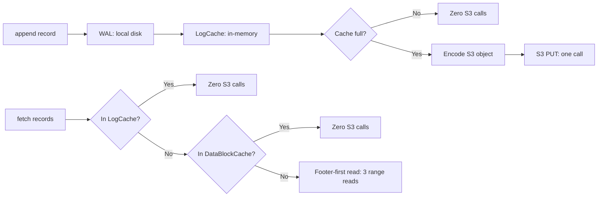
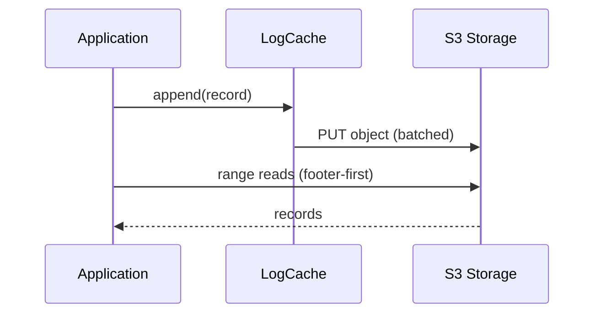

# s3Stream — S3 Performance Deep Dive

**s3Stream makes S3 fast for streaming workloads through three mechanisms: write batching (WAL + LogCache), read caching (DataBlockCache), and self-describing objects (footer-first reads). No separate metadata service needed.**

## The Performance Problem with S3

| Problem | Impact |
|---------|--------|
| High latency per request | 50-100ms per PUT/GET |
| Cost per API call | $0.005 per 1,000 requests |
| No random writes | Must rewrite entire object |
| No in-place updates | Must create new object |

**s3Stream solves all four**: batch hundreds of writes into one PUT, cache reads in memory, store metadata inside objects, and use range reads instead of full downloads.

## Core Architecture (Performance View)




## Core Flow



## Performance Numbers (What s3Stream Achieves)

| Metric | Without s3Stream | With s3Stream | Improvement |
|--------|-----------------|---------------|-------------|
| S3 PUTs per 100K records | 100,000 | ~100 | 1000x fewer |
| S3 GETs per read | 1 (full object) | 2-3 (range reads) | 10-100x less data |
| Write latency | 50-100ms (S3 roundtrip) | < 1ms (in-memory) | 50-100x faster |
| Read latency (cache hit) | 50-100ms (S3 roundtrip) | < 1ms (memory) | 50-100x faster |
| Read latency (cache miss) | 50-100ms + full download | 50-100ms + range read | 10-100x less data |

## What Makes It Insanely Efficient

**Aha:** The key insight is that **one S3 object can contain records from multiple streams, and the index is at the END of the object**. To read, you first fetch the last 48 bytes (the footer), which tells you where the index is. The index tells you where each record block is. Then you do a single S3 range read to get exactly the records you need. No downloading entire objects.

### 1. One S3 Object = Thousands of Records

A single 64MB S3 object can contain:
- 100,000+ records across 50+ streams
- ~3,000 index entries (36 bytes each = 108KB)
- A 48-byte footer for fast lookup

**Instead of 100,000 S3 PUTs → 1 S3 PUT.**

### 2. Metadata Lives Inside the Object

```
Object = [DATA] [INDEX] [FOOTER]
                       ↑
                  Always last 48 bytes
```

No separate metadata database. The footer (always at `object_size - 48`) points to the index, which points to each data block. Three range reads to find any record.

### 3. LogCache: Writes Never Touch S3

Records go to an in-memory cache first. Only when the cache fills up (default 64MB) is it flushed to S3 as one object. Until then: **zero S3 calls**.

### 4. DataBlockCache: Reads Rarely Touch S3

Recently-read data blocks are cached. Sequential reads benefit from readahead (prefetch). Cache hit rate is typically > 90% for hot streams.

### 5. Footer-First Reads

```
Step 1: GET object[last-48 bytes]    → Footer (where is the index?)
Step 2: GET object[index_position]    → Index (where is my data?)
Step 3: GET object[data_position]     → Data (exactly what I need)
```

Three range reads, regardless of object size. A 100MB object is read in the same 3 calls as a 1MB object.

## What's Next

- [00 — Write Path](00-write-path.md) — WAL + LogCache + batched upload
- [01 — Read Path](01-read-path.md) — LogCache → DataBlockCache → footer-first
- [02 — S3 Object Format](02-s3-object-format.md) — Data + Index + Footer
- [03 — Caching](03-caching.md) — LogCache merge, DataBlockCache eviction, readahead
- [04 — Rust Design](04-rust-design.md) — Condensed Rust implementation
