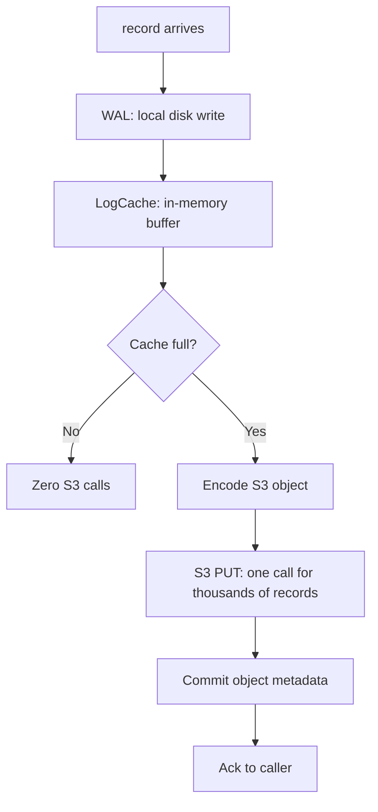
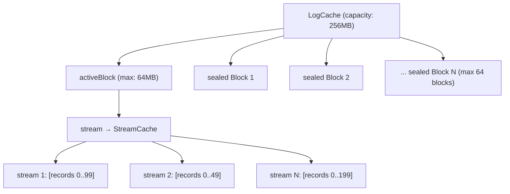

# Write Path — WAL → LogCache → Batched S3 Upload

**The write path turns thousands of small appends into one large S3 PUT. Records go through three stages: WAL (durability) → LogCache (buffering) → S3 upload (batching).**




## Stage 1: WAL — Write-Ahead Log

Source: `S3Storage.java:120`

Every record is first persisted to a local WAL:

```
append(streamId, recordBatch)
  → deltaWAL.append(recordBatch)
    → Write to local disk
    → Return RecordOffset (position in WAL)
```

**Why WAL?** If the process crashes before the S3 upload completes, the WAL is recovered on restart. Un-uploaded records are flushed to S3. This guarantees durability without paying S3 latency on every write.

**WAL characteristics:**
- Local disk, sequential writes (fast)
- Low IOPS cost (one append per record, no S3)
- Recovered on startup: continuous records are loaded into LogCache, discontinuous records are discarded (gap = data loss indicator)

## Stage 2: LogCache — In-Memory Buffering

Source: `LogCache.java` (696 lines)

After WAL persistence, records go into the `LogCache`:

```
deltaWALCache.put(recordBatch)
  → activeBlock.put(recordBatch)
    → StreamCache.add(recordBatch)  // Per-stream list
    → size += recordBatch.occupiedSize()
    → Return true if block is full
```

### LogCache Structure



| Parameter | Default | Purpose |
|-----------|---------|---------|
| `capacity` | 256 MB | Total cache size before forced upload |
| `cacheBlockMaxSize` | 64 MB | Max size per block before sealing |
| `maxCacheBlockStreamCount` | 10,000 | Max streams per block |
| `MAX_BLOCKS_COUNT` | 64 | Max sealed blocks before forced merge |
| `MERGE_BLOCK_THRESHOLD` | 8 | Min blocks before merging starts |

### How LogCache Gets Fast

**Aha:** The LogCache uses a per-stream `StreamCache` with an `offsetIndexMap` — a HashMap that maps offset → index in the records list. On the first lookup of an offset, binary search is used (`StreamRecordBatchList.search`). On subsequent lookups, the index is cached in the map with a reference count. This makes repeated reads of the same offsets O(1) instead of O(log n).

```java
// StreamCache.get() — fast path with index cache
int searchStartIndex(long startOffset) {
    IndexAndCount indexAndCount = offsetIndexMap.get(startOffset);
    if (indexAndCount != null) {
        unmap(startOffset, indexAndCount);  // Decrement refcount
        return indexAndCount.index;          // O(1) lookup
    } else {
        // slow path — binary search
        return new StreamRecordBatchList(records).search(startOffset);
    }
}
```

### Block Sealing and Upload Pipeline

When a block fills up (64MB or 10,000 streams):

```
1. activeBlock → sealed (read-only)
2. New activeBlock created
3. Sealed block → walPrepareQueue
4. Background thread: encode → walCommitQueue
5. Upload thread: S3 PUT → inflightWALUploadTasks
6. On ack: mark block as "free" → can be garbage collected
```

**Three-stage pipeline:**
```
walPrepareQueue → walCommitQueue → inflightWALUploadTasks
   (encoding)       (uploading)      (waiting for ack)
```

While one block is being encoded (CPU-bound), another is being uploaded (I/O-bound), and another is waiting for acknowledgment. The WAL never blocks on S3 latency.

### Upload Triggers

| Trigger | Config | Effect |
|---------|--------|--------|
| Size threshold | `walUploadThreshold` (64MB) | Block is full → seal and upload |
| Time interval | `walUploadIntervalMs` (100ms) | Periodic flush, even if not full |
| Capacity | `capacity` (256MB) | Total cache too big → force upload oldest blocks |
| Force | `forceUpload()` | Explicit flush (e.g., before shutdown) |

### Block Merging

When there are too many sealed blocks (> 8), the LogCache merges adjacent free blocks:

```java
// tryMerge() — merge adjacent free blocks to speed up reads
if (left.free && right.free && left.size() + right.size() < cacheBlockMaxSize) {
    if (!isDiscontinuous(left, right)) {  // Offsets are continuous
        LogCacheBlock merged = mergeBlock(left, right);
        blocks.replace(left, right, merged);
    }
}
```

**Aha:** Merging is done out of the lock — the lock is only used to check eligibility and swap the blocks. The costly merge operation (`mergeBlock`) runs outside the lock to minimize contention.

## Stage 3: S3 Upload — One PUT for Thousands of Records

Source: `CompositeObjectWriter.java` (227 lines)

When a sealed block is uploaded:

```
CompositeObjectWriter
  → For each stream in block:
    → Write data blocks (raw records)
    → Build DataBlockIndex entries (36 bytes each)
  → close():
    → Write objects block (with magic + count header)
    → Write index block (count + all index entries)
    → Write footer (index_position + index_length + magic)
  → S3 PUT (single call, 64MB object)
```

### What Gets Uploaded

One S3 object contains:
- **Objects block**: Raw record data (e.g. 64MB)
- **Index block**: 36 bytes per data block (~108KB for 3,000 blocks)
- **Footer**: 48 bytes (always at the end)

**One 64MB S3 PUT replaces ~100,000 individual S3 PUTs.**

## What's Next

- [01 — Read Path](01-read-path.md) — LogCache → DataBlockCache → footer-first
- [03 — Caching](03-caching.md) — LogCache merge, DataBlockCache eviction, readahead
- [02 — S3 Object Format](02-s3-object-format.md) — Return to object format
