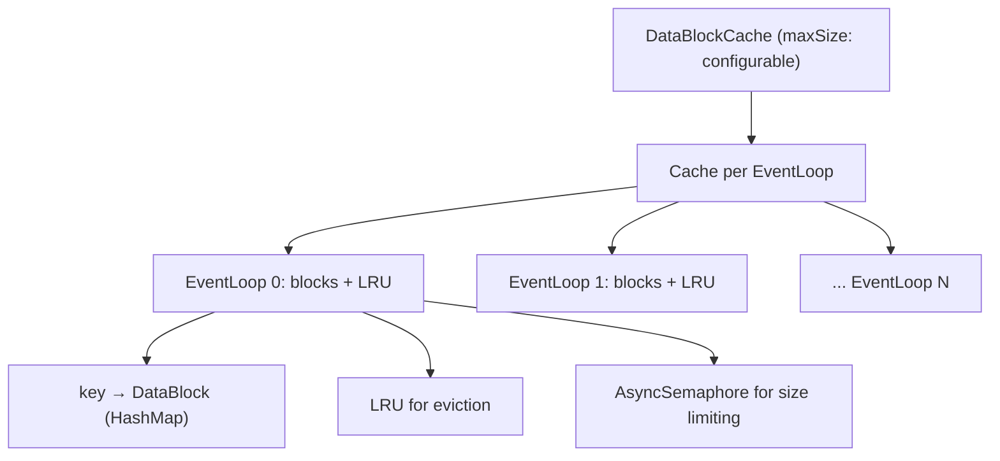

# Read Path — LogCache → DataBlockCache → Footer-First S3 Reads

**The read path has three layers, each avoiding S3 calls when possible: LogCache (in-memory recent writes) → DataBlockCache (cached S3 data blocks) → S3 Object (footer-first range reads).**

## Read Path Overview

```mermaid
flowchart TD
    A["fetch(streamId, startOffset, endOffset)"] --> B{In LogCache?}
    B -->|Yes, fully| C[Return from LogCache]
    B -->|Yes, partially| D[Return partial, continue]
    B -->|No| E{In DataBlockCache?}
    E -->|Yes| F[Return from cache]
    E -->|No| G[Find S3 objects for range]
    G --> H[For each object: footer-first read]
    H --> I[Range read: footer (48 bytes)]
    I --> J[Parse footer → index position]
    J --> K[Range read: index block]
    K --> L[Find matching data blocks]
    L --> M[Range read: data blocks]
    M --> N[Parse records]
    
    C --> O[Return records]
    D --> E
    F --> O
    N --> O
```

## Layer 1: LogCache (Zero S3 Calls)

Source: `LogCache.java:147`

The fastest path — records that were recently appended:

```java
// LogCache.get() — search active + sealed blocks
for (LogCacheBlock block : blocks) {
    List<StreamRecordBatch> records = block.get(streamId, startOffset, endOffset, maxBytes);
    if (!records.isEmpty()) {
        result.addAll(records);
        if (fulfilled) return result;
    }
}
```

**Smart intersection logic:**
- If the requested range is fully in the cache → return all records
- If the range partially overlaps → return only the continuous portion (simplifies block cache logic)
- If no overlap → return empty, fall through to DataBlockCache

| Query | Cached: [0,10], [100,200] | Result |
|-------|--------------------------|--------|
| [0,10] | Full overlap | [0,10] ✓ |
| [0,11] | Left intersect | [] (let block cache handle) |
| [5,20] | Left intersect | [] (let block cache handle) |
| [90,110] | Right intersect | [100,110] |
| [40,50] | No overlap | [] |

**Aha:** The "left intersect" behavior — returning empty when the start is cached but the end is not — is a deliberate simplification. Instead of returning partial data and coordinating between cache layers, it lets the block cache handle the entire range. This avoids complex coordination logic at the cost of occasionally re-reading data that's in the LogCache.

## Layer 2: DataBlockCache (Like Linux Page Cache)

Source: `DataBlockCache.java` (305 lines)

The DataBlockCache is "like Linux's page cache" — it caches data blocks from S3 objects:

```java
// DataBlockCache.getBlock() — check cache, fetch from S3 on miss
DataBlock dataBlock = blocks.get(key);  // key = (objectId, dataBlockIndex)
if (dataBlock == null) {
    dataBlock = new DataBlock(objectId, dataBlockIndex);
    blocks.put(key, dataBlock);
    readFromS3(objectReader, dataBlock);  // Async read
}
return dataBlock.dataFuture();
```

### DataBlockCache Architecture



| Component | Purpose |
|-----------|---------|
| `Cache[]` (one per EventLoop) | Sharded by streamId for concurrent access |
| `HashMap<DataBlockGroupKey, DataBlock>` | Fast lookup |
| `LRUCache` | Eviction order |
| `AsyncSemaphore` | Size limiting with async waiting |

### Eviction Policy

```java
// evict0() — evict LRU blocks when:
// 1. Block is expired (TTL > 1 minute)
// 2. Size limiter needs permits
while (true) {
    entry = lru.peek();  // Least recently used
    if (entry == null) break;
    if (!dataBlock.isExpired() && !sizeLimiter.requiredRelease()) break;
    lru.pop();
    dataBlock.free();  // Releases permits back to semaphore
}
```

**Eviction triggers:**
- Block TTL expired (1 minute)
- Size semaphore has waiting tasks (need permits)
- After S3 read completes (if semaphore needs release)

### Readahead

The StreamReader (which uses DataBlockCache) implements adaptive readahead:

```java
// StreamReader.Readahead
static final int READAHEAD_SIZE_UNIT = 512 KB;
static final int MAX_READAHEAD_SIZE = 32 MB;

// When reading sequentially, prefetch more data
if (readingSequentially) {
    readaheadSize = min(readaheadSize * 2, MAX_READAHEAD_SIZE);
} else {
    readaheadSize = READAHEAD_SIZE_UNIT;  // Reset on random access
}
```

**Readahead is triggered** when the next read is expected to be sequential (offsets are increasing). The prefetched data goes into the DataBlockCache, so the next read is a cache hit.

## Layer 3: S3 Object Read (Footer-First)

Source: `CompositeObjectReader.java` (659 lines)

When data is not in any cache, read directly from S3 using the footer-first approach:

### Step 1: Read Footer (48 bytes)

```
GET object[object_size - 48 .. object_size]
```

Parse the footer:
```
index_position (u64) = where the index block starts
index_length   (u32) = size of the index block
magic          (u64) = 0x88e241b785f4cff8 (verify valid object)
```

### Step 2: Read Index Block

```
GET object[index_position .. index_position + index_length]
```

Parse the index entries (36 bytes each):
```
stream_id     (u64)
start_offset  (u64)
end_delta     (u32)  → end = start + delta
record_count  (u32)
position      (u64)  → byte offset in objects block
size          (u32)
```

### Step 3: Find Matching Data Blocks

Binary search (or linear scan) through index entries to find blocks matching `(streamId, startOffset, endOffset)`.

### Step 4: Range-Read Data Blocks

```
GET object[position .. position + size]
```

Only the exact bytes needed are downloaded. For a 64MB object, you might only need 1KB of data.

### Total S3 Calls

| Scenario | S3 Calls | Data Transferred |
|----------|----------|-----------------|
| LogCache hit | 0 | 0 |
| DataBlockCache hit | 0 | 0 |
| Cache miss (1 block) | 3 | 48 + index + 1 block |
| Cache miss (5 blocks) | 3 | 48 + index + 5 blocks |

**Aha:** Multiple data blocks from the same object can be fetched in one range read (if they're contiguous). The index tells you the positions, so you can merge adjacent blocks into a single S3 GET.

## StreamReader: Putting It All Together

Source: `StreamReader.java` (678 lines)

The StreamReader coordinates all three layers:

```java
read(startOffset, endOffset, maxBytes)
  → Try LogCache
  → If partial/miss: try DataBlockCache
  → If miss: find S3 objects → footer-first read
  → Merge results from all layers
  → Trigger readahead for next read
```

The StreamReader also manages:
- **Block epoch**: When blocks are reset (e.g., after compaction), the epoch increases to invalidate stale reads
- **Retry**: If a read fails (e.g., object was compacted), reset blocks and retry
- **Readahead reset**: After 1 minute of inactivity, readahead size resets to 512KB

## What's Next

- [02 — S3 Object Format](02-s3-object-format.md) — Detailed object layout
- [03 — Caching](03-caching.md) — LogCache merge, DataBlockCache eviction, readahead
- [00 — Overview](00-overview.md) — Return to overview
