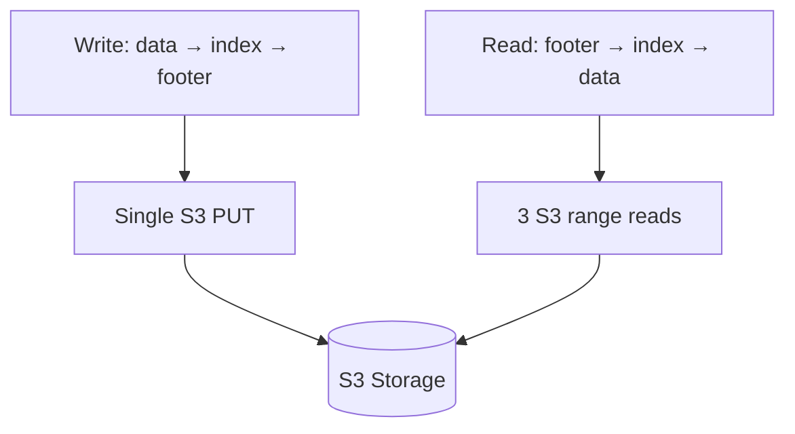
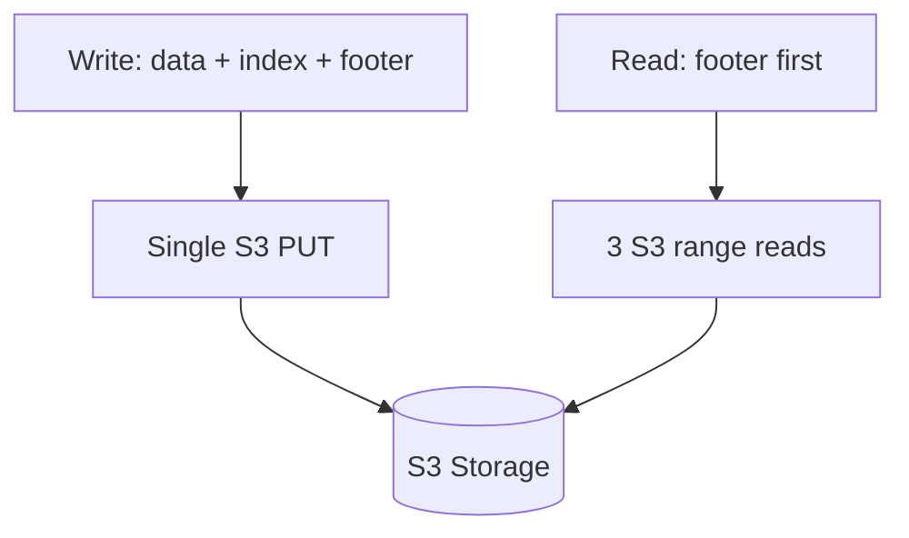

# S3 Object Format — Self-Describing Objects with Footer-First Reads

**Every S3 object written by s3Stream is self-describing: data at the start, index in the middle, and a fixed 48-byte footer at the end. The footer lets you find the index without reading the entire object.**

## Object Layout (v0 Format)

```
┌──────────────────────────────────────────────────────────────────┐
│ OBJECTS BLOCK                                                    │
│ ┌──────────────────────────────────────────────────────────────┐ │
│ │ Header: magic (0x52, 1 byte) + objects_count (u32)           │ │
│ ├──────────────────────────────────────────────────────────────┤ │
│ │ DATA BLOCK 1: raw record bytes                               │ │
│ ├──────────────────────────────────────────────────────────────┤ │
│ │ DATA BLOCK 2: raw record bytes                               │ │
│ ├──────────────────────────────────────────────────────────────┤ │
│ │ DATA BLOCK N: raw record bytes                               │ │
│ └──────────────────────────────────────────────────────────────┘ │
├──────────────────────────────────────────────────────────────────┤
│ INDEX BLOCK                                                      │
│ index_count (u32)                                                │
│ ┌──────────────────────────────────────────────────────────────┐ │
│ │ DataBlockIndex (36 bytes each):                              │ │
│ │   stream_id     (u64) = 8 bytes                              │ │
│ │   start_offset  (u64) = 8 bytes                              │ │
│ │   end_delta     (u32) = 4 bytes  (end = start + delta)       │ │
│ │   record_count  (u32) = 4 bytes                              │ │
│ │   position      (u64) = 8 bytes  (byte offset in objects)    │ │
│ │   size          (u32) = 4 bytes                              │ │
│ └──────────────────────────────────────────────────────────────┘ │
├──────────────────────────────────────────────────────────────────┤
│ FOOTER (always last 48 bytes)                                    │
│ index_position (u64) = 8 bytes  (byte offset where index starts) │
│ index_length   (u32) = 4 bytes  (size of index block)            │
│ padding              = 20 bytes  (zeros)                          │
│ magic            (u64) = 8 bytes  (0x88e241b785f4cff8)           │
└──────────────────────────────────────────────────────────────────┘
```

## Why Footer-First?

**The footer is always at `object_size - 48`.** This means:

1. You know the object size (S3 HEAD or Content-Length from previous read)
2. You can read the last 48 bytes to find the index position
3. You read the index to find your data blocks
4. You read only the data blocks you need

**Without footer-first:** You'd need to download the entire object to find the index (which is at a variable position). With a 100MB object, that's 100MB of data just to find a few records.

**With footer-first:** You download 48 bytes (footer) + ~100KB (index) + ~1KB (data) = ~101KB total, regardless of object size.

## Footer (48 Bytes)

```rust
#[repr(packed)]
struct Footer {
    index_position: u64,  // Where the index block starts
    index_length: u32,    // Size of the index block
    _padding: [u8; 20],   // Reserved for future use
    magic: u64,           // 0x88e241b785f4cff8
}
```

The magic number `0x88e241b785f4cff8` verifies you're reading a valid s3Stream object. If it doesn't match, the object is corrupted or not an s3Stream object.

## Index Entry (36 Bytes)

```rust
#[repr(packed)]
struct DataBlockIndex {
    stream_id: u64,        // Which stream this block belongs to
    start_offset: u64,     // First record's offset in the stream
    end_offset_delta: u32, // end_offset = start_offset + delta
    record_count: u32,     // Number of records in this block
    position: u64,         // Byte offset within the objects block
    size: u32,             // Size of the data block in bytes
}
```

**Aha:** `end_offset_delta` instead of absolute `end_offset` saves 4 bytes per entry. Since records within a block have contiguous offsets, `end = start + delta` is sufficient. For an object with 3,000 blocks, this saves 12KB.

## How Metadata Is Stored

**There is no separate metadata service.** All metadata lives inside the S3 object:

| Metadata | Where |
|----------|-------|
| Which streams are in this object | Index entries (`stream_id` field) |
| Where each record is | Index entries (`position` + `size`) |
| Record offsets | Index entries (`start_offset` + `end_offset_delta`) |
| Object validity | Footer magic |
| Where to find the index | Footer `index_position` |

The only "external" metadata is the `ObjectManager` which tracks which S3 objects exist for which streams. But the content of each object is entirely self-describing.

## One Object = Multiple Streams

A single S3 object can contain records from multiple streams:

```
Object with 64MB:
  Data Block 1: stream_id=100, offsets 0-99
  Data Block 2: stream_id=100, offsets 100-199
  Data Block 3: stream_id=200, offsets 0-49
  Data Block 4: stream_id=100, offsets 200-299
  Data Block 5: stream_id=300, offsets 0-199
  ...
  Index: 5 entries (5 × 36 = 180 bytes)
  Footer: 48 bytes
```

This enables efficient batching — small streams share objects instead of each having their own.

## Composite Objects (Soft Links)

Source: `CompositeObject.java`

For compaction, s3Stream can create composite objects that soft-link existing objects without copying data:

```
Composite Object:
  objects_block:
    object_id_1 | block_start_index | bucket_id
    object_id_2 | block_start_index | bucket_id
    ...
  indexes_block: (merged from all linked objects)
  footer: (points to merged index)
```

The composite object is small (just metadata) but provides a unified view of many objects. Reading through a composite object transparently fetches data from the linked objects.

**Aha:** This is the key to efficient compaction — you don't rewrite the data, you just create a new "table of contents" that references existing objects. Only when the composite object itself is compacted does data get rewritten.

## What's Next

- [03 — Caching](03-caching.md) — LogCache merge, DataBlockCache eviction, readahead
- [00 — Write Path](00-write-path.md) — Return to write path
- [04 — Rust Design](04-rust-design.md) — Condensed Rust implementation

## Reading vs Writing



**Aha:** Writing is one PUT for the entire object. Reading is always 3 range reads regardless of object size. The asymmetry is what makes s3Stream efficient — writes batch heavily, reads fetch precisely.


## Reading vs Writing



**Aha:** Writing is one PUT for the entire object. Reading is always 3 range reads regardless of object size. The asymmetry is what makes s3Stream efficient.
