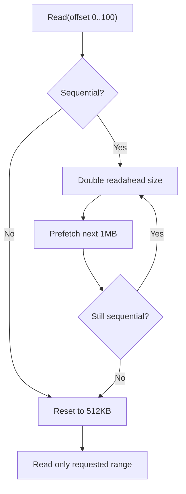

# Caching — LogCache Merge, DataBlockCache Eviction, Readahead

**s3Stream has two caches: LogCache for writes (in-memory buffer before S3 upload) and DataBlockCache for reads (cached S3 data blocks). Both are tuned for maximum throughput.**

## LogCache: Write-Side Caching

Source: `LogCache.java` (696 lines)

### Block Lifecycle

```mermaid
flowchart TD
    A["New activeBlock"] --> B["accepting writes"]
    B --> C{Full? (64MB or 10K streams)}
    C -->|No| B
    C -->|Yes| D["Seal block"]
    D --> E["Create new activeBlock"]
    E --> F["Add sealed to blocks list"]
    F --> G{List > 64 blocks?}
    G -->|Yes| H["Force upload + merge"]
    G -->|No| I["Continue writing"]
    H --> J["Upload oldest sealed blocks"]
    J --> K["Merge adjacent free blocks"]
    K --> I
```

### Block Merging

When there are many sealed blocks (> 8), the LogCache merges adjacent free blocks:

```java
// tryMerge() — merge adjacent free blocks to speed up reads
for (int i = 0; i < blocks.size() - 1; i++) {
    left = blocks.get(i);
    right = blocks.get(i + 1);
    if (left.free && right.free && left.size() + right.size() < cacheBlockMaxSize) {
        if (!isDiscontinuous(left, right)) {  // Offsets are continuous
            // Merge OUT of the lock
            LogCacheBlock merged = mergeBlock(left, right);
            // Swap IN the lock
            lock.writeLock().lock();
            blocks.set(i, merged);
            blocks.remove(i + 1);
            lock.writeLock().unlock();
        }
    }
}
```

**Aha:** The merge operation (`isDiscontinuous`, `mergeBlock`) is costly because it iterates over all streams. These operations run OUTSIDE the write lock. The lock is only used to check eligibility and swap blocks. This minimizes write contention.

### Async Free Listener

When a block is uploaded to S3, it's marked as "free":

```java
// markFree() — called after successful upload
block.free = true;
LOG_CACHE_ASYNC_EXECUTOR.execute(() -> {
    tryMerge();  // Try to merge adjacent free blocks
    removed.forEach(b -> b.free());  // Release memory
});
```

The free operation runs on an async executor, not the write path, to avoid blocking writes.

## DataBlockCache: Read-Side Caching

Source: `DataBlockCache.java` (305 lines)

### Sharded by EventLoop

The DataBlockCache is sharded across multiple EventLoops (one per CPU core):

```java
// DataBlockCache constructor
this.caches = new Cache[eventLoops.length];  // e.g., 8 caches for 8 cores
for (int i = 0; i < eventLoops.length; i++) {
    caches[i] = new Cache(eventLoops[i]);  // Each has its own LRU + HashMap
}

// Stream-to-cache mapping
private Cache cache(long streamId) {
    return caches[(int) Math.abs(streamId % caches.length)];
}
```

This avoids lock contention — different streams go to different caches, each with its own EventLoop.

### AsyncSemaphore for Size Limiting

```java
// AsyncSemaphore — like a counting semaphore, but async
sizeLimiter = new AsyncSemaphore(maxSize);  // e.g., 1GB

// When reading from S3:
boolean acquired = sizeLimiter.acquire(dataBlockSize, () -> {
    reader.read(dataBlockIndex).whenComplete((rst, ex) -> {
        // Data loaded, release permits
    });
    return dataBlock.freeFuture();  // Release when data block is freed
}, eventLoop);
if (!acquired) {
    evict();  // Force eviction to free permits
}
```

**Aha:** The AsyncSemaphore ensures the cache never exceeds its configured size, even under heavy load. If the cache is full, new reads wait until old data blocks are evicted or freed.

### Eviction: LRU + TTL

```java
// evict0() — evict LRU blocks
long expiredTimestamp = now - DATA_TTL;  // 1 minute TTL
while (true) {
    entry = lru.peek();  // Least recently used
    if (entry == null) break;
    // Evict if: expired OR size limiter needs permits
    if (!dataBlock.isExpired(expiredTimestamp) && !sizeLimiter.requiredRelease()) break;
    lru.pop();
    dataBlock.free();  // Releases permits
}
```

Eviction criteria:
- **TTL expired**: Block hasn't been accessed in 1 minute
- **Size pressure**: AsyncSemaphore has waiting tasks (need permits)

### Read Statistics

| Stat | Purpose |
|------|---------|
| `blockCacheHit` | Cache hit count |
| `blockCacheBlockMiss` | Data block not in cache |
| `blockCacheReadaheadThroughput` | Readahead bytes fetched |
| `blockCacheBlockEvictThroughput` | Evicted bytes |
| `blockCacheReadS3Throughput` | Bytes read from S3 |

## StreamReader Readahead

Source: `StreamReader.java` (678 lines)

The StreamReader implements adaptive readahead for sequential reads:

```java
// Readahead parameters
static final int READAHEAD_SIZE_UNIT = 512 KB;     // Initial readahead
static final int MAX_READAHEAD_SIZE = 32 MB;       // Maximum readahead
static final long READAHEAD_RESET_COLD_DOWN_MILLS = 1 minute;
```

### How Readahead Works



- On sequential reads: readahead size doubles (512KB → 1MB → 2MB → ... → 32MB max)
- On random access: readahead resets to 512KB
- After 1 minute of inactivity: readahead resets

### Readahead Throttling

Readahead uses a lower-priority throttle strategy:

```java
ThrottleStrategy throttleStrategy = readahead ? ThrottleStrategy.CATCH_UP : ThrottleStrategy.BYPASS;
```

- Normal reads: `BYPASS` — no throttling, highest priority
- Readahead reads: `CATCH_UP` — throttled if the system is under load

**Aha:** This ensures readahead doesn't compete with normal reads for S3 bandwidth. If the system is busy, readahead is throttled, but normal reads proceed at full speed.

## What's Next

- [04 — Rust Design](04-rust-design.md) — Condensed Rust implementation
- [00 — Write Path](00-write-path.md) — Return to write path
- [01 — Read Path](01-read-path.md) — Return to read path
