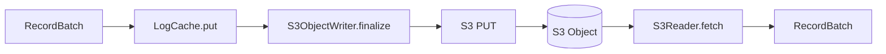

# Rust Design — Condensed s3Stream Implementation

**Here's how to implement s3Stream in Rust — condensed, without Java verbosity. The Java version is 46,458 lines. The Rust equivalent for the core is ~2,000 lines.**

## What Java Does That Rust Doesn't Need

| Java Pattern | Rust Replacement | Lines Saved |
|-------------|-----------------|------------|
| Netty ByteBuf + ref counting | `bytes::Bytes` (Arc-based) | ~2,000 |
| CompletableFuture chains | `async/await` | ~1,500 |
| 20+ Exception classes | One `Error` enum | ~500 |
| ReentrantReadWriteLock | `RwLock` / channels | ~300 |
| OTEL annotations | `tracing` crate | ~1,000 |
| Factory methods + interfaces | Constructors + traits | ~1,000 |
| Factory + builder patterns | `Default` + builder derive | ~500 |
| Null checks everywhere | `Option<T>` | ~500 |
| **Total** | | **~7,300 lines** |

## Core Types

```rust
use bytes::Bytes;
use std::collections::BTreeMap;
use std::sync::atomic::{AtomicU64, Ordering};

/// Footer — always the last 48 bytes of an S3 object.
#[derive(Clone, Debug)]
pub struct Footer {
    pub index_position: u64,
    pub index_length: u32,
}

impl Footer {
    pub const SIZE: usize = 48;
    pub const MAGIC: u64 = 0x88e241b785f4cff8;

    pub fn encode(&self, buf: &mut Vec<u8>) {
        buf.extend_from_slice(&self.index_position.to_be_bytes());
        buf.extend_from_slice(&self.index_length.to_be_bytes());
        buf.resize(32, 0);
        buf.extend_from_slice(&Self::MAGIC.to_be_bytes());
    }

    pub fn decode(buf: &[u8]) -> Result<Self, Error> {
        if buf.len() != Self::SIZE {
            return Err(Error::InvalidFooter);
        }
        if u64::from_be_bytes(buf[40..48].try_into().unwrap()) != Self::MAGIC {
            return Err(Error::InvalidMagic);
        }
        Ok(Self {
            index_position: u64::from_be_bytes(buf[0..8].try_into().unwrap()),
            index_length: u32::from_be_bytes(buf[8..12].try_into().unwrap()),
        })
    }
}

/// Index entry for a data block — 36 bytes.
#[derive(Clone, Debug, Eq, PartialEq, Hash)]
pub struct DataBlockIndex {
    pub stream_id: u64,
    pub start_offset: u64,
    pub end_offset_delta: u32,
    pub record_count: u32,
    pub position: u64,
    pub size: u32,
}

impl DataBlockIndex {
    pub const SIZE: usize = 36;

    pub fn end_offset(&self) -> u64 { self.start_offset + self.end_offset_delta as u64 }
    pub fn end_position(&self) -> u64 { self.position + self.size as u64 }

    pub fn encode(&self, buf: &mut Vec<u8>) {
        buf.extend_from_slice(&self.stream_id.to_be_bytes());
        buf.extend_from_slice(&self.start_offset.to_be_bytes());
        buf.extend_from_slice(&self.end_offset_delta.to_be_bytes());
        buf.extend_from_slice(&self.record_count.to_be_bytes());
        buf.extend_from_slice(&self.position.to_be_bytes());
        buf.extend_from_slice(&self.size.to_be_bytes());
    }

    pub fn decode(buf: &[u8]) -> Self {
        Self {
            stream_id: u64::from_be_bytes(buf[0..8].try_into().unwrap()),
            start_offset: u64::from_be_bytes(buf[8..16].try_into().unwrap()),
            end_offset_delta: u32::from_be_bytes(buf[16..20].try_into().unwrap()),
            record_count: u32::from_be_bytes(buf[20..24].try_into().unwrap()),
            position: u64::from_be_bytes(buf[24..32].try_into().unwrap()),
            size: u32::from_be_bytes(buf[32..36].try_into().unwrap()),
        }
    }
}
```

## The LogCache

```rust
use std::collections::HashMap;
use std::sync::{Arc, RwLock};

/// In-memory buffer for records before S3 upload.
pub struct LogCache {
    capacity: usize,
    block_max_size: usize,
    blocks: Vec<LogCacheBlock>,
    active: LogCacheBlock,
}

impl LogCache {
    pub fn new(capacity: usize, block_max_size: usize) -> Self {
        Self {
            capacity,
            block_max_size,
            blocks: Vec::new(),
            active: LogCacheBlock::new(block_max_size),
        }
    }

    /// Put a record batch. Returns true if the active block is full.
    pub fn put(&mut self, batch: RecordBatch) -> bool {
        let full = self.active.put(batch);
        if full {
            let sealed = std::mem::replace(
                &mut self.active,
                LogCacheBlock::new(self.block_max_size),
            );
            self.blocks.push(sealed);
        }
        self.size() >= self.capacity
    }

    /// Get records for a stream offset range.
    pub fn get(&self, stream_id: u64, start: u64, end: u64) -> Vec<RecordBatch> {
        let mut result = Vec::new();
        for block in &self.blocks {
            if let Some(records) = block.get(stream_id, start, end) {
                result.extend(records);
                if result.last().map_or(false, |r| r.last_offset() >= end) {
                    break;
                }
            }
        }
        result
    }

    /// Seal the active block and return all blocks for upload.
    pub fn seal(&mut self) -> Vec<LogCacheBlock> {
        let mut all = std::mem::take(&mut self.blocks);
        let sealed = std::mem::replace(
            &mut self.active,
            LogCacheBlock::new(self.block_max_size),
        );
        all.push(sealed);
        all
    }

    pub fn size(&self) -> usize {
        self.blocks.iter().map(|b| b.size()).sum::<usize>() + self.active.size()
    }
}

/// A sealed or active block within the LogCache.
pub struct LogCacheBlock {
    max_size: usize,
    streams: HashMap<u64, StreamCache>,
    size: usize,
}

impl LogCacheBlock {
    pub fn new(max_size: usize) -> Self {
        Self { max_size, streams: HashMap::new(), size: 0 }
    }

    pub fn put(&mut self, batch: RecordBatch) -> bool {
        let stream = self.streams.entry(batch.stream_id).or_insert_with(StreamCache::new);
        self.size += batch.size();
        stream.add(batch);
        self.size >= self.max_size || self.streams.len() >= 10_000
    }

    pub fn get(&self, stream_id: u64, start: u64, end: u64) -> Option<Vec<RecordBatch>> {
        self.streams.get(&stream_id)?.get(start, end)
    }

    pub fn size(&self) -> usize { self.size }
}

/// Per-stream record cache with offset→index lookup.
struct StreamCache {
    records: Vec<RecordBatch>,
    start_offset: u64,
    end_offset: u64,
    offset_index: HashMap<u64, usize>,  // offset → index in records
}

impl StreamCache {
    fn new() -> Self {
        Self {
            records: Vec::new(),
            start_offset: u64::MAX,
            end_offset: 0,
            offset_index: HashMap::new(),
        }
    }

    fn add(&mut self, batch: RecordBatch) {
        let offset = batch.base_offset();
        self.offset_index.insert(offset, self.records.len());
        self.records.push(batch);
        self.start_offset = self.start_offset.min(offset);
        self.end_offset = self.records.last().unwrap().last_offset();
    }

    fn get(&self, start: u64, end: u64) -> Option<Vec<RecordBatch>> {
        if self.end_offset <= start || self.start_offset >= end {
            return None;
        }
        // Fast path: use offset index
        let idx = *self.offset_index.get(&start)?;
        Some(self.records[idx..].iter()
            .take_while(|r| r.base_offset() < end)
            .cloned()
            .collect())
    }
}
```

## The S3 Object Writer

```rust
/// Writes records to an S3 object with index and footer.
pub struct S3ObjectWriter {
    data: Vec<u8>,
    indexes: Vec<DataBlockIndex>,
    stream_id: u64,
    next_offset: u64,
}

impl S3ObjectWriter {
    pub fn new() -> Self {
        Self {
            data: Vec::with_capacity(64 * 1024 * 1024),
            indexes: Vec::new(),
            stream_id: 0,
            next_offset: 0,
        }
    }

    pub fn append(&mut self, batch: &RecordBatch) -> Result<(), Error> {
        if self.indexes.is_empty() {
            self.stream_id = batch.stream_id();
            self.next_offset = batch.base_offset();
        } else if batch.stream_id() != self.stream_id || batch.base_offset() != self.next_offset {
            return Err(Error::NonContiguous);
        }
        let position = self.data.len() as u64;
        let size = batch.data().len() as u32;
        self.data.extend_from_slice(batch.data());
        self.indexes.push(DataBlockIndex {
            stream_id: batch.stream_id(),
            start_offset: batch.base_offset(),
            end_offset_delta: (batch.last_offset() - batch.base_offset()) as u32,
            record_count: batch.record_count(),
            position,
            size,
        });
        self.next_offset = batch.last_offset();
        Ok(())
    }

    /// Finalize: data + index + footer → single buffer ready for S3 PUT.
    pub fn finalize(self) -> Bytes {
        let mut buf = Vec::with_capacity(
            self.data.len() + self.indexes.len() * 36 + Footer::SIZE + 5,
        );

        // Header
        buf.push(0x52); // magic
        buf.extend_from_slice(&(self.indexes.len() as u32).to_be_bytes());
        buf.extend_from_slice(&self.data);

        // Index block
        let index_position = buf.len() as u64;
        buf.extend_from_slice(&(self.indexes.len() as u32).to_be_bytes());
        for idx in &self.indexes {
            idx.encode(&mut buf);
        }

        // Footer
        let index_length = (buf.len() - index_position) as u32;
        Footer { index_position, index_length }.encode(&mut buf);

        buf.into()
    }
}
```

## The Footer-First Reader

```rust
/// S3 object reader — footer-first approach.
pub struct S3Reader<S: ObjectStorage> {
    storage: S,
    key: String,
    size: u64,
}

impl<S: ObjectStorage> S3Reader<S> {
    /// Read records for a stream offset range. Exactly 2-3 S3 range reads.
    pub async fn fetch(
        &self,
        stream_id: u64,
        start: u64,
        end: u64,
    ) -> Result<Vec<RecordBatch>, Error> {
        // Step 1: Read footer (48 bytes)
        let footer_bytes = self.storage
            .range_read(&self.key, self.size - Footer::SIZE as u64, self.size)
            .await?;
        let footer = Footer::decode(&footer_bytes)?;

        // Step 2: Read index block
        let index_bytes = self.storage
            .range_read(&self.key, footer.index_position,
                footer.index_position + footer.index_length as u64)
            .await?;

        // Step 3: Parse index entries
        let count = u32::from_be_bytes(index_bytes[0..4].try_into().unwrap()) as usize;
        let mut pos = 4;
        let mut matching = Vec::new();
        for _ in 0..count {
            let idx = DataBlockIndex::decode(&index_bytes[pos..pos + 36]);
            pos += 36;
            if idx.stream_id == stream_id && idx.start_offset < end && idx.end_offset() > start {
                matching.push(idx);
            }
        }

        // Step 4: Read data blocks (can batch into one call if contiguous)
        let mut records = Vec::new();
        for idx in matching {
            let data = self.storage
                .range_read(&self.key, idx.position, idx.end_position())
                .await?;
            records.push(RecordBatch::decode(idx.stream_id, idx.start_offset, &data)?);
        }
        Ok(records)
    }
}
```

## The DataBlockCache

```rust
use std::collections::HashMap;
use tokio::sync::Semaphore;

/// DataBlockCache — like Linux page cache for S3 data blocks.
pub struct DataBlockCache {
    shards: Vec<CacheShard>,
    size_limiter: Arc<Semaphore>,
    max_size: usize,
}

impl DataBlockCache {
    pub fn new(max_size: usize, num_shards: usize) -> Self {
        let shard_size = max_size / num_shards;
        Self {
            shards: (0..num_shards).map(|_| CacheShard::new(shard_size)).collect(),
            size_limiter: Arc::new(Semaphore::new(max_size)),
            max_size,
        }
    }

    fn shard(&self, stream_id: u64) -> &CacheShard {
        &self.shards[(stream_id as usize) % self.shards.len()]
    }

    pub async fn get(&self, key: CacheKey, reader: &ObjectReader) -> Result<DataBlock, Error> {
        self.shard(key.stream_id).get(key, reader, &self.size_limiter).await
    }
}

/// Per-shard cache with LRU eviction.
struct CacheShard {
    blocks: RwLock<HashMap<CacheKey, Arc<DataBlock>>>,
    lru: RwLock<VecDeque<CacheKey>>,
    max_size: usize,
}

struct CacheKey {
    object_id: u64,
    stream_id: u64,
    start_offset: u64,
}
```

## Key Design Differences from Java

| Aspect | Java (AutoMQ) | Rust (Proposed) |
|--------|--------------|----------------|
| Buffer management | Netty ByteBuf + ref count | `bytes::Bytes` (automatic) |
| Async | CompletableFuture chains | `async/await` |
| Concurrency | EventLoops + ReentrantLock | `RwLock` + `tokio::sync` |
| Error handling | 20+ Exception classes | `enum Error` |
| Cache eviction | LRU + TTL + semaphore | LRU + `tokio::sync::Semaphore` |
| Object encoding | Manual ByteBuf writes | `Vec<u8>` + `extend_from_slice` |

**Aha:** The Java version needs Netty's ByteBuf for zero-copy because Java's `byte[]` is always a copy. Rust's `Bytes` type is already reference-counted and supports zero-copy slicing — no Netty needed.

## What's Next

- [00 — Overview](00-overview.md) — Return to overview
- [03 — Caching](03-caching.md) — Return to caching
- [01 — Read Path](01-read-path.md) — Return to read path

## Complete Write-Read Cycle


## What's Next


## Complete Write-Read Cycle


