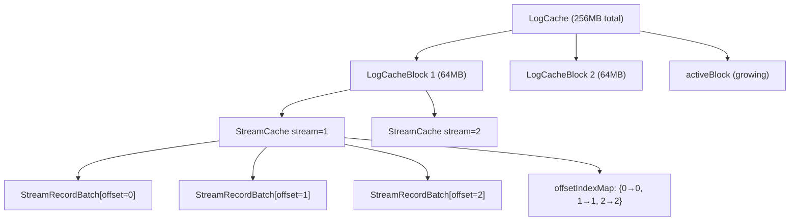
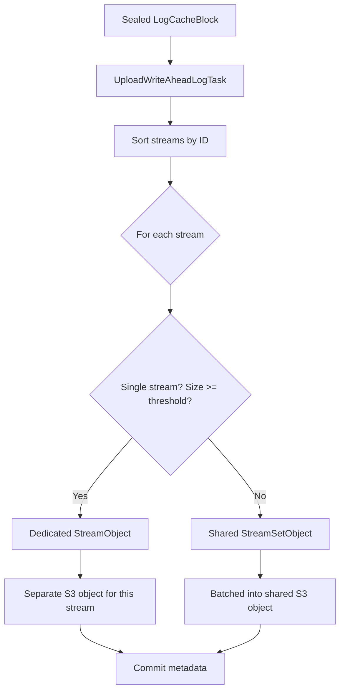
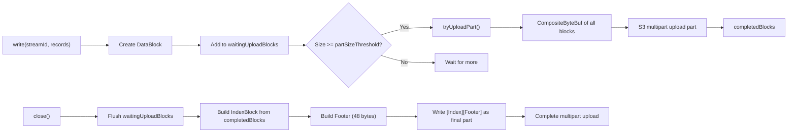

# Object Assembly — From In-Memory to S3 Object

**s3Stream builds S3 objects incrementally via multipart upload. Data blocks are streamed as they fill up, then the index and footer are appended at the end. Zero-copy `CompositeByteBuf` assembles all pieces without copying the underlying data.**

## The Three-Layer In-Memory Structure



### Layer 1: LogCache

| Component | Purpose |
|-----------|---------|
| `capacity` (256MB) | Total cache size before forced upload |
| `blocks` (list) | Sealed, read-only blocks waiting for upload |
| `activeBlock` | Currently accepting writes |

### Layer 2: LogCacheBlock

| Component | Purpose |
|-----------|---------|
| `map<streamId, StreamCache>` | Per-stream record storage |
| `size` | Current block size (max 64MB) |
| `maxStreamCount` (10,000) | Max streams per block |

### Layer 3: StreamCache

| Component | Purpose |
|-----------|---------|
| `records` (List<StreamRecordBatch>) | Ordered records for this stream |
| `startOffset`, `endOffset` | Range of offsets covered |
| `offsetIndexMap` (HashMap) | offset → index in records list for O(1) lookup |

## Sealing the Block

When `activeBlock` hits 64MB or 10,000 streams:

```
1. activeBlock → sealed (read-only)
2. New activeBlock created
3. Sealed block → walPrepareQueue
4. Background thread: create UploadWriteAheadLogTask
```

## The Upload Task

Source: `DefaultUploadWriteAheadLogTask.java`

The upload task takes the sealed block's records (`Map<streamId, List<StreamRecordBatch>>`) and decides how to write them:



| Decision | Threshold | Result |
|----------|-----------|--------|
| Single stream only | `forceSplit` | One dedicated StreamObject |
| Stream size >= `streamSplitSize` | Default: configurable | Dedicated StreamObject |
| Stream size < `streamSplitSize` | — | Shared StreamSetObject |

## The ObjectWriter: Incremental Build

Source: `ObjectWriter.java` (381 lines)

The `DefaultObjectWriter` builds the S3 object incrementally via **multipart upload**:



## DataBlock: The Unit of Storage

Each `DataBlock` wraps a batch of records with a header:

```
DataBlock = [Header][Record 0][Record 1]...[Record N]

Header (10 bytes):
  magic      (1 byte)   = 0x5A
  flag       (1 byte)   = 0x02 (default)
  recordCount (4 bytes) = number of records
  dataLength  (4 bytes) = size of record data (filled after encoding)
```

The `CompositeByteBuf` for a DataBlock holds references to the header and each record's encoded buffer — **no data copying**.

## Multipart Upload: Streaming Data as It Fills

```java
// DefaultObjectWriter.write()
public void write(long streamId, List<StreamRecordBatch> records) {
    List<List<StreamRecordBatch>> blocks = groupByBlock(records);
    for (List<StreamRecordBatch> blockRecords : blocks) {
        DataBlock block = new DataBlock(streamId, blockRecords);
        waitingUploadBlocks.add(block);
        waitingUploadBlocksSize += block.size();
    }
    if (waitingUploadBlocksSize >= partSizeThreshold) {
        tryUploadPart();  // Stream to S3
    }
}
```

When `waitingUploadBlocksSize` reaches `partSizeThreshold` (e.g. 5MB), the accumulated data blocks are streamed to S3 as a **multipart upload part**:

```java
private void tryUploadPart() {
    CompositeByteBuf partBuf = ByteBufAlloc.compositeByteBuffer();
    for (DataBlock block : uploadBlocks) {
        partBuf.addComponent(true, block.buffer());  // Zero-copy reference
    }
    writer.write(partBuf);  // Upload part to S3
    completedBlocks.addAll(uploadBlocks);
    waitingUploadBlocks.removeIf(uploadBlocks::contains);
}
```

**Aha:** This is the key performance optimization. The writer doesn't wait until all records are collected. It streams data blocks to S3 as they accumulate, using multipart upload parts. The final part (index + footer) is uploaded last. This means memory usage stays bounded — you don't need to hold the entire 64MB object in memory.

## The Close Sequence: Index + Footer

When the writer is closed:

```java
public synchronized CompletableFuture<Void> close() {
    CompositeByteBuf buf = ByteBufAlloc.compositeByteBuffer();

    // 1. Flush remaining data blocks
    for (DataBlock block : waitingUploadBlocks) {
        buf.addComponent(true, block.buffer());
        completedBlocks.add(block);
    }

    // 2. Build index block from ALL completed blocks
    indexBlock = new IndexBlock();  // IndexBlock iterates completedBlocks
    buf.addComponent(true, indexBlock.buffer());

    // 3. Build footer with computed index position
    Footer footer = new Footer(indexBlock.position(), indexBlock.size());
    buf.addComponent(true, footer.buffer());

    // 4. Write final part (index + footer)
    writer.write(buf.duplicate());
    return writer.close();  // Complete multipart upload
}
```

### IndexBlock Construction

```java
class IndexBlock {
    private final ByteBuf buf;
    private final long position;

    public IndexBlock() {
        long nextPosition = 0;
        int indexBlockSize = DataBlockIndex.BLOCK_INDEX_SIZE * completedBlocks.size();
        buf = ByteBufAlloc.byteBuffer(indexBlockSize, WRITE_INDEX_BLOCK);
        for (DataBlock block : completedBlocks) {
            ObjectStreamRange streamRange = block.getStreamRange();
            new DataBlockIndex(
                streamRange.getStreamId(),
                streamRange.getStartOffset(),
                (int) (streamRange.getEndOffset() - streamRange.getStartOffset()),
                block.recordCount(),
                nextPosition,  // Position in the objects block
                block.size()
            ).encode(buf);
            nextPosition += block.size();
        }
        position = nextPosition;
    }
}
```

The `indexBlock.position()` is the total size of all data blocks — this becomes the `index_position` in the footer. **Computed, not tracked.**

## The Final Object Layout

```
Multipart Upload Parts:
  Part 1: [DataBlock 1][DataBlock 2]...[DataBlock N]   (streamed)
  Part 2: [DataBlock N+1]...[DataBlock M]               (streamed)
  ...
  Part K: [DataBlock ...][IndexBlock][Footer]           (final part)

Final Object on S3:
  [DataBlock 1][DataBlock 2]...[DataBlock M][IndexBlock][Footer]
  ↑                                                    ↑
  Position 0                                  Last 48 bytes
```

## Memory Efficiency: Zero-Copy Throughout

| Stage | Memory Usage | Copy? |
|-------|-------------|-------|
| LogCache | Record objects + ByteBuf refs | No |
| DataBlock creation | Header + refs to record buffers | No |
| Multipart part | CompositeByteBuf refs | No |
| IndexBlock | New ByteBuf (36 bytes per block) | Yes (small) |
| Footer | New ByteBuf (48 bytes) | Yes (small) |

The 64MB of record data is never copied. Only the small index and footer are newly allocated.

## What's Next

- [04 — Rust Design](04-rust-design.md) — How to implement this in Rust
- [03 — Caching](03-caching.md) — Return to caching
- [00 — Overview](00-overview.md) — Return to overview
