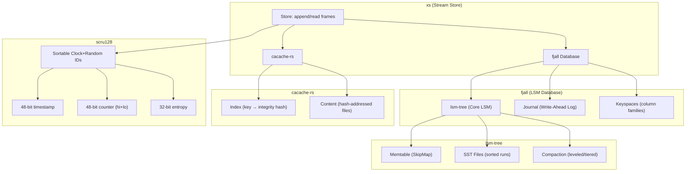
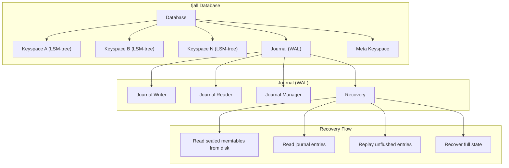
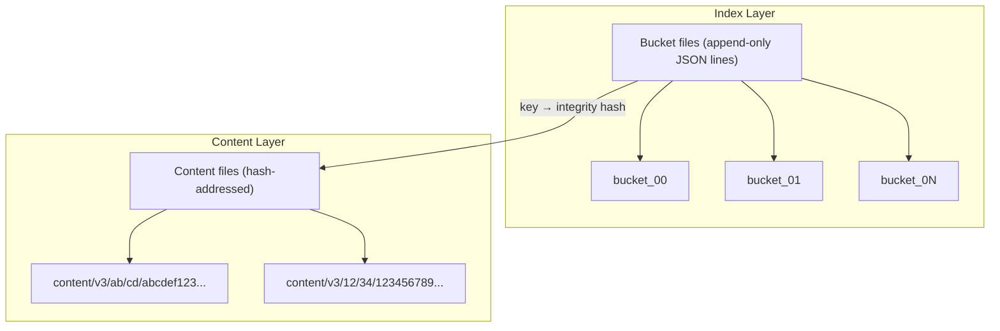
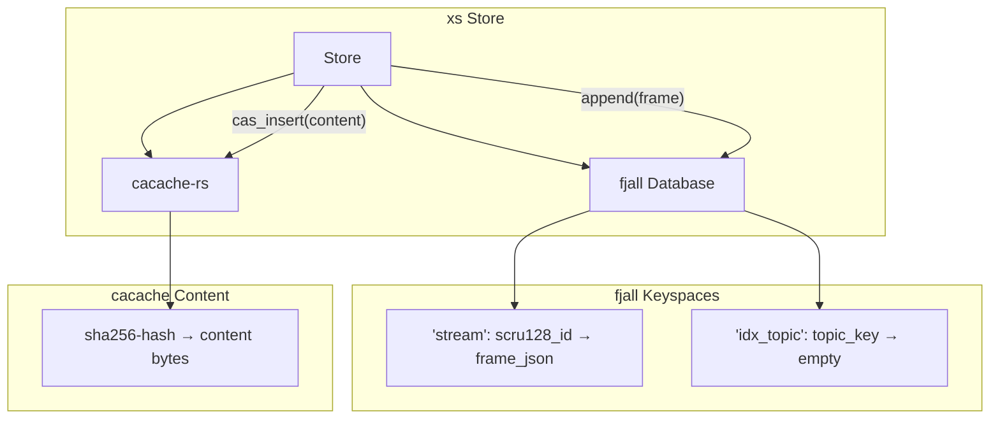
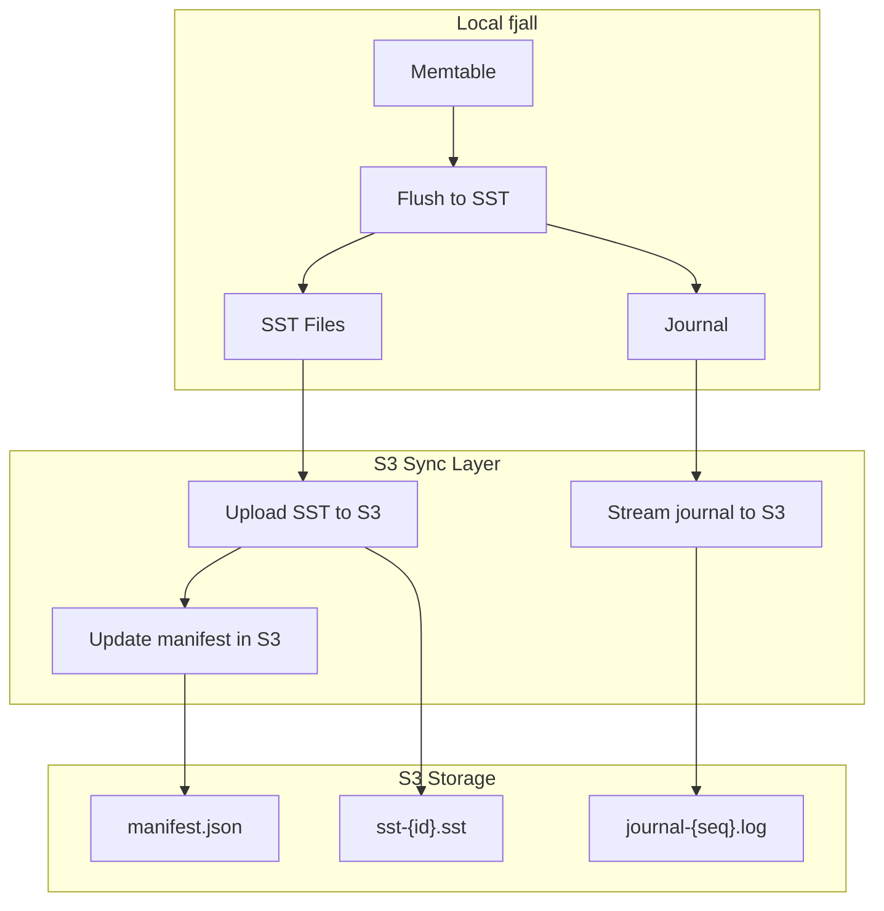

# LSM Usage — fjall, cacache-rs, scru128, and xs

**This document covers how xs uses fjall (LSM-tree database), cacache-rs (content-addressable storage), and scru128 (sortable IDs) to build a high-performance append-only stream store. It also covers how each underlying library works, how they differ from alternatives like Twitter Snowflake, and how the stack could be extended.**

## The Full Stack



## Part 1: How LSM Trees Work (lsm-tree)

Source: `lsm-tree/src/` (29,740 lines)

### The Core Idea

An LSM tree (Log-Structured Merge tree) turns random writes into sequential writes. Instead of updating data in-place (like B-trees), writes are appended to an in-memory buffer (the **Memtable**), which is periodically flushed to disk as sorted files (**SST files**). Reads search the memtable first, then search SST files from newest to oldest.

### Memtable: The Write Buffer

Source: `lsm-tree/src/memtable/mod.rs`

```rust
pub struct Memtable {
    pub id: MemtableId,
    pub items: SkipMap<InternalKey, UserValue>,  // Lock-free skiplist
    pub(crate) approximate_size: AtomicU64,
    pub(crate) highest_seqno: AtomicU64,
    pub(crate) requested_rotation: AtomicBool,
}
```

The memtable uses a **lock-free skiplist** (`crossbeam_skiplist::SkipMap`) for concurrent writes. When the memtable reaches a size threshold (configurable, e.g. 8MB), it is **sealed** and a new memtable takes its place.

### Internal Key Format

Keys in the LSM tree are not just user keys — they include metadata:

```
InternalKey = (user_key, seqno, value_type)
```

| Field | Size | Purpose |
|-------|------|---------|
| `user_key` | variable | The actual key the user inserted |
| `seqno` | 8 bytes | Monotonically increasing sequence number |
| `value_type` | 1 byte | `Value` (0) or `Tombstone` (1, for deletes) |

**Aha:** The seqno is stored in **reverse order** so that skiplist iteration naturally returns the most recent version of a key first. When searching for "abc", the lowest entry ≥ ("abc", max_seqno) is found — which is the most recent version of "abc".

### SST Files: Sorted String Tables

When a memtable is flushed, it becomes an SST file on disk:

```
SST File:
  ┌─────────────────────────────────────┐
  │ Data Blocks (compressed)            │
  │   [key1→val1][key2→val2]...         │
  ├─────────────────────────────────────┤
  │ Block Index (binary index or        │
  │ hash index for fast lookup)         │
  ├─────────────────────────────────────┤
  │ Bloom Filter (skip non-existent     │
  │ keys without reading data blocks)   │
  ├─────────────────────────────────────┤
  │ Meta Block (compression, format)    │
  └─────────────────────────────────────┘
```

### Block Structure

Source: `lsm-tree/src/table/block/`

Each data block contains:
- **Header**: block type, uncompressed size
- **Data**: key-value pairs with prefix compression
- **Restart points**: every N keys (default 16), a full key is stored for binary search
- **Trailer**: checksum, block type

**Prefix compression**: Since keys are sorted, consecutive keys share prefixes. Instead of storing "user:1", "user:2", "user:3", the block stores "user:1", then "\x00:2" (shared prefix length + suffix), then "\x00:3".

### Bloom Filters

Source: `lsm-tree/src/table/filter/`

SST files include a Bloom filter to quickly determine if a key **definitely does not exist** in the file. This avoids reading data blocks for non-existent keys.

```rust
// Standard Bloom filter with configurable bits per key
pub struct BloomFilterBuilder {
    bits_per_key: f64,  // default: 10.0 (1% false positive rate)
}
```

### Compaction

Source: `lsm-tree/src/compaction/`

As more SST files accumulate, reads become slower (more files to search) and disk space is wasted (deleted keys still exist in old files). **Compaction** merges files to solve both problems.

#### Leveled Compaction (LCS)

Source: `lsm-tree/src/compaction/leveled/mod.rs`

Files are organized into levels:
- **L0**: Recently flushed memtables (may have overlapping key ranges)
- **L1**: Size = `base_size` (e.g. 64MB), no overlapping key ranges
- **L2**: Size = `base_size × ratio` (e.g. 640MB)
- **L3**: Size = `base_size × ratio²` (e.g. 6.4GB)
- ...

When L0 reaches a threshold, files are merged into L1. When L1 reaches its threshold, files are merged into L2, and so on.

```rust
// Pick the smallest compaction set
fn pick_minimal_compaction(
    curr_run: &Run<Table>,      // Tables in current level
    next_run: Option<&Run>,     // Tables in next level
    hidden_set: &HiddenSet,     // Tables being compacted elsewhere
    table_base_size: u64,       // Target size per level
) -> Option<(HashSet<TableId>, bool)> {
    // First try: trivial move (no overlap with next level)
    // Second try: merge with minimal write amplification
}
```

#### Tiered Compaction

Source: `lsm-tree/src/compaction/tiered.rs`

Instead of levels, tiered compaction groups files into "tiers" of similar size. When a tier has enough files, they are merged into the next tier. This has **lower write amplification** but **higher read amplification** than leveled compaction.

| Metric | Leveled | Tiered |
|--------|---------|--------|
| Write amplification | High (~10x) | Low (~2x) |
| Read amplification | Low (~2x) | High (~10x) |
| Space amplification | Low (~1.1x) | Higher (~2x) |
| Best for | Read-heavy workloads | Write-heavy workloads |

## Part 2: How fjall Builds on lsm-tree

Source: `fjall/src/` (12,196 lines)

`lsm-tree` is a primitive LSM implementation — it has **no WAL** (writes aren't durable until manually flushed). `fjall` wraps `lsm-tree` to create a full database:

### Architecture



### The Journal (Write-Ahead Log)

Source: `fjall/src/journal/`

Every write goes through the journal first:

```rust
// Journal entry format
pub enum JournalEntry {
    Insert { keyspace: KeyspaceKey, key: Vec<u8>, value: Vec<u8> },
    Remove { keyspace: KeyspaceKey, key: Vec<u8> },
    // ... other entry types
}
```

**Write path:**
1. Write to journal (append-only, sequential write)
2. Write to memtable (in-memory skiplist)
3. Return success

**Recovery path (after crash):**
1. Load sealed memtables from disk (already-flushed SST metadata)
2. Read journal entries from the last checkpoint
3. Replay unflushed entries into a new memtable
4. Database is now in a consistent state

### Keyspaces (Column Families)

Source: `fjall/src/keyspace/`

A single fjall database can have multiple keyspaces, each with its own LSM-tree:

```rust
let db = Database::builder("./my-db").open()?;
let items = db.keyspace("my_items", KeyspaceCreateOptions::default)?;
let config = db.keyspace("config", KeyspaceCreateOptions::default)?;
```

Each keyspace:
- Has its own memtable and SST files
- Can have different block sizes, compression, filter settings
- Shares the same journal (atomic writes across keyspaces)

### Cross-Keyspace Atomic Batches

Source: `fjall/src/batch/`

```rust
let mut batch = db.batch();
batch.insert(&items, "key1", "value1");
batch.insert(&config, "setting", "true");
batch.commit()?;  // Atomic: all or nothing
```

The batch writes to a single journal with all keyspace operations, then commits atomically. If any operation fails, none are applied.

### Transactions

Source: `fjall/src/tx/`

fjall supports two transaction modes:

| Mode | Implementation | Guarantees |
|------|---------------|-----------|
| Single-writer | `SingleWriterDatabase` | One writer, no conflicts |
| Optimistic (OCC) | `TxDatabase` | Multiple writers, detect conflicts at commit |

Optimistic concurrency control uses an **oracle** to track read/write sets:

```rust
// Oracle tracks the latest sequence number for each key
pub struct Oracle {
    read_maps: Mutex<Vec<HashMap<KeyspaceKey, SeqNo>>>,
    write_map: Mutex<HashMap<KeyspaceKey, SeqNo>>,
}
```

At commit time, the transaction checks if any key it read has been modified by another transaction. If so, the transaction aborts.

### Flush Manager

Source: `fjall/src/flush/`

The flush manager coordinates memtable rotation:

1. Memtable reaches size threshold → flag for rotation
2. Flush manager creates a new memtable
3. Old memtable is sealed and flushed to SST in background
4. SST file is added to the LSM-tree's version

### Compaction Worker

Source: `fjall/src/compaction/worker.rs`

Background thread that runs compaction:
1. Check if any level needs compaction
2. Pick the minimal compaction set
3. Merge files into the next level
4. Update the LSM-tree's version (atomic swap)

## Part 3: How cacache-rs Works

Source: `cacache-rs/src/` (1,228 lines)

cacache is a **content-addressable cache** — data is stored by its hash, not by a key. This means:
- The same data is never stored twice
- Data integrity is guaranteed (the hash is verified on read)
- No cache corruption possible (writes go through a temp file, then atomically move)

### Two-Layer Architecture



### Write Flow

Source: `cacache-rs/src/content/write.rs`

```rust
pub struct Writer {
    cache: PathBuf,
    builder: IntegrityOpts,  // Hashes data as it's written
    mmap: Option<MmapMut>,   // Memory-mapped temp file
    tmpfile: NamedTempFile,  // Temp file for atomic write
}

impl Writer {
    pub fn close(self) -> Result<Integrity> {
        let sri = self.builder.result();  // Compute integrity hash
        let cpath = path::content_path(&self.cache, &sri);  // hash-addressed path
        self.tmpfile.persist(&cpath)?;  // Atomic rename
        Ok(sri)
    }
}
```

**The write process:**
1. Create a temp file in `{cache}/tmp/`
2. Write data, hashing it as you go (SHA-256 or SHA-1)
3. On close, rename the temp file to `{cache}/content/v3/{hash[0..2]}/{hash[2..4]}/{full_hash}`
4. Return the integrity hash

### Index Lookup

Source: `cacache-rs/src/index.rs`

The index maps string keys to integrity hashes:

```rust
// Index entry format (appended to bucket files)
struct SerializableMetadata {
    key: String,           // User-provided key
    integrity: String,     // "sha256-abcdef..."
    time: u128,            // Unix milliseconds
    size: usize,           // Data size
    metadata: Value,       // Arbitrary JSON
}

// Stored as: "{hash}\t{json}\n" (append-only)
let out = format!("\n{}\t{}", hash_entry(&stringified), stringified);
```

To look up a key:
1. Compute the bucket path: `{cache}/index-v5/{hash(key) % 256}`
2. Read the bucket file backwards (newest entries first)
3. Find the first entry matching the key
4. Return the integrity hash

**Aha:** The index is append-only — there are no updates or deletes. When a key is "updated," a new entry is appended. The lookup reads backwards to find the newest entry. This makes writes fast (just append) and keeps the index simple.

### Content Addressing

Content files are stored at paths derived from their hash:

```
content/v3/
  ab/
    cd/
      abcdef1234567890...  ← The actual data
  12/
    34/
      1234567890abcdef...
```

This means:
- The same data (same hash) is stored only once
- Reading by hash is a simple file read
- No index lookup needed for hash reads (faster than key reads)

## Part 4: How scru128 Works — and How It Differs from Twitter Snowflake

Source: `src.scru128/rust/src/` (1,845 lines)

### scru128 Bit Layout

```
128 bits total:
  ┌──────────────┬───────────────────┬───────────────────┬──────────────────┐
  │ 48-bit       │ 24-bit            │ 24-bit            │ 32-bit           │
  │ timestamp    │ counter_hi        │ counter_lo        │ entropy          │
  │ (ms since    │ (random, refreshed│ (counter per ms)  │ (fully random)   │
  │ Unix epoch)  │ every 1s)         │                   │                  │
  └──────────────┴───────────────────┴───────────────────┴──────────────────┘
   bits:  127                                    ...                    0
```

| Field | Size | Purpose |
|-------|------|---------|
| `timestamp` | 48 bits | Milliseconds since Unix epoch (usable until year 10889) |
| `counter_hi` | 24 bits | Random, refreshed every second — prevents prediction |
| `counter_lo` | 24 bits | Counter within the same millisecond (~16M IDs per ms) |
| `entropy` | 32 bits | Fully random — prevents prediction even with known timestamp |

**Aha:** Unlike Snowflake which uses a simple counter, scru128 uses a **three-layer randomness scheme**. `counter_hi` is random and refreshed every second, `counter_lo` is a counter within the millisecond, and `entropy` is fully random. This makes IDs **unpredictable** while still being **sortable by time**.

### scru128 vs Twitter Snowflake

| Aspect | Twitter Snowflake | scru128 |
|--------|------------------|---------|
| Total bits | 64 | 128 |
| Timestamp | 41 bits (ms) | 48 bits (ms) |
| Machine ID | 10 bits | None |
| Sequence | 12 bits | 48 bits (counter_hi + counter_lo) |
| Randomness | None | 56 bits (counter_hi + entropy) |
| Unpredictable | No | Yes |
| Max IDs per ms | 4,096 | ~281 trillion |
| Sortable | Yes | Yes |
| String representation | Base64/number | 25-char Base36 |

**Key differences:**
1. **No machine ID**: Snowflake requires a unique machine ID per node. scru128 doesn't — the 32-bit entropy field ensures uniqueness across nodes without coordination.
2. **Unpredictable**: Snowflake IDs are predictable (you know the next ID will be timestamp + sequence). scru128 IDs are unpredictable due to the random entropy field.
3. **Higher throughput**: scru128 can generate ~281 trillion IDs per millisecond vs Snowflake's 4,096.
4. **Clock rollback handling**: scru128 has a configurable rollback allowance (default 10 seconds). If the clock goes back more than 10 seconds, the generator resets. Snowflake would block until the clock catches up.

### Generation Logic

Source: `src.scru128/rust/src/generator.rs`

```rust
pub fn generate_or_abort_with_ts(&mut self, timestamp: u64) -> Option<Id> {
    if timestamp > self.timestamp {
        // New millisecond: reset counter_lo to random
        self.timestamp = timestamp;
        self.counter_lo = self.rand_source.next_u32() & MAX_COUNTER_LO;
    } else if timestamp + self.rollback_allowance >= self.timestamp {
        // Clock went back slightly: continue with previous timestamp
        self.counter_lo += 1;
        if self.counter_lo > MAX_COUNTER_LO {
            self.counter_lo = 0;
            self.counter_hi += 1;  // Increment hi counter
            if self.counter_hi > MAX_COUNTER_HI {
                self.counter_hi = 0;
                self.timestamp += 1;  // Force timestamp increment
                self.counter_lo = self.rand_source.next_u32() & MAX_COUNTER_LO;
            }
        }
    } else {
        return None;  // Clock rollback too significant, abort
    }

    // Refresh counter_hi every second
    if self.timestamp - self.ts_counter_hi >= 1_000 {
        self.ts_counter_hi = self.timestamp;
        self.counter_hi = self.rand_source.next_u32() & MAX_COUNTER_HI;
    }

    Some(Id::try_from_fields(
        self.timestamp,
        self.counter_hi,
        self.counter_lo,
        self.rand_source.next_u32(),  // entropy
    ).unwrap())
}
```

## Part 5: How xs Uses It All Together

Source: `xs/src/store/mod.rs` (13,083 lines total)

### The Store Architecture



### The Store Structure

```rust
pub struct Store {
    path: PathBuf,
    db: Database,              // fjall database
    stream: Keyspace,          // Main keyspace: scru128_id → Frame JSON
    idx_topic: Keyspace,       // Topic index: topic_key → empty value
    broadcast_tx: broadcast::Sender<Frame>,  // For live subscriptions
    gc_tx: UnboundedSender<GCTask>,         // Garbage collection channel
    append_lock: Arc<Mutex<()>>,            // Serialize appends for ID ordering
}
```

### Append Flow

```rust
pub fn append(&self, mut frame: Frame) -> Result<Frame, Error> {
    let _guard = self.append_lock.lock().unwrap();  // Serialize appends

    frame.id = scru128::new();  // Generate sortable ID

    // Store frame in fjall (if not ephemeral)
    if frame.ttl != Some(TTL::Ephemeral) {
        self.insert_frame(&frame)?;
        // Schedule GC for TTL-based cleanup
        if let Some(TTL::Last(n)) = frame.ttl {
            let _ = self.gc_tx.send(GCTask::CheckLastTTL { topic, keep: n });
        }
    }

    // Broadcast to subscribers
    let _ = self.broadcast_tx.send(frame.clone());
    Ok(frame)
}
```

**Why the append lock?** scru128 IDs are sortable by time, but multiple threads could generate IDs in the same millisecond with different counter values. The lock ensures IDs are inserted into fjall in scru128 order, so range scans return frames in chronological order.

### fjall Keyspace Configuration

```rust
// stream keyspace: point reads by frame ID
let stream_opts = || KeyspaceCreateOptions::default()
    .max_memtable_size(8 * 1024 * 1024)  // 8 MiB
    .data_block_size_policy(BlockSizePolicy::all(16 * 1024))  // 16 KiB blocks
    .data_block_hash_ratio_policy(HashRatioPolicy::all(8.0))  // Hash index for point reads
    .expect_point_read_hits(true);

// idx_topic keyspace: prefix scans only
let idx_opts = || KeyspaceCreateOptions::default()
    .max_memtable_size(8 * 1024 * 1024)
    .data_block_size_policy(BlockSizePolicy::all(16 * 1024))
    .data_block_hash_ratio_policy(HashRatioPolicy::all(0.0))  // No point reads
    .expect_point_read_hits(true);
```

**Aha:** xs tunes each keyspace differently. The `stream` keyspace uses a hash index for fast point reads by scru128 ID. The `idx_topic` keyspace uses a binary index (no hash) because it's primarily used for prefix scans (e.g., "user.*" wildcard queries).

### Topic Index

The `idx_topic` keyspace stores topic-based index keys for hierarchical queries:

```rust
// Direct topic key: topic + scru128_id
fn idx_topic_key_from_frame(frame: &Frame) -> Result<Vec<u8>> {
    let mut key = topic.to_string().into_bytes();
    key.push(0);  // Null byte separator
    key.extend(frame.id.as_bytes());
    Ok(key)
}

// Prefix index keys for "user.*" wildcard queries
fn idx_topic_prefix_keys(topic: &str, id: &Scru128Id) -> Vec<Vec<u8>> {
    let mut keys = Vec::new();
    // "user.profile.123" → ["user.\0", "user.profile.\0"]
    for (i, _) in topic.match_indices('.') {
        let prefix = &topic[..i + 1];
        let mut key = prefix.as_bytes().to_vec();
        key.push(0);
        keys.push(key);
    }
    keys
}
```

This enables efficient hierarchical queries: `read(topic: "user.*")` scans from "user.\0" to "user.\u{FF}\u{FF}".

### Content-Addressable Storage

```rust
// Insert content into cacache
pub async fn cas_insert_bytes(&self, bytes: &[u8]) -> cacache::Result<ssri::Integrity> {
    cacache::write_hash(&self.path.join("cacache"), bytes).await
}

// Read content by hash
pub async fn cas_read(&self, hash: &ssri::Integrity) -> cacache::Result<Vec<u8>> {
    cacache::read_hash(&self.path.join("cacache"), hash).await
}
```

The Frame stores a `hash: Option<ssri::Integrity>` field that points to content in cacache. The frame itself (metadata) is in fjall, while the actual content bytes are in cacache.

**Aha:** This is a classic separation of metadata and content. fjall handles the structured, queryable metadata (topics, IDs, TTLs), while cacache handles the unstructured content (bytes) with content-addressable deduplication.

## Part 6: How We Can Use fjall in Different Ways

### 1. As a Simple Key-Value Store

```rust
let db = Database::builder("./my-db").open()?;
let items = db.keyspace("items", KeyspaceCreateOptions::default)?;
items.insert("key", "value")?;
let value = items.get("key")?;
```

### 2. As a Multi-Tenant Database

```rust
// Each tenant gets their own keyspace
let tenant_a = db.keyspace("tenant:a", opts)?;
let tenant_b = db.keyspace("tenant:b", opts)?;
// Cross-tenant atomic operations via batch
let mut batch = db.batch();
batch.insert(&tenant_a, "key", "value");
batch.insert(&tenant_b, "key", "value");
batch.commit()?;
```

### 3. As an Event Log

Like xs uses it: scru128 IDs as keys, JSON frames as values. Range scans give you events in order.

### 4. As a Session Store

```rust
let sessions = db.keyspace("sessions", opts)?;
// Key: session_id, Value: session_data
// Use TTL via a background cleanup thread
```

### 5. As a Configuration Store

```rust
let config = db.keyspace("config", opts)?;
// Prefix scans: "app:db:", "app:cache:"
// Hierarchical config with prefix queries
```

## Part 7: Sync to S3/Object Storage

### Is it Possible?

**Yes, but with caveats.** fjall is designed for local disk storage. To sync to S3, you'd need to:

1. **SST File Sync**: SST files are immutable once written. They can be uploaded to S3 as soon as they're flushed.
2. **Journal Sync**: The journal is append-only. It can be streamed to S3 incrementally.
3. **Meta Keyspace**: The manifest (which SST files exist in which levels) must be synced atomically.

### Architecture for S3 Sync



### Challenges

| Challenge | Solution |
|-----------|----------|
| **Atomic manifest updates** | Use S3 conditional writes (ETag-based) |
| **Journal streaming** | Append-only journal can be streamed incrementally |
| **SST deduplication** | SST files are immutable and content-addressed (hash-based naming) |
| **Recovery** | Download manifest, download SSTs, replay journal from last checkpoint |
| **Latency** | Local reads are fast; remote reads need caching |

### Alternative: Use cacache + fjall Hybrid

Like xs already does: store metadata in fjall (local), store content in cacache (which could be backed by S3). This gives you:
- Fast local metadata queries (fjall)
- Deduplicated content storage (cacache → S3)
- Content-addressable integrity (SRI hashes)

### S3-Backed cacache

cacache could be extended to use S3 as the content backend:
- `write_hash()` → upload to S3 with the hash as the key
- `read_hash()` → download from S3
- Index stays local (or could be synced to S3 too)

This would give you a content-addressable storage layer that spans local disk and S3.

## What's Next

- [00 — Overview](00-overview.md) — Return to overview
- [01 — Architecture](01-architecture.md) — Return to architecture
